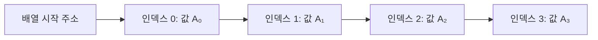

# Array 자료구조 📚

배열(Array)은 컴퓨터 과학에서 가장 기본적이고 널리 사용되는 자료구조 중 하나입니다.  
연속된 메모리 공간에 동일한 데이터 타입의 요소들을 저장하며, 인덱스를 통해 각 요소에 빠르게 접근할 수 있는 특징이 있습니다.

---

## 목차 📝
1. [개요](#개요)
2. [배열의 정의와 특징](#배열의-정의와-특징)
3. [메모리 구조 및 다이어그램](#메모리-구조-및-다이어그램)
4. [주요 연산](#주요-연산)
5. [장단점](#장단점)
6. [실무 활용 예시](#실무-활용-예시)
7. [참고 자료](#참고-자료)

---

## 개요 🧐
배열은 정적(static) 자료구조로, 생성 시 미리 정해진 크기만큼의 메모리 공간을 할당합니다.  
데이터의 저장 순서가 메모리 상에서 연속적이기 때문에, 인덱스 번호를 사용하여 임의 접근(Random Access)이 빠르게 가능합니다.

---

## 배열의 정의와 특징 🔍
- **정의**: 동일한 데이터 타입의 요소들을 연속된 메모리 공간에 저장하는 자료구조
- **특징**:
  - **빠른 인덱스 접근**: O(1)의 시간 복잡도로 원하는 인덱스에 접근 가능
  - **고정 크기**: 배열을 생성할 때 크기를 미리 정해야 함
  - **메모리 연속성**: 요소들이 연속적으로 저장되어 캐시 효율성이 높음
  - **단순 구조**: 자료구조의 기본 개념을 이해하는 데 매우 유용함

---

## 메모리 구조 및 다이어그램 🖼️
배열은 메모리 상에서 연속적인 블록에 저장됩니다. 아래 다이어그램은 크기가 4인 배열의 메모리 배치를 간단히 보여줍니다.

위 다이어그램에서 각 노드는 배열의 각 인덱스와 해당 값이 저장된 메모리 셀을 나타냅니다.  
연속된 메모리 배치는 데이터 접근 속도를 향상시키며, 특히 캐시(Cache) 효율을 높이는 데 기여합니다.

---

## 주요 연산 🛠️
배열에서 수행할 수 있는 주요 연산은 다음과 같습니다:

- **접근(Access)**: 인덱스를 이용하여 O(1) 시간 내에 특정 요소에 접근  
  _예시: `arr[i]`_
  
- **삽입(Insertion)**: 배열의 끝에 삽입은 빠르지만, 중간에 삽입 시 뒤쪽 요소들을 이동해야 하므로 O(n)의 시간 복잡도  
  _예시: `arr.append(new_value)`_
  
- **삭제(Deletion)**: 삭제 후 뒤쪽 요소들을 이동해야 하므로 O(n)의 시간 복잡도가 발생  
  _예시: `del arr[i]`_
  
- **업데이트(Update)**: 인덱스를 이용하여 원하는 위치의 값을 수정하는 연산  
  _예시: `arr[i] = new_value`_

---

## 장단점 ⚖️

### 장점 👍
- **빠른 임의 접근**: 인덱스를 사용하여 원하는 요소에 즉시 접근할 수 있음.
- **메모리 효율성**: 연속된 메모리 할당으로 캐시 효율이 높음.
- **구현의 단순성**: 기본 자료구조로서 이해하기 쉽고 구현이 간단함.

### 단점 👎
- **고정 크기**: 배열 생성 시 크기를 미리 결정해야 하며, 동적 크기 조정이 어려움.
- **삽입/삭제 비용**: 배열 중간에 요소를 삽입하거나 삭제할 경우, 많은 요소를 이동시켜야 함.

---

## 실무 활용 예시 💼
배열은 다양한 분야에서 기본 자료구조로 사용됩니다.  
예를 들어, 데이터의 집합을 빠르게 순회하거나 정렬 알고리즘의 기초 자료구조로 활용됩니다.  
또한, 메모리의 연속적 배치로 인해 시스템 프로그래밍, 게임 개발, 임베디드 시스템 등 성능이 중요한 분야에서 많이 사용됩니다.

---

## 참고 자료 🔗
- [자료구조와 알고리즘 개론](https://ko.wikipedia.org/wiki/자료구조)  
- [GeeksforGeeks - Arrays](https://www.geeksforgeeks.org/array-data-structure/)  
- [Baekjoon Online Judge](https://www.acmicpc.net/)

---

배열에 대한 이론적 배경과 구조를 이해하면, 이후 실제 구현(main.c 파일)에서 배열을 어떻게 활용할 수 있는지 명확해질 것입니다.