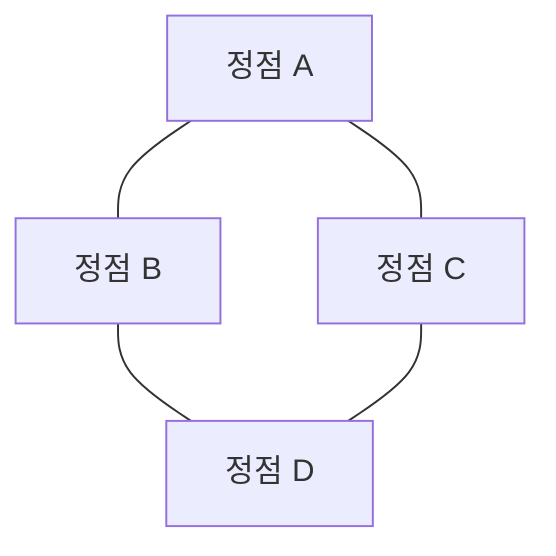

# 그래프 자료구조 🌐🕸️

그래프는 정점(Vertex)들과 이들 간의 관계(Edge)를 표현하는 비선형 자료구조입니다.  
네트워크, 소셜 미디어, 지도, 통신망 등 다양한 분야에서 복잡한 관계를 모델링하고 분석하는 데 사용됩니다.

---

## 목차 📝
1. [개요](#개요-🧐)
2. [그래프의 정의와 특징](#그래프의-정의와-특징-🔍)
3. [메모리 구조 및 다이어그램](#메모리-구조-및-다이어그램-🖼️)
4. [주요 연산](#주요-연산-🛠️)
5. [장단점](#장단점-⚖️)
6. [실무 활용 예시](#실무-활용-예시-💼)
7. [참고 자료](#참고-자료-🔗)

---

## 개요 🧐
그래프는 정점(노드)과 이들을 연결하는 간선(Edge)으로 구성된 자료구조입니다.  
방향성이 있거나(유향 그래프) 없을 수 있으며, 가중치가 부여될 수도 있습니다.  
이러한 특성 덕분에 복잡한 관계와 네트워크를 효과적으로 모델링할 수 있습니다.

---

## 그래프의 정의와 특징 🔍
- **정의**:  
  그래프는 집합 V (정점 집합)와 집합 E (간선 집합)으로 구성되며,  
  간선은 두 정점 간의 관계를 나타냅니다.

- **특징**:
  - **정점(Vertex)**: 데이터를 저장하는 기본 단위.
  - **간선(Edge)**: 정점 간의 관계를 나타내며, 방향성 및 가중치를 가질 수 있음.
  - **유형**:
    - **무향 그래프 (Undirected Graph)**: 간선에 방향이 없는 경우.
    - **유향 그래프 (Directed Graph)**: 간선에 방향이 있는 경우.
    - **가중치 그래프 (Weighted Graph)**: 간선에 비용이나 거리를 부여한 경우.
  - **표현 방법**:
    - 인접 행렬(Adjacency Matrix)
    - 인접 리스트(Adjacency List)
    - 간선 리스트(Edge List)

---

## 메모리 구조 및 다이어그램 🖼️
그래프는 표현 방식에 따라 메모리 구조가 달라집니다.  
예를 들어, 인접 리스트는 각 정점에 연결된 정점들의 리스트를 저장하여,  
희소 그래프(Sparse Graph)에서 메모리 효율성이 뛰어납니다.

위 다이어그램은 간단한 무향 그래프 예시로, 각 정점이 서로 연결된 모습을 보여줍니다.

---

## 주요 연산 🛠️
그래프에서 수행할 수 있는 대표적인 연산은 다음과 같습니다:

- **그래프 탐색**:  
  - **깊이 우선 탐색 (DFS)**: 재귀나 스택을 이용하여 정점을 깊게 탐색.
  - **너비 우선 탐색 (BFS)**: 큐를 이용하여 레벨별로 정점을 탐색.

- **최단 경로 탐색**:  
  - 다익스트라(Dijkstra) 알고리즘, 벨만-포드(Bellman-Ford) 알고리즘, A* 탐색 등.

- **최소 신장 트리 (MST)**:  
  - 크루스칼(Kruskal) 알고리즘, 프림(Prim) 알고리즘 등을 통한 그래프의 최소 신장 트리 구성.

- **사이클 검출**:  
  - DFS, Union-Find 알고리즘 등을 이용하여 그래프 내 사이클 존재 여부 확인.

- **위상 정렬**:  
  - 유향 비순환 그래프(DAG)에서 정점의 순서를 결정하는 연산.

---

## 장단점 ⚖️

### 장점 👍
- **복잡한 관계 모델링**: 다양한 정점 간의 관계를 표현할 수 있어, 현실 세계의 복잡한 네트워크를 모델링하기에 적합합니다.
- **유연성**: 방향, 가중치, 다중 간선 등 여러 조건을 추가하여 세밀한 관계 분석이 가능합니다.
- **알고리즘 다양성**: 다양한 탐색, 최단 경로, 최소 신장 트리 등의 알고리즘을 적용할 수 있습니다.

### 단점 👎
- **메모리 사용**: 인접 행렬을 사용하는 경우 정점 수에 따라 메모리 사용량이 급격히 증가할 수 있습니다.
- **구현 복잡성**: 다양한 유형의 그래프와 연산을 지원하기 위해 구현이 복잡해질 수 있습니다.
- **연산 비용**: 최악의 경우(예: 모든 정점이 서로 연결된 경우) 연산 시간이 크게 증가할 수 있습니다.

---

## 실무 활용 예시 💼
- **네트워크 분석**: 컴퓨터 네트워크, 소셜 네트워크, 통신망 등에서 데이터 간의 연결 관계 분석.
- **경로 탐색**: 지도, GPS, 교통 시스템에서 최단 경로 및 효율적인 경로 탐색.
- **추천 시스템**: 사용자 간의 관계 및 선호도를 기반으로 한 추천 알고리즘.
- **프로젝트 관리**: 작업 간의 의존 관계를 모델링하여, 위상 정렬 등을 통한 스케줄링.

---

## 참고 자료 🔗
- [Graph (자료구조) - Wikipedia](https://en.wikipedia.org/wiki/Graph_(abstract_data_type))
- [GeeksforGeeks - Graph Data Structure](https://www.geeksforgeeks.org/graph-data-structure-and-algorithms/)
- [Baekjoon Online Judge](https://www.acmicpc.net/)

---

그래프 자료구조의 원리와 다양한 알고리즘을 이해하면,  
현실 세계의 복잡한 네트워크와 관계를 효과적으로 분석하고 최적화할 수 있습니다.  