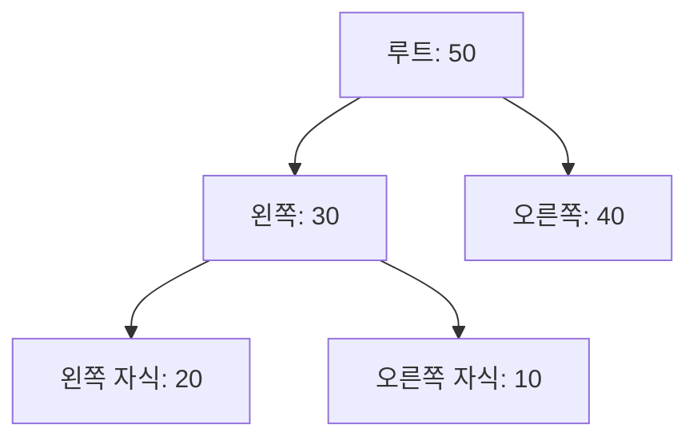

# Heap 자료구조 (Heap) 🏗️

Heap은 완전 이진 트리(Complete Binary Tree)의 형태를 띄며, 부모 노드와 자식 노드 간의 특정 관계(Heap Property)를 만족하는 자료구조입니다.  
주로 **최대 힙(Max Heap)** 또는 **최소 힙(Min Heap)** 으로 구분되며, 우선순위 큐, 힙 정렬 등 다양한 알고리즘에서 핵심 역할을 합니다.

---

## 목차 📝
1. [개요](#개요)
2. [Heap의 정의와 종류](#heap의-정의와-종류)
3. [메모리 구조 및 다이어그램](#메모리-구조-및-다이어그램)
4. [주요 연산](#주요-연산)
5. [장단점](#장단점)
6. [실무 활용 예시](#실무-활용-예시)
7. [참고 자료](#참고-자료)

---

## 개요 🧐
Heap은 완전 이진 트리의 특성을 이용하여 효율적으로 데이터를 관리할 수 있는 자료구조입니다.  
각 노드는 특정 기준(우선순위)에 따라 부모-자식 간의 관계를 유지하며, 이로 인해 삽입, 삭제, 최댓값(또는 최솟값) 검색 연산을 O(log n)의 시간 복잡도로 수행할 수 있습니다.  
주로 **우선순위 큐**의 구현, **힙 정렬(Heap Sort)**, 그리고 선택 알고리즘에서 사용됩니다. 🚀

---

## Heap의 정의와 종류 🔍
- **정의**:  
  Heap은 완전 이진 트리 형태를 가지며, 각 부모 노드가 자식 노드와의 관계에서 특정 조건(최대 힙은 부모 ≥ 자식, 최소 힙은 부모 ≤ 자식)을 만족하는 자료구조입니다.

- **종류**:
  - **최대 힙 (Max Heap)**:  
    각 부모 노드가 자식 노드보다 크거나 같은 값을 가지며, 루트 노드에 가장 큰 값이 위치합니다.
  - **최소 힙 (Min Heap)**:  
    각 부모 노드가 자식 노드보다 작거나 같은 값을 가지며, 루트 노드에 가장 작은 값이 위치합니다.

---

## 메모리 구조 및 다이어그램 🖼️
Heap은 배열을 사용하여 효율적으로 저장할 수 있습니다.  
배열의 인덱스 관계를 통해 트리 구조를 쉽게 관리할 수 있으며, 부모와 자식의 인덱스는 아래와 같이 계산됩니다:
- **부모 노드 인덱스**: `(i - 1) / 2`
- **왼쪽 자식 인덱스**: `2 * i + 1`
- **오른쪽 자식 인덱스**: `2 * i + 2`

아래 다이어그램은 최대 힙의 간단한 예시를 보여줍니다.

이 구조는 배열에 저장될 때 연속적인 메모리 블록으로 관리되어, 인덱스 연산을 통해 빠른 접근이 가능합니다.

---

## 주요 연산 🛠️
Heap에서 자주 사용되는 연산은 다음과 같습니다:

- **삽입 (Insert)**:  
  새로운 요소를 배열의 마지막에 추가한 후, `heapifyUp` 과정을 거쳐 힙 성질을 복구합니다.  
  **시간 복잡도**: O(log n)

- **최대/최소 값 조회 (Peek)**:  
  최대 힙의 경우 루트 노드(최대값), 최소 힙의 경우 루트 노드(최소값)를 반환합니다.  
  **시간 복잡도**: O(1)

- **삭제 (Extract)**:  
  루트 노드를 삭제하고, 배열의 마지막 요소를 루트로 옮긴 후, `heapifyDown` 과정을 통해 힙 성질을 복구합니다.  
  **시간 복잡도**: O(log n)

- **힙 빌드 (Build Heap)**:  
  임의의 배열을 Heap 구조로 변환하는 연산으로, 보통 O(n)의 시간 복잡도를 가집니다.

---

## 장단점 ⚖️

### 장점 👍
- **효율적인 연산**: 삽입, 삭제 및 최댓값/최솟값 조회가 O(log n) 또는 O(1)로 빠르게 처리됩니다.
- **배열 기반 저장**: 연속된 메모리 할당을 통해 캐시 효율성을 높일 수 있습니다.
- **우선순위 큐 구현에 최적**: 다양한 알고리즘에서 우선순위 기반 처리를 쉽게 구현할 수 있습니다.

### 단점 👎
- **구현 복잡성**: 힙의 재구성이 필요하여 단순한 배열이나 연결리스트에 비해 구현이 다소 복잡합니다.
- **정렬된 순서 보장 X**: 힙은 완전 이진 트리 구조로, 전체 배열이 정렬된 상태를 보장하지 않습니다. (힙 정렬을 통해 정렬 가능)

---

## 실무 활용 예시 💼
Heap은 다양한 분야에서 핵심적으로 사용됩니다:
- **우선순위 큐**: 작업 스케줄러, 네트워크 패킷 처리, 이벤트 기반 시스템 등에서 활용됩니다.
- **힙 정렬 (Heap Sort)**: 효율적인 정렬 알고리즘으로, 대용량 데이터의 정렬에 사용됩니다.
- **메모리 관리**: 일부 시스템에서는 동적 메모리 할당 및 해제 관리에 Heap 구조를 활용합니다.

---

## 참고 자료 🔗
- [Heap - Wikipedia](https://ko.wikipedia.org/wiki/힙_(자료구조))
- [GeeksforGeeks - Heap Data Structure](https://www.geeksforgeeks.org/heap-data-structure/)
- [Baekjoon Online Judge](https://www.acmicpc.net/)

---

Heap의 개념과 내부 동작 원리를 충분히 이해하면,  
우선순위 큐나 정렬 알고리즘 등 다양한 문제 해결에 응용할 수 있습니다.  