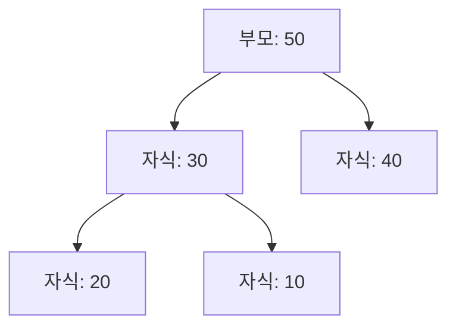

# 우선순위 큐 자료구조 (Priority Queue) ⏫

우선순위 큐는 각 요소에 우선순위(priority)를 부여하여, 가장 높은 우선순위를 가진 요소가 먼저 처리되도록 하는 특수한 형태의 큐입니다.  
보통 이 자료구조는 힙(Heap)을 기반으로 구현되며, 효율적인 삽입과 삭제 연산을 통해 높은 우선순위의 작업을 빠르게 처리할 수 있습니다.

---

## 목차 📝
1. [개요](#개요)
2. [우선순위 큐의 정의와 특징](#우선순위-큐의-정의와-특징)
3. [메모리 구조 및 다이어그램](#메모리-구조-및-다이어그램)
4. [주요 연산](#주요-연산)
5. [장단점](#장단점)
6. [실무 활용 예시](#실무-활용-예시)
7. [참고 자료](#참고-자료)

---

## 개요 🧐
우선순위 큐는 일반 큐와 달리, 각 요소에 부여된 우선순위에 따라 데이터가 처리됩니다.  
높은 우선순위를 가진 요소가 항상 먼저 처리되기 때문에, 작업 스케줄링, 이벤트 처리, 네트워크 패킷 관리 등 다양한 분야에서 핵심적으로 활용됩니다. 🚀

---

## 우선순위 큐의 정의와 특징 🔍
- **정의**:  
  우선순위 큐는 각 요소에 우선순위를 부여하여, 큐에서 요소를 제거할 때 가장 높은 우선순위를 가진 요소를 우선적으로 반환하는 자료구조입니다.
  
- **특징**:
  - **우선순위 기반 처리**: 요소들이 삽입된 순서와 무관하게, 우선순위가 높은 요소가 먼저 처리됩니다.
  - **동적 관리**: 일반적으로 이진 힙(Binary Heap) 등의 자료구조를 이용해 효율적인 연산(O(log n))을 보장합니다.
  - **응용 범위**: 작업 스케줄링, 네트워크 트래픽 관리, 최단 경로 알고리즘 등 다양한 분야에 활용됩니다.

---

## 메모리 구조 및 다이어그램 🖼️
우선순위 큐는 일반적으로 이진 힙(Binary Heap)을 사용하여 구현됩니다.  
아래의 다이어그램은 최대 힙(Max Heap)의 구조를 간략하게 나타냅니다.  
(최대 힙에서는 부모 노드가 자식 노드보다 큰 값을 갖습니다.)

이 다이어그램은 최대 힙의 기본 구조를 보여주며, 우선순위 큐에서 높은 우선순위(여기서는 큰 값)를 가진 요소가 루트에 위치함을 나타냅니다.

---

## 주요 연산 🛠️
우선순위 큐에서 수행되는 대표적인 연산은 다음과 같습니다:

- **삽입 (Insert)**:  
  새로운 요소와 그 우선순위를 큐에 삽입합니다.  
  보통 이진 힙을 사용하면 O(log n)의 시간 복잡도를 가집니다.
  
- **최대값/최소값 반환 (Peek/Top)**:  
  우선순위가 가장 높은(또는 낮은) 요소를 확인합니다.  
  이 연산은 O(1) 시간에 수행됩니다.
  
- **삭제 (Remove/Extract)**:  
  우선순위가 가장 높은(또는 낮은) 요소를 제거하고, 힙의 재정렬을 통해 O(log n) 시간에 수행합니다.

- **우선순위 변경 (Decrease/Increase Key)**:  
  특정 요소의 우선순위를 업데이트하고 힙 구조를 유지합니다.

---

## 장단점 ⚖️

### 장점 👍
- **효율적인 작업 관리**: 높은 우선순위의 작업을 빠르게 선택할 수 있어, 작업 스케줄링에 유리합니다.
- **동적 업데이트**: 우선순위 변경과 같은 연산을 통해 유연하게 요소의 순서를 조정할 수 있습니다.
- **다양한 응용**: 그래프 알고리즘(예, 다익스트라 알고리즘) 등 다양한 문제 해결에 효과적입니다.

### 단점 👎
- **구현 복잡성**: 단순 큐에 비해 자료구조 구현 및 유지보수가 상대적으로 복잡합니다.
- **메모리 사용**: 힙 기반 구현의 경우 추가적인 메모리 관리가 필요합니다.
- **균형 문제**: 잘못된 우선순위 설정이나 비효율적인 힙 연산은 성능 저하를 유발할 수 있습니다.

---

## 실무 활용 예시 💼
우선순위 큐는 다양한 분야에서 핵심적으로 사용됩니다:
- **작업 스케줄링**: 운영체제의 작업 스케줄러에서 우선순위에 따라 프로세스를 관리합니다.
- **네트워크 패킷 관리**: 네트워크 트래픽 제어에서 패킷의 우선순위를 관리하여 중요한 데이터가 먼저 처리되도록 합니다.
- **최단 경로 알고리즘**: 다익스트라(Dijkstra) 알고리즘 등에서 우선순위 큐를 사용하여 최적의 경로를 효율적으로 찾습니다.
- **이벤트 시뮬레이션**: 이벤트를 시간 순서나 우선순위에 따라 처리하는 시뮬레이션 시스템에 활용됩니다.

---

## 참고 자료 🔗
- [우선순위 큐 - Wikipedia](https://ko.wikipedia.org/wiki/우선순위_큐)
- [GeeksforGeeks - Priority Queue](https://www.geeksforgeeks.org/priority-queue-set-1-introduction/)
- [Baekjoon Online Judge](https://www.acmicpc.net/)

---

우선순위 큐의 개념과 동작 원리를 충분히 이해하면, 복잡한 문제를 효율적으로 해결하는 데 큰 도움이 될 것입니다.  