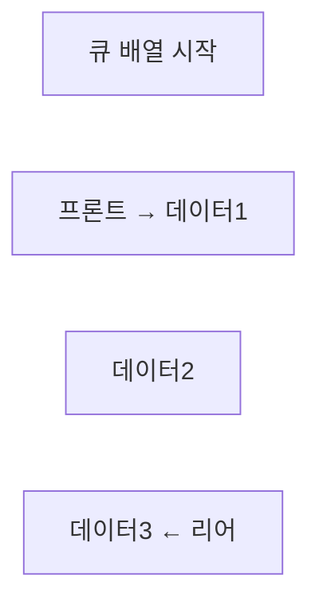

# 큐 자료구조 (Queue) ⏩

큐는 FIFO(First In, First Out) 원칙에 따라 동작하는 선형 자료구조입니다.  
데이터는 한쪽 끝(리어, Rear)에서 삽입(enqueue)되고 반대쪽 끝(프론트, Front)에서 삭제(dequeue)되며, 다양한 실무 분야에서 순차적인 데이터 처리를 위해 활용됩니다.

---

## 목차 📝
1. [개요](#개요)
2. [큐의 정의와 특징](#큐의-정의와-특징)
3. [메모리 구조 및 다이어그램](#메모리-구조-및-다이어그램)
4. [주요 연산](#주요-연산)
5. [장단점](#장단점)
6. [실무 활용 예시](#실무-활용-예시)
7. [참고 자료](#참고-자료)

---

## 개요 🧐
큐는 먼저 들어온 데이터가 먼저 처리되는 FIFO(First In, First Out) 원칙을 따르는 자료구조입니다.  
이 구조는 요청 처리, 이벤트 큐, 데이터 스트림 버퍼 등 순차적인 처리가 필요한 다양한 상황에서 사용됩니다.

---

## 큐의 정의와 특징 🔍
- **정의**:  
  큐는 한쪽 끝(리어)에서 데이터를 삽입하고, 반대쪽 끝(프론트)에서 데이터를 삭제하는 선형 자료구조입니다.

- **특징**:
  - **FIFO 원칙**: 먼저 삽입된 데이터가 먼저 삭제됩니다.
  - **두 가지 끝**: 프론트(Front)와 리어(Rear)를 통해 데이터의 삽입과 삭제가 구분됩니다.
  - **순차 처리**: 데이터가 순서대로 처리되므로, 요청이나 작업 스케줄링에 유용합니다.
  - **구현 방법**: 배열, 연결 리스트, 또는 원형 큐(Circular Queue), 투 스택 큐(Two-Stack Queue) 다양한 방식으로 구현할 수 있습니다.

---

## 메모리 구조 및 다이어그램 🖼️
큐는 보통 두 개의 포인터(프론트와 리어)를 사용하여 관리됩니다.  
아래 다이어그램은 배열 기반 큐의 기본 구조를 보여줍니다.

이 다이어그램은 큐에서 프론트와 리어가 어떻게 데이터의 삽입과 삭제를 관리하는지 시각적으로 표현합니다.

---

## 주요 연산 🛠️
큐에서 수행되는 대표적인 연산은 다음과 같습니다:

- **Enqueue (삽입)**:  
  리어(Rear) 쪽에 데이터를 추가하는 연산  
  _예시: `enqueue(data)`_

- **Dequeue (삭제)**:  
  프론트(Front) 쪽에서 데이터를 제거하고 반환하는 연산  
  _예시: `dequeue()`_

- **Peek (Front 확인)**:  
  큐의 프론트에 있는 데이터를 확인하되, 삭제하지 않는 연산  
  _예시: `peek()`_

- **isEmpty**:  
  큐가 비어있는지 여부를 확인하는 연산  
  _예시: `isEmpty()`_

---

## 장단점 ⚖️

### 장점 👍
- **FIFO 처리**: 데이터가 입력된 순서대로 처리되므로, 순차적인 작업에 최적화되어 있습니다.
- **명확한 구조**: 프론트와 리어의 개념으로 데이터의 흐름과 상태를 쉽게 파악할 수 있습니다.
- **다양한 응용**: 프로세스 스케줄링, 이벤트 처리, 데이터 스트림 관리 등 여러 실무 상황에 유용합니다.

### 단점 👎
- **임의 접근 불가**: 큐는 특정 위치의 데이터를 직접 접근하기 어렵습니다.
- **메모리 재할당 문제**: 배열 기반 큐의 경우 고정 크기로 인해 오버플로우나 언더플로우가 발생할 수 있으며, 원형 큐 등의 개선이 필요합니다.
- **공간 낭비**: 일반 배열 큐에서는 데이터가 삭제된 후 빈 공간이 발생할 수 있어 효율적인 메모리 사용이 어려울 수 있습니다.

---

## 실무 활용 예시 💼
큐는 다양한 분야에서 핵심 역할을 합니다:
- **프로세스 스케줄링**: 운영체제에서 프로세스의 순서를 관리합니다.
- **데이터 스트림 처리**: 실시간 이벤트나 요청을 순차적으로 처리하는 버퍼로 활용됩니다.
- **프린터 작업 관리**: 인쇄 명령을 입력된 순서대로 처리합니다.
- **네트워크 패킷 관리**: 전송된 패킷의 순서를 보장하여 안정적인 데이터 전송을 지원합니다.

---

## 참고 자료 🔗
- [Queue - Wikipedia](https://ko.wikipedia.org/wiki/큐_(자료구조))
- [GeeksforGeeks - Queue Data Structure](https://www.geeksforgeeks.org/queue-data-structure/)
- [Baekjoon Online Judge](https://www.acmicpc.net/)

- [큐는 언제 써야하는가?](When.md)

---

큐 자료구조의 개념과 동작 원리를 이해하면,  
실무에서 순차적인 작업 처리 및 데이터 흐름 제어 문제를 효율적으로 해결할 수 있습니다.  
