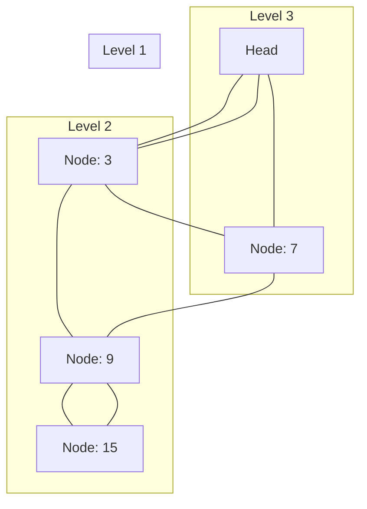

# 스킵 리스트 자료구조 (Skip List) 🚀📈

스킵 리스트는 확률적(randomized) 자료구조로, 정렬된 리스트 위에 여러 레벨의 링크드 리스트를 쌓아  
빠른 검색, 삽입, 삭제 연산을 평균 O(log n) 시간에 수행할 수 있도록 설계되었습니다.  
균형 잡힌 이진 탐색 트리와 유사한 성능을 보이면서도 구현이 상대적으로 단순한 것이 특징입니다.

---

## 목차 📝
1. [개요](#개요-🧐)
2. [정의 및 특징](#정의-및-특징-🔍)
3. [메모리 구조 및 다이어그램](#메모리-구조-및-다이어그램-🖼️)
4. [주요 연산](#주요-연산-🛠️)
5. [장단점](#장단점-⚖️)
6. [실무 활용 예시](#실무-활용-예시-💼)
7. [참고 자료](#참고-자료-🔗)

---

## 개요 🧐
스킵 리스트는 정렬된 데이터에 대해 빠른 검색을 지원하는 확률적 자료구조입니다.  
기본 아이디어는 여러 레벨의 링크드 리스트를 구성하여, 상위 레벨에서는 많은 요소들을 건너뛰며  
빠르게 검색 위치를 찾아내고, 하위 레벨에서 세부적으로 탐색하는 방식입니다.

---

## 정의 및 특징 🔍
- **정의**:  
  스킵 리스트는 여러 층의 연결 리스트(Linked List)를 통해 정렬된 데이터를 관리하는 자료구조입니다.  
  각 원소는 무작위로 결정된 레벨에 따라 여러 포인터를 가지며,  
  상위 레벨의 링크를 이용해 검색 속도를 크게 향상시킵니다.

- **특징**:
  - **확률적 균형**: 삽입 시 무작위성을 이용해 레벨을 결정,  
    평균적으로 O(log n) 성능을 보장합니다.
  - **구현의 단순성**: 트리와 달리 복잡한 회전이나 재구조화 없이 간단하게 구현할 수 있습니다.
  - **동적 레벨**: 각 원소의 레벨은 확률적으로 결정되어,  
    데이터 분포에 따라 자연스럽게 균형을 이루게 됩니다.

---

## 메모리 구조 및 다이어그램 🖼️
스킵 리스트는 여러 레벨의 연결 리스트로 구성되며,  
최상위 레벨은 전체 요소 중 일부만 포함하고, 하위 레벨로 내려갈수록 점점 더 많은 요소를 포함합니다.

위 다이어그램은 스킵 리스트의 여러 레벨 중 일부를 단순화하여 표현한 예시입니다.  
각 레벨은 상위 레벨보다 많은 노드를 포함하며, 최하위 레벨은 전체 데이터의 연결 리스트입니다.

---

## 주요 연산 🛠️
- **검색 (Search)**:  
  상위 레벨에서 빠르게 원하는 원소의 위치 근처로 이동한 후,  
  하위 레벨을 따라가며 정확한 위치를 찾습니다.  
  평균 시간 복잡도: O(log n)

- **삽입 (Insertion)**:  
  새로운 원소를 삽입할 때, 무작위로 레벨을 결정하고,  
  각 레벨의 올바른 위치에 포인터를 업데이트합니다.  
  평균 시간 복잡도: O(log n)

- **삭제 (Deletion)**:  
  검색을 통해 삭제할 원소를 찾아 모든 레벨에서 제거합니다.  
  평균 시간 복잡도: O(log n)

---

## 장단점 ⚖️

### 장점 👍
- **빠른 검색**: 여러 레벨의 링크드 리스트를 활용하여 평균 O(log n)의 검색 속도를 보장합니다.
- **구현 용이성**: 복잡한 트리 회전 없이 간단한 포인터 조작으로 구현할 수 있습니다.
- **동적 균형**: 확률적으로 균형을 이루므로, 데이터 삽입/삭제 시 자동으로 구조가 최적화됩니다.

### 단점 👎
- **최악의 경우 성능**: 무작위성에 의존하므로 최악의 경우 O(n)의 성능을 보일 수 있습니다.
- **공간 오버헤드**: 각 노드가 여러 포인터를 가지므로, 추가 메모리 사용이 발생할 수 있습니다.
- **확률적 보장**: 성능은 평균적으로 좋지만, 확률적 특성 때문에 항상 일정한 성능을 보장하지는 않습니다.

---

## 실무 활용 예시 💼
- **데이터베이스 인덱싱**: 빠른 검색 및 삽입/삭제가 요구되는 경우.
- **메모리 캐시**: 실시간 검색 및 업데이트가 필요한 애플리케이션.
- **네트워크 라우팅**: 경로 탐색 시 빠른 검색에 활용.
- **텍스트 검색 엔진**: 단어의 존재 여부나 순차 검색에 적합합니다.

---

## 참고 자료 🔗
- [Skip List - Wikipedia](https://en.wikipedia.org/wiki/Skip_list)
- [GeeksforGeeks - Skip List](https://www.geeksforgeeks.org/skip-list/)
- [Baekjoon Online Judge](https://www.acmicpc.net/)

---

스킵 리스트의 구조와 작동 원리를 이해하면,  
단순하면서도 효율적인 데이터 검색 및 업데이트 시스템을 구현할 수 있습니다.  