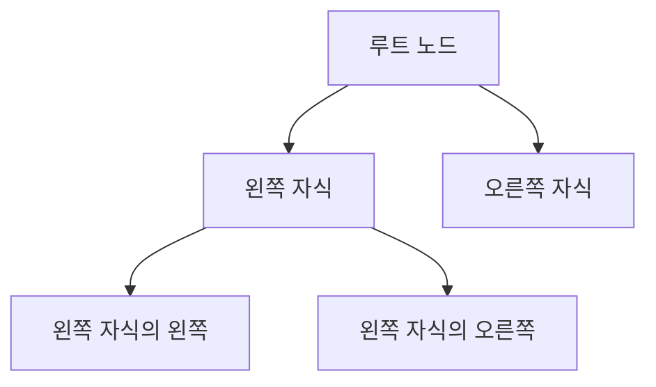
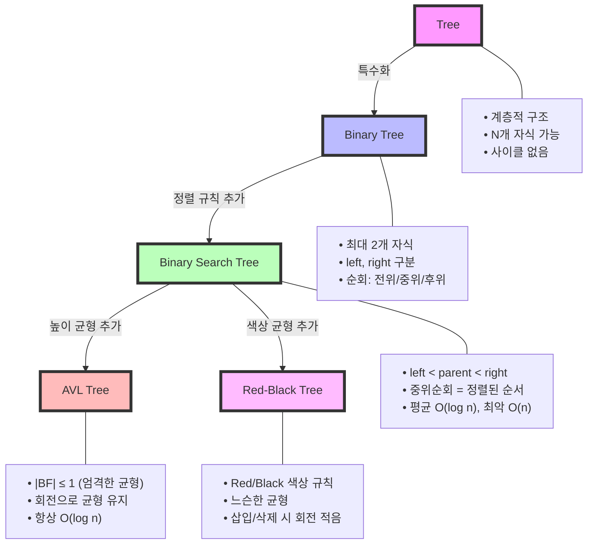

# Tree 자료구조 🌳

Tree는 노드들이 계층적으로 연결된 비선형 자료구조로, 각 노드는 데이터를 저장하고 여러 자식 노드를 가질 수 있습니다.  
파일 시스템, 데이터베이스 인덱스, 파싱 및 컴파일러 등 다양한 분야에서 트리 구조를 활용하여 데이터를 효율적으로 조직하고 탐색할 수 있습니다.

---

## 목차 📝
1. [개요](#개요)
2. [트리의 정의와 특징](#트리의-정의와-특징)
3. [메모리 구조 및 다이어그램](#메모리-구조-및-다이어그램)
4. [주요 연산](#주요-연산)
5. [장단점](#장단점)
6. [실무 활용 예시](#실무-활용-예시)
7. [트리 확장판 비교](#트리-확장판-비교)
8. [여러 트리 종류](#여러-트리-종류)
9. [참고 자료](#참고-자료)

---

## 개요 🧐
트리(Tree)는 계층적 구조를 표현하는 대표적인 비선형 자료구조입니다.  
하나의 **루트 노드(Root Node)**를 시작으로, 각 노드는 하나 이상의 자식 노드를 가질 수 있으며, 이러한 노드들의 연결로 전체 트리 구조가 형성됩니다.  
트리는 재귀적인 성질을 지니며, 다양한 형태(예: 이진 트리, 이진 탐색 트리, AVL 트리, B-트리 등)로 구현되어 문제에 맞는 최적의 데이터 구조를 선택할 수 있습니다.

---

## 트리의 정의와 특징 🔍
- **정의**:  
  트리는 하나의 루트 노드를 가지며, 각 노드는 데이터와 자식 노드에 대한 포인터(또는 참조)를 포함하는 자료구조입니다.

- **특징**:
  - **계층적 구조**: 데이터가 부모-자식 관계를 통해 계층적으로 조직됩니다.
  - **재귀적 성질**: 각 하위 트리(subtree)도 전체 트리와 동일한 구조를 가집니다.
  - **다양한 형태**: 이진 트리, 일반 트리, 균형 트리 등 문제에 따라 다양한 트리 형태를 사용할 수 있습니다.
  - **효율적 탐색**: 이진 탐색 트리(BST) 등은 평균적으로 O(log n) 시간에 탐색, 삽입, 삭제가 가능합니다.

---

## 메모리 구조 및 다이어그램 🖼️
트리는 각 노드가 독립적으로 할당되며, 포인터를 통해 부모와 자식 간의 관계를 유지합니다.  
아래 다이어그램은 간단한 이진 트리의 구조를 나타냅니다.

이 구조는 루트 노드에서 시작해 각 노드가 자신의 자식 노드를 가리키며 계층적인 구조를 형성하는 것을 보여줍니다.

---

## 주요 연산 🛠️
트리 자료구조에서 자주 사용되는 연산은 다음과 같습니다:

- **탐색 (Search)**:  
  특정 값을 찾기 위해 트리의 노드를 순회합니다. 이진 탐색 트리에서는 평균 O(log n)의 시간 복잡도를 가집니다.

- **삽입 (Insertion)**:  
  새로운 노드를 트리의 적절한 위치에 추가합니다. 트리 종류에 따라 삽입 방식이 달라질 수 있습니다.

- **삭제 (Deletion)**:  
  트리에서 특정 노드를 제거하며, 필요 시 자식 노드들을 재배치합니다.

- **순회 (Traversal)**:  
  트리의 모든 노드를 방문하는 연산으로, 전위(Pre-order), 중위(In-order), 후위(Post-order), 레벨 순회(Level-order) 등이 있습니다.

---

## 장단점 ⚖️

### 장점 👍
- **계층적 데이터 표현**: 복잡한 계층 구조의 데이터를 직관적으로 표현할 수 있습니다.
- **효율적 탐색**: 균형 잡힌 트리(BST 등)는 빠른 탐색과 삽입, 삭제 연산을 지원합니다.
- **재귀적 문제 해결**: 트리의 재귀적 구조를 활용하여 알고리즘을 간결하게 구현할 수 있습니다.

### 단점 👎
- **메모리 오버헤드**: 각 노드가 별도로 할당되므로 배열 등 선형 자료구조에 비해 메모리 사용량이 많습니다.
- **구현 복잡성**: 균형 트리나 특수 트리(AVL, Red-Black Tree 등)는 구현과 유지보수가 복잡할 수 있습니다.
- **최악의 경우 성능 저하**: 이진 탐색 트리의 경우, 균형이 맞지 않으면 최악의 경우 선형 탐색과 동일한 성능(O(n))을 보일 수 있습니다.

---

## 실무 활용 예시 💼
트리 자료구조는 다양한 분야에서 활용됩니다:
- **파일 시스템**: 디렉토리와 파일의 계층적 구조 표현
- **데이터베이스 인덱스**: B-트리, B+트리 등을 활용한 빠른 검색
- **파싱 및 컴파일러**: 구문 트리(Abstract Syntax Tree, AST)를 사용한 소스 코드 분석
- **네트워크 라우팅**: 최적 경로 탐색 및 계층적 네트워크 구조 관리

---

## 트리 확장판 비교

---

## 여러 트리 종류

### 이진 트리(Binary Tree)
[이진 트리 바로 가기](./binary-tree/README.md)

### 세그먼트 트리(Segment Tree)
[세그먼트 트리 바로 가기](segment.md)

### 펜윅 트리 (Fenwick Tree)
[펜윅 트리 바로 가기](fenwick.md)

### 트라이 (Trie)
[트라이 바로가기](trie.md)

### 라디슐 트리 (Radix Tree)
[라디슐 트리 바로가기](radix.md)

---

## 참고 자료 🔗
- [Tree - Wikipedia](https://ko.wikipedia.org/wiki/트리_(자료구조))
- [GeeksforGeeks - Tree Data Structure](https://www.geeksforgeeks.org/tree-data-structure/)
- [Baekjoon Online Judge](https://www.acmicpc.net/)

---

트리 자료구조의 개념과 응용 사례를 충분히 이해하면,  
복잡한 계층적 데이터를 효율적으로 관리하고 탐색하는 데 큰 도움이 됩니다.  