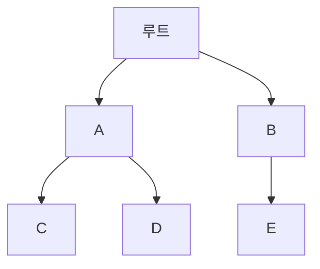

# 트라이 (Trie) 자료구조 🔠🌐

트라이는 문자열(또는 시퀀스) 데이터를 저장하고 검색하기 위해 설계된 트리 기반 자료구조입니다.  
각 노드는 한 글자 또는 한 요소를 나타내며,  
공통 접두사를 공유하는 단어들을 효율적으로 저장할 수 있어, 자동 완성, 사전 검색, 문자열 매칭 등 다양한 응용 분야에서 활용됩니다.

---

## 목차 📝
1. [개요](#개요-🧐)
2. [트라이의 정의와 특징](#트라이의-정의와-특징-🔍)
3. [메모리 구조 및 다이어그램](#메모리-구조-및-다이어그램-🖼️)
4. [주요 연산](#주요-연산-🛠️)
5. [장단점](#장단점-⚖️)
6. [실무 활용 예시](#실무-활용-예시-💼)
7. [참고 자료](#참고-자료-🔗)

---

## 개요 🧐
트라이는 문자열 데이터의 집합을 효율적으로 저장하고 검색할 수 있도록 설계된 트리 구조입니다.  
각 노드는 특정 문자나 값으로 표현되며,  
루트부터 리프까지의 경로가 하나의 문자열을 나타냅니다.  
이 구조는 특히 공통 접두사를 가진 단어들이 많을 때 메모리 사용과 검색 속도에서 큰 이점을 제공합니다.

---

## 트라이의 정의와 특징 🔍
- **정의**:  
  트라이는 각 노드가 하나의 문자(또는 값)를 나타내며,  
  문자열의 접두사를 기반으로 하위 노드들이 연결되어 있는 트리 구조입니다.

- **특징**:
  - **빠른 검색**: 단어 검색, 자동 완성, 사전 검색 등에서 평균 O(m) (m: 검색할 문자열 길이) 시간 내에 수행됩니다.
  - **공간 효율성**: 공통 접두사를 공유하는 문자열들을 하나의 경로로 통합하여 저장할 수 있습니다.
  - **다양한 응용**: 문자열 매칭, 철자 검사, IP 라우팅, DNA 서열 분석 등 여러 분야에서 활용됩니다.
  - **알파벳 기반**: 일반적으로 각 노드는 알파벳의 문자(또는 확장된 문자 집합)를 자식으로 가질 수 있습니다.

---

## 메모리 구조 및 다이어그램 🖼️
트라이는 루트 노드에서 시작해 각 노드가 자식 노드들의 집합(해시맵 또는 고정 배열)을 가지는 형태입니다.  
아래 다이어그램은 간단한 트라이의 구조를 보여줍니다.

이 예시에서, 루트 노드 아래에 여러 자식이 있으며, "A" 노드 아래에 "C"와 "D"가 연결되는 등,  
경로를 통해 특정 문자열(예: "AC", "AD", "BE" 등)을 형성할 수 있습니다.

---

## 주요 연산 🛠️
트라이에서 수행되는 주요 연산은 다음과 같습니다:

- **삽입 (Insertion)**:  
  - 주어진 문자열의 각 문자를 순차적으로 삽입하며,  
    해당 경로에 노드가 없으면 새 노드를 생성합니다.
  
- **검색 (Search)**:  
  - 주어진 문자열을 루트부터 순차적으로 따라가며 존재 여부를 확인합니다.
  - 만약 전체 문자열의 경로가 존재하면, 해당 단어가 저장되어 있음을 의미합니다.

- **삭제 (Deletion)**:  
  - 특정 문자열을 트라이에서 삭제합니다.
  - 노드를 삭제한 후, 불필요한 노드(더 이상 다른 문자열의 접두사가 아닌 경우)를 제거하여 공간을 회수합니다.

---

## 장단점 ⚖️

### 장점 👍
- **빠른 문자열 검색**: 입력 문자열 길이에 비례하는 시간(O(m)) 내에 검색이 가능합니다.
- **자동 완성 및 접두사 검색**: 공통 접두사를 공유하는 문자열들을 효율적으로 저장하여, 자동 완성 기능에 최적화되어 있습니다.
- **동적 업데이트**: 문자열 삽입과 삭제가 비교적 간단하게 이루어집니다.

### 단점 👎
- **메모리 사용량**: 각 노드가 자식 포인터 배열이나 해시맵을 사용하므로,  
  특히 문자 집합이 큰 경우 메모리 사용량이 증가할 수 있습니다.
- **구현 복잡성**: 삭제와 같은 연산에서는 불필요한 노드 제거 및 트리 구조 재조정이 필요하여 구현이 복잡할 수 있습니다.

---

## 실무 활용 예시 💼
- **자동 완성 시스템**: 검색 엔진, 모바일 키보드, IDE 등에서 실시간 단어 추천에 사용됩니다.
- **철자 검사**: 단어의 존재 여부를 빠르게 확인할 수 있어, 오타 검증에 활용됩니다.
- **문자열 매칭**: 긴 텍스트에서 특정 접두사나 단어를 검색하는 작업에 적합합니다.
- **네트워크 라우팅**: IP 주소의 접두사 매칭 등에 활용됩니다.

---

## 참고 자료 🔗
- [Trie - Wikipedia](https://en.wikipedia.org/wiki/Trie)
- [GeeksforGeeks - Trie Data Structure](https://www.geeksforgeeks.org/trie-insert-and-search/)
- [Baekjoon Online Judge](https://www.acmicpc.net/)

---

트라이 자료구조의 원리와 응용을 이해하면,  
빠른 문자열 검색 및 자동 완성 시스템 구현에 큰 도움이 될 것입니다.  