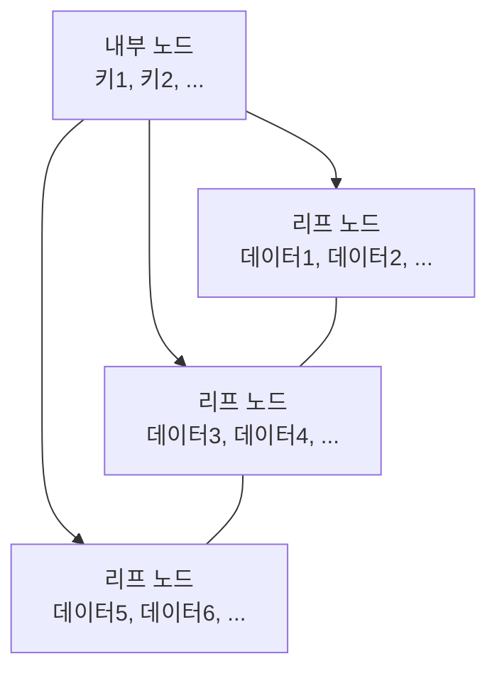

# B+ Tree 자료구조 📚🌲

B+ Tree는 B-Tree의 한 변형으로, 주로 데이터베이스와 파일 시스템에서 활용됩니다.  
내부 노드는 오직 검색 인덱스 역할만 수행하며, 실제 데이터는 모두 리프 노드에 저장됩니다.  
리프 노드들은 연결 리스트 형태로 서로 연결되어 있어 순차 탐색과 범위 검색에 매우 효율적입니다.

---

## 목차 📝
1. [개요](#개요-🧐)
2. [B+ Tree의 정의와 특징](#b-tree의-정의와-특징)
3. [메모리 구조 및 다이어그램](#메모리-구조-및-다이어그램-🖼️)
4. [주요 연산](#주요-연산-🛠️)
5. [장단점](#장단점-⚖️)
6. [실무 활용 예시](#실무-활용-예시-💼)
7. [참고 자료](#참고-자료-🔗)

---

## 개요 🧐
B+ Tree는 균형 잡힌 다진 트리 구조로,  
내부 노드는 검색 인덱스(키와 자식 포인터)만을 보유하고,  
모든 실제 데이터는 리프 노드에 저장됩니다.  
리프 노드들은 순차적인 접근을 위해 연결 리스트로 연결되어, 범위 검색 및 정렬된 데이터 접근에 탁월한 성능을 발휘합니다.

---

## B+ Tree의 정의와 특징
- **정의**:  
  B+ Tree는 모든 실제 데이터 레코드가 리프 노드에 저장되고,  
  내부 노드는 인덱스 역할만 수행하는 다진 균형 트리입니다.
  
- **특징**:
  - **데이터 저장**: 실제 데이터는 리프 노드에만 존재하며,  
    내부 노드는 키와 자식 포인터만 포함합니다.
  - **순차 접근 효율**: 리프 노드들이 연결 리스트 형태로 연결되어 있어,  
    범위 검색과 순차 읽기가 매우 빠릅니다.
  - **높은 차수**: 각 노드가 다수의 자식을 가질 수 있어,  
    디스크 I/O 횟수를 줄이고 대용량 데이터에 유리합니다.
  - **높이 균형**: 모든 리프 노드가 동일한 깊이에 위치하여,  
    최악의 경우에도 일정한 탐색 시간을 보장합니다.

---

## 메모리 구조 및 다이어그램 🖼️
B+ Tree의 내부 노드는 데이터가 아닌 키와 자식 포인터만 저장하며,  
리프 노드는 실제 데이터 레코드와 함께, 다음 리프 노드에 대한 포인터를 포함합니다.

---

## 주요 연산 🛠️
- **검색 (Search)**:  
  내부 노드를 통해 적절한 리프 노드를 찾아, 원하는 데이터를 빠르게 검색합니다.
  
- **삽입 (Insertion)**:  
  적절한 리프 노드를 찾아 데이터를 삽입하며, 노드가 과도하게 채워지면 분할(split) 연산을 수행합니다.
  
- **삭제 (Deletion)**:  
  리프 노드에서 데이터를 삭제하고, 노드 병합(merge) 또는 재분배(redistribution)를 통해 트리 균형을 유지합니다.
  
- **순회 (Traversal)**:  
  리프 노드의 연결 리스트를 통해 범위 검색이나 순차 접근을 매우 효율적으로 수행할 수 있습니다.

---

## 장단점 ⚖️

### 장점 👍
- **효율적인 범위 검색**: 리프 노드 연결 리스트로 인해 연속된 데이터 접근이 빠릅니다.
- **높은 디스크 I/O 효율**: 높은 차수를 활용하여 디스크 접근 횟수를 최소화합니다.
- **균형 유지**: 모든 리프 노드가 동일한 깊이에 위치하여, 검색 시간이 일정합니다.

### 단점 👎
- **구현 복잡성**: 노드 분할, 병합, 재분배 등의 연산 구현이 상대적으로 복잡합니다.
- **내부 노드의 공간 낭비**: 내부 노드는 실제 데이터를 저장하지 않아, 메모리 사용 효율이 다소 떨어질 수 있습니다.

---

## 실무 활용 예시 💼
- **데이터베이스 인덱스**: MySQL, Oracle 등 주요 데이터베이스 시스템에서 인덱스로 사용됩니다.
- **파일 시스템**: 디렉토리 및 파일 메타데이터 관리를 위해 활용됩니다.
- **키-값 저장소**: 대용량 데이터 검색 및 범위 쿼리에 유리한 인덱싱 구조로 사용됩니다.

---

## 참고 자료 🔗
- [B+ Tree - Wikipedia](https://en.wikipedia.org/wiki/B%2B_tree)
- [GeeksforGeeks - B+ Tree](https://www.geeksforgeeks.org/b-plus-tree/)
- [Baekjoon Online Judge](https://www.acmicpc.net/)

---

B+ Tree의 구조와 연산을 이해하면,  
대용량 데이터베이스와 파일 시스템에서 빠른 검색 및 효율적인 데이터 관리를 구현할 수 있습니다.  