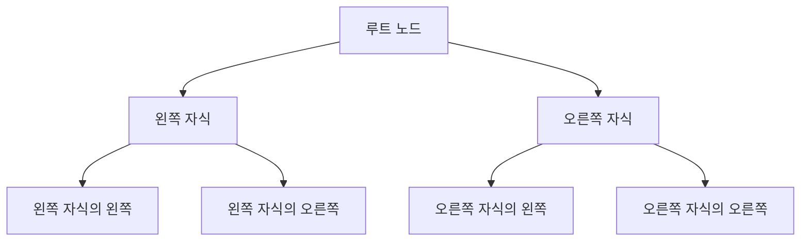

# 이진 트리 자료구조 🌲

이진 트리는 각 노드가 최대 두 개의 자식(왼쪽, 오른쪽)을 갖는 트리 구조입니다.  
많은 알고리즘과 데이터 구조(예: 이진 탐색 트리, 힙, 표현식 트리 등)의 기초가 되며, 효율적인 검색, 정렬 및 계층적 데이터 표현에 활용됩니다.

---

## 목차 📝
1. [개요](#개요)
2. [이진 트리의 정의와 특징](#이진-트리의-정의와-특징)
3. [주요 연산 및 순회](#주요-연산-및-순회)
4. [메모리 구조 및 다이어그램](#메모리-구조-및-다이어그램)
5. [실무 활용 예시](#실무-활용-예시)
6. [이진 검색 트리의 확장](#이진-트리-확장)
7. [참고 자료](#참고-자료)

---

## 개요 🧐
이진 트리는 각 노드가 두 개 이하의 자식 노드를 가지는 자료구조로,  
재귀적 구조를 이용하여 데이터를 계층적으로 관리하고 탐색하는 데 매우 유용합니다.  
이진 트리의 기본 형태는 단순한 구조이지만, 이를 확장하여 다양한 변형(이진 탐색 트리, 균형 이진 트리, 완전 이진 트리 등)으로 활용할 수 있습니다.

---

## 이진 트리의 정의와 특징 🔍
- **정의**:  
  이진 트리는 각 노드가 최대 두 개의 자식 노드를 갖는 트리 자료구조입니다.
  
- **특징**:
  - **최대 두 자식**: 각 노드는 왼쪽 자식과 오른쪽 자식을 가질 수 있습니다.
  - **재귀적 구조**: 트리의 각 부분은 또 다른 이진 트리로 볼 수 있어, 재귀 알고리즘 구현에 적합합니다.
  - **순회 방법**: 전위, 중위, 후위, 레벨 순회 등의 다양한 방식으로 노드를 방문할 수 있습니다.
  - **다양한 응용**: 이진 탐색 트리, 힙, 표현식 트리 등 여러 분야에서 핵심적인 역할을 합니다.

---

## 주요 연산 및 순회 🛠️
- **삽입 (Insertion)**:  
  새로운 노드를 적절한 위치에 추가합니다.  
  이진 탐색 트리의 경우, 왼쪽 서브트리는 작은 값, 오른쪽 서브트리는 큰 값으로 분류합니다.

- **삭제 (Deletion)**:  
  특정 노드를 제거하며, 자식 노드들을 적절히 재배치합니다.

- **탐색 (Search)**:  
  재귀 또는 반복문을 통해 특정 값을 가진 노드를 찾습니다.

- **순회 (Traversal)**:  
  - **전위 순회 (Pre-order)**: 현재 노드 → 왼쪽 서브트리 → 오른쪽 서브트리  
  - **중위 순회 (In-order)**: 왼쪽 서브트리 → 현재 노드 → 오른쪽 서브트리  
  - **후위 순회 (Post-order)**: 왼쪽 서브트리 → 오른쪽 서브트리 → 현재 노드  
  - **레벨 순회 (Level-order)**: 트리의 각 레벨을 순서대로 방문

---

## 메모리 구조 및 다이어그램 🖼️
이진 트리는 각 노드가 동적으로 할당되며, 포인터를 통해 왼쪽 및 오른쪽 자식과 연결됩니다.  
아래 다이어그램은 간단한 이진 트리의 구조를 나타냅니다.

---

## 실무 활용 예시 💼
- **이진 탐색 트리 (BST)**: 데이터 검색, 삽입, 삭제를 평균 O(log n)의 시간 복잡도로 수행  
- **힙(Heap)**: 우선순위 큐, 힙 정렬 등에 사용되어 효율적인 정렬 및 스케줄링 지원  
- **표현식 트리(Expression Tree)**: 수식의 구문 분석 및 평가  
- **네트워크 라우팅**: 계층적 데이터 구조로 라우팅 경로 관리

---

## 이진 트리 확장

### 이진 검색 트리 (BST Bianry Search Tree)
[이진 검색 트리 바로가기](./binary-search-tree/README.md)

### B+ Tree
[B+ Tree 바로 가기](./B-plus-tree/README.md)

### B- Tree
[B- Tree 바로 가기](./B-minus-tree/README.md)

---

## 참고 자료 🔗
- [이진 트리 - Wikipedia](https://ko.wikipedia.org/wiki/이진_트리)
- [GeeksforGeeks - Binary Tree](https://www.geeksforgeeks.org/binary-tree-data-structure/)
- [Baekjoon Online Judge](https://www.acmicpc.net/)

---

이진 트리 자료구조를 이해하면, 다양한 알고리즘 및 응용 분야에서 효율적인 데이터 관리와 탐색 기법을 구현할 수 있습니다. 