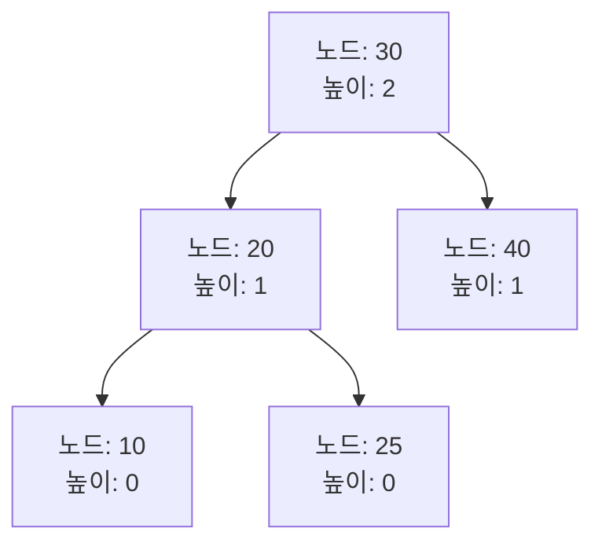

# AVL 트리 (AVL Tree) 🌳🔄

AVL 트리는 Adelson-Velsky와 Landis가 제안한 자가 균형 이진 검색 트리(Self-Balancing Binary Search Tree)입니다.  
각 노드에서 좌우 서브트리의 높이 차이가 최대 1을 유지하도록 하여, 모든 기본 연산(탐색, 삽입, 삭제)이 평균 O(log n)의 시간복잡도를 보장합니다.

---

## 목차 📝
1. [개요](#개요-🧐)
2. [정의와 특징](#정의와-특징-🔍)
3. [회전 연산](#회전-연산-🔄)
4. [메모리 구조 및 다이어그램](#메모리-구조-및-다이어그램-🖼️)
5. [주요 연산](#주요-연산-🛠️)
6. [장단점](#장단점-⚖️)
7. [실무 활용 예시](#실무-활용-예시-💼)
8. [참고 자료](#참고-자료-🔗)

---

## 개요 🧐
AVL 트리는 이진 검색 트리(BST)의 일종으로,  
각 노드의 **균형 인수(Balance Factor)**가 -1, 0, 1만을 유지하도록 하여 트리의 높이가 최소화되도록 합니다.  
이를 통해 최악의 경우에도 탐색, 삽입, 삭제 연산을 빠르게 수행할 수 있습니다. 🚀

---

## 정의와 특징 🔍
- **정의**:  
  AVL 트리는 각 노드에 대해 좌우 서브트리 높이 차이가 1 이하인 이진 검색 트리입니다.
  
- **특징**:
  - **자체 균형**: 삽입 및 삭제 후 자동으로 회전 연산을 수행하여 트리의 균형을 유지합니다.
  - **높이 보장**: 균형을 유지하기 때문에 트리의 높이가 O(log n)을 보장합니다.
  - **회전 연산**: 균형을 맞추기 위해 단일 회전(LL, RR)과 이중 회전(LR, RL)을 사용합니다.

---

## 회전 연산 🔄
AVL 트리의 균형을 회복하기 위해 네 가지 기본 회전 연산이 사용됩니다:

- **LL 회전**: 왼쪽 자식의 왼쪽 서브트리에서 불균형이 발생한 경우  
- **RR 회전**: 오른쪽 자식의 오른쪽 서브트리에서 불균형이 발생한 경우  
- **LR 회전**: 왼쪽 자식의 오른쪽 서브트리에서 불균형이 발생한 경우 (왼쪽 회전 후 오른쪽 회전)  
- **RL 회전**: 오른쪽 자식의 왼쪽 서브트리에서 불균형이 발생한 경우 (오른쪽 회전 후 왼쪽 회전)  

이러한 회전 연산을 통해 AVL 트리는 항상 균형 상태를 유지합니다.

---

## 메모리 구조 및 다이어그램 🖼️
AVL 트리는 각 노드가 데이터를 저장하고, 좌우 자식에 대한 포인터와 노드의 높이 정보를 함께 보유합니다.  
아래 다이어그램은 AVL 트리의 기본 구조와 균형 상태를 간략하게 나타냅니다.

---

## 주요 연산 🛠️
- **삽입 (Insertion)**:  
  새로운 노드를 BST 규칙에 따라 삽입한 후, 회전 연산을 통해 균형을 유지합니다.
  
- **삭제 (Deletion)**:  
  삭제 후에도 트리의 균형 인수를 확인하고, 필요한 경우 회전 연산을 수행하여 균형을 복구합니다.
  
- **탐색 (Search)**:  
  균형 잡힌 구조 덕분에 평균 O(log n)의 시간 내에 원하는 값을 찾을 수 있습니다.
  
- **회전 (Rotation)**:  
  불균형이 감지될 경우 LL, RR, LR, RL 회전 연산을 통해 트리의 균형을 회복합니다.

---

## 장단점 ⚖️

### 장점 👍
- **빠른 연산 속도**: 균형 잡힌 구조 덕분에 모든 기본 연산이 O(log n) 시간에 수행됩니다.
- **예측 가능한 성능**: 최악의 경우에도 트리의 높이가 제한되어 있어 성능 저하가 적습니다.
- **동적 균형**: 삽입, 삭제 시 자동으로 회전하여 균형을 유지합니다.

### 단점 👎
- **구현 복잡성**: 회전 연산 및 균형 인수 업데이트 등으로 구현이 다소 복잡합니다.
- **추가 메모리 사용**: 각 노드에 높이 정보를 저장하므로 약간의 메모리 오버헤드가 발생합니다.

---

## 실무 활용 예시 💼
- **데이터베이스 인덱스**: 빠른 데이터 검색과 삽입, 삭제를 위해 AVL 트리를 활용할 수 있습니다.
- **메모리 관리**: 균형 잡힌 트리 구조로 효율적인 메모리 할당 및 해제가 가능합니다.
- **실시간 시스템**: 예측 가능한 성능이 요구되는 실시간 응용 프로그램에서 사용됩니다.

---

## 참고 자료 🔗
- [AVL 트리 - Wikipedia](https://ko.wikipedia.org/wiki/AVL_트리)
- [GeeksforGeeks - AVL Tree](https://www.geeksforgeeks.org/avl-tree-set-1-insertion/)
- [Baekjoon Online Judge](https://www.acmicpc.net/)

---

AVL 트리의 균형 유지 메커니즘과 회전 연산을 이해하면,  
효율적인 데이터 검색 및 동적 데이터 구조 설계에 큰 도움이 될 것입니다.  