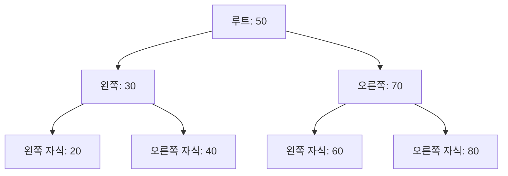

# 이진 검색 트리 (Binary Search Tree) 🔍🌳

이진 검색 트리(BST)는 각 노드가 하나의 값을 저장하며,  
왼쪽 서브트리의 모든 값은 해당 노드의 값보다 작고,  
오른쪽 서브트리의 모든 값은 해당 노드의 값보다 큰 구조를 가진 트리입니다.  
이러한 성질 덕분에 데이터의 탐색, 삽입, 삭제 연산을 평균 O(log n)의 시간복잡도로 수행할 수 있어 매우 효율적입니다.

---

## 목차 📝
1. [개요](#개요-🧐)
2. [정의와 특징](#정의와-특징-🔍)
3. [메모리 구조 및 다이어그램](#메모리-구조-및-다이어그램-🖼️)
4. [주요 연산](#주요-연산-🛠️)
5. [장단점](#장단점-⚖️)
6. [실무 활용 예시](#실무-활용-예시-💼)
7. [이진 검색 트리 확장](#이진-검색-트리-확장)
8. [참고 자료](#참고-자료-🔗)

---

## 개요 🧐
이진 검색 트리는 **정렬된 상태**로 데이터를 저장하기 때문에,  
특정 값을 빠르게 찾아내거나, 정렬된 순서대로 데이터를 열람할 수 있는 장점이 있습니다.  
하지만 트리의 균형이 깨지면 최악의 경우 O(n)의 시간복잡도를 보일 수 있으므로,  
균형 잡힌 트리(예: AVL 트리, Red-Black 트리)와 함께 많이 연구됩니다.

---

## 정의와 특징 🔍
- **정의**:  
  이진 검색 트리는 각 노드가 다음의 조건을 만족하는 이진 트리입니다.  
  - 왼쪽 서브트리의 모든 노드 값 < 현재 노드의 값  
  - 오른쪽 서브트리의 모든 노드 값 > 현재 노드의 값

- **특징**:
  - **정렬 유지**: 중위 순회를 하면 오름차순으로 정렬된 결과를 얻을 수 있습니다.
  - **효율적 탐색**: 평균적으로 O(log n) 시간 내에 원하는 값을 찾을 수 있습니다.
  - **재귀적 구조**: 각 서브트리 역시 이진 검색 트리의 성질을 그대로 가집니다.

---

## 메모리 구조 및 다이어그램 🖼️
이진 검색 트리는 각 노드가 동적으로 할당되며,  
포인터를 통해 왼쪽 및 오른쪽 자식과 연결됩니다.  
아래 다이어그램은 간단한 이진 검색 트리의 구조를 보여줍니다.

---

## 주요 연산 🛠️
- **삽입 (Insertion)**:  
  새로운 데이터를 트리의 적절한 위치에 삽입합니다.  
  - 재귀적으로 트리를 탐색하며 위치를 결정  
  - 중위 순회 결과가 정렬 상태로 유지됨

- **탐색 (Search)**:  
  트리의 성질을 이용하여 원하는 값을 빠르게 찾아냅니다.  
  - 현재 노드와 비교하여 왼쪽 또는 오른쪽 서브트리로 재귀적으로 이동

- **삭제 (Deletion)**:  
  특정 값을 가진 노드를 삭제하고, 트리의 구조를 재정비합니다.  
  - 삭제할 노드가 리프인 경우, 단순 제거  
  - 자식이 하나인 경우, 해당 자식을 부모와 연결  
  - 두 자식을 가진 경우, 오른쪽 서브트리의 중위 후계자를 찾아 대체

- **순회 (Traversal)**:  
  - **중위 순회 (In-order)**: 오름차순으로 데이터를 출력  
  - **전위 순회 (Pre-order)** 및 **후위 순회 (Post-order)**: 트리의 구조를 이해하는 데 유용  
  - **레벨 순회 (Level-order)**: 각 레벨별로 데이터를 출력

---

## 장단점 ⚖️

### 장점 👍
- **효율적 탐색**: 평균 O(log n) 시간에 데이터 탐색이 가능  
- **정렬된 데이터**: 중위 순회를 통해 항상 정렬된 데이터를 얻을 수 있음  
- **유연성**: 동적 데이터 구조로 삽입 및 삭제가 용이함

### 단점 👎
- **불균형 문제**: 입력 순서에 따라 한쪽으로 치우칠 수 있어 최악의 경우 탐색 속도가 O(n)으로 떨어질 수 있음  
- **추가 메모리 사용**: 각 노드마다 포인터를 저장해야 하므로 배열 기반 자료구조에 비해 메모리 오버헤드가 있음

---

## 실무 활용 예시 💼
- **데이터베이스 인덱스**: 검색과 정렬이 중요한 데이터베이스 시스템에서 활용  
- **파일 시스템**: 디렉토리 구조 관리 및 빠른 파일 검색  
- **라이브러리 및 API 구현**: 검색 기능이 필요한 소프트웨어에서 효율적 데이터 관리

---

## 이진 검색 트리 확장

### AVL 트리(Adelson-Velsky and Landis Tree)
AVL 트리는 BST에서 발생하는 편향(Skewed) 문제를 해결하기 위해, 노드 높이 균형을 엄격하게 유지하는 자가 균형 이진 검색 트리의 한 종류입니다.
[AVL 트리 바로 가기](./AVL/README.md)

### Red-Black Tree
AVL 트리와 마찬가지로 편향(스큐) 문제를 해결하기 위한 균형(Binary Balanced) 트리의 한 종류입니다. 그러나 AVL 트리에 비해 균형 유지 조건이 조금 더 완화되어, 삽입·삭제 연산에서 회전(Rotation)의 발생 빈도가 줄어드는 특징이 있습니다.
[Red-Black 트리 바로 가기](./Red-Black/README.md)

---

## 참고 자료 🔗
- [이진 검색 트리 - Wikipedia](https://ko.wikipedia.org/wiki/이진_탐색_트리)
- [GeeksforGeeks - Binary Search Tree](https://www.geeksforgeeks.org/binary-search-tree-data-structure/)
- [Baekjoon Online Judge](https://www.acmicpc.net/)

---

이진 검색 트리의 원리와 구현 방식을 이해하면,  
효율적인 데이터 검색과 정렬을 위한 강력한 도구로 활용할 수 있습니다.  