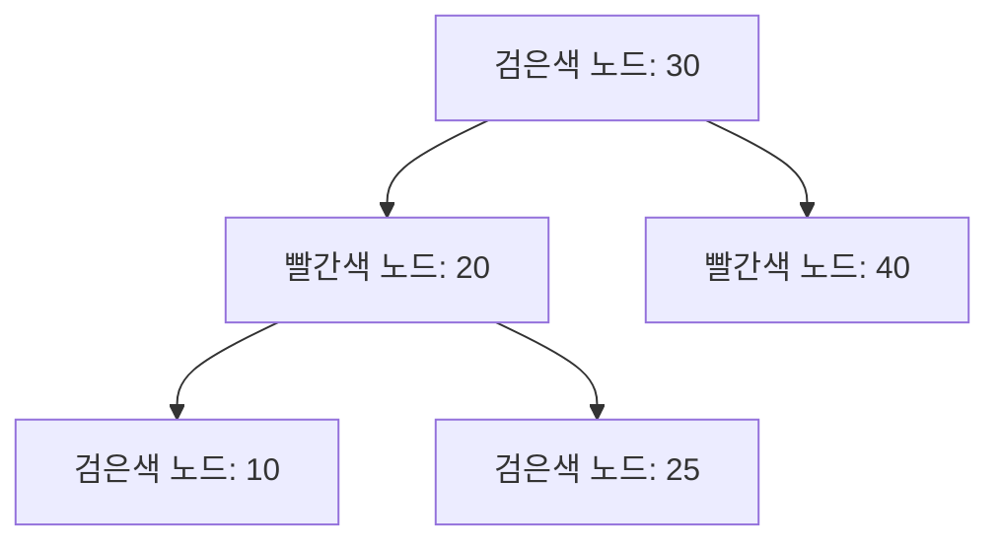

\# Red-Black Tree 자료구조 (Red-Black Tree) 🔴⚫

Red-Black Tree는 자가 균형 이진 검색 트리의 한 종류로,  
각 노드에 **빨간색(Red)** 또는 **검은색(Black)**의 색상을 부여하여 트리의 균형을 유지합니다.  
이러한 색상 기반 규칙 덕분에 삽입, 삭제, 탐색 연산을 최악의 경우에도 O(log n) 시간 내에 수행할 수 있습니다.

---

## 목차 📝
1. [개요](#개요-🧐)
2. [정의와 특징](#정의와-특징-🔍)
3. [Red-Black Tree의 규칙](#red-black-tree의-규칙)
4. [메모리 구조 및 다이어그램](#메모리-구조-및-다이어그램-🖼️)
5. [주요 연산](#주요-연산-🛠️)
6. [장단점](#장단점-⚖️)
7. [실무 활용 예시](#실무-활용-예시-💼)
8. [참고 자료](#참고-자료-🔗)

---

## 개요 🧐
Red-Black Tree는 이진 검색 트리(BST)의 일종으로,  
노드에 색상 정보를 추가하여 트리의 균형을 유지합니다.  
이 트리는 대규모 데이터셋에서도 안정적인 성능을 보장하며, 삽입 및 삭제 연산 시 예측 가능한 O(log n) 시간복잡도를 제공합니다.

---

## 정의와 특징 🔍
- **정의**:  
  Red-Black Tree는 각 노드가 빨간색 또는 검은색을 가지며,  
  다음의 규칙을 만족하도록 유지되는 자가 균형 이진 검색 트리입니다.
  
- **특징**:
  - **자가 균형 유지**: 색상과 회전 연산을 통해 트리의 높이를 O(log n)으로 제한합니다.
  - **효율적인 연산**: 삽입, 삭제, 탐색 연산 모두 최악의 경우에도 O(log n) 시간에 수행됩니다.
  - **광범위한 응용**: C++ STL의 `std::map`, `std::set` 등 다양한 라이브러리와 시스템에서 채택되고 있습니다.

---

## Red-Black Tree의 규칙
Red-Black Tree는 다음의 5가지 규칙(속성)을 반드시 만족해야 합니다:

1. **노드 색상**: 모든 노드는 빨간색 또는 검은색입니다.
2. **루트 노드**: 루트 노드는 항상 검은색입니다.
3. **리프 노드**: 모든 NIL(외부) 노드는 검은색으로 간주됩니다.
4. **빨간색 규칙**: 빨간색 노드의 자식은 반드시 검은색이어야 하므로,  
   두 개의 연속된 빨간색 노드는 존재할 수 없습니다.
5. **검은색 높이**: 임의의 노드에서 그 자손 리프 노드까지의 모든 경로는 동일한 수의 검은색 노드를 포함해야 합니다.

이러한 규칙들은 트리의 균형을 유지하며, 최악의 경우에도 빠른 연산을 보장합니다.

---

## 메모리 구조 및 다이어그램 🖼️
Red-Black Tree는 각 노드가 데이터, 좌우 자식 포인터, 그리고 색상 정보를 포함합니다.  
아래 다이어그램은 간단한 Red-Black Tree의 구조를 나타냅니다.

---

## 주요 연산 🛠️
- **삽입 (Insertion)**:  
  새로운 노드를 BST 규칙에 따라 삽입한 후,  
  색상 재조정과 회전(Rotation) 연산을 통해 Red-Black Tree의 속성을 복구합니다.
  
- **삭제 (Deletion)**:  
  노드 삭제 후, 잉여 균형을 맞추기 위해 색상 재조정과 회전 연산을 수행합니다.
  
- **탐색 (Search)**:  
  균형 잡힌 트리 구조 덕분에 평균 O(log n) 시간 내에 원하는 값을 찾을 수 있습니다.
  
- **순회 (Traversal)**:  
  전위, 중위, 후위, 그리고 레벨 순회 방식을 통해 트리의 모든 노드를 방문할 수 있습니다.

---

## 장단점 ⚖️

### 장점 👍
- **효율적인 연산**: 노드의 균형을 유지하여 최악의 경우에도 O(log n) 성능을 보장합니다.
- **예측 가능한 성능**: 대규모 데이터셋에서도 안정적인 검색 및 업데이트가 가능합니다.
- **광범위한 활용**: 표준 라이브러리와 다양한 응용 프로그램에서 신뢰성 있는 자료구조로 사용됩니다.

### 단점 👎
- **구현 복잡성**: 삽입과 삭제 시 색상 재조정 및 여러 회전 연산을 처리해야 하므로,  
  구현이 상대적으로 복잡할 수 있습니다.
- **메모리 오버헤드**: 각 노드에 색상 정보를 추가로 저장해야 하므로,  
  약간의 메모리 오버헤드가 발생합니다.

---

## 실무 활용 예시 💼
- **표준 라이브러리**: C++ STL의 `std::map`, `std::set` 등의 내부 구현에 사용됩니다.
- **데이터베이스 인덱스**: 대규모 데이터 검색 및 정렬이 요구되는 시스템에서 활용됩니다.
- **실시간 시스템**: 예측 가능한 성능과 빠른 업데이트가 필요한 응용 프로그램에 적용됩니다.

---

## 참고 자료 🔗
- [Red-Black Tree - Wikipedia](https://en.wikipedia.org/wiki/Red%E2%80%93black_tree)
- [GeeksforGeeks - Red-Black Tree](https://www.geeksforgeeks.org/red-black-tree-set-1-introduction-2/)
- [Baekjoon Online Judge](https://www.acmicpc.net/)

---

Red-Black Tree의 균형 유지 메커니즘과 색상 규칙을 이해하면,  
효율적인 데이터 관리와 동적 업데이트가 요구되는 다양한 시스템에서  
강력한 도구로 활용할 수 있습니다. 