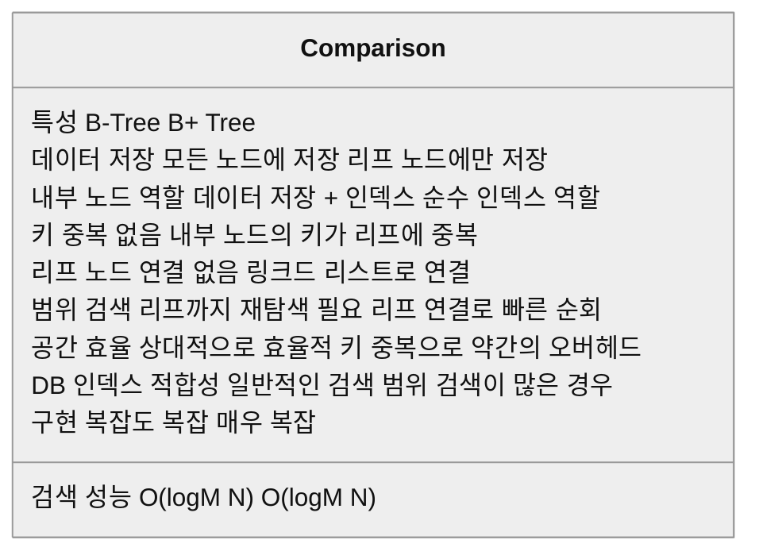
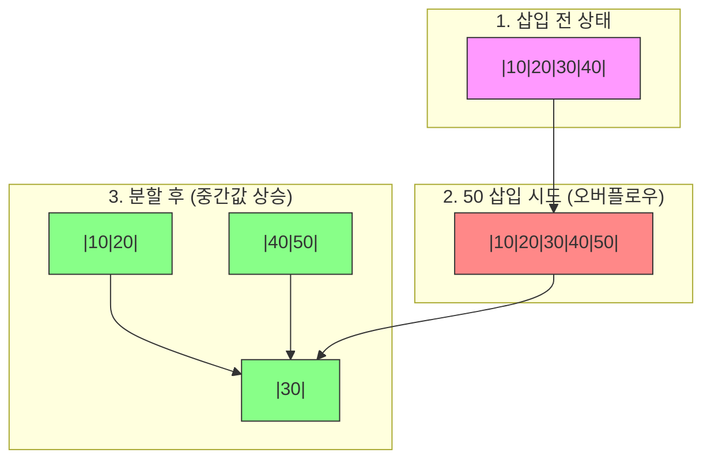
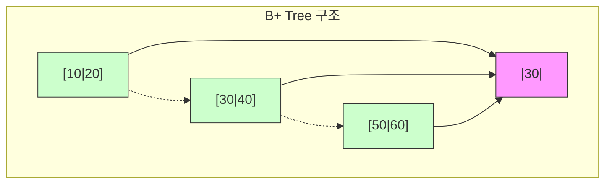

# B-Tree와 B+ Tree

## 1. B-Tree

* 개념
    * B-Tree는 이진 트리를 확장하여 **하나의 노드가 여러 개의 키와 자식**을 가질 수 있도록 일반화한 균형 트리입니다.
    * 주로 **디스크나 파일 시스템**에서 사용되며, 대용량 데이터를 처리하는데 효율적입니다.
    * 모든 리프 노드가 같은 레벨에 있는 **완전 균형 트리(Perfectly Balanced Tree)** 입니다.

* B-Tree의 특성 및 규칙
    1. 차수(Degree)와 키
        - 차수 M인 B-Tree에서:
            * 각 노드는 최대 M-1개의 키를 가질 수 있음
            * 각 노드는 최대 M개의 자식을 가질 수 있음
            * 루트를 제외한 각 노드는 최소 ⌈M/2⌉-1개의 키를 가져야 함
            * 리프 노드를 제외한 노드의 자식 수는 키의 수보다 1개 많아야 함

    2. 정렬 및 구조
        - 노드 내의 키들은 오름차순으로 정렬되어 있음
        - K[i]를 키값이라 할 때:
            * 왼쪽 서브트리의 모든 키 < K[i]
            * 오른쪽 서브트리의 모든 키 > K[i]

    3. 균형 특성
        - 모든 리프 노드는 같은 레벨에 존재
        - 트리의 높이는 O(logM N)으로 유지됨

* B-Tree 주요 연산
    1. 검색(Search)
        ```python
        def search(node, key):
            i = 0
            # 현재 노드에서 key보다 큰 첫 위치를 찾음
            while i < len(node.keys) and key > node.keys[i]:
                i += 1
            
            # key를 찾은 경우
            if i < len(node.keys) and key == node.keys[i]:
                return (node, i)
            
            # 리프노드인데 못찾은 경우
            if node.is_leaf:
                return None
            
            # 내부노드면 적절한 자식으로 내려감
            return search(node.children[i], key)
        ```

    2. 삽입(Insertion)
        1. 리프 노드까지 검색
        2. 키 삽입
        3. 필요시 노드 분할(Split)
            * 노드가 가득 차면(M-1개 키) 중간 키를 부모로 올리고 둘로 분할

    3. 삭제(Deletion)
        1. 키 찾기
        2. 케이스별 처리:
            * 리프 노드: 직접 삭제
            * 내부 노드: 선행자/후행자로 대체 후 삭제
        3. 필요시 노드 병합 또는 재분배

* 예시 구현
    ```python
    class BTreeNode:
        def __init__(self, leaf=True):
            self.keys = []        # 키 저장 리스트
            self.children = []    # 자식 노드 리스트
            self.leaf = leaf      # 리프 노드 여부
        
        def split_child(self, i, child):
            """i번째 자식 노드를 분할"""
            new_node = BTreeNode(child.leaf)
            t = len(self.keys) // 2  # 최소 차수
            
            # 새 노드로 키 이동
            new_node.keys = child.keys[t+1:]
            child.keys = child.keys[:t]
            
            # 리프가 아니면 자식도 이동
            if not child.leaf:
                new_node.children = child.children[t+1:]
                child.children = child.children[:t+1]
            
            # 부모 노드에 중간 키 삽입
            self.keys.insert(i, child.keys[t])
            self.children.insert(i+1, new_node)

    class BTree:
        def __init__(self, t):
            self.root = BTreeNode()
            self.t = t  # 최소 차수
        
        def insert(self, key):
            root = self.root
            if len(root.keys) == (2 * self.t) - 1:
                # 루트가 가득 찼으면 새 루트 생성
                new_root = BTreeNode(False)
                new_root.children.append(self.root)
                new_root.split_child(0, self.root)
                self.root = new_root
            self._insert_non_full(self.root, key)

        def _insert_non_full(self, node, key):
            i = len(node.keys) - 1
            if node.leaf:
                # 리프 노드면 적절한 위치에 삽입
                while i >= 0 and key < node.keys[i]:
                    i -= 1
                node.keys.insert(i+1, key)
            else:
                # 내부 노드면 적절한 자식으로 내려감
                while i >= 0 and key < node.keys[i]:
                    i -= 1
                i += 1
                if len(node.children[i].keys) == (2 * self.t) - 1:
                    node.split_child(i, node.children[i])
                    if key > node.keys[i]:
                        i += 1
                self._insert_non_full(node.children[i], key)
    ```

* 시간 복잡도
    * 검색: O(logM N)
    * 삽입: O(logM N)
    * 삭제: O(logM N)
    * M: B-Tree의 차수, N: 전체 키의 개수

* 장단점
    1. 장점
        - 디스크 접근 횟수를 최소화 (높이가 낮고 노드당 많은 키 저장)
        - 항상 균형을 유지
        - 범위 검색에 효율적

    2. 단점
        - 구현이 복잡
        - 메모리 오버헤드 (노드당 여유 공간 필요)
        - 삭제 연산이 특히 복잡

## 2. B+ Tree

* 개념
    * B+ Tree는 B-Tree의 변형으로, **모든 키를 리프 노드에 저장**하는 것이 특징입니다.
    * 내부 노드는 인덱스 역할만 하며, 실제 데이터는 리프 노드에만 존재합니다.
    * 리프 노드들은 연결 리스트로 연결되어 있어 **순차 접근이 매우 효율적**입니다.

* B+ Tree의 특성
    1. 구조적 특징
        - 내부 노드: 인덱스 역할 (키와 포인터만 저장)
        - 리프 노드: 모든 실제 데이터 저장
        - 리프 노드들은 링크드 리스트로 연결

    2. 규칙
        - 내부 노드의 키는 리프 노드의 키를 복사한 것
        - 리프 노드는 모든 키를 정렬된 순서로 저장
        - 각 내부 노드는 M/2에서 M개의 자식을 가짐

* B+ Tree vs B-Tree 주요 차이점
    1. 데이터 저장
        - B-Tree: 모든 노드가 키와 데이터 저장
        - B+ Tree: 리프 노드만 데이터 저장

    2. 키 중복
        - B-Tree: 각 키는 한 번만 나타남
        - B+ Tree: 내부 노드의 키가 리프에도 중복됨

    3. 리프 노드 연결
        - B-Tree: 리프 노드 간 연결 없음
        - B+ Tree: 리프 노드가 연결 리스트로 연결됨

* 예시 구현
    ```python
    class BPlusNode:
        def __init__(self, leaf=True):
            self.keys = []
            self.children = []
            self.leaf = leaf
            self.next = None  # 리프 노드 연결용
        
        def insert_non_full(self, key, value=None):
            idx = len(self.keys) - 1
            if self.leaf:
                # 리프 노드에 데이터 삽입
                while idx >= 0 and self.keys[idx] > key:
                    idx -= 1
                self.keys.insert(idx + 1, key)
                if value:
                    self.children.insert(idx + 1, value)
            else:
                # 내부 노드는 적절한 자식으로 이동
                while idx >= 0 and self.keys[idx] > key:
                    idx -= 1
                idx += 1
                if len(self.children[idx].keys) == self.max_keys:
                    self.split_child(idx)
                    if key > self.keys[idx]:
                        idx += 1
                self.children[idx].insert_non_full(key, value)

    class BPlusTree:
        def __init__(self, order):
            self.root = BPlusNode()
            self.order = order
            
        def insert(self, key, value):
            root = self.root
            if len(root.keys) == self.order - 1:
                # 루트가 가득 차면 새로운 루트 생성
                new_root = BPlusNode(leaf=False)
                new_root.children.append(self.root)
                self.split_child(new_root, 0)
                self.root = new_root
            self.root.insert_non_full(key, value)
    ```

* 활용 사례
    1. 데이터베이스 인덱스
        - MySQL의 InnoDB 스토리지 엔진
        - PostgreSQL의 B-tree 인덱스

    2. 파일 시스템
        - NTFS, ext4 등에서 활용

* 장단점
    1. 장점
        - 순차 접근이 매우 빠름 (리프 노드 연결)
        - 범위 검색에 최적화
        - 리프 노드에서 모든 데이터를 찾을 수 있음

    2. 단점
        - B-Tree보다 구현이 더 복잡
        - 내부 노드의 키 중복으로 약간의 공간 낭비
        - 키 삭제가 더 복잡할 수 있음

## 3. 실무 활용 팁

1. 데이터베이스 인덱스 설계
    ```sql
    -- MySQL에서 B-Tree 인덱스 생성
    CREATE INDEX idx_name ON table_name (column_name);
    
    -- 복합 인덱스 생성
    CREATE INDEX idx_composite ON table_name (col1, col2, col3);
    ```

2. 성능 최적화
    - 인덱스 키 선택 시 고려사항:
        * 카디널리티(Cardinality)
        * 선택도(Selectivity)
        * 업데이트 빈도

3. 모니터링
    ```sql
    -- MySQL에서 인덱스 사용 현황 확인
    SHOW INDEX FROM table_name;
    
    -- 실행 계획 확인
    EXPLAIN SELECT * FROM table_name WHERE indexed_column = value;
    ```

## 4. 참고사항

* B-Tree/B+ Tree 선택 기준
    1. B-Tree 선택 상황
        - 개별 검색이 주된 작업
        - 데이터가 자주 변경되지 않음
        - 메모리 제약이 있는 환경

    2. B+ Tree 선택 상황
        - 범위 검색이 빈번
        - 순차 접근이 많음
        - 데이터베이스 인덱스 구현





