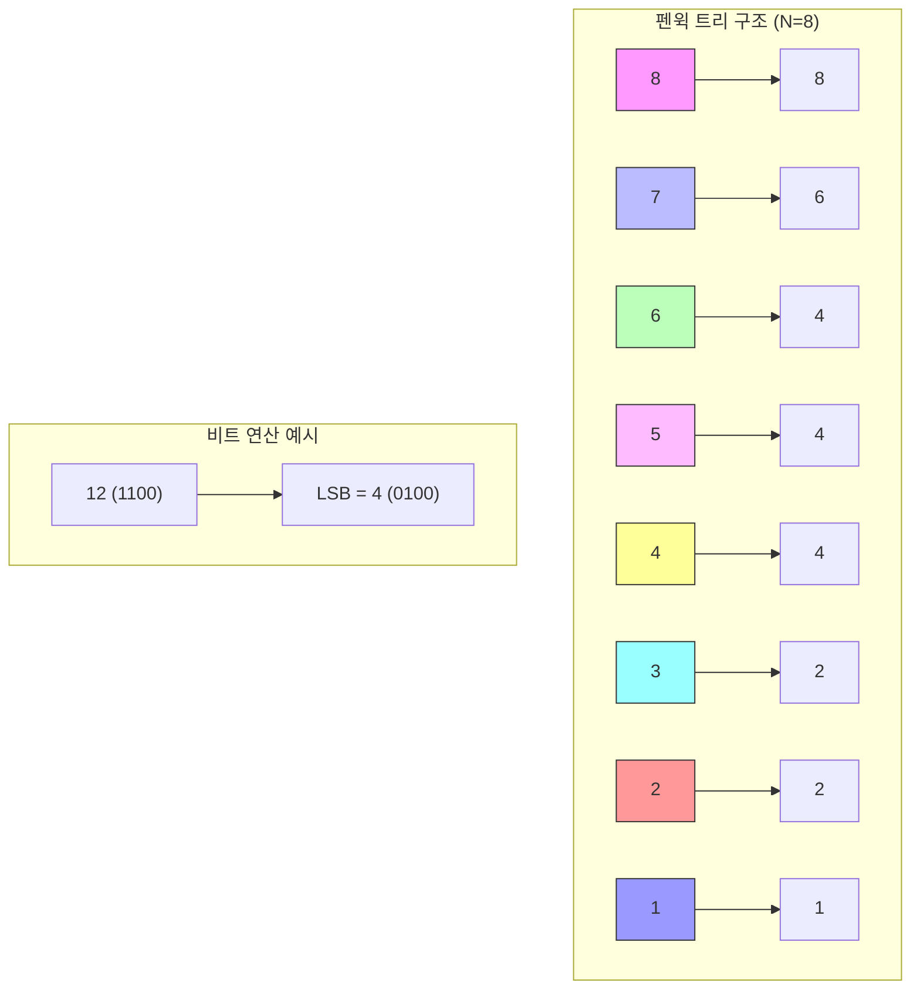

# 펜윅 트리 (Fenwick Tree / Binary Indexed Tree)

* 개념
    * **펜윅 트리**는 구간 합을 효율적으로 계산하고 값의 업데이트를 처리하기 위한 자료구조입니다.
    * **바이너리 인덱스 트리(Binary Indexed Tree, BIT)**라고도 불립니다.
    * 특징:
        - 세그먼트 트리보다 메모리 효율적 (N + 1 크기의 배열만 사용)
        - 구현이 매우 간단 (비트 연산 활용)
        - 구간 합에 특화됨
        - 1-based indexing 사용 (0이 아닌 1부터 시작)

* 주요 연산
    1. 업데이트(Update)
        - 특정 인덱스의 값을 변경
        - 시간 복잡도: O(log N)
    
    2. 구간 합 쿼리(Query)
        - prefix sum 계산: [1, x] 구간의 합
        - 구간 [l, r] 합: sum(r) - sum(l-1)
        - 시간 복잡도: O(log N)

* 시간 복잡도
    |연산|복잡도|설명|
    |---|------|-----|
    |Update|O(log N)|단일 값 업데이트|
    |Query|O(log N)|구간 합 계산|
    |Build|O(N log N) 또는 O(N)|초기 트리 구축|

* 기본 구현
    ```python
    class FenwickTree:
        def __init__(self, n):
            self.n = n
            self.tree = [0] * (n + 1)  # 1-based indexing
        
        def update(self, idx, delta):
            """인덱스 idx의 값을 delta만큼 증가"""
            while idx <= self.n:
                self.tree[idx] += delta
                idx += (idx & -idx)  # 최하위 비트만큼 더함
        
        def sum(self, idx):
            """1부터 idx까지의 구간 합 계산"""
            result = 0
            while idx > 0:
                result += self.tree[idx]
                idx -= (idx & -idx)  # 최하위 비트만큼 뺌
            return result
        
        def range_sum(self, left, right):
            """left부터 right까지의 구간 합 계산"""
            return self.sum(right) - self.sum(left - 1)

        @classmethod
        def build(cls, arr):
            """배열로부터 펜윅 트리 생성"""
            n = len(arr)
            fenwick = cls(n)
            for i in range(n):
                fenwick.update(i + 1, arr[i])
            return fenwick
```

* 최적화된 구현 (Point Query 지원)
    ```python
    class FenwickTreeOptimized:
        def __init__(self, n):
            self.n = n
            self.tree = [0] * (n + 1)
            self.original = [0] * (n + 1)  # 원본 값 저장
        
        def update(self, idx, val):
            """인덱스 idx의 값을 val로 변경"""
            delta = val - self.original[idx]
            self.original[idx] = val
            while idx <= self.n:
                self.tree[idx] += delta
                idx += (idx & -idx)
        
        def get(self, idx):
            """인덱스 idx의 원본 값 조회"""
            return self.original[idx]
        
        def sum(self, idx):
            result = 0
            while idx > 0:
                result += self.tree[idx]
                idx -= (idx & -idx)
            return result
```

* 2차원 펜윅 트리
    ```python
    class FenwickTree2D:
        def __init__(self, n, m):
            self.n = n
            self.m = m
            self.tree = [[0] * (m + 1) for _ in range(n + 1)]
        
        def update(self, x, y, delta):
            i = x
            while i <= self.n:
                j = y
                while j <= self.m:
                    self.tree[i][j] += delta
                    j += (j & -j)
                i += (i & -i)
        
        def sum(self, x, y):
            result = 0
            i = x
            while i > 0:
                j = y
                while j > 0:
                    result += self.tree[i][j]
                    j -= (j & -j)
                i -= (i & -i)
            return result
        
        def range_sum(self, x1, y1, x2, y2):
            """(x1,y1)부터 (x2,y2)까지의 직사각형 영역 합"""
            return (self.sum(x2, y2) - self.sum(x2, y1-1) - 
                   self.sum(x1-1, y2) + self.sum(x1-1, y1-1))
    ```

* 비트 연산 이해하기
    ```python
    def LSB(x):
        """x의 최하위 비트(Least Significant Bit) 반환"""
        return x & -x

    # 예시:
    # 6(110) & -6(010) = 2(010)
    # 12(1100) & -12(0100) = 4(0100)
    ```

* 활용 사례
    1. 누적 합 관리
        - 동적 배열의 구간 합 계산
        - 업데이트가 빈번한 상황에서 효율적

    2. 좌표 압축
        - 값의 상대적 순위나 등수 계산
        - 2D 공간에서의 점 개수 쿼리

    3. 데이터 분석
        - 구간 통계 계산
        - 시계열 데이터의 구간 집계

    4. 인버전 카운팅
        - 배열에서 역전된 쌍의 개수 계산
        ```python
        def count_inversions(arr):
            n = len(arr)
            fenwick = FenwickTree(n)
            result = 0
            
            # 좌표 압축
            sorted_arr = sorted(enumerate(arr), key=lambda x: x[1])
            rank = [0] * n
            for i, (orig_idx, _) in enumerate(sorted_arr):
                rank[orig_idx] = i + 1
            
            # 인버전 카운팅
            for i in range(n-1, -1, -1):
                result += fenwick.sum(rank[i] - 1)
                fenwick.update(rank[i], 1)
            
            return result
        ```

* 장단점
    1. 장점
        - 구현이 매우 간단
        - 메모리 효율적 (세그먼트 트리의 절반)
        - 비트 연산으로 인한 빠른 수행 속도
        - 캐시 효율성이 좋음

    2. 단점
        - 구간 최댓값/최솟값 등 다른 연산은 직접 지원하지 않음
        - 구간 업데이트 미지원 (별도 구현 필요)
        - 1-based indexing으로 인한 실수 가능성

* 실전 팁
    1. 인덱스 관리
        - 1-based indexing 주의
        - 업데이트/쿼리 시 인덱스 범위 체크

    2. 메모리 최적화
        - 필요한 경우 압축된 좌표 사용
        - 2D의 경우 희소 행렬 고려

    3. 응용 패턴
        - 구간 업데이트가 필요하면 차분 배열 기법 활용
        - 좌표 압축으로 큰 값 처리

* 마무리
    - 펜윅 트리는 구간 합에 특화된 효율적인 자료구조
    - 세그먼트 트리보다 간단하고 메모리 효율적
    - 비트 연산의 이해가 중요
    - 실전에서 자주 사용되는 필수 자료구조

