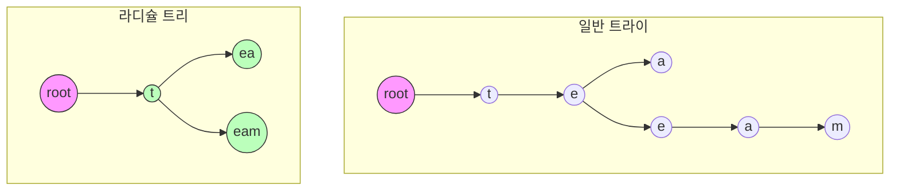

# 라디슐 트리 (Radix Tree)

* 개념
    * **라디슐 트리**는 기존 트라이(Trie)를 압축한 형태의 자료구조입니다.
    * **Patricia Tree** 또는 **Compressed Trie**라고도 불립니다.
    * 특징:
        - 공통 접두사를 가진 노드들을 병합
        - 한 노드가 여러 문자를 저장 가능
        - 분기가 없는 경로는 하나의 노드로 압축
        - 메모리 효율적인 문자열 저장/검색

* 트라이와의 차이점
    1. 노드 구조
        - 트라이: 한 노드가 한 문자만 저장
        - 라디슐 트리: 한 노드가 문자열을 저장 가능

    2. 공간 효율성
        - 트라이: 많은 단일 분기 노드
        - 라디슐 트리: 압축으로 공간 절약

    3. 검색 성능
        - 트라이: 문자 단위 비교
        - 라디슐 트리: 문자열 단위 비교로 더 빠를 수 있음

* 주요 연산
    1. 삽입(Insert)
        - 공통 접두사 찾기
        - 필요시 노드 분할
        - 시간 복잡도: O(k), k는 문자열 길이

    2. 검색(Search)
        - 경로를 따라가며 문자열 비교
        - 시간 복잡도: O(k)

    3. 삭제(Delete)
        - 노드 제거 후 필요시 병합
        - 시간 복잡도: O(k)

* 기본 구현
    ```python
    class RadixNode:
        def __init__(self):
            self.children = {}  # {문자열: 자식노드}
            self.is_end = False  # 문자열의 끝 표시
            self.value = None  # 저장된 값 (필요시)

    class RadixTree:
        def __init__(self):
            self.root = RadixNode()

        def insert(self, key: str, value=None):
            """키 삽입"""
            node = self.root

            while key:
                # 가장 긴 공통 접두사 찾기
                matched_prefix = ""
                matched_child = None

                for prefix in node.children:
                    common = self._get_common_prefix(prefix, key)
                    if len(common) > len(matched_prefix):
                        matched_prefix = common
                        matched_child = prefix

                if matched_prefix:
                    # 공통 접두사가 있는 경우
                    if matched_prefix == matched_child:
                        # 완전 일치하는 경우
                        node = node.children[matched_child]
                        key = key[len(matched_prefix):]
                    else:
                        # 부분 일치하는 경우 -> 노드 분할
                        new_node = RadixNode()
                        child_node = node.children[matched_child]
                        new_node.children[matched_child[len(matched_prefix):]] = child_node
                        node.children[matched_prefix] = new_node
                        del node.children[matched_child]
                        node = new_node
                        key = key[len(matched_prefix):]
                else:
                    # 일치하는 접두사가 없는 경우
                    new_node = RadixNode()
                    node.children[key] = new_node
                    new_node.is_end = True
                    new_node.value = value
                    break

        def search(self, key: str) -> bool:
            """키 검색"""
            node = self.root
            while key:
                found = False
                for prefix in node.children:
                    if key.startswith(prefix):
                        node = node.children[prefix]
                        key = key[len(prefix):]
                        found = True
                        break
                if not found:
                    return False
            return node.is_end

        def _get_common_prefix(self, str1: str, str2: str) -> str:
            """두 문자열의 공통 접두사 찾기"""
            i = 0
            while i < len(str1) and i < len(str2) and str1[i] == str2[i]:
                i += 1
            return str1[:i]
```

* 최적화된 구현 (바이트 문자열 사용)
    ```python
    class OptimizedRadixTree:
        def __init__(self):
            self.root = RadixNode()

        def insert(self, key: bytes):
            """바이트 문자열을 사용한 최적화된 삽입"""
            node = self.root
            key_view = memoryview(key)  # 메모리 효율적인 뷰 사용

            while key_view:
                # 구현은 기본적으로 동일하나 바이트 단위 처리
                pass
```

* 활용 사례
    1. 파일 시스템 경로
        ```python
        class FileSystem:
            def __init__(self):
                self.path_tree = RadixTree()
            
            def add_path(self, path: str, metadata=None):
                self.path_tree.insert(path, metadata)
            
            def find_path(self, path: str):
                return self.path_tree.search(path)
        ```

    2. IP 라우팅 테이블
        ```python
        class IPRouter:
            def __init__(self):
                self.route_table = RadixTree()
            
            def add_route(self, prefix: str, next_hop: str):
                self.route_table.insert(prefix, next_hop)
            
            def find_route(self, ip: str):
                # 가장 긴 접두사 매칭 구현
                return self.route_table.longest_prefix_match(ip)
        ```

    3. 문자열 압축
        ```python
        class CompressedDictionary:
            def __init__(self):
                self.trie = RadixTree()
            
            def add_word(self, word: str):
                self.trie.insert(word)
            
            def contains(self, word: str):
                return self.trie.search(word)
        ```

* 장단점
    1. 장점
        - 메모리 효율적
        - 접두사 검색이 빠름
        - 문자열 압축 효과
        - 가장 긴 접두사 매칭에 적합

    2. 단점
        - 구현이 복잡
        - 동적 삽입/삭제 시 노드 재구성 필요
        - 최악의 경우 성능 저하 가능

* 실전 팁
    1. 성능 최적화
        - 바이트 문자열 사용
        - 메모리 뷰 활용
        - 캐시 지역성 고려

    2. 구현 선택
        - 정적 데이터: 더 많은 압축
        - 동적 데이터: 유연한 구조

    3. 응용 패턴
        - URL 라우팅
        - DNS 조회
        - 자동 완성

* 마무리
    - 라디슐 트리는 트라이의 공간 효율적 버전
    - 실제 시스템에서 경로 처리, 라우팅에 많이 사용
    - 구현 복잡도를 감수할 만한 이점이 있는 경우 선택

