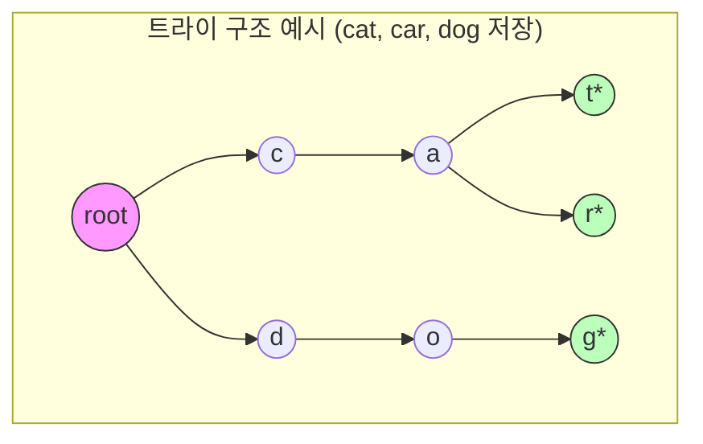

# 트라이 (Trie)

* 개념
    * **트라이**는 문자열 집합을 저장하고 효율적으로 검색하기 위한 트리 자료구조입니다.
    * **접두사 트리(Prefix Tree)**라고도 불립니다.
    * 특징:
        - 루트에서 특정 노드까지의 경로가 하나의 문자열을 표현
        - 자식 노드들은 문자별로 분기
        - 공통 접두사를 가진 문자열들은 경로를 공유
        - 문자열 검색이 문자열 길이에 비례(O(L))

* 주요 연산
    1. 삽입(Insert)
        - 문자열을 트라이에 추가
        - 시간 복잡도: O(L), L은 문자열 길이

    2. 검색(Search)
        - 문자열이 트라이에 존재하는지 확인
        - 시간 복잡도: O(L)

    3. 접두사 검색(Prefix Search)
        - 특정 접두사로 시작하는 모든 문자열 찾기
        - 시간 복잡도: O(P + M), P는 접두사 길이, M은 결과 문자열 수

* 기본 구현
    ```python
    class TrieNode:
        def __init__(self):
            self.children = {}  # 자식 노드 맵
            self.is_end = False  # 문자열의 끝인지 표시
            self.count = 0  # 현재 노드를 지나는 문자열 수

    class Trie:
        def __init__(self):
            self.root = TrieNode()
        
        def insert(self, word: str) -> None:
            """문자열 삽입"""
            node = self.root
            for char in word:
                if char not in node.children:
                    node.children[char] = TrieNode()
                node = node.children[char]
                node.count += 1
            node.is_end = True
        
        def search(self, word: str) -> bool:
            """정확한 문자열 검색"""
            node = self.root
            for char in word:
                if char not in node.children:
                    return False
                node = node.children[char]
            return node.is_end
        
        def starts_with(self, prefix: str) -> bool:
            """접두사로 시작하는 문자열 존재 여부"""
            node = self.root
            for char in prefix:
                if char not in node.children:
                    return False
                node = node.children[char]
            return True
        
        def find_words_with_prefix(self, prefix: str) -> list:
            """접두사로 시작하는 모든 문자열 찾기"""
            words = []
            node = self.root
            
            # 접두사까지 이동
            for char in prefix:
                if char not in node.children:
                    return words
                node = node.children[char]
            
            # DFS로 모든 문자열 수집
            def dfs(node, curr_word):
                if node.is_end:
                    words.append(curr_word)
                for char, child in node.children.items():
                    dfs(child, curr_word + char)
            
            dfs(node, prefix)
            return words
    ```

* 메모리 최적화 버전 (배열 사용)
    ```python
    class TrieNodeOptimized:
        def __init__(self):
            self.children = [None] * 26  # 알파벳 소문자만 가정
            self.is_end = False
        
        def get_index(self, char):
            return ord(char) - ord('a')

    class OptimizedTrie:
        def __init__(self):
            self.root = TrieNodeOptimized()
        
        def insert(self, word: str) -> None:
            node = self.root
            for char in word:
                idx = node.get_index(char)
                if not node.children[idx]:
                    node.children[idx] = TrieNodeOptimized()
                node = node.children[idx]
            node.is_end = True
    ```

* 응용 구현 (자동 완성)
    ```python
    class AutocompleteTrie:
        def __init__(self):
            self.root = TrieNode()
        
        def insert_with_weight(self, word: str, weight: int) -> None:
            """가중치와 함께 단어 삽입"""
            node = self.root
            for char in word:
                if char not in node.children:
                    node.children[char] = TrieNode()
                node = node.children[char]
                node.count += 1
            node.is_end = True
            node.weight = weight  # 검색 우선순위
        
        def get_suggestions(self, prefix: str, limit: int = 5) -> list:
            """접두사에 대한 상위 N개 추천 단어"""
            node = self.root
            for char in prefix:
                if char not in node.children:
                    return []
                node = node.children[char]
            
            suggestions = []
            def dfs(node, word):
                if len(suggestions) >= limit:
                    return
                if node.is_end:
                    suggestions.append((word, node.weight))
                for char in sorted(node.children.keys()):
                    dfs(node.children[char], word + char)
            
            dfs(node, prefix)
            return [word for word, _ in sorted(suggestions, 
                                             key=lambda x: (-x[1], x[0]))]
    ```

* 활용 사례
    1. 자동 완성 시스템
        - 검색어 추천
        - IDE의 코드 자동 완성

    2. 사전 구현
        - 영어 사전
        - 맞춤법 검사기

    3. IP 라우팅 테이블
        - IP 주소 검색 최적화
        - 네트워크 패킷 라우팅

    4. 문자열 검색 엔진
        - 텍스트 검색
        - 패턴 매칭

* 시간 복잡도
    |연산|복잡도|설명|
    |---|------|-----|
    |삽입|O(L)|L: 문자열 길이|
    |검색|O(L)|정확한 문자열 검색|
    |접두사 검색|O(P)|P: 접두사 길이|
    |자동 완성|O(P + K)|K: 결과 문자열 수|

* 장단점
    1. 장점
        - 빠른 문자열 검색
        - 효율적인 접두사 기반 검색
        - 공통 접두사 공유로 공간 절약
        - 정렬된 결과 얻기 용이

    2. 단점
        - 메모리 사용량이 큼
        - 단순 문자열 하나의 검색은 해시맵보다 느릴 수 있음
        - 구현이 상대적으로 복잡

* 실전 팁
    1. 구현 선택
        - 문자 종류가 적으면 배열 기반
        - 문자 종류가 많으면 해시맵 기반

    2. 메모리 최적화
        - 필요한 경우 압축 트라이 사용
        - 터미널 노드만 표시

    3. 성능 고려사항
        - 삽입이 많은 경우 동적 할당 주의
        - 검색이 많은 경우 캐시 활용

* 마무리
    - 트라이는 문자열 검색에 특화된 효율적인 자료구조
    - 특히 자동 완성, 사전 검색 등에 매우 유용
    - 메모리와 성능의 트레이드오프를 고려해 적절한 구현 선택 필요

