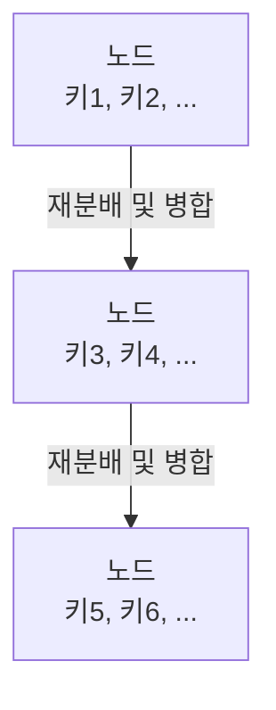

# B* Tree 자료구조 📚🌳

B* Tree는 B-Tree의 한 변형으로, 노드의 최소 채움률을 일반 B-Tree보다 높게 유지하여 디스크 공간 활용도를 극대화하고 검색, 삽입, 삭제의 성능을 향상시키기 위해 설계된 자료구조입니다.  
노드 분할 시 인접한 형제 노드와 키를 재분배하여, 불필요한 분할을 줄이고 트리의 균형과 깊이를 효율적으로 관리합니다.

---

## 목차 📝
1. [개요](#개요-🧐)
2. [B* Tree의 정의와 특징](#b-tree의-정의와-특징)
3. [메모리 구조 및 다이어그램](#메모리-구조-및-다이어그램-🖼️)
4. [주요 연산](#주요-연산-🛠️)
5. [장단점](#장단점-⚖️)
6. [실무 활용 예시](#실무-활용-예시-💼)
7. [참고 자료](#참고-자료-🔗)

---

## 개요 🧐
B* Tree는 기존 B-Tree보다 높은 최소 채움률(일반적으로 2/3 이상)을 유지하도록 설계되어,  
디스크 상의 공간 낭비를 줄이고, 전체 트리의 깊이를 낮추어 빠른 검색 및 업데이트 성능을 제공합니다.  
형제 노드 간의 키 재분배 및 병합 기법을 통해 노드 분할을 지연시켜, 안정적인 트리 구조를 유지합니다.

---

## B* Tree의 정의와 특징
- **정의**:  
  B* Tree는 B-Tree의 변형으로, 노드가 가득 차면 인접한 형제 노드와 키를 재분배한 후에도 공간이 부족할 경우에만 분할을 수행하는 균형 다진 트리입니다.
  
- **특징**:
  - **높은 노드 채움률**:  
    일반 B-Tree보다 최소 채움률을 높게 설정(보통 2/3 이상)하여 디스크 공간 활용이 효율적입니다.
  - **키 재분배**:  
    노드가 가득 찼을 때 인접 형제 노드와 키를 공유, 재분배하여 불필요한 노드 분할을 최소화합니다.
  - **낮은 트리 깊이**:  
    효과적인 재분배와 병합 기법으로 전체 트리의 높이가 낮아, 검색 및 업데이트 속도가 향상됩니다.
  - **균형 유지**:  
    모든 리프 노드가 동일한 깊이에 위치하여, 안정적인 성능을 보장합니다.

---

## 메모리 구조 및 다이어그램 🖼️
B* Tree의 각 노드는 다수의 키와 자식 포인터를 포함하며,  
노드 분할 시 인접 노드와의 재분배를 통해 키들이 보다 균등하게 분포됩니다.

---

## 주요 연산 🛠️
- **검색 (Search)**:  
  균형 잡힌 노드 구조로 인해 로그 시간 복잡도로 빠른 검색이 가능합니다.
  
- **삽입 (Insertion)**:  
  노드에 빈 공간이 있을 경우 바로 삽입하며, 가득 찬 경우에는 인접 노드와 키를 재분배한 후에도 공간이 부족하면 노드를 분할합니다.
  
- **삭제 (Deletion)**:  
  삭제 후에도 최소 채움률을 유지하기 위해 형제 노드와의 병합 또는 재분배를 수행합니다.

---

## 장단점 ⚖️

### 장점 👍
- **높은 공간 활용률**:  
  최소 채움률이 2/3 이상으로, 디스크 공간을 보다 효율적으로 사용합니다.
- **낮은 트리 깊이**:  
  키 재분배 및 병합 기법 덕분에 트리의 높이가 낮아, 검색 및 업데이트 속도가 빠릅니다.
- **효율적인 노드 분할**:  
  불필요한 분할을 지연시켜 전체 구조의 안정성을 향상시킵니다.

### 단점 👎
- **구현 복잡성**:  
  키 재분배 및 형제 노드와의 협력적 분할 알고리즘이 복잡하여 구현 난이도가 높습니다.
- **업데이트 오버헤드**:  
  삽입 및 삭제 시 추가적인 재분배 작업으로 인한 오버헤드가 발생할 수 있습니다.

---

## 실무 활용 예시 💼
- **데이터베이스 인덱스**:  
  높은 공간 활용률과 낮은 트리 깊이로 인해, 데이터베이스 인덱스 구조로 효과적으로 사용됩니다.
- **파일 시스템**:  
  파일 메타데이터 관리에 적합하며, 효율적인 키 관리로 성능을 유지합니다.
- **고성능 검색 시스템**:  
  대용량 데이터를 다루는 시스템에서 안정적인 검색 및 업데이트 성능을 제공합니다.

---

## 참고 자료 🔗
- [B* Tree - Wikipedia](https://en.wikipedia.org/wiki/B%2A_tree)
- [Introduction to B* Trees](https://www.geeksforgeeks.org/b-tree-set-2-insert/)
- [Data Structures: B* Tree](https://www.tutorialspoint.com/data_structures_algorithms/b_tree_algorithm.htm)

---

B* Tree의 설계와 알고리즘을 이해하면,  
높은 디스크 공간 활용과 빠른 데이터 검색이 요구되는 시스템에서 효율적이고 안정적인 성능을 구현할 수 있습니다.