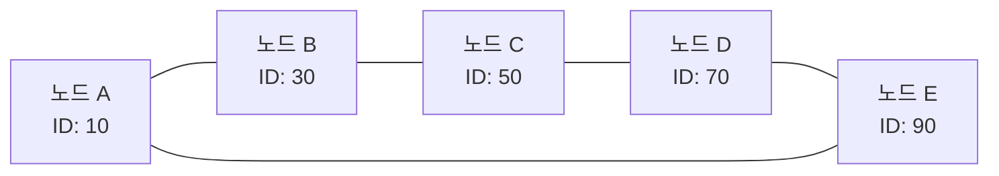

# Chord DHT (Distributed Hash Table) 자료구조 📚🌐

Chord DHT는 분산 피어 투 피어 환경에서 노드 간 효율적인 데이터 위치 검색을 위해 설계된 분산 해시 테이블 알고리즘입니다.  
Chord는 원형 링 구조를 사용하여 각 노드에 고유한 식별자를 부여하고, "Finger Table"을 통해 로그 시간 복잡도의 키 조회를 가능하게 합니다.  
이 자료구조는 분산 파일 시스템, P2P 네트워크, 분산 캐시 등 다양한 응용 분야에서 확장성과 내결함성을 제공합니다.

---

## 목차 📝
1. [개요](#개요-🧐)
2. [Chord DHT의 정의와 특징](#chord-dht의-정의와-특징)
3. [아키텍처 및 다이어그램](#아키텍처-및-다이어그램-🖼️)
4. [주요 연산 및 프로토콜](#주요-연산-및-프로토콜-🛠️)
5. [장단점](#장단점-⚖️)
6. [실무 활용 예시](#실무-활용-예시-💼)
7. [참고 자료](#참고-자료-🔗)

---

## 개요 🧐
Chord DHT는 분산 네트워크 환경에서 데이터 객체의 위치를 빠르게 찾기 위해 고안된 프로토콜입니다.  
각 노드는 일정 범위의 키를 책임지고, 링 구조를 형성함으로써 새로운 노드의 추가나 기존 노드의 탈퇴와 같은 변화에도 안정적인 검색 기능을 제공합니다.

---

## Chord DHT의 정의와 특징
- **정의**:  
  Chord는 분산 해시 테이블(DHT)로, 각 노드에 고유한 식별자를 할당하고  
  키(데이터 객체의 해시값)를 해당 식별자와 비교하여 데이터 저장 위치를 결정합니다.
  
- **특징**:
  - **원형 링 구조**:  
    모든 노드는 0부터 2^m - 1 범위의 식별자를 가지며, 원형 링으로 연결되어 있습니다.
  - **Finger Table**:  
    각 노드는 자신의 고유 식별자와 관련된 몇 개의 "피너" 정보를 저장하여,  
    로그 시간(즉, O(log N)) 내에 키의 소유 노드를 찾을 수 있습니다.
  - **확장성**:  
    네트워크 규모가 커져도 검색 성능이 안정적으로 유지되며, 새로운 노드의 추가가 원활합니다.
  - **내결함성**:  
    노드의 추가/삭제 시 안정화(stabilization) 프로토콜을 통해 데이터 일관성을 유지합니다.

---

## 아키텍처 및 다이어그램 🖼️
Chord DHT는 원형 링과 Finger Table을 기반으로 구성됩니다.
- **원형 링**:  
  각 노드는 고유 식별자(예: 해시값)를 가지며, 식별자 순으로 링에 배치됩니다.
- **Finger Table**:  
  각 노드는 자신으로부터 2^i (i=0,1,...,m-1) 떨어진 위치의 노드를 가리키는 포인터 목록을 유지합니다.
  

이와 같이, 각 노드는 자신의 Finger Table을 통해 원형 링에서 더 멀리 떨어진 노드로 빠르게 점프할 수 있어, 검색 시 전체 노드를 순회하지 않아도 됩니다.

---

## 주요 연산 및 프로토콜 🛠️
- **Lookup (검색)**:  
  주어진 키의 해시값을 기반으로, Finger Table을 활용하여  
  해당 키를 소유한 노드를 로그 시간 내에 찾습니다.
  
- **Join (노드 추가)**:  
  새로운 노드가 네트워크에 참가할 때,  
  기존 노드의 Finger Table 및 원형 링 구조를 업데이트하고,  
  데이터의 일부를 이전 노드로부터 분산 받아 자신의 책임 범위를 형성합니다.
  
- **Leave/Failure (노드 탈퇴 및 실패 처리)**:  
  노드가 네트워크를 떠나거나 실패할 경우,  
  안정화 프로토콜(stabilization protocol)을 통해  
  인접 노드들이 자신의 Finger Table과 데이터 소유권을 재조정합니다.
  
- **Stabilization (안정화)**:  
  주기적으로 각 노드가 자신의 후속 노드(successor) 정보를 확인하고,  
  변화된 네트워크 상황에 맞게 Finger Table을 갱신합니다.

---

## 장단점 ⚖️

### 장점 👍
- **높은 확장성**:  
  네트워크 규모가 커져도 로그 시간 복잡도의 검색 성능을 유지합니다.
- **내결함성**:  
  안정화 프로토콜을 통해 노드 추가/삭제 및 실패에 유연하게 대응합니다.
- **분산 자원 활용**:  
  중앙 집중식 인덱스 없이 모든 노드가 동등하게 데이터 검색에 기여합니다.

### 단점 👎
- **안정화 오버헤드**:  
  노드의 빈번한 추가/탈퇴가 발생하면 안정화 과정에 따른 오버헤드가 발생할 수 있습니다.
- **네트워크 지연**:  
  분산 환경에서는 네트워크 지연이 검색 성능에 영향을 줄 수 있습니다.
- **구현 복잡성**:  
  동적 네트워크 변화와 데이터 일관성을 유지하기 위한 알고리즘이 복잡합니다.

---

## 실무 활용 예시 💼
- **P2P 파일 공유 시스템**:  
  분산 환경에서 파일 위치 검색 및 데이터 공유에 사용됩니다.
- **분산 데이터베이스**:  
  대규모 분산 데이터 저장소에서 키 기반의 효율적인 데이터 조회를 지원합니다.
- **분산 캐시 및 네임 서비스**:  
  높은 확장성과 내결함성이 요구되는 서비스에서 사용됩니다.

---

## 참고 자료 🔗
- [Chord: A Scalable Peer-to-Peer Lookup Protocol for Internet Applications](https://pdos.csail.mit.edu/papers/chord:sigcomm01/chord_sigcomm.pdf)
- [Distributed Hash Tables (DHTs) in Peer-to-Peer Systems](https://www.usenix.org/legacy/publications/library/proceedings/sruts98/full_papers/sruts98.pdf)
- [P2P Systems and Applications – Chord 관련 기술 자료](https://www.acm.org)

---

Chord DHT의 구조와 프로토콜을 이해하면,  
분산 시스템 환경에서 확장성, 내결함성, 빠른 데이터 검색을 모두 만족하는  
효율적인 분산 해시 테이블 솔루션을 구축할 수 있습니다.