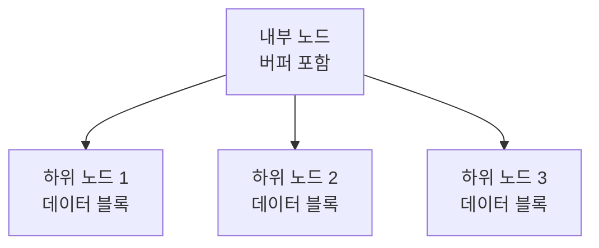

# Fractal Tree 자료구조 📚🌲

Fractal Tree는 높은 쓰기 성능과 효율적인 업데이트를 위해 설계된 자료구조입니다.  
내부 노드에 버퍼를 포함하여 다수의 업데이트를 배치로 처리함으로써, 디스크 I/O를 최소화하고 대용량 데이터 처리에 최적화된 구조를 제공합니다.  
이 구조는 데이터베이스 인덱스, 로그 시스템 등에서 빠른 삽입 및 일괄 업데이트를 위해 활용됩니다.

---

## 목차 📝
1. [개요](#개요-🧐)
2. [Fractal Tree의 정의와 특징](#fractal-tree의-정의와-특징)
3. [메모리 구조 및 다이어그램](#메모리-구조-및-다이어그램-🖼️)
4. [주요 연산](#주요-연산-🛠️)
5. [장단점](#장단점-⚖️)
6. [실무 활용 예시](#실무-활용-예시-💼)
7. [참고 자료](#참고-자료-🔗)

---

## 개요 🧐
Fractal Tree는 내부 노드에 버퍼를 두어 업데이트를 배치 처리하는 다진 트리 구조입니다.  
이 방식은 대규모 데이터 삽입 및 업데이트 시 발생하는 디스크 접근 비용을 크게 줄이며, 높은 쓰기 처리량과 낮은 지연 시간을 보장합니다.

---

## Fractal Tree의 정의와 특징
- **정의**:  
  Fractal Tree는 각 노드에 버퍼를 포함하여 여러 삽입, 업데이트, 삭제 연산을 일괄 처리하는 다진 트리입니다.
  
- **특징**:
  - **버퍼 기반 업데이트**:  
    각 내부 노드는 버퍼를 보유하여, 다수의 업데이트를 모아 하위 노드로 배분합니다.
  - **높은 쓰기 성능**:  
    배치 처리 방식을 통해 랜덤 I/O를 줄이고, 연속적인 쓰기 작업을 최적화합니다.
  - **대용량 데이터 처리 최적화**:  
    대규모 삽입 및 업데이트가 빈번한 환경에서 우수한 성능을 발휘합니다.
  - **자기 유사 구조**:  
    트리 전체가 반복적인 패턴으로 구성되어 확장이 용이합니다.

---

## 메모리 구조 및 다이어그램 🖼️
Fractal Tree는 각 노드가 버퍼를 포함하여, 여러 업데이트를 임시 저장한 후 일정 시점에 하위 노드로 플러시하는 구조입니다.

---

## 주요 연산 🛠️
- **삽입 (Insertion)**:  
  데이터는 먼저 해당 노드의 버퍼에 기록되고, 버퍼가 가득 차면 배치 플러시를 통해 하위 노드로 전달됩니다.
  
- **업데이트 (Update)**:  
  여러 업데이트 연산을 버퍼에 모아 일괄 처리함으로써, 개별 디스크 접근을 줄입니다.
  
- **삭제 (Deletion)**:  
  삭제 연산 역시 버퍼에 기록되어, 일정 주기마다 일괄 삭제 처리됩니다.
  
- **검색 (Search)**:  
  일반적인 다진 트리와 유사하게, 각 노드를 탐색하며 최종 데이터를 반환합니다.

---

## 장단점 ⚖️

### 장점 👍
- **높은 쓰기 효율**:  
  버퍼를 통한 배치 처리로 디스크 I/O 횟수를 크게 줄여 빠른 삽입 및 업데이트가 가능합니다.
- **대용량 데이터 처리**:  
  대규모 삽입 및 업데이트 작업에 적합하며, 높은 처리량을 유지합니다.
- **낮은 I/O 비용**:  
  랜덤 I/O를 최소화하여 디스크 성능을 극대화합니다.

### 단점 👎
- **복잡한 구현**:  
  버퍼 관리 및 배치 처리 로직 등으로 인해 구현 난이도가 높습니다.
- **읽기 성능의 잠재적 저하**:  
  버퍼에 대기 중인 업데이트가 많을 경우 최신 데이터 검색에 추가 처리가 필요할 수 있습니다.
- **메모리 사용 증가**:  
  각 노드의 버퍼로 인해 메모리 사용량이 상대적으로 증가할 수 있습니다.

---

## 실무 활용 예시 💼
- **데이터베이스 인덱스**:  
  Fractal Tree 인덱스는 높은 쓰기 부하가 요구되는 데이터베이스에서 빠른 업데이트와 삽입을 지원합니다.
- **로그 및 이벤트 저장소**:  
  실시간 로그 수집 및 분석 시스템에서 대량의 데이터를 효율적으로 처리합니다.
- **대규모 분산 시스템**:  
  지속적으로 업데이트되는 분산 환경에서 높은 쓰기 처리량과 낮은 지연 시간을 제공합니다.

---

## 참고 자료 🔗
- [Fractal Tree Index - Wikipedia](https://en.wikipedia.org/wiki/Fractal_tree_index)
- [Write-Optimized Data Structures](https://www.usenix.org/legacy/events/fast11/tech/slides/fast11-zheng.pdf)
- [Understanding Fractal Trees](https://www.tokutek.com/technology/fractal-tree-index/)

---

Fractal Tree의 구조와 동작 원리를 이해하면,  
대용량 데이터 환경에서 높은 쓰기 처리량과 효율적인 업데이트 관리를 요구하는 시스템을 효과적으로 설계할 수 있습니다.