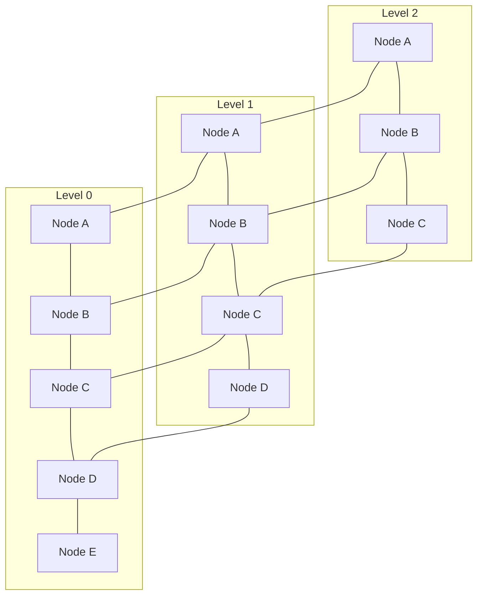

# Skip Graph 자료구조 📚🔗

Skip Graph는 분산 환경에서 효율적인 검색 및 범위 쿼리를 지원하는 확률적 자가 조직화 데이터 구조입니다.  
전통적인 스킵 리스트와 유사하지만, Skip Graph는 네트워크상의 노드들이 동적으로 참여하고 탈퇴할 수 있도록 설계되어,  
피어 투 피어 시스템, 분산 해시 테이블, 파일 시스템 등에서 높은 확장성과 내결함성을 제공합니다.

---

## 목차 📝
1. [개요](#개요-🧐)
2. [Skip Graph의 정의와 특징](#skip-graph의-정의와-특징)
3. [메모리 구조 및 다이어그램](#메모리-구조-및-다이어그램-🖼️)
4. [주요 연산](#주요-연산-🛠️)
5. [장단점](#장단점-⚖️)
6. [실무 활용 예시](#실무-활용-예시-💼)
7. [참고 자료](#참고-자료-🔗)

---

## 개요 🧐
Skip Graph는 노드들이 여러 레벨의 연결 구조를 통해 구성되는 분산 데이터 구조입니다.  
각 노드는 여러 레벨에 걸쳐 이웃 노드들과 연결되어 있으며,  
이러한 다중 연결 구조를 통해 로그 시간(log n)의 검색 성능과 범위 쿼리 효율성을 동시에 달성할 수 있습니다.  
특히, 분산 네트워크 환경에서 노드의 동적 참여와 탈퇴가 빈번한 경우에도 안정적인 검색 및 데이터 관리가 가능합니다.

---

## Skip Graph의 정의와 특징
- **정의**:  
  Skip Graph는 분산 환경에서 각 노드가 여러 레벨의 연결(링크)을 통해 서로 연결된 구조로,  
  이를 통해 전체 네트워크에서 빠른 검색, 삽입, 삭제 및 범위 쿼리를 지원하는 자가 조직화 데이터 구조입니다.
  
- **특징**:
  - **분산 확장성**:  
    노드들이 독립적으로 참여하거나 탈퇴할 수 있어, 피어 투 피어 네트워크에서 높은 확장성을 보장합니다.
  - **효율적 검색 및 범위 쿼리**:  
    다중 레벨 링크를 활용해, 검색 시 상위 레벨에서 대략적인 위치를 파악하고 하위 레벨에서 세밀하게 탐색할 수 있습니다.
  - **확률적 균형 유지**:  
    삽입과 삭제 시 확률적 알고리즘을 통해 구조의 균형을 유지하며, 평균적으로 로그 시간 복잡도를 가집니다.
  - **내결함성**:  
    네트워크 일부의 장애가 발생해도, 다른 경로를 통해 데이터 접근이 가능하여 높은 내결함성을 제공합니다.

---

## 메모리 구조 및 다이어그램 🖼️
Skip Graph는 여러 레벨의 연결 리스트와 유사한 구조를 가지며,  
각 레벨에서 노드들이 순서대로 연결되어 있고, 상위 레벨은 하위 레벨의 "요약" 역할을 합니다.  
아래 다이어그램은 3개 레벨로 구성된 Skip Graph의 기본 구조를 나타냅니다.

---

## 주요 연산 🛠️
- **검색 (Search)**:  
  다중 레벨의 링크를 따라 상위 레벨에서 대략적인 위치를 찾고, 하위 레벨로 내려오면서 정확한 키를 탐색합니다.
  
- **삽입 (Insertion)**:  
  새로운 노드를 확률적으로 각 레벨에 삽입하여, Skip Graph의 연결 구조를 동적으로 업데이트합니다.
  
- **삭제 (Deletion)**:  
  노드 삭제 시, 해당 노드와 연결된 링크들을 재조정하여 전체 구조의 일관성을 유지합니다.
  
- **범위 검색 (Range Search)**:  
  리프 노드들이 순차적으로 연결되어 있어, 특정 범위 내의 모든 노드를 빠르게 탐색할 수 있습니다.

---

## 장단점 ⚖️

### 장점 👍
- **높은 확장성**:  
  분산 환경에서 노드의 동적 참여와 탈퇴가 자유로워, 확장성이 뛰어납니다.
- **효율적인 범위 쿼리**:  
  리프 노드의 순차 연결을 통해 연속된 데이터 접근이 빠릅니다.
- **내결함성**:  
  일부 노드 장애가 발생해도 다른 경로로 데이터 접근이 가능하여, 안정적인 시스템 운영이 가능합니다.

### 단점 👎
- **구현 복잡성**:  
  다중 레벨의 링크 관리와 확률적 균형 유지 로직이 복잡할 수 있습니다.
- **네트워크 오버헤드**:  
  분산 환경에서의 통신 비용 및 동기화 문제로 인해 성능 저하가 발생할 수 있습니다.
- **데이터 일관성 관리 어려움**:  
  동적 노드 참여 및 탈퇴 시 데이터 일관성을 유지하기 위한 추가 메커니즘이 필요합니다.

---

## 실무 활용 예시 💼
- **분산 해시 테이블**:  
  피어 투 피어 네트워크에서 분산 인덱싱 및 데이터 검색에 활용됩니다.
- **분산 파일 시스템**:  
  파일 메타데이터 및 인덱스 관리에 사용되어, 빠른 범위 검색과 데이터 접근을 지원합니다.
- **실시간 데이터 스트리밍**:  
  대규모 분산 환경에서 실시간 데이터 업데이트와 범위 쿼리를 효율적으로 처리합니다.

---

## 참고 자료 🔗
- [Skip Graphs: Distributed Data Structures for Peer-to-Peer Systems](https://www.cs.princeton.edu/courses/archive/spring06/cos521/handouts/skipgraph.pdf)
- [Probabilistic Data Structures and Distributed Skip Graphs](https://dl.acm.org/doi/10.1145/129095.129101)
- [Peer-to-Peer Systems and Skip Graph 구현 관련 자료](https://www.usenix.org/legacy/events/p2p02/tech/full_papers/aspnes/aspnes.pdf)

---

Skip Graph의 구조와 알고리즘을 이해하면,  
분산 환경에서 효율적이고 확장 가능한 데이터 검색 및 범위 쿼리 솔루션을 구축할 수 있습니다.