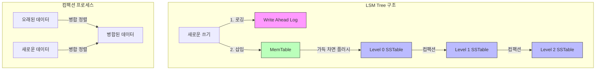

# LSM Tree (Log-Structured Merge Tree)

* 개념
    * **LSM Tree**는 쓰기 작업을 최적화하기 위해 설계된 디스크 기반 자료구조입니다.
    * 특징:
        - 순차적 디스크 쓰기로 성능 향상
        - 메모리(MemTable)와 디스크(SSTable) 계층 구조
        - 주기적인 병합(Compaction) 작업
        - 읽기보다 쓰기에 최적화

* 기본 구조
    1. MemTable (메모리 계층)
        - 새로운 데이터가 먼저 저장되는 곳
        - 보통 균형 이진 트리나 Skip List로 구현
        - WAL(Write-Ahead Log)로 내구성 보장

    2. SSTable (디스크 계층)
        - Sorted String Table
        - 정렬된 불변(Immutable) 파일
        - 여러 레벨로 구성
        - 각 레벨마다 크기가 증가

* 주요 작업
    1. 쓰기 (Write)
        ```python
        class LSMTree:
            def __init__(self):
                self.memtable = SkipList()  # 인메모리 테이블
                self.sstables = []  # 디스크의 SSTable 리스트
                self.wal = WriteAheadLog()  # 복구용 로그
            
            def put(self, key, value):
                # WAL에 먼저 기록
                self.wal.append(key, value)
                
                # MemTable에 삽입
                self.memtable.insert(key, value)
                
                # MemTable 크기 체크 및 필요시 플러시
                if self.memtable.size() >= MEMTABLE_SIZE:
                    self.flush_memtable()
        ```

    2. 읽기 (Read)
        ```python
        def get(self, key):
            # 1. MemTable 검색
            value = self.memtable.search(key)
            if value is not None:
                return value
                
            # 2. SSTable 레벨별 검색
            for level in range(len(self.sstables)):
                value = self.search_sstable_level(level, key)
                if value is not None:
                    return value
            
            return None
        ```

    3. 플러시 (Flush)
        ```python
        def flush_memtable(self):
            # MemTable을 SSTable로 변환
            sstable = SSTable.from_memtable(self.memtable)
            
            # Level 0에 추가
            self.sstables[0].append(sstable)
            
            # 새로운 MemTable 생성
            self.memtable = SkipList()
            
            # 필요시 컴팩션 수행
            if need_compaction(self.sstables[0]):
                self.compact(0)
        ```

    4. 컴팩션 (Compaction)
        ```python
        def compact(self, level):
            """레벨 N과 N+1을 병합"""
            current_tables = self.sstables[level]
            next_tables = self.sstables[level + 1]
            
            # 병합 정렬 수행
            merged = merge_sort_sstables(current_tables, next_tables)
            
            # 새로운 SSTable 생성
            self.sstables[level] = []
            self.sstables[level + 1] = merged
            
            # 필요시 다음 레벨도 컴팩션
            if need_compaction(merged):
                self.compact(level + 1)
        ```

* 최적화 전략
    1. Bloom Filter 사용
        ```python
        class SSTableWithBloom:
            def __init__(self):
                self.data = {}
                self.bloom = BloomFilter(expected_size=1000000, fp_prob=0.01)
                
            def put(self, key, value):
                self.data[key] = value
                self.bloom.add(key)
                
            def get(self, key):
                # Bloom Filter로 먼저 체크
                if not self.bloom.might_contain(key):
                    return None
                return self.data.get(key)
        ```

    2. Size-Tiered vs. Leveled 컴팩션
        ```python
        class SizeTieredCompaction:
            def should_compact(self, sstables):
                """크기가 비슷한 SSTable들을 병합"""
                size_groups = group_by_size(sstables)
                return any(len(group) >= 4 for group in size_groups)

        class LeveledCompaction:
            def should_compact(self, level, sstables):
                """레벨별 크기 제한 초과시 병합"""
                level_size = sum(table.size for table in sstables)
                return level_size > (10 ** level) * BASE_SIZE
        ```

* 성능 특성
    |작업|복잡도|설명|
    |---|------|-----|
    |쓰기|O(1)|MemTable에 순차 쓰기|
    |읽기|O(log N)|최악의 경우 모든 레벨 검색|
    |플러시|O(N log N)|MemTable 정렬 및 디스크 쓰기|
    |컴팩션|O(N)|레벨간 병합 정렬|

* 실제 구현 사례
    1. RocksDB 스타일
        ```python
        class RocksDBStyle:
            def __init__(self):
                self.memtable = SkipList()
                self.immutable_memtables = []  # 플러시 대기 중인 테이블
                self.levels = [[] for _ in range(7)]  # L0 ~ L6
                
            def write_batch(self, updates):
                with self.mutex:
                    for key, value in updates:
                        self.memtable.put(key, value)
                        
                    if self.memtable.size() >= threshold:
                        self.immutable_memtables.append(self.memtable)
                        self.memtable = SkipList()
                        self.schedule_flush()
        ```

    2. Cassandra 스타일
        ```python
        class CassandraStyle:
            def __init__(self):
                self.memtable = {}
                self.commitlog = CommitLog()
                self.sstables = []
                
            def write(self, key, value, timestamp):
                # 분산 환경을 위한 타임스탬프 기반 쓰기
                self.commitlog.append(key, value, timestamp)
                self.memtable[key] = (value, timestamp)
        ```

* 활용 사례
    1. 키-값 스토어
    2. 시계열 데이터베이스
    3. 로그 처리 시스템
    4. 블록체인 상태 저장소

* 장단점
    1. 장점
        - 높은 쓰기 처리량
        - 순차적 디스크 접근
        - SSD에 최적화
        - 확장성 좋음

    2. 단점
        - 읽기 성능이 상대적으로 낮음
        - 주기적인 컴팩션 필요
        - 공간 증폭 발생 가능
        - 컴팩션 중 지연 발생 가능

* 마무리
    - LSM Tree는 쓰기 집약적 워크로드에 최적화된 구조
    - RocksDB, LevelDB, Cassandra 등에서 널리 사용
    - 적절한 튜닝과 최적화가 중요

