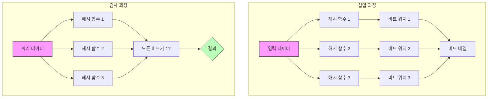

# 블룸 필터 (Bloom Filter)

* 개념
    * **블룸 필터**는 원소가 집합에 속하는지 여부를 검사하는 확률적 자료구조입니다.
    * 특징:
        - 공간 효율적 (비트 배열 사용)
        - False Positive는 가능하나 False Negative는 불가능
        - 원소 삭제를 지원하지 않음 (Counting Bloom Filter로 확장 가능)
        - 여러 해시 함수를 사용

* 작동 원리
    1. 비트 배열과 해시 함수들을 준비
    2. 삽입 시 각 해시 함수로 위치를 계산하여 비트를 1로 설정
    3. 검사 시 모든 해시 함수 위치의 비트가 1이면 "있을 수 있음"
    4. 하나라도 0이면 "확실히 없음"

* 주요 매개변수
    1. m: 비트 배열의 크기
    2. k: 해시 함수의 개수
    3. n: 저장할 원소의 예상 개수
    4. p: 허용 가능한 False Positive 비율

    * 최적값 계산:
        ```python
        import math

        def get_optimal_params(n, p):
            """최적의 m과 k 계산"""
            m = -1 * (n * math.log(p)) / (math.log(2) ** 2)
            k = (m / n) * math.log(2)
            return int(m), int(k)
        ```

* 기본 구현
    ```python
    import math
    import mmh3  # MurmurHash3 해시 함수

    class BloomFilter:
        def __init__(self, size: int, num_hash_functions: int):
            self.size = size
            self.num_hash_functions = num_hash_functions
            self.bit_array = [0] * size

        def _get_hash_positions(self, item):
            """item에 대한 모든 해시 위치 계산"""
            positions = []
            for seed in range(self.num_hash_functions):
                hash_val = mmh3.hash(str(item), seed) % self.size
                positions.append(hash_val)
            return positions

        def add(self, item):
            """원소 추가"""
            for pos in self._get_hash_positions(item):
                self.bit_array[pos] = 1

        def might_contain(self, item):
            """원소 존재 여부 확인"""
            return all(self.bit_array[pos] == 1 
                      for pos in self._get_hash_positions(item))

        @classmethod
        def get_optimal_size(cls, n: int, p: float):
            """최적의 크기 계산"""
            m = -1 * (n * math.log(p)) / (math.log(2) ** 2)
            return int(m)

        @classmethod
        def get_optimal_hash_count(cls, m: int, n: int):
            """최적의 해시 함수 개수 계산"""
            k = (m / n) * math.log(2)
            return int(k)
    ```

* 최적화된 구현 (비트 연산 사용)
    ```python
    class OptimizedBloomFilter:
        def __init__(self, size: int, num_hash_functions: int):
            self.size = size
            self.num_hash_functions = num_hash_functions
            # 비트 배열을 정수 배열로 표현
            self.data = bytearray((size + 7) // 8)

        def _set_bit(self, n):
            """n번째 비트를 1로 설정"""
            self.data[n // 8] |= 1 << (n % 8)

        def _get_bit(self, n):
            """n번째 비트 값 반환"""
            return bool(self.data[n // 8] & (1 << (n % 8)))

        def add(self, item):
            for pos in self._get_hash_positions(item):
                self._set_bit(pos)

        def might_contain(self, item):
            return all(self._get_bit(pos) 
                      for pos in self._get_hash_positions(item))
    ```

* Counting Bloom Filter 구현
    ```python
    class CountingBloomFilter:
        def __init__(self, size: int, num_hash_functions: int):
            self.size = size
            self.num_hash_functions = num_hash_functions
            self.counters = [0] * size  # 카운터 배열

        def add(self, item):
            """원소 추가 (카운터 증가)"""
            for pos in self._get_hash_positions(item):
                self.counters[pos] += 1

        def remove(self, item):
            """원소 제거 (카운터 감소)"""
            if self.might_contain(item):
                for pos in self._get_hash_positions(item):
                    self.counters[pos] -= 1

        def might_contain(self, item):
            return all(self.counters[pos] > 0 
                      for pos in self._get_hash_positions(item))
    ```

* 활용 사례
    1. 캐시 필터
        ```python
        class CacheFilter:
            def __init__(self, size: int, false_positive_rate: float):
                n = size  # 예상 원소 수
                m = BloomFilter.get_optimal_size(n, false_positive_rate)
                k = BloomFilter.get_optimal_hash_count(m, n)
                self.bloom = BloomFilter(m, k)
                self.cache = {}  # 실제 캐시

            def get(self, key):
                if not self.bloom.might_contain(key):
                    return None  # 확실히 캐시에 없음
                return self.cache.get(key)  # 캐시 확인

            def put(self, key, value):
                self.bloom.add(key)
                self.cache[key] = value
        ```

    2. 중복 URL 필터
        ```python
        class URLDeduplicator:
            def __init__(self, expected_urls: int, false_positive_rate: float):
                self.bloom = BloomFilter(
                    BloomFilter.get_optimal_size(expected_urls, false_positive_rate),
                    BloomFilter.get_optimal_hash_count(
                        BloomFilter.get_optimal_size(expected_urls, false_positive_rate),
                        expected_urls
                    )
                )

            def is_seen(self, url: str) -> bool:
                if self.bloom.might_contain(url):
                    return True
                self.bloom.add(url)
                return False
        ```

* 장단점
    1. 장점
        - 매우 공간 효율적
        - 빠른 삽입과 조회
        - False Negative가 없음

    2. 단점
        - False Positive 발생 가능
        - 원소 삭제 불가 (기본 버전)
        - 정확한 원소 수 파악 불가

* 실전 팁
    1. 매개변수 선택
        - False Positive 비율과 메모리 사용량 trade-off 고려
        - 예상 원소 수에 여유 두기

    2. 구현 선택
        - 기본 버전: 단순 멤버십 테스트
        - Counting 버전: 삭제 필요 시
        - 비트 최적화: 메모리 중요 시

    3. 해시 함수 선택
        - MurmurHash3 추천 (빠르고 균등 분포)
        - 해시 함수 간 독립성 중요

* 마무리
    - 블룸 필터는 공간 효율적인 확률적 자료구조
    - 대규모 시스템에서 중복 검사용으로 유용
    - False Positive 비율을 고려한 적절한 설계 필요

