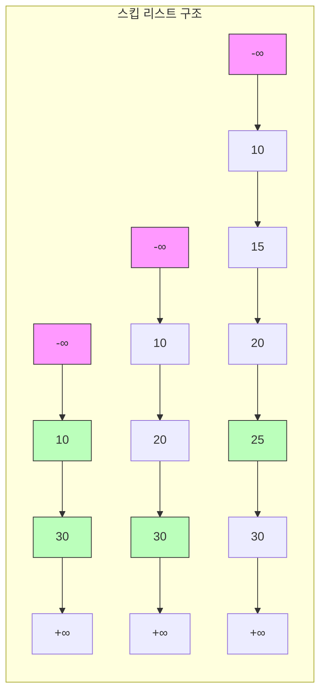

# 스킵 리스트 (Skip List)

* 개념
    * **스킵 리스트**는 여러 층의 연결 리스트로 구성된 확률적 자료구조입니다.
    * 균형 이진 탐색 트리와 비슷한 성능을 제공하면서도 구현과 유지보수가 더 쉽습니다.
    * 특징:
        - 정렬된 데이터를 유지
        - 확률적으로 레벨을 결정
        - O(log N) 시간 복잡도를 기대할 수 있음
        - 동적 데이터 구조(삽입/삭제가 용이)

* 구조
    1. 기본 구성요소
        - 여러 레벨의 연결 리스트
        - 각 노드는 여러 레벨의 포인터를 가짐
        - 최하위 레벨은 모든 노드를 포함
        - 상위 레벨로 갈수록 노드 수가 감소

    2. 레벨 결정
        - 각 노드의 레벨은 확률적으로 결정
        - 일반적으로 1/2 확률로 다음 레벨 진행
        - 최대 레벨은 log N 정도로 제한

* 주요 연산
    1. 검색(Search)
        - 최상위 레벨부터 시작
        - 각 레벨에서 목표값보다 작은 최대값까지 이동
        - 시간 복잡도: O(log N) 기대값

    2. 삽입(Insert)
        - 삽입 위치 검색
        - 노드의 레벨 결정
        - 각 레벨별 연결 갱신
        - 시간 복잡도: O(log N) 기대값

    3. 삭제(Delete)
        - 삭제할 노드 검색
        - 각 레벨별 연결 갱신
        - 시간 복잡도: O(log N) 기대값

* 기본 구현
    ```python
    import random

    class Node:
        def __init__(self, key, level):
            self.key = key
            self.forward = [None] * (level + 1)  # 각 레벨별 다음 노드

    class SkipList:
        def __init__(self, max_level=16, p=0.5):
            self.max_level = max_level
            self.p = p
            self.level = 0
            # 헤더 노드 (-inf 값으로 초기화)
            self.header = Node(float('-inf'), max_level)

        def random_level(self):
            """무작위로 노드의 레벨을 결정"""
            level = 0
            while random.random() < self.p and level < self.max_level:
                level += 1
            return level

        def search(self, key):
            """키 값을 가진 노드 검색"""
            current = self.header

            # 최상위 레벨부터 내려오며 검색
            for i in range(self.level, -1, -1):
                while (current.forward[i] and 
                       current.forward[i].key < key):
                    current = current.forward[i]

            current = current.forward[0]
            
            if current and current.key == key:
                return current
            return None

        def insert(self, key):
            """새로운 키 삽입"""
            # update 배열 초기화
            update = [None] * (self.max_level + 1)
            current = self.header

            # 각 레벨별 업데이트 위치 저장
            for i in range(self.level, -1, -1):
                while (current.forward[i] and 
                       current.forward[i].key < key):
                    current = current.forward[i]
                update[i] = current

            # 새 노드의 레벨 결정
            new_level = self.random_level()
            if new_level > self.level:
                for i in range(self.level + 1, new_level + 1):
                    update[i] = self.header
                self.level = new_level

            # 새 노드 생성
            new_node = Node(key, new_level)

            # 각 레벨별 연결 갱신
            for i in range(new_level + 1):
                new_node.forward[i] = update[i].forward[i]
                update[i].forward[i] = new_node

        def delete(self, key):
            """키 값을 가진 노드 삭제"""
            update = [None] * (self.max_level + 1)
            current = self.header

            # 삭제할 노드의 위치 찾기
            for i in range(self.level, -1, -1):
                while (current.forward[i] and 
                       current.forward[i].key < key):
                    current = current.forward[i]
                update[i] = current

            current = current.forward[0]

            # 노드가 존재하면 삭제
            if current and current.key == key:
                for i in range(self.level + 1):
                    if update[i].forward[i] != current:
                        break
                    update[i].forward[i] = current.forward[i]

                # 필요하면 레벨 조정
                while (self.level > 0 and 
                       self.header.forward[self.level] is None):
                    self.level -= 1
    ```

* 시간 복잡도
    |연산|평균|최악|
    |---|-----|-----|
    |검색|O(log N)|O(N)|
    |삽입|O(log N)|O(N)|
    |삭제|O(log N)|O(N)|
    |공간|O(N)|O(N log N)|

* 장단점
    1. 장점
        - 구현과 유지보수가 간단
        - 동적 데이터 구조
        - 병렬화/동시성 처리가 용이
        - 확률적 균형으로 재조정 비용 없음

    2. 단점
        - 추가 메모리 사용
        - 확률적 성능 보장
        - 최악의 경우 O(N) 가능성

* 활용 사례
    1. Redis의 정렬된 집합(Sorted Set)
        ```python
        # Redis 스타일의 정렬된 집합 구현
        class SortedSet:
            def __init__(self):
                self.skip_list = SkipList()
                self.scores = {}  # 키-점수 매핑

            def add(self, member, score):
                self.scores[member] = score
                self.skip_list.insert((score, member))

            def get_rank(self, member):
                if member not in self.scores:
                    return None
                score = self.scores[member]
                return self.skip_list.get_rank((score, member))
        ```

    2. 인메모리 데이터베이스
        - 정렬된 인덱스 구현
        - 범위 검색 지원

    3. 파일 시스템
        - 대용량 정렬 데이터 관리
        - 로그 구조화 병합 트리

* 실전 최적화
    1. 메모리 최적화
        ```python
        class CompactNode:
            __slots__ = ['key', 'forward']
            def __init__(self, key, level):
                self.key = key
                self.forward = [None] * (level + 1)
        ```

    2. 동시성 지원
        ```python
        from threading import Lock

        class ThreadSafeSkipList:
            def __init__(self):
                self.skip_list = SkipList()
                self.lock = Lock()

            def insert(self, key):
                with self.lock:
                    self.skip_list.insert(key)
        ```

    3. 범위 검색 최적화
        ```python
        def range_search(self, start, end):
            """start부터 end까지의 범위 검색"""
            result = []
            current = self.header
            
            # start 위치로 이동
            for i in range(self.level, -1, -1):
                while (current.forward[i] and 
                       current.forward[i].key < start):
                    current = current.forward[i]
            
            current = current.forward[0]
            
            # end까지 수집
            while current and current.key <= end:
                result.append(current.key)
                current = current.forward[0]
            
            return result
        ```

* 마무리
    - 스킵 리스트는 균형 이진 검색 트리의 실용적인 대안
    - 구현이 간단하면서도 효율적인 성능 제공
    - Redis 등 실제 시스템에서 널리 사용
    - 동시성 처리에 적합한 구조

