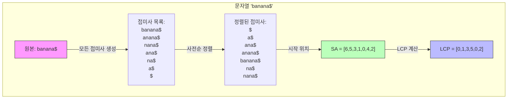

# 접미사 배열 (Suffix Array)

* 개념
    * **접미사 배열**은 문자열의 모든 접미사(Suffix)를 사전순으로 정렬한 배열입니다.
    * 문자열 검색 및 패턴 매칭에 효율적으로 사용됩니다.
    * 특징:
        - 문자열의 모든 접미사를 저장
        - 정렬된 상태 유지
        - 이진 탐색으로 빠른 검색 가능
        - LCP(Longest Common Prefix) 배열과 함께 사용시 더욱 강력

* 구성 요소
    1. SA(Suffix Array)
        - 접미사들의 시작 위치를 정렬된 순서로 저장
        - 크기는 문자열 길이와 동일

    2. LCP(Longest Common Prefix) 배열
        - 인접한 접미사들의 최장 공통 접두사 길이
        - SA와 함께 사용하여 다양한 문제 해결

* 기본 구현 (단순 버전)
    ```python
    def build_suffix_array_naive(text: str) -> list:
        """단순한 방식의 접미사 배열 생성"""
        # 모든 접미사와 시작 위치를 저장
        suffixes = [(text[i:], i) for i in range(len(text))]
        
        # 사전순 정렬
        suffixes.sort()
        
        # 정렬된 접미사들의 시작 위치만 반환
        return [pos for _, pos in suffixes]
    ```

* 최적화된 구현 (Manber-Myers 알고리즘)
    ```python
    def build_suffix_array(text: str) -> list:
        """효율적인 접미사 배열 생성"""
        text += '$'  # 문자열 끝 표시
        n = len(text)
        
        # 초기 순위 배열 생성 (첫 문자 기준)
        rank = [ord(c) for c in text]
        sa = list(range(n))
        tmp = [0] * n
        
        k = 1
        while k < n:
            # k 길이 기준으로 정렬
            sa.sort(key=lambda x: (rank[x], 
                                 rank[(x + k) % n] if x + k < n else -1))
            
            # 새로운 순위 계산
            tmp[sa[0]] = 0
            for i in range(1, n):
                if (rank[sa[i]], rank[(sa[i] + k) % n]) == \
                   (rank[sa[i-1]], rank[(sa[i-1] + k) % n]):
                    tmp[sa[i]] = tmp[sa[i-1]]
                else:
                    tmp[sa[i]] = tmp[sa[i-1]] + 1
            
            rank = tmp[:]
            k *= 2
        
        return sa[1:]  # $ 문자 제외하고 반환
    ```

* LCP 배열 구현
    ```python
    def build_lcp_array(text: str, sa: list) -> list:
        """LCP 배열 생성"""
        n = len(text)
        rank = [0] * n
        lcp = [0] * (n - 1)
        
        # 각 접미사의 순위 저장
        for i in range(n):
            rank[sa[i]] = i
        
        k = 0  # 이전 LCP 값
        for i in range(n):
            if rank[i] == n - 1:
                k = 0
                continue
            
            j = sa[rank[i] + 1]
            
            # 공통 접두사 길이 계산
            while i + k < n and j + k < n and text[i + k] == text[j + k]:
                k += 1
            
            lcp[rank[i]] = k
            
            if k > 0:
                k -= 1
                
        return lcp
    ```

* 활용 예시
    1. 문자열 검색
        ```python
        def string_search(text: str, pattern: str, sa: list) -> list:
            """패턴이 등장하는 모든 위치 찾기"""
            n = len(text)
            m = len(pattern)
            positions = []
            
            # 이진 탐색으로 패턴의 범위 찾기
            left = 0
            right = n - 1
            
            while left <= right:
                mid = (left + right) // 2
                suffix = text[sa[mid]:sa[mid] + m]
                
                if suffix == pattern:
                    # 패턴을 찾았을 때 양쪽으로 확장
                    positions.append(sa[mid])
                    # 왼쪽 확인
                    i = mid - 1
                    while i >= 0 and text[sa[i]:sa[i] + m] == pattern:
                        positions.append(sa[i])
                        i -= 1
                    # 오른쪽 확인
                    i = mid + 1
                    while i < n and text[sa[i]:sa[i] + m] == pattern:
                        positions.append(sa[i])
                        i += 1
                    break
                elif suffix < pattern:
                    left = mid + 1
                else:
                    right = mid - 1
            
            return sorted(positions)
        ```

    2. 중복 문자열 찾기
        ```python
        def find_repeating_substrings(text: str, min_length: int) -> set:
            """길이가 min_length 이상인 모든 중복 문자열 찾기"""
            sa = build_suffix_array(text)
            lcp = build_lcp_array(text, sa)
            
            result = set()
            for i in range(len(lcp)):
                if lcp[i] >= min_length:
                    substring = text[sa[i]:sa[i] + lcp[i]]
                    result.add(substring)
            
            return result
        ```

* 시간 복잡도
    |연산|복잡도|설명|
    |---|------|-----|
    |생성(naive)|O(n² log n)|단순 정렬 방식|
    |생성(최적화)|O(n log n)|Manber-Myers 알고리즘|
    |LCP 배열 생성|O(n)|Kasai 알고리즘|
    |문자열 검색|O(m log n)|m: 패턴 길이, n: 텍스트 길이|

* 장단점
    1. 장점
        - 공간 효율적 (Suffix Tree 대비)
        - 이진 탐색으로 빠른 검색
        - 구현이 상대적으로 단순
        - 캐시 지역성이 좋음

    2. 단점
        - 생성 시간이 비교적 오래 걸림
        - 동적 업데이트 어려움
        - 일부 연산은 LCP 배열 추가 필요

* 실전 팁
    1. 구현 선택
        - 문자열 길이가 작으면 단순 구현도 충분
        - 대용량 데이터는 최적화된 알고리즘 필수

    2. 메모리 관리
        - 문자열 길이에 비례하는 메모리만 필요
        - 필요한 경우 압축 기법 적용 가능

    3. 활용 패턴
        - 패턴 매칭
        - 중복 문자열 찾기
        - 최장 공통 부분 문자열

* 마무리
    - 접미사 배열은 효율적인 문자열 처리를 위한 강력한 도구
    - Suffix Tree보다 공간 효율적이며 구현이 간단
    - LCP 배열과 함께 사용하면 다양한 문자열 문제 해결 가능

