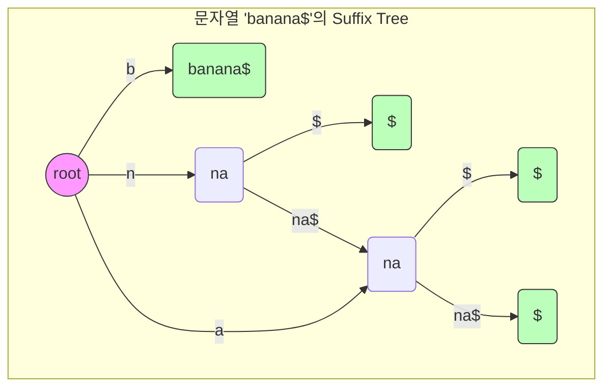

# 접미사 트리 (Suffix Tree)

* 개념
    * **접미사 트리**는 문자열의 모든 접미사를 저장하는 트라이(Trie)의 압축된 형태입니다.
    * 특징:
        - 모든 접미사가 리프 노드에 저장됨
        - 공통 접두사는 경로 공유
        - 간선에 문자열 조각을 저장
        - 모든 내부 노드는 최소 2개의 자식을 가짐

* 구조적 특징
    1. 노드 구성
        - 루트 노드: 빈 문자열 표현
        - 내부 노드: 공통 접두사 분기점
        - 리프 노드: 실제 접미사 표현
        - 각 간선: 문자열 조각 저장

    2. 특수 문자($)
        - 문자열 끝을 표시
        - 모든 접미사가 리프에서 끝나도록 보장

* 기본 구현
    ```python
    class Node:
        def __init__(self):
            self.children = {}  # 자식 노드 {문자열: 노드}
            self.suffix_index = -1  # 접미사 시작 위치
            self.start = -1  # 간선 문자열의 시작 위치
            self.end = -1    # 간선 문자열의 끝 위치

    class SuffixTree:
        def __init__(self, text):
            self.text = text + "$"
            self.root = Node()
            self.n = len(self.text)
            self.build_naive()

        def build_naive(self):
            """단순한 방식의 접미사 트리 구축"""
            for i in range(self.n):
                self._insert_suffix(i)

        def _insert_suffix(self, suffix_start):
            """하나의 접미사를 트리에 삽입"""
            current = self.root
            j = suffix_start

            while j < self.n:
                current_char = self.text[j]
                
                # 현재 문자로 시작하는 간선 찾기
                matched_edge = None
                for edge_str, child in current.children.items():
                    if edge_str[0] == current_char:
                        matched_edge = edge_str
                        break

                if matched_edge:
                    # 기존 간선과 매칭
                    edge_len = len(matched_edge)
                    k = 0
                    while (k < edge_len and 
                           j + k < self.n and 
                           matched_edge[k] == self.text[j + k]):
                        k += 1

                    if k == edge_len:
                        # 간선을 완전히 매칭
                        current = current.children[matched_edge]
                        j += k
                    else:
                        # 간선을 분할해야 함
                        new_node = Node()
                        new_node.children[matched_edge[k:]] = current.children[matched_edge]
                        current.children[matched_edge[:k]] = new_node
                        
                        # 새로운 리프 노드 추가
                        leaf = Node()
                        leaf.suffix_index = suffix_start
                        new_node.children[self.text[j + k:]] = leaf
                        
                        del current.children[matched_edge]
                        break
                else:
                    # 새로운 리프 노드 추가
                    leaf = Node()
                    leaf.suffix_index = suffix_start
                    current.children[self.text[j:]] = leaf
                    break
    ```

* Ukkonen 알고리즘 구현 (선형 시간)
    ```python
    class UkkonenNode:
        def __init__(self, start=-1, end=None):
            self.children = {}
            self.suffix_link = None
            self.start = start
            self.end = end
            self.suffix_index = -1

    class UkkonenSuffixTree:
        def __init__(self, text):
            self.text = text + "$"
            self.root = UkkonenNode()
            self.n = len(self.text)
            self.active_node = self.root
            self.active_edge = -1
            self.active_length = 0
            self.remainder = 0
            self.current_end = -1
            self.build()

        def build(self):
            """Ukkonen의 알고리즘으로 접미사 트리 구축"""
            self.current_end = -1
            
            for i in range(self.n):
                self.current_end += 1
                self.remainder += 1
                last_created_node = None

                while self.remainder > 0:
                    if self.active_length == 0:
                        self.active_edge = i

                    if (self.text[self.active_edge] not in 
                        self.active_node.children):
                        # 새로운 리프 노드 생성
                        self.active_node.children[self.text[self.active_edge]] = \
                            UkkonenNode(i, None)
                        if last_created_node:
                            last_created_node.suffix_link = self.active_node
                            last_created_node = None
                    else:
                        next_node = self.active_node.children[self.text[self.active_edge]]
                        if self._walk_down(next_node):
                            continue

                        if (self.text[next_node.start + self.active_length] == 
                            self.text[i]):
                            self.active_length += 1
                            if last_created_node:
                                last_created_node.suffix_link = self.active_node
                            break

                        # 분기점 생성
                        split_node = UkkonenNode(next_node.start, 
                                               next_node.start + self.active_length)
                        self.active_node.children[self.text[self.active_edge]] = split_node
                        split_node.children[self.text[i]] = \
                            UkkonenNode(i, None)
                        next_node.start += self.active_length
                        split_node.children[self.text[next_node.start]] = next_node

                        if last_created_node:
                            last_created_node.suffix_link = split_node
                        last_created_node = split_node

                    self.remainder -= 1
                    if (self.active_node == self.root and self.active_length > 0):
                        self.active_length -= 1
                        self.active_edge = i - self.remainder + 1
                    else:
                        self.active_node = (self.active_node.suffix_link 
                                          if self.active_node.suffix_link 
                                          else self.root)
    ```

* 문자열 검색 구현
    ```python
    def search(self, pattern):
        """패턴이 문자열에 존재하는지 확인"""
        current = self.root
        i = 0
        
        while i < len(pattern):
            # 현재 문자로 시작하는 간선 찾기
            found = False
            for edge, node in current.children.items():
                if edge.startswith(pattern[i:]):
                    i = len(pattern)  # 패턴을 완전히 찾음
                    found = True
                    break
                elif pattern[i:].startswith(edge):
                    i += len(edge)
                    current = node
                    found = True
                    break
            
            if not found:
                return False
                
        return True
    ```

* 활용 사례
    1. 패턴 매칭
        ```python
        def find_all_occurrences(self, pattern):
            """패턴이 등장하는 모든 위치 찾기"""
            positions = []
            
            def collect_leaves(node, path_length):
                if not node.children:  # 리프 노드
                    positions.append(node.suffix_index)
                    return
                
                for edge, child in node.children.items():
                    collect_leaves(child, path_length + len(edge))
            
            # 패턴에 해당하는 노드 찾기
            current = self.root
            i = 0
            while i < len(pattern):
                found = False
                for edge, node in current.children.items():
                    if edge.startswith(pattern[i:]):
                        collect_leaves(node, i + len(edge))
                        found = True
                        break
                    elif pattern[i:].startswith(edge):
                        i += len(edge)
                        current = node
                        found = True
                        break
                        
                if not found:
                    return []
                    
            return sorted(positions)
        ```

    2. 최장 공통 부분 문자열
        ```python
        def longest_common_substring(text1, text2):
            """두 문자열의 최장 공통 부분 문자열 찾기"""
            combined = text1 + "#" + text2 + "$"
            tree = SuffixTree(combined)
            n1 = len(text1)
            
            def find_lcs(node, length, height):
                max_length = length
                result = ""
                
                if node.suffix_index == -1:  # 내부 노드
                    found_text1 = False
                    found_text2 = False
                    
                    for edge, child in node.children.items():
                        if child.suffix_index < n1:
                            found_text1 = True
                        else:
                            found_text2 = True
                            
                        child_length, child_result = find_lcs(child, 
                                                            length + len(edge),
                                                            height + len(edge))
                        if child_length > max_length:
                            max_length = child_length
                            result = child_result
                            
                    if found_text1 and found_text2:
                        return height, combined[node.start:node.start + height]
                        
                return max_length, result
                
            return find_lcs(tree.root, 0, 0)[1]
        ```

* 시간 복잡도
    |연산|복잡도|설명|
    |---|------|-----|
    |구축(naive)|O(n²)|단순 구현|
    |구축(Ukkonen)|O(n)|선형 시간 알고리즘|
    |검색|O(m)|m: 패턴 길이|
    |공간|O(n)|n: 문자열 길이|

* 장단점
    1. 장점
        - 빠른 문자열 검색 (O(m) 시간)
        - 다양한 문자열 연산 지원
        - 온라인 구축 가능(Ukkonen)

    2. 단점
        - 구현이 복잡
        - 메모리 사용량이 큼
        - 캐시 효율성이 낮을 수 있음

* Suffix Array와의 비교
    |특성|Suffix Tree|Suffix Array|
    |----|-----------|------------|
    |공간 복잡도|O(n)|O(n)|
    |구축 시간|O(n)|O(n log n)|
    |검색 시간|O(m)|O(m log n)|
    |구현 복잡도|매우 복잡|비교적 단순|
    |메모리 사용|더 많음|적음|
    |응용 범위|더 넓음|제한적|

* 마무리
    - Suffix Tree는 강력한 문자열 처리 자료구조
    - Ukkonen 알고리즘으로 효율적 구축 가능
    - 실제 구현시 공간과 복잡도 고려 필요

