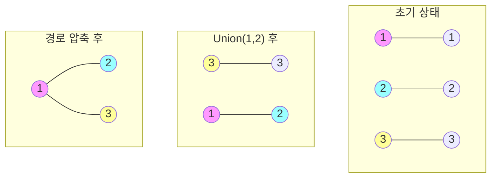

# Union-Find (Disjoint Set)

* 개념
    * **Union-Find**는 서로소 집합(Disjoint Set)을 표현하는 자료구조로, 여러 노드가 있을 때 특정 노드들이 같은 집합에 속하는지를 판단하는데 사용됩니다.
    * 주로 그래프의 연결성을 확인하거나 사이클 탐지에 활용되며, MST(Minimum Spanning Tree) 알고리즘의 핵심 컴포넌트입니다.
    * 두 가지 주요 연산:
        - **Find**: 특정 원소가 속한 집합의 대표값(루트)을 찾음
        - **Union**: 두 집합을 하나로 합침

* Union-Find의 주요 연산
    1. MakeSet(x)
        - 새로운 단일 원소 집합 생성
        - 초기에 각 원소는 자기 자신을 부모로 가짐

    2. Find(x)
        - 원소 x가 속한 집합의 대표값(루트)을 찾음
        - 경로 압축(Path Compression) 최적화 가능

    3. Union(x, y)
        - x가 속한 집합과 y가 속한 집합을 합침
        - Union by Rank/Size 최적화 가능

* 시간 복잡도
    |연산|최적화 전|경로 압축|Union by Rank|모든 최적화|
    |---|---------|---------|-------------|-----------|
    |Find|O(N)|O(log N)|O(log N)|O(α(N))|
    |Union|O(N)|O(log N)|O(log N)|O(α(N))|

    - α(N)은 애커만 함수의 역함수로, 실제로는 거의 상수 시간
    - 최적화 기법들을 모두 적용하면 사실상 O(1)에 가까운 성능

* 구현 방법
    1. 기본 구현 (배열 사용)
        ```python
        class UnionFind:
            def __init__(self, n):
                self.parent = list(range(n))  # 각 원소의 부모를 자신으로 초기화
            
            def find(self, x):
                if self.parent[x] != x:  # 루트가 아니면
                    self.parent[x] = self.find(self.parent[x])  # 경로 압축
                return self.parent[x]
            
            def union(self, x, y):
                root_x = self.find(x)
                root_y = self.find(y)
                if root_x != root_y:
                    self.parent[root_y] = root_x  # y의 루트를 x의 루트 아래로
                    return True
                return False
        ```

    2. 최적화된 구현 (Union by Rank + 경로 압축)
        ```python
        class UnionFindOptimized:
            def __init__(self, n):
                self.parent = list(range(n))
                self.rank = [0] * n  # 트리의 높이를 저장
            
            def find(self, x):
                if self.parent[x] != x:
                    self.parent[x] = self.find(self.parent[x])  # 경로 압축
                return self.parent[x]
            
            def union(self, x, y):
                root_x = self.find(x)
                root_y = self.find(y)
                
                if root_x == root_y:
                    return False
                
                # Union by Rank
                if self.rank[root_x] < self.rank[root_y]:
                    root_x, root_y = root_y, root_x
                self.parent[root_y] = root_x
                
                if self.rank[root_x] == self.rank[root_y]:
                    self.rank[root_x] += 1
                return True
        ```

* 최적화 기법
    1. 경로 압축(Path Compression)
        - Find 연산 시 거쳐간 모든 노드를 루트에 직접 연결
        - 재귀적 구현이 간단하며, 이후의 Find 연산이 O(1)에 가까워짐
        ```python
        def find(self, x):
            if self.parent[x] != x:
                self.parent[x] = self.find(self.parent[x])  # 경로 압축
            return self.parent[x]
        ```

    2. Union by Rank
        - 항상 높이가 낮은 트리를 높은 트리 아래로 합침
        - 트리의 높이를 최소화하여 Find 연산 최적화
        ```python
        def union(self, x, y):
            if self.rank[x] < self.rank[y]:
                x, y = y, x
            self.parent[y] = x
            if self.rank[x] == self.rank[y]:
                self.rank[x] += 1
        ```

    3. Union by Size
        - Rank 대신 서브트리의 크기를 기준으로 합침
        - 더 작은 집합을 큰 집합에 붙임

* 활용 사례
    1. Kruskal's MST 알고리즘
        ```python
        def kruskal(edges, n):  # edges: [(가중치, 정점1, 정점2)]
            uf = UnionFindOptimized(n)
            edges.sort()  # 가중치 기준 정렬
            mst = []
            
            for weight, u, v in edges:
                if uf.union(u, v):  # 사이클이 생기지 않으면
                    mst.append((u, v, weight))
            
            return mst
        ```

    2. 그래프 사이클 탐지
        ```python
        def has_cycle(edges, n):
            uf = UnionFindOptimized(n)
            
            for u, v in edges:
                if uf.find(u) == uf.find(v):  # 이미 같은 집합이면
                    return True  # 사이클 발견
                uf.union(u, v)
            return False
        ```

    3. 네트워크 연결성 확인
        - 컴퓨터 네트워크에서 노드 간 연결 여부 확인
        - 소셜 네트워크에서 친구 관계 파악

* 장단점
    1. 장점
        - 거의 상수 시간에 가까운 연산 (최적화 시)
        - 구현이 상대적으로 간단
        - 동적인 그래프 연결성 문제에 효율적

    2. 단점
        - 집합의 크기나 원소 열거가 어려움
        - 분리(Split) 연산이 효율적이지 않음
        - 메모리 해제가 까다로움

* 실전 팁
    1. 구현 선택
        - 단순한 용도: 기본 구현으로 충분
        - 대규모 데이터: 최적화 버전 사용 권장

    2. 성능 고려사항
        - 경로 압축만으로도 실용적인 성능
        - Union by Rank는 추가 메모리 필요

    3. 활용 패턴
        - 그래프 문제에서 연결성 확인
        - 동적 연결성이 필요한 경우
        - 집합 분할 문제

* 마무리
    - Union-Find는 집합의 분할과 병합을 효율적으로 처리하는 자료구조
    - 최적화 기법들을 적용하면 거의 상수 시간에 가까운 성능
    - MST, 사이클 탐지, 네트워크 연결성 등 다양한 문제 해결에 활용

