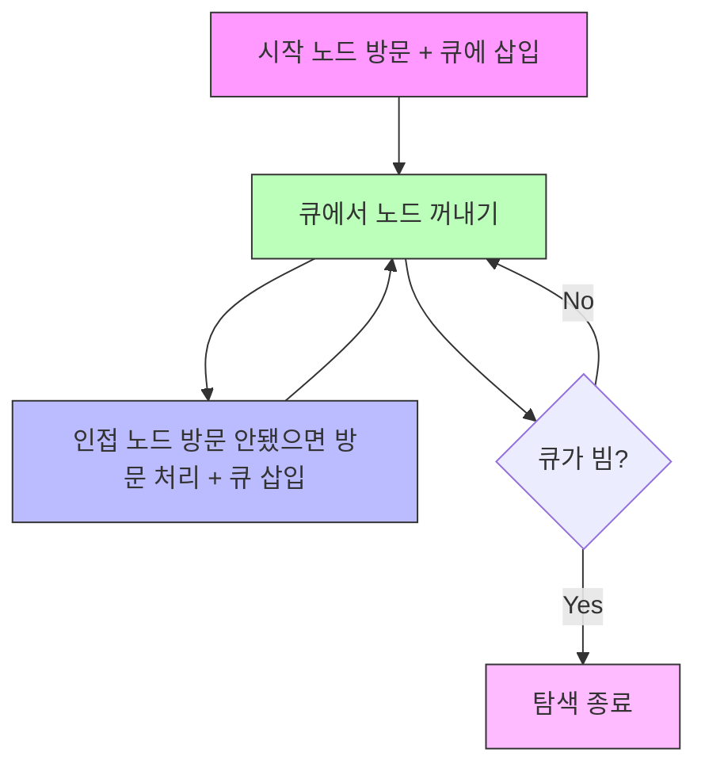

# 너비 우선 탐색 (Breadth-First Search, BFS)

* 개념
    * BFS는 그래프(또는 트리)의 한 노드에서 시작하여, 가까운(같은 레벨) 노드를 먼저 모두 방문한 뒤에 그 다음 레벨의 노드를 방문하는 방식의 탐색 알고리즘입니다.
    * 큐(Queue) 자료구조를 사용하여 구현하는 것이 일반적입니다.
    * 최단 경로(가중치가 없는 그래프) 탐색이나, 계층적 방문(레벨 순회) 등에 매우 유용합니다.

* 동작 원리
    1. 시작 노드를 방문하고 큐에 넣습니다.
    2. 큐에서 노드를 하나 꺼내(Dequeue), 인접 노드 중 아직 방문하지 않은 노드를 모두 방문 처리 한 큐에 넣습니다.
    3. 큐가 빌 때까지(또는 더 이상 방문할 노드가 없을 때까지) 2번 과정을 반복합니다.
    4. 방문 순서는 "루트에서 가까운 노드(레벨이 낮은) -> 먼 노드(레벨이 높은)" 순이 됩니다.

    **트리의 BFS는 "레벨 순회"와 동일한 개념이며, 그래프에서는 사이클이 있을 수 있으므로 방문 배열(visited)를 사용해야 합니다**

* 기본 구현
    ```python
    from collections import deque

    def bfs(graph, start):
        """그래프(인접 리스트)에서 BFS 탐색"""
        visited = set()
        queue = deque([start])
        visited.add(start)

        while queue:
            node = queue.popleft()
            print(node, end=' ')

            for neighbor in graph[node]:
                if neighbor not in visited:
                    visited.add(neighbor)
                    queue.append(neighbor)
    ```

    * `graph`는 인접 리스트 형태를 가정합니다:
        ```python
        graph = {
            'A': ['B', 'C'],
            'B': ['A', 'D', 'E'],
            'C': ['A', 'F'],
            ...
        }
        ```
    * `visited`는 이미 방문한 노드를 저장하는 자료구조(집합, 리스트, boolean 배열 등).

* 최적화된 C++ 스타일 구현
    - 아래 예시는 인접 리스트 `vector<vector<int>> graph`를 전제로, BFS를 큐 기반 반복문으로 구현한 예시입니다.
    ```cpp
    #include <bits/stdc++.h>
    using namespace std;

    void bfs(const vector<vector<int>>& graph, int start) {
        vector<bool> visited(graph.size(), false);
        queue<int> q;

        visited[start] = true;
        q.push(start);

        while (!q.empty()) {
            int node = q.front();
            q.pop();
            cout << node << " ";

            for (int neighbor : graph[node]) {
                if (!visited[neighbor]) {
                    visited[neighbor] = true;
                    q.push(neighbor);
                }
            }
        }
    }

    int main() {
        // 예시 그래프 (인접 리스트)
        vector<vector<int>> graph = {
            {1, 2},     // 0번 노드는 1, 2와 연결
            {0, 3, 4},  // 1번 노드는 0, 3, 4와 연결
            {0, 5},     // 2번 노드는 0, 5와 연결
            {1},        // 3번 노드는 1과 연결
            {1},        // 4번 노드는 1과 연결
            {2}         // 5번 노드는 2와 연결
        };

        bfs(graph, 0);
        return 0;
    }
    ```
    - 큐(queue<int>)에 방문 예정 노드를 넣고, 꺼낸 순서대로 탐색을 진행합니다.
    - 방문 순서는 레벨(거리) 기준이며, "가까운 노드부터 방문"한다는 점이 DFS와 다릅니다.

* 시간 복잡도
    * 그래프 G에서 정점(Vertex) 수를 V, 간선(edge) 수를 E라고 하면:
        - BFS의 시간 복잡도는 O(V + E) 입니다.
        - 모든 정점을 최소 한 번씩 방문, 각 간선을 최대 한 번씩 확인합니다.
    
    * 트리(간선이 V - 1개)인 경우, **O(V)**가 됩니다.

* 공간 복잡도
    - O(V):
        - 방문 배열(visited) 크기가 최대 V
        - 큐 역시 최악의 경우(예: 이진 트리의 최하단 레벨 등)에 한 레벨의 노드를 모두 담을 수 있으므로 최대 O(V)

* 장단점
    1. 장점
        - 가중치가 없는 그래프에서 시작 노드로부터의 최단 거리(최소 간선 수)를 쉽게 구할 수 있음.
        - 방문 순서가 "레벨 별"이므로, 트리/계층 구조의 레벨 순회에 유리
        - 구현이 비교적 단순 (큐 활용)

    2. 단점
        - 큐에 노드가 많이 쌓이면 메모리 사용량이 클 수 있음
        - 깊이가 매우 깊은 그래프를 탐색할 때, 레벨이 넓을수록 상당한 큐 저장 공간 필요
        - DFS가 쉽게 처리할 수 있는(백트래킹 같은) 문제에는 다소 불리

* 최적화 전략
    1. 인접 리스트 사용
        - 인접 행렬(Adjacency Matrix) 대신 인접 리스트(Adjacency List) 사용 시, 메모리와 방문 비용을 절약할 수 있습니다(그래프가 희소(sparse)한 경우 특히 효과적).

    2. 조기 종료 (Early Stopping)
        - 최단 경로가 필요해서 BFS를 사용한다면, 목적지를 찾는 순간 탐색을 종료할 수 있습니다.

    3. 방문 노드 순서 제어
        - 도의 우선순위가 필요하지 않은 일반 BFS에서는 인접 노드를 순서대로 큐에 넣지만,
        어떤 우선순위(노드 번호가 작은 것부터)를 보장하고 싶다면 인접 리스트를 정렬해 둔 뒤 큐에 넣습니다.

    4. 2차원 배열/격자
        - 미로 탐색이나 2차원 격자에서 BFS가 자주 사용됩니다. 이때는 (row, col) 방문 체크 배열을 효율적으로 관리해야 합니다.

* 활용 예시
    1. 최단 경로 찾기(가중치 없음)
        - 예: 미롱에서 출발점부터 도착점까지 이동하는 최소 단계 수
        - 예: **각 노드(정점)**까지의 거리(레벨)를 배열/딕셔너리에 기록

    2. 계층 구조 탐색
        - 예: 트리의 레벨 순회(루트부터 레벨별로)
        - 예: SNS에서 "친구의 친구" 관계 레벨 파악

    3. 연결 요소 찾기
        - 방문하지 않은 노드에서 BFS를 돌려 연결 컴포넌트를 구분(DFS로도 동일)

    4. 토폴로지 레벨 구조
        - DAG(방향성 비순환 그래프)에서 진입차수가 0인 노드부터 BFS 형태로 탐색 (kahn 알고리즘)

    5. 최소 간선으로 이동 가능한 문제
        - 모든 간선 가중치가 동일할 때, BFS로 최소 경로를 탐색 가능 (Dijkstra의 특수 케이스)

* 마무리
    - **너비 우선 탐색(BFS)**은 레벨 순서대로 그래프(또는 트리)를 탐색하며, 최단 거리나 레벨 구조가 필요한 문제에서 매우 효과적입니다.
    - 큐를 사용하므로, 방문하는 순서가 "같은 거리 -> 그 다음 거리"로 진행되어 DFS와는 반대되는 형태입니다.
    - 간단하면서도 다양한 응용(미로 탐색, SNS 분석, 최단 경로, 위상 정렬 등)에서 활용되는 기본 그래프 알고리즘입니다.

