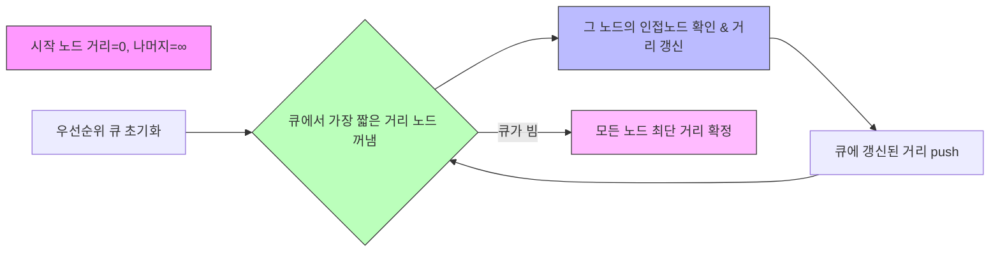

# 다익스트라 (Dijkstra) 알고리즘

* 개념
    * 다익스트라는 **가중치가 비음수(0 이상)**인 방향/무방향 그래프에서, 한 노드(시작점)로부터 모든 다른 노드까지의 최단 거리를 구하는 알고리즘입니다.
    * "가중치가 음수가 아닌" 것이 핵심 전제이며, 음수 간선이 있는 경우에는 사용할 수 없습니다.
        (음수 간선이 있을 때는 벨만-포드(Bellman-Ford) 또는 플로이드-워셜(Floyd-Warshall) 등을 고려해야 합니다.)

* 동작 원리
    1. 시작 노드의 거리를 0으로 설정하고, 나머지 노드는 거리를 무한대로 초기화합니다.
    2. 아직 방문 처리되지 않은 노드 중 가장 거리가 작은 노드를 선택(우선순위 큐를 사용하면 효율적), 그 노드로부터 인접 노드의 거리를 갱신합니다.
    3. 이 과정을 모든 노드가 방문 처리될 때까지 반복합니다.
    4. 최종적으로 distance 배열에 시작점으로부터 각 노드까지의 최단 거리가 저장됩니다.

    * 다 익스트라의 주요 아이디어는 **가장 짧은 경로를 먼저 확정**한다는 것입니다.
    즉, 우선순위 큐(Min Heap)에서 현재까지의 "가장 작은 거리" 노드를 뽑아서, 그 노드와 연결된 경로를 업데이트하는 식입니다.

* 기본 구현 (우선순위 큐 사용)
    ```python
    import heapq

    def dijkstra(graph, start):
        """
        graph: {node: [(adj_node, weight), (adj_node2, weight2), ...]}
        start: 시작 노드
        return: start 노드에서 모든 노드까지의 최단 거리 딕셔너리(dist)
        """
        # 거리 테이블 (초기값: 무한대)
        dist = {node: float('inf') for node in graph}
        dist[start] = 0

        # 우선순위 큐 (파이썬 heapq는 최소 힙)
        # (현재까지의 거리, 노드)
        pq = [(0, start)]

        while pq:
            current_dist, node = heapq.heappop(pq)

            # 이미 처리된 노드라면 스킵
            if current_dist > dist[node]:
                continue

            # 인접 노드 확인
            for (adj_node, weight) in graph[node]:
                cost = current_dist + weight
                # 더 짧은 경로 발견 시 갱신
                if cost < dist[adj_node]:
                    dist[adj_node] = cost
                    heapq.heappush(pq, (cost, adj_node))

        return dist

    # 예시 그래프 (무방향 가중치 예시)
    graph_example = {
        'A': [('B', 2), ('C', 5)],
        'B': [('A', 2), ('C', 4), ('D', 7)],
        'C': [('A', 5), ('B', 4), ('D', 1), ('E', 6)],
        'D': [('B', 7), ('C', 1), ('E', 3)],
        'E': [('C', 6), ('D', 3)]
    }

    start_node = 'A'
    dist_result = dijkstra(graph_example, start_node)
    print(dist_result)
    # 예: {
    #   'A': 0,
    #   'B': 2,
    #   'C': 5,
    #   'D': 6,   # A->B->C->D(2+4+1=7)보다 A->B->D(2+7=9)보다 A->C->D(5+1=6)이 더 짧음
    #   'E': 9    # A->C->D->E(5+1+3=9)
    # }
    ```

    - 그래프는 `dict` 형태로, 각 노드마다 연결된 `(인접노드, 가중치)` 리스트를 가지고 있다고 가정합니다.
    - 우선순위 큐(Min Heap)로 `heapq`를 사용하여, "거리 값이 가장 작은 노드"를 효율적으로 꺼내 쓸 수 있습니다.
    - 방문한 노드라도, 더 짧은 경로가 나올 수 있음을 고려하긴 하지만("이미 처리된 노드라면 스킵" 조건), 다익스트라 알고리즘 특성상, 한 번 확정된 노드는 더 이상 짧은 경로로 갱신되지 않습니다.

* 최적화된 C++ 스타일 (우선순위 큐)
    ```cpp
    #include <bits/stdc++.h>
    using namespace std;

    vector<long long> dijkstra(int start, const vector<vector<pair<int,int>>>& graph) {
        // 노드 개수
        int n = graph.size();
        // 거리 배열, 초기값 무한대
        vector<long long> dist(n, LLONG_MAX);
        dist[start] = 0;

        // (거리, 노드)를 저장하는 최소 힙
        priority_queue<pair<long long,int>, vector<pair<long long,int>>, greater<pair<long long,int>>> pq;
        pq.push({0, start});

        while (!pq.empty()) {
            auto [current_dist, node] = pq.top();
            pq.pop();
            if (current_dist > dist[node]) continue; // 이미 더 짧은 경로 존재

            for (auto& [adj_node, weight] : graph[node]) {
                long long cost = current_dist + weight;
                if (cost < dist[adj_node]) {
                    dist[adj_node] = cost;
                    pq.push({cost, adj_node});
                }
            }
        }
        return dist;
    }

    int main(){
        // 예시: 노드 개수 N=5, 그래프(0~4번 노드)
        vector<vector<pair<int,int>>> graph(5);
        // 무방향 예시: A(0) - B(1): 2
        // A(0) - C(2): 5, ...
        // 그래프 구성
        // 0과 1 연결
        graph[0].push_back({1, 2});
        graph[1].push_back({0, 2});

        graph[0].push_back({2, 5});
        graph[2].push_back({0, 5});

        graph[1].push_back({2, 4});
        graph[2].push_back({1, 4});

        graph[1].push_back({3, 7});
        graph[3].push_back({1, 7});

        graph[2].push_back({3, 1});
        graph[3].push_back({2, 1});

        graph[2].push_back({4, 6});
        graph[4].push_back({2, 6});

        graph[3].push_back({4, 3});
        graph[4].push_back({3, 3});

        // 시작 노드 0(A) 기준
        auto dist = dijkstra(0, graph);
        for (int i = 0; i < 5; i++) {
            cout << i << "번 노드까지 거리: " << dist[i] << "\n";
        }
        return 0;
    }
    ```

    - `graph`는 `vector<vector<pair<int, int>>>` 형태로, 각 노드마다 `(인접노드, 가중치)` 리스트를 가지고 있습니다.
    - 우선순위 큐(priority_queue)에서 `greater<pair<long long, int>>`를 사용하여 최소 힙으로 작동시킵니다.
    - `dist[node]`를 이용해 현재 노드까지의 최단 거리가 업데이트되었는지 확인합니다.

* 시간 복잡도
    * 일반적으로 **우선순위 큐(힙)**를 사용하면, O(E * log V) 가 됩니다.
        - E = 간선 수, V = 노드 수
        - 간선별로 최대 한 번씩 업데이트가 일어날 때마다 `push/pop` 연산 log V의 비용.

    * 만약 그래프가 조밀(dense)해서 E≈V^2에 가까우면 O(V^2 log V) 정도가 됩니다.
    * 인접 리스트 + 이진 힙 구조의 전형적인 다익스트라 알고리즘 시간 복잡도입니다.

* 장단점
    1. 장점
        - 음수가 아닌 가중치에서는 최단 경로를 효율적으로 구할 수 있음.
        - 우선순위 큐를 사용하면, 큰 그래프(수십만 ~ 수백만 간선)에도 적용 가능
        - BFS가 "가중치 = 1"인 특수 케이스를 다룰 수 있듯이, 다익스트라는 "가중치 >= 0" 범용 케이스로 볼 수 있음.

    2. 단점
        - 간선에 음수 가중치가 있으면 사용 불가
        - 플로이드-워셜처럼 모든 노드 쌍에 대한 최단 거리(ALL-Pairs)를 직접 구하려면, 각 노드를 시작점으로 V번 돌려야 해서 **O(V * E log V)**가 될 수 있음. (그래서 모든 쌍 최단 경로에서는 다른 알고리즘을 사용한다.)
        - 코딩 구현이 간단하진 않다(BFS보다 복잡, 우선순위 큐 등)

* 최적화 전략
    1. 우선순위 큐 대신 더 효율적인 자료구조 (예: Indexed Priority Queue, pairing heap, Fibonacci heap)을 쓸 수도 있지만, 실제로는 구현 복잡도 대비 이점이 크지 않아 보통 binary heap(C++ priority_queue)으로 충분합니다.

    2. 데이터 구조:
        - 인접 리스트(Adjacency List)를 사용하면 희소(sparse) 그래프에서 메모리를 아끼고 빠르게 동작합니다.
        - 인접 행렬(Adjacency Matrix)은 간선이 매우 많은(n*(n-1)/2) 조밀(dense) 그래프에서만 고려해볼 만하지만, 보통은 비효율적입니다.

    3. 사용 케이스:
        - 한 번 최단 거리를 구하면 다시 안 쓰는 경우, 그냥 `dist` 배열 하나로 충분.
        - 동적(online) 업데이트가 많은 경우(간선 추가/삭제), 다익스트라보다는 다른 자료구조나 접근을 고려해야 할 수도 있습니다.

* 활용 예시
    1. 지도 내 경로 탐색 (GPS, 네비게이션)
        - 도시 간 도로(간선)가 모두 음수 아닌 비용(거리/시간)인 경우, 다익스트라로 최단 경로 탐색.
    
    2. 네트워크 라우팅
        - 링크 가중치(대역폭, 혼잡도)가 모두 양수 -> 라우터에서 최단 경로 계산.

    3. 게임 맵/그래프 최단 경로
        - 예: RPG나 시뮬레이션 게임에서 "가장 빠른 길" 찾기.

    4. 트리 + 가중치
        - 사실 트리(노드 V, 간선 V - 1)인 경우, 다익스트라가 일반적인 그래프보다 훨씬 빠르게 동작
            (사실상 한 번의 DFS/BFS 변형으로도 가능)

* 마무리
    * 다익스트라(Dijkstra) 알고리즘은 음수가 아닌 가중치 그래프에서 한 노드(시작점)로부터 다른 모든 노드까지의 최단 경로를 찾는 데 사용됩니다.
    * 우선순위 큐(Min-Heap)를 이용한 구현에서, 시간 복잡도는 **O(E log V)**가 대표적입니다.
    * 음수 간선이 없다는 전제에서 매우 빠른 알고리즘으로, 지도/GPS, 네트워크 라우팅, 게임 개발 등에서 가장 많이 쓰이는 최단 거리 알고리즘입니다.
    * 음수 가중치가 있으면 벨만-포드나 플로이드-워셜로 넘어가야 함을 기억합시다.

