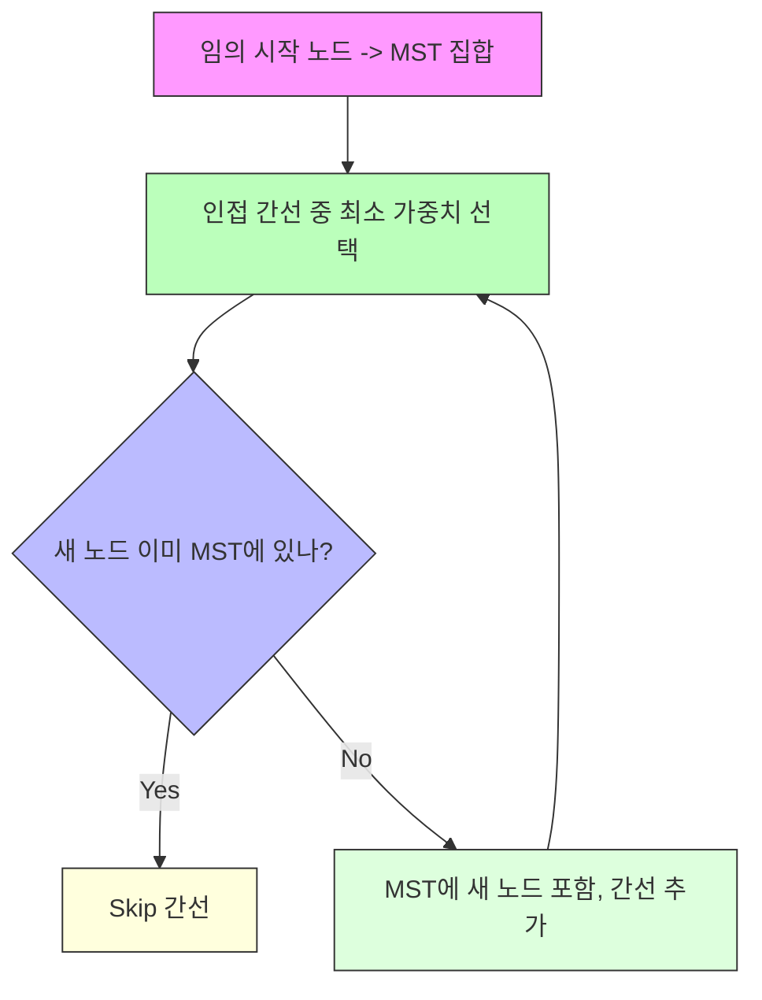

# 프림 (Prima) 알고리즘

* 개념
    * **프림(Prim)**은 임의의 정점에서 시작하여, **확장(Expand)**해 나가면서 **최소 신장 트리(MST)**를 완성하는 알고리즘입니다.
    * **크루스칼(Kruskal)**이 간선 중심으로 “가장 작은 간선부터 연결”하는 방식을 취했다면, **프림(Prim)**은 정점 중심으로 “현재 MST 집합과 연결되는 간선 중 비용이 최소인 간선을 추가”하는 방식을 취합니다.

* 동작 원리
    1. 시작 정점을 선택하고, 이를 MST 집합(방문 집합)으로 표기합니다.
    2. 현재 MST 집합과 연결되어 있으면서, MST 집합에 속하지 않은 정점으로 향하는 가장 가중치가 작은 간선을 찾습니다.
    3. 그 간선을 MST에 추가하고, 해당 간선으로 연결되는 새 정점을 MST 집합에 포함시킵니다.
    4. 모든 정점이 MST 집합에 들어갈 때까지(또는 간선을 V-1개 선택할 때까지) 2 ~ 3 과정을 반복합니다.

    - 초기 MST 집합에는 임의의 한 정점만 들어 있고, 매 단계마다 MST에 속한 정점들과 연결된 최소 비용 간선을 찾는 식으로 MST를 확장해 나갑니다.

* 기본 구현
    ```python
    import heapq

    def prim(adj_list, start=0):
        """
        adj_list: 그래프의 인접 리스트
                예) adj_list[u] = [(v, w), (v2, w2), ...]
                (u->v 가중치 w)
        start: 시작 정점 번호 (기본값=0)
        
        return: (MST 가중치, MST에 포함된 간선 목록)
        """
        V = len(adj_list)
        
        visited = [False] * V
        mst_edges = []
        mst_weight = 0
        
        # 우선순위 큐(가중치 기준 min-heap)
        # (가중치, 현재 정점, 연결될 정점)
        pq = []
        
        # 시작 정점 처리
        visited[start] = True
        for (next_v, w) in adj_list[start]:
            heapq.heappush(pq, (w, start, next_v))
        
        # MST는 간선 V-1개 필요
        edge_count = 0
        
        while pq and edge_count < V-1:
            w, u, v = heapq.heappop(pq)
            
            # 이미 방문한 정점이면 스킵
            if visited[v]:
                continue
            
            # 새 정점을 MST에 편입
            visited[v] = True
            mst_weight += w
            mst_edges.append((u, v, w))
            edge_count += 1
            
            # v와 인접한 간선을 우선순위 큐에 추가
            for (next_v, w2) in adj_list[v]:
                if not visited[next_v]:
                    heapq.heappush(pq, (w2, v, next_v))
        
        return mst_weight, mst_edges


    # 예시 그래프
    # 정점: 0, 1, 2, 3, 4
    # 간선:
    #    0 - 1 (1), 0 - 2 (2), 1 - 2 (5)
    #    1 - 3 (4), 1 - 4 (3), 2 - 3 (6), 3 - 4 (7)
    adj_list_example = [
        [(1,1),(2,2)],     # 0
        [(0,1),(2,5),(3,4),(4,3)],  # 1
        [(0,2),(1,5),(3,6)],        # 2
        [(1,4),(2,6),(4,7)],        # 3
        [(1,3),(3,7)]               # 4
    ]

    mst_w, mst_e = prim(adj_list_example, start=0)
    print("MST Weight:", mst_w)
    print("MST Edges:", mst_e)
    ```
    - 인접 리스트(Adjacency list) 형태에서, 시작 정점의 인접 간선들을 우선순위 큐에 넣고, MST에 속하지 않은 정점 중 최소 간선을 찾습니다.
    - 우선순위 큐(`heapq`)에서 `(가중치, 현재노드, 다음노드)`를 꺼내며, 이미 방문한 노드라면 스킵합니다.
    - 방문하지 않았다면, 해당 간선을 MST에 추가하고, 그 노드에 인접한 간선들을 큐에 넣습니다.

* 최적화된 C++ 스타일 (우선순위 큐)
    ```cpp
    #include <bits/stdc++.h>
    using namespace std;

    struct Edge {
        int to;
        long long w;
    };

    int main(){
        ios::sync_with_stdio(false); cin.tie(nullptr);

        int V = 5; 
        vector<vector<Edge>> graph(V);

        // 0 <-> 1 (1), 0 <-> 2 (2)...
        graph[0].push_back({1,1});
        graph[1].push_back({0,1});

        graph[0].push_back({2,2});
        graph[2].push_back({0,2});

        graph[1].push_back({2,5});
        graph[2].push_back({1,5});

        graph[1].push_back({3,4});
        graph[3].push_back({1,4});

        graph[1].push_back({4,3});
        graph[4].push_back({1,3});

        graph[2].push_back({3,6});
        graph[3].push_back({2,6});

        graph[3].push_back({4,7});
        graph[4].push_back({3,7});

        // Prim
        vector<bool> visited(V, false);
        long long mst_weight = 0;
        vector<tuple<int,int,long long>> mst_edges; 
        // (u, v, w)

        // 우선순위 큐 (가중치, u, v)
        priority_queue< tuple<long long,int,int>,
                        vector< tuple<long long,int,int> >,
                        greater< tuple<long long,int,int>> > pq;

        // 임의의 시작 노드 = 0
        visited[0] = true;
        // 0번 노드와 연결된 간선들 push
        for(auto &edge : graph[0]){
            pq.push({edge.w, 0, edge.to});
        }

        int edge_count = 0;
        while(!pq.empty() && edge_count < V-1){
            auto [w,u,v] = pq.top();
            pq.pop();
            if(visited[v]) continue;

            // 새 노드 v를 MST에 편입
            visited[v] = true;
            mst_weight += w;
            mst_edges.push_back({u, v, w});
            edge_count++;

            // v와 연결된 간선들 push
            for(auto &edge : graph[v]){
                if(!visited[edge.to]){
                    pq.push({edge.w, v, edge.to});
                }
            }
        }

        cout << "MST Weight: " << mst_weight << "\n";
        for(auto &e : mst_edges){
            cout << get<0>(e) << "-" << get<1>(e)
                << " (" << get<2>(e) << ")\n";
        }

        return 0;
    }
    ```
    - 시작 노드를 임의로 정하고(`0`), 그 노드에 연결된 간선을 우선순위 큐(Min-Heap)에 삽입.
    - 큐에서 가장 가중치가 작은 간선을 뽑아, 새로 방문할 수 있는 노드라면 MST에 추가.
    - 그 노드의 인접 간선들을 다시 큐에 삽입.

* 시간 복잡도
    1. 인접 리스트 + 우선순위 큐(Min-Heap) 구현 시
        - O(E log V)
        - 매 간선을 최대 한 번씩 큐에 넣을 수 있고(정점마다 인접한 간선), 큐에서 노드를 꺼내는 데 log V

    2. 인접 행렬로 구현 시(또는 우선순위 큐 없이 매 단계 O(V) 스캔)
        - O(V^2)
        - 노드 수가 많을 경우 비효율적이나, 그래프가 매우 조밀(dense)하거나 V가 작으면 쓸 만합니다.

* 장단점
    1. 장점
        - 정점 중심 접근: 한 번에 하나의 정점을 MST에 추가
        - 그래프가 연결되어 있다면, 중간에 임의의 정점에서 시작하도 MST 결과 동일
        - 간선을 많이 추가하지 않아도 되므로, **조밀 그래프(dense graph)**에서 유리 (E가 V^2에 가까운 경우)

    2. 단점
        - 인접 행렬로 구현 시, **O(V^2)**여서 희소 그래프(sparse graph)에는 비효율적
        - 크루스칼에 비해, 간선 정렬이 필요 없지만, 우선순위 큐 구현에 따라 성능이 달라질 수 있음(인접 리스트 + 힙으로 최적화).

* 활용 예시
    1. 네트워크 케이블 연결
        - 어떤 서버(정점)에서 시작해, 점차 연결 확장(간선)해가며 최소 비용 연결망을 구축

    2. 실시간으로 MST를 확장
        - "여기서부터 연결 시작"이라는 상황에서, 순차적으로 간선을 고르는 방식

    3. 조밀(dense) 그래프
        - 간선이 많을 때, Prim + 인접 행렬로 구현하면 코드가 단순하며, V가 크지 않다면 무난히 사용 가능.

* 크루스칼(Kruskal) vs 프림(Prim)
    |알고리즘|접근 방식|구현 자료구조|시간 복잡도|사용 그래프 형태|
    |--------|-----------|-------|------------|--------------|
    |Kruskal|간선 중심|Union-Find + 정렬|O(E log E) ≈ O(E log V)| 희소(sparse) 그래프 유리|
    |Prim|정점 중심|우선선위 큐(Min-Heap) or 인접 행렬|O(E log V) (인접 리스트 + 힙), O(V^2)(인접행렬)|조밀(dense) 그래프 유리|
    * 큰 틀에서 두 알고리즘은 모두 MST를 구하며, 희소 그래프면 크루스칼, 조밀 그래프면 프림 쪽이 조금 더 낫다는 경험적 차이가 있습니다(물론 구현 세부사항에 따라 달라질 수 있음).

* 마무리
    * 프림(Prim) 알고리즘은 정점 중심으로 MST 집합을 단계적으로 확장하며, 가장 작은 간선을 선택해 나가는 방식으로 최소 신장 트리를 구합니다.
    * 시간 복잡도는 인접 리스트 + 우선순위 큐 사용 시 O(E log V) 정도이며, 그래프가 조밀할수록(간선이 많을수록) 성능이 괜찮습니다.
    * 크루스칼과 프림 모두 MST를 구하는 대표적 알고리즘이므로, 그래프 형태(E, V의 관계)와 구현 편의에 따라 적합한 방법을 선택하면 됩니다.

