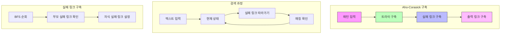

# Aho-Corasick 알고리즘

* 개념
    * **Aho-Corasick**은 여러 패턴을 동시에 검색할 수 있는 문자열 매칭 알고리즘입니다.
    * 특징:
        - 트라이(Trie) 구조 활용
        - 실패 링크(Failure Links) 사용
        - KMP 알고리즘의 확장 버전
        - 선형 시간 검색 가능

* 핵심 구성 요소
    1. 트라이 구조
        - 모든 패턴을 저장
        - 공통 접두사 공유
        - 패턴의 종료 표시

    2. 실패 링크
        - 매칭 실패시 이동할 다음 상태
        - KMP의 실패 함수와 유사
        - BFS로 구축

    3. 출력 링크
        - 현재 상태에서 발견될 수 있는 모든 패턴
        - 실패 링크를 따라가며 구축

* 기본 구현
    ```python
    from collections import deque

    class AhoCorasick:
        class Node:
            def __init__(self):
                self.children = {}
                self.fail = None
                self.output = []
                self.is_root = False
                
        def __init__(self):
            self.root = self.Node()
            self.root.is_root = True
            
        def add_pattern(self, pattern, pattern_index):
            """패턴 추가"""
            node = self.root
            for char in pattern:
                if char not in node.children:
                    node.children[char] = self.Node()
                node = node.children[char]
            node.output.append((pattern, pattern_index))
            
        def build_failure_links(self):
            """실패 링크 구축"""
            queue = deque()
            
            # 루트의 자식들의 실패 링크는 루트를 가리킴
            for child in self.root.children.values():
                child.fail = self.root
                queue.append(child)
                
            # BFS로 나머지 노드들의 실패 링크 설정
            while queue:
                current = queue.popleft()
                
                for char, child in current.children.items():
                    queue.append(child)
                    
                    # 실패 링크 찾기
                    failure = current.fail
                    while not failure.is_root and char not in failure.children:
                        failure = failure.fail
                        
                    child.fail = failure.children.get(char, self.root)
                    # 출력 링크 구축
                    child.output.extend(child.fail.output)
                    
        def search(self, text):
            """패턴 검색 수행"""
            current = self.root
            results = []
            
            for i, char in enumerate(text):
                # 현재 상태에서 다음 문자를 찾을 때까지 실패 링크 따라감
                while not current.is_root and char not in current.children:
                    current = current.fail
                    
                # 다음 상태로 이동
                current = current.children.get(char, self.root)
                
                # 현재 상태에서 발견된 모든 패턴 기록
                for pattern, pattern_index in current.output:
                    results.append((i - len(pattern) + 1, pattern_index))
                    
            return sorted(results)  # 위치순 정렬
    ```

* 최적화된 구현
    ```python
    class OptimizedAhoCorasick:
        class Node:
            __slots__ = ['children', 'fail', 'output', 'is_root']
            
            def __init__(self):
                self.children = {}
                self.fail = None
                self.output = []
                self.is_root = False
                
        def __init__(self, patterns):
            self.root = self.Node()
            self.root.is_root = True
            self.patterns = patterns
            
            # 패턴 추가 및 실패 링크 구축을 한번에 수행
            self._build_trie()
            self._build_failure_links()
            
        def _build_trie(self):
            """최적화된 트라이 구축"""
            for i, pattern in enumerate(self.patterns):
                node = self.root
                for char in pattern:
                    node = node.children.setdefault(char, self.Node())
                node.output.append((pattern, i))
                
        def _build_failure_links(self):
            """최적화된 실패 링크 구축"""
            queue = deque()
            
            # 첫 레벨 처리
            for char, node in self.root.children.items():
                node.fail = self.root
                queue.append(node)
                
            # 나머지 레벨 처리
            while queue:
                current = queue.popleft()
                
                for char, child in current.children.items():
                    queue.append(child)
                    
                    failure = current.fail
                    while not failure.is_root and char not in failure.children:
                        failure = failure.fail
                        
                    child.fail = failure.children.get(char, self.root)
                    child.output.extend(child.fail.output)
    ```

* 성능 최적화 버전
    ```python
    class HighPerformanceAC:
        def __init__(self, patterns):
            self.patterns = patterns
            self.trie = self._build_compressed_trie()
            
        def _build_compressed_trie(self):
            """압축된 트라이 구조 생성"""
            root = {}
            for i, pattern in enumerate(self.patterns):
                current = root
                for char in pattern:
                    current = current.setdefault(char, {})
                current['#'] = i  # 패턴 종료 표시
                
            return root
            
        def search(self, text):
            """최적화된 검색"""
            results = []
            current = self.trie
            buffer = []
            
            for i, char in enumerate(text):
                while buffer and char not in current:
                    buffer.pop()
                    if not buffer:
                        current = self.trie
                        break
                    current = self.trie
                    for c in buffer:
                        if c not in current:
                            buffer = []
                            current = self.trie
                            break
                        current = current[c]
                
                if char in current:
                    buffer.append(char)
                    current = current[char]
                    if '#' in current:
                        results.append((i - len(buffer) + 1, current['#']))
                        
            return results
    ```

* 시간 복잡도
    |연산|복잡도|설명|
    |---|------|-----|
    |트라이 구축|O(m)|m은 모든 패턴 길이의 합|
    |실패 링크 구축|O(m)|BFS로 구축|
    |검색|O(n + k)|n은 텍스트 길이, k는 발견된 패턴 수|

* 공간 복잡도
    - O(m): 트라이와 실패 링크 저장

* 장단점
    1. 장점
        - 여러 패턴 동시 검색
        - 선형 시간 검색
        - 실패시 최적의 위치로 이동
        - 모든 매칭 발견 보장

    2. 단점
        - 메모리 사용량이 큼
        - 구현이 복잡
        - 초기 구축 비용
        - 실패 링크 관리 오버헤드

* 활용 예시
    1. 악성코드 패턴 검사
        ```python
        def virus_scan(file_content, virus_signatures):
            """파일에서 바이러스 시그니처 검색"""
            ac = AhoCorasick()
            
            # 시그니처 추가
            for i, signature in enumerate(virus_signatures):
                ac.add_pattern(signature, i)
                
            ac.build_failure_links()
            
            # 검색 수행
            matches = ac.search(file_content)
            return [(pos, virus_signatures[pattern_idx])
                    for pos, pattern_idx in matches]
        ```

    2. 필터링 시스템
        ```python
        class ContentFilter:
            def __init__(self, bad_words):
                self.ac = AhoCorasick()
                self.bad_words = bad_words
                
                for i, word in enumerate(bad_words):
                    self.ac.add_pattern(word.lower(), i)
                    
                self.ac.build_failure_links()
                
            def filter_text(self, text):
                """불appropriate 단어 검출"""
                matches = self.ac.search(text.lower())
                
                # 마스킹 처리
                result = list(text)
                for pos, word_idx in matches:
                    word = self.bad_words[word_idx]
                    for i in range(pos, pos + len(word)):
                        result[i] = '*'
                        
                return ''.join(result)
        ```

* 최적화 기법
    1. 실패 링크 압축
        ```python
        def compress_failure_links(self):
            """실패 링크 체인 압축"""
            queue = deque([self.root])
            
            while queue:
                node = queue.popleft()
                
                # 실패 링크를 따라가며 출력이 있는 노드 찾기
                failure = node.fail
                while failure and not failure.output:
                    failure = failure.fail
                    
                if failure:
                    node.fail = failure
                    
                queue.extend(node.children.values())
        ```

    2. 메모리 최적화
        ```python
        class MemoryEfficientAC:
            def __init__(self):
                self.trie = {}
                self.fail = {}
                self.output = {}
                
            def add_pattern(self, pattern, pattern_idx):
                """메모리 효율적인 패턴 추가"""
                current = 0  # 노드 번호로 관리
                for char in pattern:
                    if (current, char) not in self.trie:
                        self.trie[(current, char)] = len(self.trie)
                    current = self.trie[(current, char)]
                
                if current not in self.output:
                    self.output[current] = []
                self.output[current].append((pattern, pattern_idx))
        ```

* 마무리
    - Aho-Corasick은 효율적인 다중 패턴 매칭 알고리즘
    - 안티바이러스, 필터링 등 실제 응용에서 널리 사용
    - 트라이와 실패 링크의 조합이 핵심
    - 최적화를 통한 실용적 구현 가능

