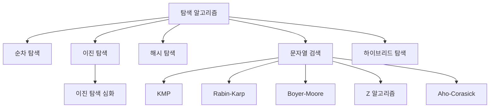

# 탐색 알고리즘 🔍

탐색 알고리즘은 데이터 집합에서 원하는 요소나 패턴을 빠르고 효율적으로 찾기 위한 기법입니다.  
데이터의 크기, 구조, 특성에 따라 적합한 탐색 방법을 선택하면 응용 프로그램의 성능을 크게 향상시킬 수 있습니다.

---

## 목차 📝
1. [개요](#개요-🧐)
2. [탐색 알고리즘 분류](#탐색-알고리즘-분류)
3. [알고리즘 특징 비교](#알고리즘-특징-비교)
4. [동작 과정 다이어그램](#동작-과정-다이어그램-🖼️)
5. [실무 활용 및 참고 자료](#실무-활용-및-참고-자료-🔗)

---

## 개요 🧐
탐색 알고리즘은 주어진 데이터 집합 내에서 특정 값이나 패턴을 찾기 위해 사용됩니다.  
간단한 순차 검색부터 고급 문자열 검색, 다중 패턴 탐색까지 다양한 기법이 존재하며,  
각 알고리즘은 데이터 구조와 문제의 요구사항에 따라 최적의 성능을 발휘할 수 있도록 설계되었습니다.

---

## 탐색 알고리즘 분류
탐색 알고리즘은 크게 다음과 같이 분류할 수 있습니다:

- **순차 탐색 (Linear Search):**  
  데이터 집합을 처음부터 끝까지 한 번씩 순회하며 원하는 값을 찾습니다.  
  [Linear Search](linear.c)

- **이진 탐색 (Binary Search):**  
  정렬된 배열을 대상으로 중간값을 기준으로 탐색 범위를 절반씩 좁혀가며 검색합니다.  
  [Bianry Search](binary.md)

- **이진 검색 심화 (Binary Search Advanced):**  
  이진 탐색의 변형 및 최적화를 통해 보다 복잡한 조건에서도 효율적인 검색을 지원합니다.  
  [Binary Search Advanced](binary_advanced.c)

- **해시 탐색 (Hash Search):**  
  해시 테이블을 이용하여 키-값 쌍으로 데이터를 저장하고, 상수 시간에 가까운 검색을 수행합니다.  
  [Hash Search](hash.c)

- **문자열 검색 알고리즘:**  
  - **KMP (Knuth-Morris-Pratt):**  
    긴 문자열 내에서 패턴을 빠르게 찾기 위한 알고리즘으로, 부분 일치 테이블을 활용합니다.  
    [KMP](./KMP/README.md)
  - **라빈-카프 (Rabin-Karp):**  
    해시 함수를 사용하여 여러 패턴을 동시에 검색할 수 있는 알고리즘입니다.  
    [Rabin-Karp](./RabinKarp/README.md)
  - **보이어-무어 (Boyer-Moore):**  
    문자열 검색에서 후방에서부터 비교하는 기법을 사용하여 평균적으로 빠른 검색 성능을 제공합니다.  
    [Boyer-Moore](./BoyerMoore/README.md)
  - **Z 알고리즘 (Z Algorithm):**  
    간단한 구현과 효율적인 성능을 갖춘 문자열 검색 알고리즘입니다.  
    [Z](./Z/README.md)
  - **Aho-Corasick:**  
    다중 패턴 검색에 특화된 알고리즘으로, 바이러스 검사나 콘텐츠 필터링에 널리 사용됩니다.  
    [Aho-Corasick](./AhoCorasick/README.md)

- **하이브리드 탐색 (Hybrid Search):**  
  여러 탐색 기법을 결합하여, 데이터의 특성에 맞춰 최적의 검색 성능을 달성합니다.  
  [hybrid Search](./hybrid/README.md)

---

## 알고리즘 특징 비교
각 탐색 알고리즘은 다음과 같은 특징을 갖습니다:

- **시간 복잡도:**  
  - 선형 탐색: O(n)  
  - 이진 탐색: O(log n) (정렬된 데이터 대상)  
  - 해시 탐색: 평균 O(1), 최악 O(n)  
  - 문자열 검색: 패턴 및 텍스트 길이에 따라 다름

- **공간 복잡도:**  
  - 해시 탐색과 일부 문자열 검색 알고리즘은 추가 메모리 공간을 필요로 합니다.
  
- **적용 범위:**  
  - 정렬된 데이터에는 이진 탐색, 복잡한 문자열 검색에는 KMP, 보이어-무어, Aho-Corasick 등이 적합합니다.

---

## 동작 과정 다이어그램 🖼️
아래 다이어그램은 탐색 알고리즘의 분류와 각 알고리즘 간의 관계를 시각적으로 나타냅니다.

---

## 실무 활용 및 참고 자료 🔗
- **실무 활용:**  
  탐색 알고리즘은 데이터베이스 검색, 파일 시스템, 네트워크 패킷 검사, 텍스트 처리 등 다양한 분야에서 핵심적인 역할을 합니다.  
  데이터의 특성과 요구사항에 따라 적합한 탐색 기법을 선택하면 응용 프로그램의 반응 속도와 효율성을 크게 향상시킬 수 있습니다.

- **참고 자료:**  
  - [Wikipedia - 탐색 알고리즘](https://ko.wikipedia.org/wiki/%ED%83%90%EC%83%89_%EC%95%8C%EA%B3%A0%EB%A6%AC%EC%A6%98)  
  - [GeeksforGeeks - Searching Algorithms](https://www.geeksforgeeks.org/searching-algorithms/)  
  - [Baekjoon Online Judge](https://www.acmicpc.net/)

---

이 문서는 다양한 탐색 알고리즘의 기본 개념과 특성을 정리하였으며, 각 알고리즘에 대한 상세 구현은 링크된 파일에서 확인할 수 있습니다.  
효율적인 탐색 기법을 이해하고 응용하여, 데이터 처리 및 검색 성능을 최적화하는 데 활용해 보세요!