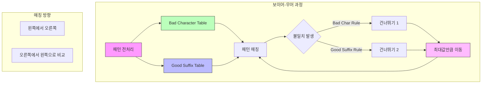

# 보이어-무어 (Boyer-Moore) 알고리즘

* 개념
    * **보이어-무어**는 문자열 패턴 매칭에서 가장 효율적인 알고리즘 중 하나입니다.
    * 특징:
        - 오른쪽에서 왼쪽으로 비교
        - Bad Character Rule 사용
        - Good Suffix Rule 사용
        - 실제 텍스트 에디터에서 많이 사용

* 핵심 구성 요소
    1. Bad Character Rule
        - 불일치 문자를 이용한 건너뛰기
        - 마지막으로 등장한 위치 정보 활용
        - 알파벳 크기만큼의 테이블 필요

    2. Good Suffix Rule
        - 일치했던 접미사 정보 활용
        - 접미사 테이블 구축 필요
        - 더 긴 이동 거리 제공

* 기본 구현
    ```python
    class BoyerMoore:
        def __init__(self, pattern):
            self.pattern = pattern
            self.pattern_length = len(pattern)
            
            # Bad Character Rule 테이블 생성
            self.bad_char = self._build_bad_char_table()
            
            # Good Suffix Rule 테이블 생성
            self.good_suffix = self._build_good_suffix_table()
            
        def _build_bad_char_table(self):
            """Bad Character Rule 테이블 생성"""
            # 256은 ASCII 문자 범위
            bad_char = [-1] * 256
            
            # 패턴의 각 문자의 마지막 등장 위치 저장
            for i in range(self.pattern_length):
                bad_char[ord(self.pattern[i])] = i
                
            return bad_char
        
        def _build_good_suffix_table(self):
            """Good Suffix Rule 테이블 생성"""
            m = self.pattern_length
            good_suffix = [0] * (m + 1)
            
            # 보조 배열 생성
            suffix = self._build_suffix_array()
            
            # Case 1: 일치하는 접미사가 없는 경우
            j = 0
            for i in range(m - 1, -1, -1):
                if suffix[i] == i + 1:
                    while j < m - 1 - i:
                        if good_suffix[j] == 0:
                            good_suffix[j] = m - 1 - i
                        j += 1
            
            # Case 2: 일치하는 접미사가 있는 경우
            for i in range(m - 1):
                good_suffix[m - 1 - suffix[i]] = m - 1 - i
                
            return good_suffix
        
        def _build_suffix_array(self):
            """접미사 배열 생성"""
            m = self.pattern_length
            suffix = [0] * m
            suffix[m - 1] = m
            
            g = m - 1
            f = 0
            
            for i in range(m - 2, -1, -1):
                if i > g and suffix[i + m - 1 - f] < i - g:
                    suffix[i] = suffix[i + m - 1 - f]
                else:
                    if i < g:
                        g = i
                    f = i
                    while (g >= 0 and 
                           self.pattern[g] == self.pattern[g + m - 1 - f]):
                        g -= 1
                    suffix[i] = f - g
                    
            return suffix
        
        def search(self, text):
            """패턴 매칭 수행"""
            n = len(text)
            m = self.pattern_length
            matches = []
            
            if m == 0:
                return matches
            
            i = 0  # 텍스트에서의 위치
            while i <= n - m:
                j = m - 1  # 패턴에서의 위치
                
                # 오른쪽에서 왼쪽으로 비교
                while j >= 0 and self.pattern[j] == text[i + j]:
                    j -= 1
                
                if j < 0:  # 패턴을 찾은 경우
                    matches.append(i)
                    i += self.good_suffix[0] if m > 1 else 1
                else:
                    # Bad Character Rule과 Good Suffix Rule 중 
                    # 더 큰 값만큼 이동
                    bc_skip = j - self.bad_char[ord(text[i + j])]
                    gs_skip = self.good_suffix[j]
                    i += max(bc_skip, gs_skip)
                    
            return matches
    ```

* 최적화된 구현 (Bad Character Rule만 사용)
    ```python
    class SimplifiedBoyerMoore:
        def __init__(self, pattern):
            self.pattern = pattern
            self.bad_char = self._build_bad_char_table()
            
        def _build_bad_char_table(self):
            """최적화된 Bad Character 테이블"""
            # 딕셔너리 사용으로 메모리 최적화
            bad_char = {}
            
            for i in range(len(self.pattern)):
                bad_char[self.pattern[i]] = i
                
            return bad_char
        
        def search(self, text):
            """간소화된 검색"""
            matches = []
            m = len(self.pattern)
            n = len(text)
            
            i = 0
            while i <= n - m:
                j = m - 1
                
                while j >= 0 and self.pattern[j] == text[i + j]:
                    j -= 1
                
                if j < 0:
                    matches.append(i)
                    i += 1
                else:
                    # Bad Character Rule만 사용
                    skip = j - self.bad_char.get(text[i + j], -1)
                    i += max(1, skip)
                    
            return matches
    ```

* 시간 복잡도
    |연산|평균|최악|
    |---|-----|-----|
    |전처리|O(m + σ)|O(m + σ)|
    |검색|O(n/m)|O(nm)|

    * n: 텍스트 길이
    * m: 패턴 길이
    * σ: 알파벳 크기

* 공간 복잡도
    - O(σ): Bad Character Rule 테이블
    - O(m): Good Suffix Rule 테이블

* 장단점
    1. 장점
        - 실제 상황에서 매우 효율적
        - 긴 패턴에서 더욱 효과적
        - 서브리니어 시간 가능
        - 실용적인 구현 가능

    2. 단점
        - 구현이 복잡
        - 짧은 패턴에서는 오버헤드
        - 전처리 시간 필요
        - 추가 메모리 사용

* 활용 예시
    1. 텍스트 에디터 검색
        ```python
        class TextEditor:
            def __init__(self):
                self.text = ""
                self.search_engine = None
                
            def find_all(self, pattern, case_sensitive=True):
                """대소문자 구분 옵션이 있는 검색"""
                search_text = self.text
                search_pattern = pattern
                
                if not case_sensitive:
                    search_text = search_text.lower()
                    search_pattern = pattern.lower()
                    
                self.search_engine = BoyerMoore(search_pattern)
                return self.search_engine.search(search_text)
        ```

    2. 멀티패턴 검색
        ```python
        class MultiPatternBoyerMoore:
            def __init__(self, patterns):
                self.patterns = patterns
                self.engines = {
                    pattern: BoyerMoore(pattern) 
                    for pattern in patterns
                }
                
            def search_all(self, text):
                """여러 패턴 동시 검색"""
                results = {}
                for pattern, engine in self.engines.items():
                    matches = engine.search(text)
                    if matches:
                        results[pattern] = matches
                return results
        ```

* 최적화 기법
    1. 5-gram 최적화
        ```python
        def optimize_for_long_patterns(self):
            """긴 패턴을 위한 최적화"""
            if len(self.pattern) >= 5:
                # 5글자 단위로 건너뛰기 테이블 생성
                self.skip_table = {}
                for i in range(len(self.pattern) - 4):
                    gram = self.pattern[i:i + 5]
                    if gram not in self.skip_table:
                        self.skip_table[gram] = len(self.pattern) - i - 5
        ```

    2. 메모리 최적화
        ```python
        def build_compact_tables(self):
            """메모리 효율적인 테이블 구축"""
            # 실제 사용된 문자만 저장
            self.bad_char = {}
            # 필요한 접미사 정보만 저장
            self.good_suffix = []
            
            # 구현...
        ```

* 마무리
    - 보이어-무어는 실용적이고 효율적인 문자열 검색 알고리즘
    - 실제 많은 텍스트 에디터에서 사용
    - 긴 패턴에서 특히 효과적
    - Bad Character Rule과 Good Suffix Rule의 조합이 핵심

