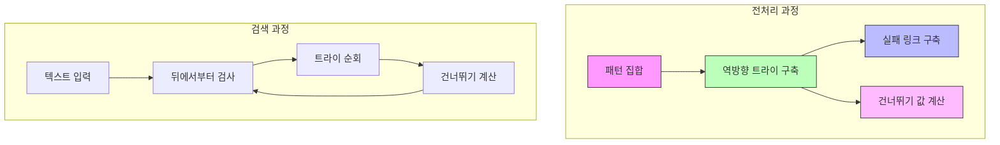

# Commentz-Walter 알고리즘

* 개념
    * **Commentz-Walter**는 다중 패턴 매칭을 위한 하이브리드 알고리즘입니다.
    * 특징:
        - Aho-Corasick의 트라이 구조 활용
        - Boyer-Moore의 뒤에서부터 검사 방식 적용
        - 효율적인 건너뛰기 규칙
        - 실패 함수 최적화

* 핵심 구성 요소
    1. 역방향 트라이
        - 패턴들을 역순으로 저장
        - 공통 접미사 공유
        - 실패 링크 구축

    2. 건너뛰기 함수
        - Boyer-Moore 스타일의 이동 규칙
        - 패턴 집합 전체 고려
        - 최대 이동량 계산

* 기본 구현
    ```python
    class CommentzWalter:
        class Node:
            def __init__(self):
                self.children = {}
                self.fail = None
                self.output = []
                self.shift = 0
                
        def __init__(self, patterns):
            self.patterns = patterns
            self.root = self.Node()
            self.build_reversed_trie()
            self.build_shifts()
            self.build_failure_links()
            
        def build_reversed_trie(self):
            """역방향 트라이 구축"""
            for i, pattern in enumerate(self.patterns):
                node = self.root
                # 패턴을 역순으로 삽입
                for char in reversed(pattern):
                    if char not in node.children:
                        node.children[char] = self.Node()
                    node = node.children[char]
                node.output.append((pattern, i))
                
        def build_shifts(self):
            """건너뛰기 값 계산"""
            min_length = min(len(p) for p in self.patterns)
            
            # 각 노드의 shift 값 초기화
            def init_shifts(node, depth):
                node.shift = min_length - depth
                for child in node.children.values():
                    init_shifts(child, depth + 1)
                    
            init_shifts(self.root, 0)
            
        def build_failure_links(self):
            """실패 링크 구축"""
            queue = deque()
            
            # 루트의 자식들의 실패 링크는 루트를 가리킴
            for child in self.root.children.values():
                child.fail = self.root
                queue.append(child)
                
            while queue:
                current = queue.popleft()
                
                for char, child in current.children.items():
                    queue.append(child)
                    failure = current.fail
                    
                    while failure is not None and char not in failure.children:
                        failure = failure.fail
                        
                    child.fail = failure.children.get(char, self.root) if failure else self.root
                    # shift 값 업데이트
                    child.shift = min(child.shift, child.fail.shift)
                    
        def search(self, text):
            """패턴 검색 수행"""
            matches = []
            pos = len(text)
            
            while pos > 0:
                node = self.root
                shift = node.shift
                j = 0
                
                while pos - j > 0:
                    char = text[pos - j - 1]
                    
                    if char not in node.children:
                        break
                        
                    node = node.children[char]
                    j += 1
                    shift = min(shift, node.shift)
                    
                    # 매칭된 패턴 확인
                    for pattern, pattern_idx in node.output:
                        if j == len(pattern):
                            matches.append((pos - j, pattern_idx))
                            
                pos -= max(1, shift)
                
            return sorted(matches)
    ```

* 최적화된 구현
    ```python
    class OptimizedCommentzWalter:
        def __init__(self, patterns):
            self.patterns = patterns
            self.max_length = max(len(p) for p in self.patterns)
            self.min_length = min(len(p) for p in self.patterns)
            self.build_tables()
            
        def build_tables(self):
            """최적화된 테이블 구축"""
            # 마지막 문자 기반 건너뛰기 테이블
            self.last_char_shift = {}
            
            # 접미사 기반 건너뛰기 테이블
            self.suffix_shift = {}
            
            for pattern in self.patterns:
                # 마지막 문자 처리
                last = pattern[-1]
                self.last_char_shift[last] = min(
                    self.last_char_shift.get(last, self.max_length),
                    len(pattern)
                )
                
                # 접미사 처리
                for i in range(len(pattern)):
                    suffix = pattern[-(i+1):]
                    if suffix not in self.suffix_shift:
                        self.suffix_shift[suffix] = self.max_length - i
                        
        def search(self, text):
            """최적화된 검색"""
            matches = []
            pos = len(text)
            
            while pos > self.min_length:
                char = text[pos - 1]
                shift = self.last_char_shift.get(char, self.max_length)
                
                # 마지막 문자가 일치하면 패턴 검사
                if shift < self.max_length:
                    for pattern in self.patterns:
                        if len(pattern) <= pos and \
                           text[pos - len(pattern):pos] == pattern:
                            matches.append(pos - len(pattern))
                            
                pos -= max(1, shift)
                
            return sorted(matches)
    ```

* 시간 복잡도
    |연산|복잡도|설명|
    |---|------|-----|
    |전처리|O(m)|m은 모든 패턴 길이의 합|
    |검색|O(n)|n은 텍스트 길이|
    |최악|O(nm)|m은 가장 긴 패턴의 길이|

* 공간 복잡도
    - O(m): 트라이 구조와 테이블 저장

* 장단점
    1. 장점
        - 다중 패턴 매칭에 효율적
        - Boyer-Moore의 건너뛰기 활용
        - 공통 접미사 공유
        - 실제 데이터에서 좋은 성능

    2. 단점
        - 구현이 매우 복잡
        - 메모리 사용량이 큼
        - 짧은 패턴에서는 비효율적
        - 전처리 시간이 김

* 활용 예시
    1. 바이러스 시그니처 검사
        ```python
        class VirusScanner:
            def __init__(self, signatures):
                self.matcher = CommentzWalter(signatures)
                
            def scan_file(self, filename):
                """파일 스캔"""
                matches = []
                buffer_size = 1024 * 1024  # 1MB
                
                with open(filename, 'rb') as f:
                    while True:
                        buffer = f.read(buffer_size)
                        if not buffer:
                            break
                            
                        # 시그니처 검사
                        current_matches = self.matcher.search(buffer)
                        matches.extend(current_matches)
                        
                return matches
        ```

    2. 네트워크 패킷 검사
        ```python
        class PacketInspector:
            def __init__(self, patterns):
                self.matcher = OptimizedCommentzWalter(patterns)
                
            def inspect_packet(self, packet_data):
                """패킷 검사"""
                matches = self.matcher.search(packet_data)
                return [
                    (pos, self.patterns[idx])
                    for pos, idx in matches
                ]
        ```

* 최적화 전략
    1. 메모리 최적화
        ```python
        class MemoryEfficientCW:
            def __init__(self, patterns):
                # 공통 접미사 압축
                self.compressed_patterns = self._compress_patterns(patterns)
                self.matcher = CommentzWalter(self.compressed_patterns)
                
            def _compress_patterns(self, patterns):
                """공통 접미사 압축"""
                result = set()
                for pattern in patterns:
                    compressed = self._compress_single(pattern)
                    result.add(compressed)
                return list(result)
                
            def _compress_single(self, pattern):
                """단일 패턴 압축"""
                # 구현...
                pass
        ```

    2. 캐시 최적화
        ```python
        class CacheOptimizedCW:
            def __init__(self, patterns):
                self.block_size = 64  # 캐시 라인 크기
                self.matcher = CommentzWalter(patterns)
                
            def search(self, text):
                """캐시 효율적 검색"""
                matches = []
                n = len(text)
                
                # 블록 단위로 처리
                for i in range(0, n, self.block_size):
                    end = min(i + self.block_size, n)
                    block_matches = self.matcher.search(text[i:end])
                    matches.extend(
                        (pos + i, idx) for pos, idx in block_matches
                    )
                    
                return matches
        ```

* 마무리
    - Commentz-Walter는 강력한 다중 패턴 매칭 알고리즘
    - Boyer-Moore와 Aho-Corasick의 장점 결합
    - 구현은 복잡하지만 성능이 우수
    - 실제 보안 시스템 등에서 활용

