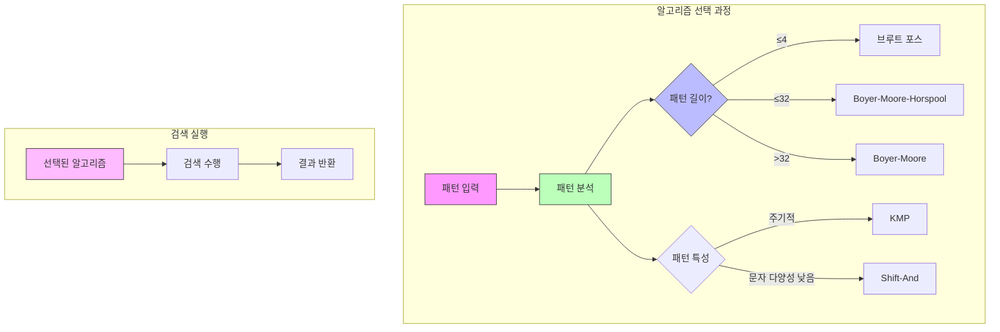

# Hybrid Pattern Matching

* 개념
    * **Hybrid Pattern Matching**은 패턴의 특성에 따라 적절한 알고리즘을 선택하는 적응형 문자열 검색 방식입니다.
    * 특징:
        - 패턴 길이와 특성에 따른 알고리즘 선택
        - 여러 알고리즘의 장점 활용
        - 동적 전환 가능
        - 상황별 최적화

* 기본 전략
    1. 짧은 패턴 (length ≤ 4)
        - 브루트 포스 또는 Shift-And
        - 간단하고 오버헤드가 적음

    2. 중간 길이 패턴 (4 < length ≤ 32)
        - Boyer-Moore-Horspool
        - 간단한 건너뛰기 테이블

    3. 긴 패턴 (length > 32)
        - Boyer-Moore
        - 두 개의 건너뛰기 테이블 활용

* 기본 구현
    ```python
    class HybridPatternMatcher:
        def __init__(self, pattern):
            self.pattern = pattern
            self.length = len(pattern)
            self.matcher = self._select_matcher()
            
        def _select_matcher(self):
            """패턴 길이에 따른 알고리즘 선택"""
            if self.length <= 4:
                return BruteForce(self.pattern)
            elif self.length <= 32:
                return BoyerMooreHorspool(self.pattern)
            else:
                return BoyerMoore(self.pattern)
                
        def search(self, text):
            """패턴 검색 수행"""
            return self.matcher.search(text)
            
    class BruteForce:
        def __init__(self, pattern):
            self.pattern = pattern
            self.length = len(pattern)
            
        def search(self, text):
            """브루트 포스 검색"""
            matches = []
            n = len(text)
            
            for i in range(n - self.length + 1):
                if text[i:i + self.length] == self.pattern:
                    matches.append(i)
                    
            return matches
            
    class BoyerMooreHorspool:
        def __init__(self, pattern):
            self.pattern = pattern
            self.length = len(pattern)
            self.skip = self._build_skip_table()
            
        def _build_skip_table(self):
            """단순화된 건너뛰기 테이블"""
            skip = {}
            for i in range(self.length - 1):
                skip[self.pattern[i]] = self.length - 1 - i
            return skip
            
        def search(self, text):
            """Horspool 변형 검색"""
            matches = []
            n = len(text)
            
            i = 0
            while i <= n - self.length:
                j = self.length - 1
                while j >= 0 and text[i + j] == self.pattern[j]:
                    j -= 1
                    
                if j < 0:
                    matches.append(i)
                    i += 1
                else:
                    i += self.skip.get(text[i + self.length - 1], self.length)
                    
            return matches
    ```

* 최적화된 구현
    ```python
    class OptimizedHybridMatcher:
        def __init__(self, pattern):
            self.pattern = pattern
            self.length = len(pattern)
            # 패턴 분석
            self.characteristics = self._analyze_pattern()
            self.matcher = self._select_optimal_matcher()
            
        def _analyze_pattern(self):
            """패턴 특성 분석"""
            chars = set(self.pattern)
            return {
                'length': self.length,
                'unique_chars': len(chars),
                'periodic': self._is_periodic(),
                'char_distribution': self._char_distribution()
            }
            
        def _is_periodic(self):
            """패턴의 주기성 검사"""
            if self.length <= 1:
                return False
                
            for i in range(1, self.length // 2 + 1):
                if self.pattern[:i] * (self.length // i) == self.pattern[:-(self.length % i) or None]:
                    return True
            return False
            
        def _char_distribution(self):
            """문자 분포 분석"""
            dist = {}
            for c in self.pattern:
                dist[c] = dist.get(c, 0) + 1
            return dist
            
        def _select_optimal_matcher(self):
            """특성 기반 최적 알고리즘 선택"""
            if self.length <= 4:
                return BruteForce(self.pattern)
                
            if self.characteristics['periodic']:
                return KMP(self.pattern)
                
            if self.characteristics['unique_chars'] < self.length * 0.1:
                # 문자 종류가 적으면 Boyer-Moore-Horspool
                return BoyerMooreHorspool(self.pattern)
                
            # 기본적으로 Boyer-Moore
            return BoyerMoore(self.pattern)
    ```

* SIMD 최적화 버전
    ```python
    class SIMDHybridMatcher:
        def __init__(self, pattern):
            self.pattern = pattern
            self.length = len(pattern)
            self.has_simd = self._check_simd_support()
            
        def _check_simd_support(self):
            """SIMD 지원 여부 확인"""
            try:
                import numpy as np
                return True
            except ImportError:
                return False
                
        def search(self, text):
            """SIMD 최적화된 검색"""
            if self.has_simd and self.length >= 16:
                return self._simd_search(text)
            else:
                return self._regular_search(text)
                
        def _simd_search(self, text):
            """SIMD 명령어를 활용한 검색"""
            import numpy as np
            
            n = len(text)
            matches = []
            
            # 16바이트 단위로 비교
            text_array = np.frombuffer(text.encode(), dtype=np.uint8)
            pattern_array = np.frombuffer(self.pattern.encode(), dtype=np.uint8)
            
            for i in range(0, n - self.length + 1, 16):
                # SIMD 비교
                chunk = text_array[i:i + 16]
                if np.array_equal(chunk[:self.length], pattern_array):
                    matches.append(i)
                    
            return matches
    ```

* 시간 복잡도
    |알고리즘|짧은 패턴|중간 패턴|긴 패턴|
    |--------|---------|---------|--------|
    |최선|O(n)|O(n/m)|O(n/m)|
    |평균|O(n)|O(n)|O(n)|
    |최악|O(nm)|O(nm)|O(nm)|

* 장단점
    1. 장점
        - 상황별 최적 성능
        - 다양한 패턴에 효과적
        - 리소스 효율적 사용
        - 확장성이 좋음

    2. 단점
        - 구현 복잡도 높음
        - 알고리즘 전환 오버헤드
        - 메모리 사용량 증가
        - 성능 예측이 어려움

* 활용 예시
    1. 텍스트 에디터
        ```python
        class SmartTextSearch:
            def __init__(self):
                self.cache = {}  # 패턴별 매처 캐시
                
            def find_all(self, text, pattern):
                """캐시를 활용한 스마트 검색"""
                if pattern not in self.cache:
                    self.cache[pattern] = HybridPatternMatcher(pattern)
                    
                return self.cache[pattern].search(text)
                
            def clear_cache(self):
                """캐시 정리"""
                self.cache.clear()
        ```

    2. 로그 분석
        ```python
        class LogAnalyzer:
            def __init__(self, patterns):
                self.matchers = {
                    pattern: OptimizedHybridMatcher(pattern)
                    for pattern in patterns
                }
                
            def analyze_log(self, log_file):
                """로그 파일에서 여러 패턴 검색"""
                matches = {pattern: [] for pattern in self.matchers}
                
                with open(log_file, 'r') as f:
                    for line_num, line in enumerate(f, 1):
                        for pattern, matcher in self.matchers.items():
                            if matcher.search(line):
                                matches[pattern].append(line_num)
                                
                return matches
        ```

* 최적화 전략
    1. 알고리즘 선택 기준
        ```python
        def select_algorithm(pattern):
            """상세한 알고리즘 선택 로직"""
            length = len(pattern)
            unique_chars = len(set(pattern))
            
            if length <= 4:
                return 'brute_force'
                
            if length <= 32:
                if unique_chars < length * 0.2:
                    return 'shift_and'
                return 'horspool'
                
            if unique_chars > length * 0.8:
                return 'boyer_moore'
                
            return 'kmp'
        ```

    2. 캐시 최적화
        ```python
        class CacheOptimizedMatcher:
            def __init__(self, pattern):
                self.pattern = pattern
                self.cache_size = 1024 * 1024  # 1MB
                self.cache = {}
                
            def search(self, text):
                """캐시를 활용한 검색"""
                matches = []
                n = len(text)
                
                # 청크 단위로 처리
                for i in range(0, n, self.cache_size):
                    chunk = text[i:i + self.cache_size]
                    if chunk in self.cache:
                        chunk_matches = self.cache[chunk]
                    else:
                        chunk_matches = self._search_chunk(chunk)
                        self.cache[chunk] = chunk_matches
                        
                    matches.extend(m + i for m in chunk_matches)
                    
                return matches
        ```

* 마무리
    - Hybrid Pattern Matching은 적응형 문자열 검색 전략
    - 패턴 특성에 따른 최적 알고리즘 선택
    - 다양한 최적화 기법 적용 가능
    - 실제 응용에서 효율적인 성능 제공

