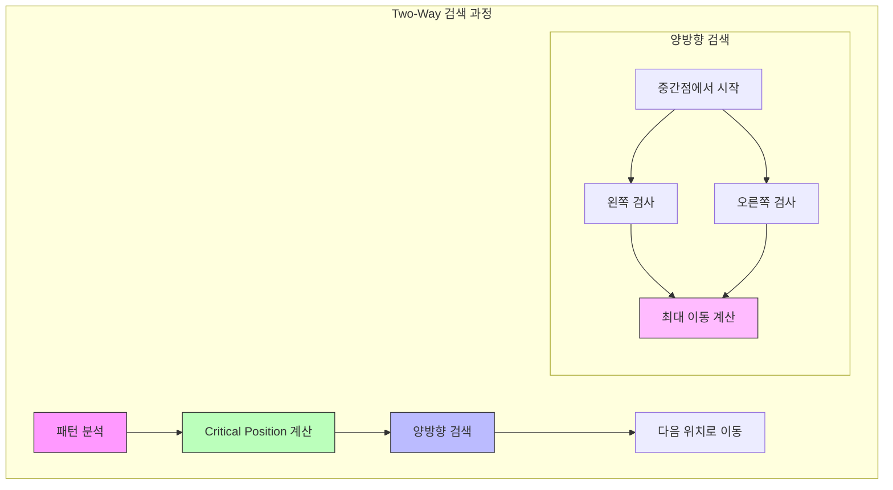

# Two-Way String Matching 알고리즘

* 개념
    * **Two-Way String Matching**은 양방향 문자열 검색을 수행하는 하이브리드 알고리즘입니다.
    * 특징:
        - 패턴을 두 부분으로 분할하여 검사
        - 왼쪽과 오른쪽에서 동시에 검색
        - Critical Factorization 사용
        - Boyer-Moore와 KMP의 장점 결합

* 핵심 구성 요소
    1. Critical Factorization
        - 패턴을 두 부분으로 최적 분할
        - 주기성을 고려한 분할점 선택
        - 효율적인 건너뛰기 보장

    2. 양방향 검색
        - 분할점을 기준으로 양쪽 검사
        - 불일치 발생 시 최대 이동
        - 병렬 처리 가능성

* 기본 구현
    ```python
    class TwoWayStringMatch:
        def __init__(self, pattern):
            self.pattern = pattern
            self.length = len(pattern)
            # Critical Factorization 계산
            self.critical_pos = self._compute_critical_pos()
            
        def _compute_critical_pos(self):
            """Critical Position 계산"""
            # 패턴의 주기성 분석
            period = self._compute_period()
            
            # 주기를 고려한 분할점 선택
            pos = min(period, (self.length + 1) // 2)
            return pos
        
        def _compute_period(self):
            """패턴의 최소 주기 계산"""
            z = [0] * self.length
            z[0] = self.length
            
            l = r = 0
            for i in range(1, self.length):
                if i <= r:
                    z[i] = min(r - i + 1, z[i - l])
                
                while i + z[i] < self.length and \
                      self.pattern[z[i]] == self.pattern[i + z[i]]:
                    z[i] += 1
                    
                if i + z[i] - 1 > r:
                    l = i
                    r = i + z[i] - 1
                    
            # 최소 주기 찾기
            for i in range(1, self.length):
                if i + z[i] == self.length:
                    return i
            return self.length
            
        def search(self, text):
            """양방향 검색 수행"""
            if not self.pattern:
                return []
                
            matches = []
            n = len(text)
            
            pos = 0
            while pos <= n - self.length:
                # 중간부터 양방향 검사
                i = self.critical_pos
                j = self.critical_pos - 1
                
                # 오른쪽 방향 검사
                while i < self.length and \
                      text[pos + i] == self.pattern[i]:
                    i += 1
                    
                # 왼쪽 방향 검사
                while j >= 0 and \
                      text[pos + j] == self.pattern[j]:
                    j -= 1
                    
                # 패턴 발견
                if i == self.length and j == -1:
                    matches.append(pos)
                    pos += 1
                else:
                    # 최대 이동량 계산
                    if i < self.length:
                        pos += max(1, i - self.critical_pos)
                    else:
                        pos += max(1, j - self.critical_pos + 2)
                    
            return matches
    ```

* 최적화된 구현
    ```python
    class OptimizedTwoWay:
        def __init__(self, pattern):
            self.pattern = pattern
            self.length = len(pattern)
            self.critical_pos = self._compute_critical_pos()
            # 건너뛰기 테이블 추가
            self.skip = self._build_skip_table()
            
        def _build_skip_table(self):
            """Boyer-Moore 스타일의 건너뛰기 테이블"""
            skip = {}
            for i in range(self.length):
                skip[self.pattern[i]] = self.length - i - 1
            return skip
            
        def search(self, text):
            """최적화된 양방향 검색"""
            matches = []
            n = len(text)
            pos = 0
            
            while pos <= n - self.length:
                # 먼저 마지막 문자 확인 (Boyer-Moore 스타일)
                if text[pos + self.length - 1] == self.pattern[-1]:
                    # 양방향 검사 수행
                    match = True
                    i = self.critical_pos
                    j = self.critical_pos - 1
                    
                    # 오른쪽 검사
                    while i < self.length - 1 and match:
                        if text[pos + i] != self.pattern[i]:
                            match = False
                        i += 1
                        
                    # 왼쪽 검사
                    while j >= 0 and match:
                        if text[pos + j] != self.pattern[j]:
                            match = False
                        j -= 1
                        
                    if match:
                        matches.append(pos)
                        
                # 건너뛰기 계산
                skip_dist = self.skip.get(text[pos + self.length - 1], 
                                        self.length)
                pos += max(1, skip_dist)
            
            return matches
    ```

* 시간 복잡도
    |케이스|복잡도|설명|
    |------|------|-----|
    |최선|O(n/m)|m은 패턴 길이|
    |평균|O(n/m)|실제로 매우 효율적|
    |최악|O(n)|드문 경우|

* 공간 복잡도
    - O(m): 패턴 분석 및 건너뛰기 테이블

* 장단점
    1. 장점
        - 효율적인 건너뛰기
        - 양방향 검사로 불일치 빠른 발견
        - Boyer-Moore의 장점 활용
        - 실제 데이터에서 좋은 성능

    2. 단점
        - 구현 복잡도 높음
        - Critical Factorization 계산 필요
        - 짧은 패턴에서는 오버헤드
        - 추가 메모리 필요

* 활용 예시
    1. 텍스트 에디터 검색
        ```python
        class TextSearch:
            def __init__(self):
                self.searcher = None
                
            def find_all(self, text, pattern, case_sensitive=True):
                """대소문자 구분 옵션이 있는 검색"""
                if not case_sensitive:
                    text = text.lower()
                    pattern = pattern.lower()
                    
                self.searcher = TwoWayStringMatch(pattern)
                return self.searcher.search(text)
        ```

    2. 바이너리 파일 검색
        ```python
        def search_binary_file(filename, pattern):
            """바이너리 파일에서 패턴 검색"""
            searcher = OptimizedTwoWay(pattern)
            matches = []
            
            with open(filename, 'rb') as f:
                chunk_size = 1024 * 1024  # 1MB
                overlap = len(pattern) - 1
                
                prev_chunk = b''
                pos = 0
                
                while True:
                    chunk = f.read(chunk_size)
                    if not chunk:
                        break
                        
                    # 청크 연결
                    search_text = prev_chunk[-overlap:] + chunk
                    chunk_matches = searcher.search(search_text)
                    
                    # 위치 조정
                    matches.extend(m + pos - overlap 
                                 for m in chunk_matches 
                                 if m >= overlap)
                    
                    prev_chunk = chunk
                    pos += len(chunk)
                    
            return matches
        ```

* 최적화 전략
    1. 병렬 처리
        ```python
        from concurrent.futures import ThreadPoolExecutor
        
        def parallel_search(text, pattern, num_threads=4):
            """병렬 처리를 통한 검색"""
            searcher = TwoWayStringMatch(pattern)
            chunk_size = len(text) // num_threads
            
            def search_chunk(start, end):
                # 청크 크기 조정 (패턴 길이 고려)
                adjusted_start = max(0, start - len(pattern) + 1)
                local_matches = searcher.search(text[adjusted_start:end])
                return [m + adjusted_start for m in local_matches]
            
            with ThreadPoolExecutor(max_workers=num_threads) as executor:
                futures = []
                for i in range(num_threads):
                    start = i * chunk_size
                    end = start + chunk_size if i < num_threads - 1 else len(text)
                    futures.append(executor.submit(search_chunk, start, end))
                    
                matches = []
                for future in futures:
                    matches.extend(future.result())
                    
            return sorted(matches)
        ```

    2. SIMD 최적화
        ```python
        def compare_blocks(text, pattern, pos, length):
            """SIMD를 활용한 블록 비교"""
            # 실제로는 C/C++에서 SIMD 명령어 사용
            block_size = 16  # SSE 레지스터 크기
            
            for i in range(0, length, block_size):
                # 블록 단위 비교
                block_end = min(i + block_size, length)
                if text[pos + i:pos + block_end] != \
                   pattern[i:block_end]:
                    # 불일치 위치 찾기
                    for j in range(block_size):
                        if text[pos + i + j] != pattern[i + j]:
                            return i + j
            return length
        ```

* 마무리
    - Two-Way String Matching은 효율적인 하이브리드 문자열 검색 알고리즘
    - Boyer-Moore와 KMP의 장점을 결합
    - 양방향 검사로 더 빠른 불일치 발견
    - 실제 응용에서 좋은 성능 제공

