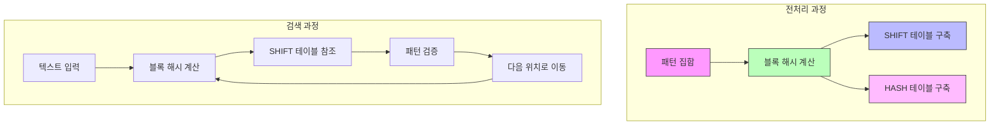

# Wu-Manber 알고리즘

* 개념
    * **Wu-Manber**는 다중 패턴 매칭을 위한 효율적인 알고리즘입니다.
    * 특징:
        - 블록 단위 처리
        - 해시 기반 접근
        - Boyer-Moore의 아이디어 확장
        - 효율적인 건너뛰기 규칙

* 핵심 구성 요소
    1. 블록 해시
        - B 길이의 블록 단위로 해시
        - 일반적으로 B=2 또는 3
        - 해시 충돌 최소화

    2. 건너뛰기 테이블
        - SHIFT: 블록 기반 건너뛰기
        - HASH: 패턴 해시 테이블
        - PREFIX: 패턴 접두사 테이블

* 기본 구현
    ```python
    class WuManber:
        def __init__(self, patterns, block_size=2):
            self.patterns = patterns
            self.block_size = block_size
            self.min_length = min(len(p) for p in patterns)
            self.max_length = max(len(p) for p in patterns)
            
            # 테이블 초기화
            self.shift = {}
            self.hash = {}
            self.prefix = {}
            
            self._build_tables()
            
        def _build_tables(self):
            """테이블 구축"""
            # SHIFT 테이블 초기화
            self.shift = defaultdict(
                lambda: self.min_length - self.block_size + 1
            )
            
            # 각 패턴에 대해 처리
            for i, pattern in enumerate(self.patterns):
                # 모든 가능한 블록에 대해
                for j in range(len(pattern) - self.block_size + 1):
                    block = pattern[j:j + self.block_size]
                    block_hash = self._hash_block(block)
                    
                    # SHIFT 테이블 갱신
                    shift = self.min_length - j - self.block_size
                    if shift > 0:
                        self.shift[block_hash] = min(
                            self.shift[block_hash], 
                            shift
                        )
                        
                    # 마지막 블록이면 패턴 정보 저장
                    if j == len(pattern) - self.block_size:
                        if block_hash not in self.hash:
                            self.hash[block_hash] = []
                        self.hash[block_hash].append(i)
                        
                        prefix = pattern[:self.block_size]
                        prefix_hash = self._hash_block(prefix)
                        self.prefix[i] = prefix_hash
                        
        def _hash_block(self, block):
            """블록의 해시값 계산"""
            result = 0
            for c in block:
                result = (result * 31 + ord(c)) & 0xFFFFFFFF
            return result
            
        def search(self, text):
            """패턴 검색 수행"""
            matches = []
            n = len(text)
            pos = self.min_length - 1
            
            while pos < n:
                # 현재 위치의 블록 해시
                block = text[pos - self.block_size + 1:pos + 1]
                block_hash = self._hash_block(block)
                
                # 이동량 확인
                shift = self.shift[block_hash]
                if shift > 0:
                    pos += shift
                    continue
                    
                # 해시 테이블에서 패턴 확인
                if block_hash in self.hash:
                    for pattern_idx in self.hash[block_hash]:
                        pattern = self.patterns[pattern_idx]
                        start = pos - len(pattern) + 1
                        
                        if start >= 0 and \
                           text[start:start + len(pattern)] == pattern:
                            matches.append((start, pattern_idx))
                            
                pos += 1
                
            return sorted(matches)
    ```

* 최적화된 구현
    ```python
    class OptimizedWuManber:
        def __init__(self, patterns, block_size=2):
            self.patterns = patterns
            self.block_size = block_size
            self.min_length = min(len(p) for p in patterns)
            
            # 비트마스크를 활용한 최적화
            self.pattern_masks = {}
            self.shift = array.array('I')  # 정수 배열 사용
            self._build_optimized_tables()
            
        def _build_optimized_tables(self):
            """최적화된 테이블 구축"""
            # 해시 테이블 크기 최적화
            table_size = 1 << 16  # 65536
            self.shift = array.array('I', 
                [self.min_length - self.block_size + 1] * table_size)
            
            # 패턴별 비트마스크 생성
            for i, pattern in enumerate(self.patterns):
                mask = 1 << i
                for j in range(len(pattern) - self.block_size + 1):
                    block = pattern[j:j + self.block_size]
                    block_hash = self._fast_hash(block) % table_size
                    
                    shift = self.min_length - j - self.block_size
                    if shift > 0:
                        self.shift[block_hash] = min(
                            self.shift[block_hash], 
                            shift
                        )
                        
                    if j == len(pattern) - self.block_size:
                        if block_hash not in self.pattern_masks:
                            self.pattern_masks[block_hash] = 0
                        self.pattern_masks[block_hash] |= mask
                        
        def _fast_hash(self, block):
            """최적화된 해시 함수"""
            result = 0
            for c in block:
                result = ((result << 5) + result + ord(c)) & 0xFFFFFFFF
            return result
    ```

* 시간 복잡도
    |연산|복잡도|설명|
    |---|------|-----|
    |전처리|O(N)|N은 모든 패턴 길이의 합|
    |검색|O(n)|n은 텍스트 길이|
    |최악|O(nm)|m은 패턴의 총 길이|

* 공간 복잡도
    - O(k): k는 해시 테이블 크기

* 장단점
    1. 장점
        - 다중 패턴에 효율적
        - 실제 데이터에서 좋은 성능
        - 메모리 사용 효율적
        - 블록 단위 처리로 캐시 친화적

    2. 단점
        - 짧은 패턴에서 오버헤드
        - 해시 충돌 가능성
        - 전처리 비용
        - 블록 크기 선택 중요

* 활용 예시
    1. 악성코드 탐지
        ```python
        class MalwareScanner:
            def __init__(self, signatures):
                self.matcher = OptimizedWuManber(signatures)
                
            def scan_file(self, filename, chunk_size=1024*1024):
                """파일 스캔"""
                matches = []
                
                with open(filename, 'rb') as f:
                    pos = 0
                    while True:
                        chunk = f.read(chunk_size)
                        if not chunk:
                            break
                            
                        chunk_matches = self.matcher.search(chunk)
                        matches.extend(
                            (m[0] + pos, m[1]) 
                            for m in chunk_matches
                        )
                        pos += len(chunk)
                        
                return matches
        ```

    2. 네트워크 패킷 필터링
        ```python
        class PacketFilter:
            def __init__(self, patterns):
                self.matcher = WuManber(patterns, block_size=3)
                
            def process_packet(self, packet_data):
                """패킷 검사"""
                matches = self.matcher.search(packet_data)
                return [
                    self.patterns[idx] for _, idx in matches
                ]
        ```

* 최적화 전략
    1. 병렬 처리
        ```python
        from concurrent.futures import ThreadPoolExecutor
        
        def parallel_search(text, patterns, num_threads=4):
            """병렬 처리를 통한 검색"""
            matcher = WuManber(patterns)
            chunk_size = len(text) // num_threads
            
            with ThreadPoolExecutor(max_workers=num_threads) as executor:
                futures = []
                for i in range(num_threads):
                    start = i * chunk_size
                    end = start + chunk_size if i < num_threads - 1 \
                          else len(text)
                    futures.append(
                        executor.submit(
                            matcher.search, 
                            text[start:end]
                        )
                    )
                    
                matches = []
                offset = 0
                for future in futures:
                    chunk_matches = future.result()
                    matches.extend(
                        (pos + offset, idx) 
                        for pos, idx in chunk_matches
                    )
                    offset += chunk_size
                    
                return sorted(matches)
        ```

    2. SIMD 활용
        ```python
        def compare_blocks(text, pattern, pos, block_size):
            """SIMD를 활용한 블록 비교"""
            # 실제로는 C/C++에서 구현
            blocks = len(pattern) // block_size
            
            for i in range(blocks):
                start = i * block_size
                if text[pos + start:pos + start + block_size] != \
                   pattern[start:start + block_size]:
                    return False
            return True
        ```

* 마무리
    - Wu-Manber는 효율적인 다중 패턴 매칭 알고리즘
    - 블록 단위 처리와 해시를 통한 최적화
    - 실제 시스템에서 널리 사용
    - 보안 및 네트워크 응용에 적합

