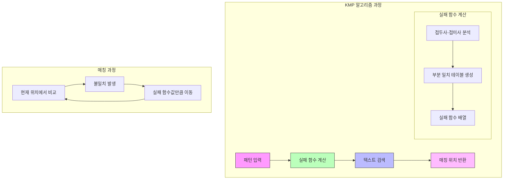

# KMP (Knuth-Morris-Pratt) 알고리즘

* 개념
    * **KMP**는 문자열 패턴 매칭을 위한 효율적인 알고리즘입니다.
    * 실패 함수(Failure Function)를 사용하여 불필요한 비교를 건너뜁니다.
    * 특징:
        - O(n + m) 시간 복잡도
        - 부분 일치 테이블 활용
        - 전처리를 통한 최적화
        - 패턴 내의 반복되는 부분 활용

* 동작 원리
    1. 실패 함수 계산
        - 패턴의 접두사와 접미사 중 일치하는 가장 긴 길이 계산
        - 매칭 실패시 돌아갈 위치를 미리 계산

    2. 패턴 매칭
        - 실패 함수를 활용해 불필요한 비교 건너뛰기
        - 매칭 실패시 패턴 전체를 이동하지 않고 실패 함수값만큼만 이동

* 기본 구현
    ```python
    class KMP:
        def __init__(self, pattern):
            self.pattern = pattern
            self.failure = self._build_failure_function()
            
        def _build_failure_function(self):
            """실패 함수 계산"""
            pattern = self.pattern
            m = len(pattern)
            failure = [0] * m
            
            j = 0  # 현재까지 일치한 길이
            for i in range(1, m):
                # 불일치가 발생한 경우
                while j > 0 and pattern[i] != pattern[j]:
                    j = failure[j - 1]
                    
                # 일치하는 경우
                if pattern[i] == pattern[j]:
                    j += 1
                failure[i] = j
                
            return failure
        
        def search(self, text):
            """패턴 매칭 수행"""
            matches = []
            n, m = len(text), len(self.pattern)
            
            j = 0  # 패턴에서의 현재 위치
            for i in range(n):
                # 불일치가 발생한 경우
                while j > 0 and text[i] != self.pattern[j]:
                    j = self.failure[j - 1]
                    
                # 일치하는 경우
                if text[i] == self.pattern[j]:
                    if j == m - 1:  # 패턴을 찾은 경우
                        matches.append(i - m + 1)
                        j = self.failure[j]
                    else:
                        j += 1
                        
            return matches
    ```

* 최적화된 구현
    ```python
    class OptimizedKMP:
        def __init__(self, pattern):
            self.pattern = pattern
            self.failure = self._build_optimized_failure()
            
        def _build_optimized_failure(self):
            """최적화된 실패 함수"""
            pattern = self.pattern
            m = len(pattern)
            failure = [0] * m
            
            # 첫 글자에 대한 최적화
            failure[0] = -1
            j = -1
            
            for i in range(1, m):
                while j >= 0 and pattern[i] != pattern[j + 1]:
                    j = failure[j]
                    
                if pattern[i] == pattern[j + 1]:
                    j += 1
                    
                failure[i] = j
                
            return failure
        
        def search_all(self, text):
            """모든 매칭 위치 찾기 (최적화)"""
            matches = []
            n, m = len(text), len(self.pattern)
            
            # 패턴이 빈 문자열인 경우 처리
            if m == 0:
                return [i for i in range(n + 1)]
                
            j = 0  # 현재 일치한 길이
            for i in range(n):
                while j >= 0 and text[i] != self.pattern[j]:
                    j = self.failure[j]
                
                j += 1
                if j == m:
                    matches.append(i - m + 1)
                    j = self.failure[j - 1] + 1
                    
            return matches
    ```

* 시간 복잡도
    |연산|복잡도|설명|
    |---|------|-----|
    |실패 함수 계산|O(m)|m은 패턴의 길이|
    |문자열 검색|O(n)|n은 텍스트의 길이|
    |전체 알고리즘|O(n + m)|전처리 + 검색|

* 공간 복잡도
    - O(m): 실패 함수를 저장하기 위한 배열

* 장단점
    1. 장점
        - 선형 시간복잡도
        - 전처리를 통한 최적화
        - 모든 매칭 위치 찾기 가능
        - 긴 패턴에서 효율적

    2. 단점
        - 실패 함수 구현이 복잡
        - 추가 메모리 필요
        - 짧은 패턴에서는 단순 검색이 더 효율적일 수 있음

* 활용 예시
    1. 문서 검색
        ```python
        def search_document(document, pattern):
            """문서에서 패턴 검색"""
            kmp = KMP(pattern.lower())
            text = document.lower()
            
            matches = kmp.search(text)
            return [(pos, pos + len(pattern)) for pos in matches]
        ```

    2. DNA 서열 검색
        ```python
        def find_dna_sequence(genome, sequence):
            """DNA 서열에서 특정 패턴 찾기"""
            kmp = KMP(sequence)
            matches = kmp.search(genome)
            
            # 매칭된 위치와 주변 컨텍스트 반환
            context_size = 10
            results = []
            for pos in matches:
                start = max(0, pos - context_size)
                end = min(len(genome), pos + len(sequence) + context_size)
                results.append({
                    'position': pos,
                    'context': genome[start:end]
                })
            return results
        ```

* 최적화 기법
    1. 실패 함수 최적화
        ```python
        def build_strong_failure(pattern):
            """강화된 실패 함수"""
            m = len(pattern)
            failure = [0] * m
            
            # 첫 글자 최적화
            failure[0] = -1
            k = -1
            
            for i in range(1, m):
                while k >= 0 and pattern[k + 1] != pattern[i]:
                    k = failure[k]
                    
                if pattern[k + 1] == pattern[i]:
                    k += 1
                    
                # 추가 최적화: 같은 문자가 반복되는 경우
                if i < m - 1 and pattern[i + 1] == pattern[k + 1]:
                    failure[i] = failure[k]
                else:
                    failure[i] = k
                    
            return failure
        ```

    2. 캐시 지역성 최적화
        ```python
        def cache_friendly_search(text, pattern):
            """캐시 효율적인 검색"""
            n, m = len(text), len(pattern)
            block_size = 256  # CPU 캐시 라인 크기 고려
            
            # 텍스트를 블록 단위로 처리
            matches = []
            for i in range(0, n, block_size):
                end = min(i + block_size + m - 1, n)
                block_matches = KMP(pattern).search(text[i:end])
                matches.extend(pos + i for pos in block_matches)
                
            return matches
        ```

* 실제 활용
    1. 텍스트 에디터의 검색 기능
        ```python
        class TextEditor:
            def __init__(self):
                self.text = ""
                self.kmp_cache = {}  # 패턴별 KMP 인스턴스 캐시
                
            def find_all(self, pattern):
                """대소문자 구분 없는 검색"""
                if pattern not in self.kmp_cache:
                    self.kmp_cache[pattern] = KMP(pattern.lower())
                    
                return self.kmp_cache[pattern].search(self.text.lower())
        ```

    2. 로그 파일 분석
        ```python
        def analyze_log_file(filename, pattern):
            """로그 파일에서 패턴 검색"""
            kmp = KMP(pattern)
            matches = []
            
            with open(filename, 'r') as f:
                for line_num, line in enumerate(f, 1):
                    if kmp.search(line):
                        matches.append(line_num)
                        
            return matches
        ```

* 마무리
    - KMP는 효율적인 문자열 패턴 매칭 알고리즘
    - 실패 함수를 통한 최적화가 핵심
    - 실제 텍스트 검색, 생물정보학 등에서 활용
    - 구현은 복잡하지만 강력한 성능 제공

