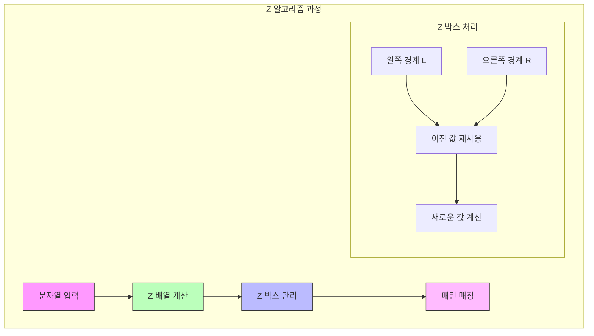

# Z 알고리즘 (Z Algorithm)

* 개념
    * **Z 알고리즘**은 문자열의 모든 위치에서 시작하는 가장 긴 접두사를 찾는 알고리즘입니다.
    * 특징:
        - Z 배열을 사용한 선형 시간 해결
        - Z 박스(Z-box) 개념 활용
        - O(n) 시간 복잡도
        - 패턴 매칭에 효율적

* 핵심 구성 요소
    1. Z 배열
        - 각 위치에서 시작하는 가장 긴 접두사의 길이
        - Z[i]: i 위치에서 시작하는 부분 문자열 중 원본 문자열의 접두사와 일치하는 가장 긴 길이

    2. Z 박스
        - 현재 처리 중인 구간
        - 왼쪽 경계(l)과 오른쪽 경계(r) 유지
        - 이전 계산 결과 재사용

* 기본 구현
    ```python
    class ZAlgorithm:
        def __init__(self, pattern):
            self.pattern = pattern
            
        def compute_z_array(self, str):
            """Z 배열 계산"""
            n = len(str)
            z = [0] * n
            z[0] = n
            
            # [l,r] Z 박스 유지
            l = r = 0
            
            for i in range(1, n):
                if i <= r:  # 현재 Z 박스 안에 있음
                    # 이전에 계산한 값 재사용
                    k = i - l
                    if z[k] < r - i + 1:
                        z[i] = z[k]
                        continue
                    # Z 박스를 벗어나는 경우
                    l = i
                else:
                    l = r = i
                    
                # 직접 비교하여 Z 값 계산
                while r < n and str[r-l] == str[r]:
                    r += 1
                z[i] = r - l
                r -= 1
                
            return z
        
        def search(self, text):
            """패턴 매칭 수행"""
            # 패턴과 텍스트를 특수 문자로 연결
            concat = self.pattern + "$" + text
            z = self.compute_z_array(concat)
            
            # 패턴 길이와 같은 Z 값을 찾음
            pattern_len = len(self.pattern)
            matches = []
            
            for i in range(pattern_len + 1, len(concat)):
                if z[i] == pattern_len:
                    matches.append(i - pattern_len - 1)
                    
            return matches
    ```

* 최적화된 구현
    ```python
    class OptimizedZAlgorithm:
        def __init__(self, pattern):
            self.pattern = pattern
            self.pattern_z = None
            
        def preprocess(self):
            """패턴에 대한 Z 배열 미리 계산"""
            self.pattern_z = self.compute_z_array(self.pattern)
            
        def compute_z_array_optimized(self, str):
            """캐시 지역성을 고려한 Z 배열 계산"""
            n = len(str)
            z = [0] * n
            z[0] = n
            
            # 블록 단위로 처리
            block_size = 64  # 캐시 라인 크기 고려
            
            for block_start in range(1, n, block_size):
                block_end = min(block_start + block_size, n)
                l = r = block_start
                
                for i in range(block_start, block_end):
                    if i <= r:
                        k = i - l
                        if z[k] < r - i + 1:
                            z[i] = z[k]
                            continue
                        l = i
                    else:
                        l = r = i
                        
                    while r < n and str[r-l] == str[r]:
                        r += 1
                    z[i] = r - l
                    r -= 1
                    
            return z
    ```

* 시간 복잡도
    |연산|복잡도|설명|
    |---|------|-----|
    |Z 배열 계산|O(n)|각 문자를 최대 한 번씩만 비교|
    |패턴 매칭|O(n + m)|n은 텍스트 길이, m은 패턴 길이|

* 공간 복잡도
    - O(n): Z 배열 저장

* 장단점
    1. 장점
        - 선형 시간 복잡도
        - 단순한 구현
        - 여러 문자열 처리 문제에 활용
        - 전처리 없이 바로 사용 가능

    2. 단점
        - 추가 메모리 필요
        - KMP보다 실제 성능이 떨어질 수 있음
        - 긴 문자열에서 캐시 효율성 고려 필요

* 활용 예시
    1. 문자열 압축
        ```python
        def compress_string(text):
            """반복되는 패턴 찾아 압축"""
            z = ZAlgorithm("").compute_z_array(text)
            n = len(text)
            
            # 가장 긴 반복 패턴 찾기
            max_len = 0
            period = 0
            
            for i in range(1, n):
                if z[i] + i == n:  # 문자열 끝까지 반복
                    if i > max_len:
                        max_len = i
                        period = i
                        
            if period > 0:
                pattern = text[:period]
                repeats = n // period
                return f"({pattern}){repeats}"
            return text
        ```

    2. 주기성 검사
        ```python
        def find_period(text):
            """문자열의 최소 주기 찾기"""
            z = ZAlgorithm("").compute_z_array(text)
            n = len(text)
            
            for i in range(1, n):
                if z[i] + i == n:  # 주기 발견
                    return i
            return n
        ```

* 최적화 기법
    1. SIMD 최적화
        ```python
        def compare_blocks(self, str1, str2, pos1, pos2, length):
            """SIMD 명령어를 활용한 블록 비교"""
            # 실제로는 C/C++에서 구현하는 것이 좋음
            block_size = 16  # SSE 레지스터 크기
            
            # 블록 단위로 비교
            for i in range(0, length, block_size):
                if str1[pos1+i:pos1+i+block_size] != \
                   str2[pos2+i:pos2+i+block_size]:
                    # 불일치 위치 찾기
                    for j in range(block_size):
                        if str1[pos1+i+j] != str2[pos2+i+j]:
                            return i + j
            return length
        ```

    2. 병렬 처리
        ```python
        from concurrent.futures import ThreadPoolExecutor
        
        def parallel_z_search(text, patterns, num_threads=4):
            """여러 패턴 병렬 검색"""
            with ThreadPoolExecutor(max_workers=num_threads) as executor:
                futures = []
                for pattern in patterns:
                    z = ZAlgorithm(pattern)
                    futures.append(
                        executor.submit(z.search, text)
                    )
                
                results = {}
                for pattern, future in zip(patterns, futures):
                    results[pattern] = future.result()
                    
            return results
        ```

* 실제 활용
    1. DNA 서열 분석
        ```python
        def find_repeating_sequences(dna_sequence, min_length=10):
            """반복되는 DNA 서열 찾기"""
            z = ZAlgorithm("").compute_z_array(dna_sequence)
            n = len(dna_sequence)
            repeats = set()
            
            for i in range(1, n):
                if z[i] >= min_length:
                    repeats.add(dna_sequence[i:i+z[i]])
                    
            return repeats
        ```

    2. 파일 시스템 검색
        ```python
        def search_in_file(filename, pattern, chunk_size=1024*1024):
            """대용량 파일에서 패턴 검색"""
            z = ZAlgorithm(pattern)
            matches = []
            
            with open(filename, 'r') as f:
                overlap = len(pattern) - 1
                offset = 0
                prev_chunk = ""
                
                while True:
                    chunk = f.read(chunk_size)
                    if not chunk:
                        break
                        
                    # 청크 연결하여 검색
                    search_text = prev_chunk[-overlap:] + chunk
                    chunk_matches = z.search(search_text)
                    
                    # 오프셋 조정
                    matches.extend(m + offset for m in chunk_matches 
                                 if m >= overlap)
                    
                    prev_chunk = chunk
                    offset += len(chunk)
                    
            return matches
        ```

* 마무리
    - Z 알고리즘은 단순하면서도 강력한 문자열 처리 알고리즘
    - 선형 시간 복잡도로 효율적
    - 다양한 문자열 문제 해결에 활용 가능
    - 최적화를 통해 실용적인 성능 달성 가능

