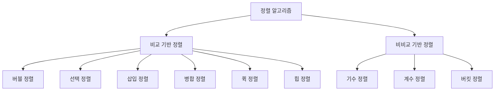

# 정렬 알고리즘 📚

정렬 알고리즘은 데이터 집합 내 요소들을 특정 순서(주로 오름차순 또는 내림차순)로 재배열하는 알고리즘입니다.  
이론적 배경과 다양한 정렬 알고리즘의 특성을 이해하면, 문제의 크기와 데이터 특성에 맞춰 최적의 정렬 방법을 선택할 수 있습니다.

---

## 목차 📝
1. [개요](#개요-🧐)
2. [정렬 알고리즘 분류](#정렬-알고리즘-분류)
3. [알고리즘 특징 비교](#알고리즘-특징-비교)
4. [동작 과정 다이어그램](#동작-과정-다이어그램-🖼️)
5. [실무 활용 및 참고 자료](#실무-활용-및-참고-자료-🔗)

---

## 개요 🧐
정렬 알고리즘은 데이터 검색, 분석, 그리고 다양한 응용 프로그램에서 필수적인 전처리 단계로 사용됩니다.  
각 정렬 알고리즘은 시간 복잡도, 공간 복잡도, 안정성 및 제자리 정렬 여부와 같은 다양한 특성을 가지므로, 문제의 조건에 맞게 적절한 알고리즘을 선택하는 것이 중요합니다.

---

## 정렬 알고리즘 분류
정렬 알고리즘은 크게 두 가지 범주로 분류할 수 있습니다.

- **비교 기반 정렬 (Comparison-based Sorting)**  
  요소 간의 비교를 통해 순서를 결정하는 알고리즘입니다.  
  - 버블 정렬 (Bubble Sort)
  - 선택 정렬 (Selection Sort)
  - 삽입 정렬 (Insertion Sort)
  - 병합 정렬 (Merge Sort)
  - 퀵 정렬 (Quick Sort)
  - 힙 정렬 (Heap Sort)

- **비비교 기반 정렬 (Non-comparison-based Sorting)**  
  요소의 값을 직접 활용하여 순서를 결정하는 알고리즘으로, 일반적으로 특정 조건(예: 정수 데이터)에 효과적입니다.  
  - 기수 정렬 (Radix Sort)
  - 계수 정렬 (Counting Sort)
  - 버킷 정렬 (Bucket Sort)

---

## 알고리즘 특징 비교
- **시간 복잡도:**  
  각 알고리즘은 최선, 평균, 최악의 경우 시간 복잡도가 다르게 나타납니다.  
  예를 들어, 병합 정렬은 O(n log n)의 안정적인 성능을 보이는 반면, 퀵 정렬은 평균 O(n log n)이지만 최악의 경우 O(n²)까지 갈 수 있습니다.

- **공간 복잡도:**  
  일부 알고리즘은 추가 메모리 공간을 요구(예: 병합 정렬)하는 반면, 제자리 정렬(in-place sorting)을 수행하는 알고리즘(예: 퀵 정렬, 힙 정렬)도 있습니다.

- **안정성 (Stability):**  
  정렬 과정에서 동일한 키 값을 가진 요소들의 상대적 순서를 유지하는지 여부가 중요할 수 있습니다.  
  예를 들어, 삽입 정렬과 병합 정렬은 안정적인 정렬 알고리즘입니다.

- **제자리 정렬 (In-place Sorting):**  
  추가 메모리 사용 없이 입력 배열 내에서 직접 정렬을 수행하는 알고리즘의 경우, 메모리 효율성이 높습니다.

---

## 동작 과정 다이어그램 🖼️
아래 다이어그램은 정렬 알고리즘의 분류와 각 알고리즘 간의 관계를 시각적으로 표현합니다.

---

## 실무 활용 및 참고 자료 🔗
- **실무 활용:**  
  정렬 알고리즘은 데이터베이스, 통계 분석, 파일 처리 등 다양한 분야에서 핵심적인 역할을 수행합니다.  
  데이터의 양과 특성, 그리고 정렬의 안정성 여부 등에 따라 적합한 정렬 알고리즘을 선택하여 적용합니다.

- **참고 자료:**
  - [Wikipedia - Sorting Algorithm](https://en.wikipedia.org/wiki/Sorting_algorithm)
  - [GeeksforGeeks - Sorting Algorithms](https://www.geeksforgeeks.org/sorting-algorithms/)
  - [Baekjoon Online Judge](https://www.acmicpc.net/)

---

이 README는 정렬 알고리즘의 이론적 배경과 주요 분류, 그리고 동작 원리를 한눈에 파악할 수 있도록 구성되었습니다.  
다음 파일인 `main.c`에서는 각 정렬 알고리즘의 최적화된 구현 예제를 다룰 예정입니다.