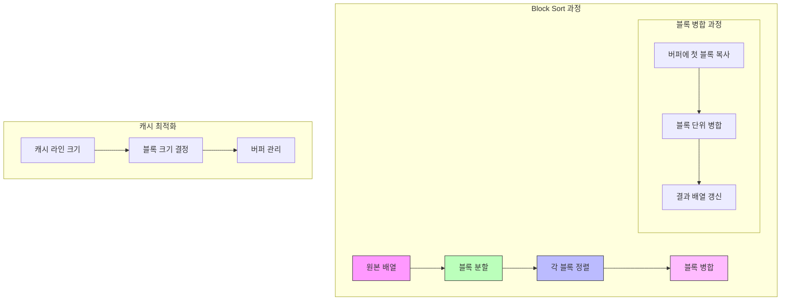

# Block Sort

* 개념
    * **Block Sort**는 In-place 병합 정렬의 최적화 버전입니다.
    * 메모리 지역성을 높이기 위해 블록 단위로 데이터를 처리합니다.
    * 특징:
        - 병합 정렬 기반이지만 추가 메모리 최소화
        - 캐시 효율적인 블록 단위 처리
        - 안정 정렬(Stable Sort)
        - 실제 하드웨어에서 효율적

* 핵심 구성 요소
    1. 블록(Block)
        - 캐시 라인 크기에 맞춘 작은 단위
        - 일반적으로 16~64개 요소
        - 메모리 지역성 최적화의 기본 단위

    2. 버퍼(Buffer)
        - 블록 병합에 사용되는 임시 공간
        - 전체 배열의 일부를 버퍼로 활용

    3. 병합 전략
        - 블록 단위 병합
        - 순환 병합(Rotation) 활용
        - 버퍼 재사용

* 기본 구현
    ```python
    class BlockSort:
        def __init__(self, arr):
            self.arr = arr
            self.block_size = 32  # 캐시 라인 크기에 맞춤
            
        def sort(self):
            n = len(self.arr)
            if n <= 1:
                return
                
            # 블록 단위로 분할하고 정렬
            for i in range(0, n, self.block_size):
                end = min(i + self.block_size, n)
                self._insertion_sort(i, end - 1)
            
            # 블록 병합
            for block_size in range(self.block_size, n, self.block_size * 2):
                for i in range(0, n - block_size, block_size * 2):
                    mid = i + block_size
                    end = min(i + block_size * 2, n)
                    self._merge_blocks(i, mid, end)
                    
        def _insertion_sort(self, start, end):
            """각 블록 내부 정렬"""
            for i in range(start + 1, end + 1):
                key = self.arr[i]
                j = i - 1
                while j >= start and self.arr[j] > key:
                    self.arr[j + 1] = self.arr[j]
                    j -= 1
                self.arr[j + 1] = key
                
        def _merge_blocks(self, start, mid, end):
            """블록 단위 병합"""
            if mid >= end:
                return
                
            # 블록 크기의 버퍼 확보
            buffer = self.arr[start:mid].copy()
            
            # 병합 수행
            i = 0
            j = mid
            k = start
            
            while i < len(buffer) and j < end:
                if buffer[i] <= self.arr[j]:
                    self.arr[k] = buffer[i]
                    i += 1
                else:
                    self.arr[k] = self.arr[j]
                    j += 1
                k += 1
            
            # 남은 요소 복사
            while i < len(buffer):
                self.arr[k] = buffer[i]
                i += 1
                k += 1
    ```

* 최적화된 구현
    ```python
    class BlockSortOptimized:
        def __init__(self, arr):
            self.arr = arr
            # CPU 캐시 라인 크기를 고려한 블록 크기
            self.block_size = 64 // sizeof(arr[0])
            
        def _rotate_block(self, start, mid, end):
            """블록 순환"""
            while mid < end:
                self.arr[start], self.arr[mid] = self.arr[mid], self.arr[start]
                start += 1
                mid += 1
                
        def _merge_with_buffer(self, start, mid, end, buffer_start):
            """버퍼를 활용한 병합"""
            # 첫 번째 블록을 버퍼로 복사
            buffer_size = mid - start
            for i in range(buffer_size):
                self.arr[buffer_start + i] = self.arr[start + i]
                
            # 병합 수행
            i = 0
            j = mid
            k = start
            
            while i < buffer_size and j < end:
                if self.arr[buffer_start + i] <= self.arr[j]:
                    self.arr[k] = self.arr[buffer_start + i]
                    i += 1
                else:
                    self.arr[k] = self.arr[j]
                    j += 1
                k += 1
                
            # 남은 버퍼 요소 복사
            while i < buffer_size:
                self.arr[k] = self.arr[buffer_start + i]
                i += 1
                k += 1
    ```

* 캐시 최적화 구현
    ```cpp
    template<typename T>
    class CacheOptimizedBlockSort {
    private:
        static const int CACHE_LINE_SIZE = 64;  // 일반적인 캐시 라인 크기
        static const int BLOCK_SIZE = CACHE_LINE_SIZE / sizeof(T);
        
        void mergeWithBuffer(T* arr, int start, int mid, int end, T* buffer) {
            // 블록 단위로 버퍼에 복사
            for(int i = 0; i < mid - start; i += BLOCK_SIZE) {
                int block_end = std::min(i + BLOCK_SIZE, mid - start);
                std::copy(arr + start + i, 
                         arr + start + block_end, 
                         buffer + i);
            }
            
            // 블록 단위로 병합
            int i = 0, j = mid, k = start;
            while(i < mid - start && j < end) {
                // 블록 단위 비교 및 복사
                int block_size = std::min(BLOCK_SIZE, 
                                        std::min(mid - start - i, end - j));
                if(buffer[i] <= arr[j]) {
                    std::copy(buffer + i, 
                             buffer + i + block_size, 
                             arr + k);
                    i += block_size;
                } else {
                    std::copy(arr + j, 
                             arr + j + block_size, 
                             arr + k);
                    j += block_size;
                }
                k += block_size;
            }
            
            // 남은 블록 처리
            while(i < mid - start) {
                int block_size = std::min(BLOCK_SIZE, mid - start - i);
                std::copy(buffer + i, 
                         buffer + i + block_size, 
                         arr + k);
                i += block_size;
                k += block_size;
            }
        }
    };
    ```

* 시간 복잡도
    |연산|복잡도|설명|
    |---|------|-----|
    |최선|O(n log n)|모든 케이스|
    |평균|O(n log n)|모든 케이스|
    |최악|O(n log n)|모든 케이스|

* 공간 복잡도
    - O(1): 블록 크기만큼의 추가 공간

* 장단점
    1. 장점
        - 캐시 효율적
        - 안정 정렬
        - 일관된 성능
        - 실제 하드웨어에서 좋은 성능

    2. 단점
        - 구현이 복잡
        - 블록 크기 선정이 중요
        - 하드웨어 의존적 최적화 필요

* 최적화 전략
    1. 블록 크기 조정
        ```python
        def get_optimal_block_size():
            """시스템 캐시 라인 크기에 맞춘 블록 크기 계산"""
            import sys
            cache_line_size = 64  # 일반적인 캐시 라인 크기
            element_size = sys.getsizeof(int())
            return max(1, cache_line_size // element_size)
        ```

    2. 버퍼 재사용
        ```python
        def reuse_buffer(arr, buffer_size):
            """버퍼 공간 재사용 전략"""
            buffer = [0] * buffer_size
            buffer_start = 0
            
            def merge_with_buffer(start, mid, end):
                nonlocal buffer_start
                # 버퍼 순환 사용
                buffer_start = (buffer_start + buffer_size) % len(buffer)
                # 병합 로직...
            
            return merge_with_buffer
        ```

* 실제 활용
    1. 대용량 파일 정렬
        ```python
        def sort_large_file(filename):
            """파일을 블록 단위로 읽어 정렬"""
            block_size = get_optimal_block_size()
            with open(filename, 'rb+') as f:
                # 파일을 블록 단위로 처리
                pass
        ```

    2. 데이터베이스 인덱싱
        ```python
        class DatabaseIndex:
            def __init__(self):
                self.block_size = get_optimal_block_size()
                self.sorted_blocks = []
                
            def add_entries(self, entries):
                """인덱스 엔트리 추가"""
                # 블록 단위로 처리
                pass
        ```

* 마무리
    - Block Sort는 메모리 지역성을 고려한 실용적인 정렬 알고리즘
    - 하드웨어의 특성을 활용하여 최적화 가능
    - 대용량 데이터 처리에 적합
    - 캐시 효율적인 구현이 핵심

