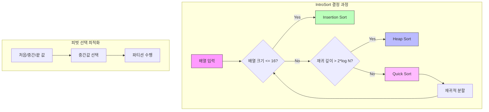

# IntroSort (Introspective Sort)

* 개념
    * **IntroSort**는 QuickSort, HeapSort, InsertionSort를 결합한 하이브리드 정렬 알고리즘입니다.
    * C++ STL의 std::sort 구현에 사용됩니다.
    * 특징:
        - QuickSort의 평균적인 성능
        - HeapSort의 최악의 경우 보장
        - 작은 부분 배열에 대한 InsertionSort 최적화
        - 비재귀적 피벗 선택

* 동작 원리
    1. QuickSort로 시작
    2. 재귀 깊이가 2*log(N)을 초과하면 HeapSort로 전환
    3. 부분 배열 크기가 16 이하면 InsertionSort 사용
    4. 중간값 피벗 선택으로 최적화

* 기본 구현
    ```python
    class IntroSort:
        def __init__(self, arr):
            self.arr = arr
            self.length = len(arr)
            # 최대 재귀 깊이를 2*log(n)으로 설정
            self.max_depth = 2 * (len(arr).bit_length())

        def sort(self):
            self._intro_sort(0, self.length - 1, self.max_depth)

        def _intro_sort(self, start, end, max_depth):
            length = end - start + 1
            
            # 작은 배열은 삽입 정렬
            if length <= 16:
                self._insertion_sort(start, end)
                return
            
            # 최대 깊이 도달 시 힙 정렬
            if max_depth == 0:
                self._heap_sort(start, end)
                return
            
            # 퀵 정렬 수행
            pivot = self._partition(start, end)
            self._intro_sort(start, pivot - 1, max_depth - 1)
            self._intro_sort(pivot + 1, end, max_depth - 1)

        def _partition(self, low, high):
            """최적화된 피벗 선택과 파티셔닝"""
            # 중간값을 피벗으로 선택
            mid = (low + high) // 2
            pivot_candidates = [
                (self.arr[low], low),
                (self.arr[mid], mid),
                (self.arr[high], high)
            ]
            _, pivot_idx = sorted(pivot_candidates)[1]
            
            # 피벗을 맨 오른쪽으로 이동
            self.arr[pivot_idx], self.arr[high] = \
                self.arr[high], self.arr[pivot_idx]
            pivot = self.arr[high]
            
            i = low - 1
            for j in range(low, high):
                if self.arr[j] <= pivot:
                    i += 1
                    self.arr[i], self.arr[j] = self.arr[j], self.arr[i]
                    
            self.arr[i + 1], self.arr[high] = self.arr[high], self.arr[i + 1]
            return i + 1

        def _heap_sort(self, start, end):
            """힙 정렬 구현"""
            def heapify(n, i):
                largest = i
                left = 2 * i + 1
                right = 2 * i + 2

                if left < n and self.arr[start + left] > self.arr[start + largest]:
                    largest = left

                if right < n and self.arr[start + right] > self.arr[start + largest]:
                    largest = right

                if largest != i:
                    self.arr[start + i], self.arr[start + largest] = \
                        self.arr[start + largest], self.arr[start + i]
                    heapify(n, largest)

            n = end - start + 1

            # 힙 구성
            for i in range(n // 2 - 1, -1, -1):
                heapify(n, i)

            # 하나씩 추출
            for i in range(n - 1, 0, -1):
                self.arr[start], self.arr[start + i] = \
                    self.arr[start + i], self.arr[start]
                heapify(i, 0)

        def _insertion_sort(self, start, end):
            """삽입 정렬 구현"""
            for i in range(start + 1, end + 1):
                key = self.arr[i]
                j = i - 1
                while j >= start and self.arr[j] > key:
                    self.arr[j + 1] = self.arr[j]
                    j -= 1
                self.arr[j + 1] = key
    ```

* 최적화된 C++ 스타일 구현
    ```cpp
    template<typename T>
    class IntroSortOptimized {
    private:
        static const int INSERTION_SORT_THRESHOLD = 16;
        vector<T>& arr;
        
        void introSortUtil(int start, int end, int depth_limit) {
            int size = end - start + 1;
            
            if (size <= INSERTION_SORT_THRESHOLD) {
                insertionSort(start, end);
                return;
            }
            
            if (depth_limit == 0) {
                heapSort(start, end);
                return;
            }
            
            int pivot = medianOfThree(start, start + size/2, end);
            pivot = partition(start, end, pivot);
            
            introSortUtil(start, pivot-1, depth_limit-1);
            introSortUtil(pivot+1, end, depth_limit-1);
        }
        
        int medianOfThree(int a, int b, int c) {
            // 중간값을 찾아 피벗으로 반환
            T va = arr[a], vb = arr[b], vc = arr[c];
            if (va < vb) {
                if (vb < vc) return b;
                if (va < vc) return c;
                return a;
            }
            if (va < vc) return a;
            if (vb < vc) return c;
            return b;
        }
        
    public:
        IntroSortOptimized(vector<T>& array) : arr(array) {}
        
        void sort() {
            if (arr.size() <= 1) return;
            int maxDepth = 2 * log2(arr.size());
            introSortUtil(0, arr.size()-1, maxDepth);
        }
    };
    ```

* 시간 복잡도
    |케이스|복잡도|설명|
    |------|------|-----|
    |최선|O(n log n)|QuickSort 주도|
    |평균|O(n log n)|QuickSort + HeapSort 혼합|
    |최악|O(n log n)|HeapSort로 보장|

* 공간 복잡도
    - O(log n): 재귀 호출 스택

* 장단점
    1. 장점
        - 최악의 경우도 O(n log n) 보장
        - 평균적으로 QuickSort의 성능
        - 실제 데이터에서 매우 효율적
        - 추가 메모리 사용 최소화

    2. 단점
        - 구현이 복잡
        - 불안정 정렬
        - TimSort보다 부분 정렬된 데이터에서 성능 떨어짐

* 최적화 전략
    1. 피벗 선택
        ```cpp
        int choosePivot(int low, int high) {
            if (high - low + 1 <= 3) 
                return medianOfThree(low, low, high);
                
            // 5개 표본에서 중간값 선택
            int mid = low + (high - low) / 2;
            int quarterLen = (high - low) / 4;
            
            return medianOfFive(
                low,
                low + quarterLen,
                mid,
                high - quarterLen,
                high
            );
        }
        ```

    2. 캐시 지역성 최적화
        ```cpp
        void optimizedPartition() {
            // 블록 크기를 캐시 라인에 맞춤
            const int BLOCK_SIZE = 64 / sizeof(T);
            vector<T> buffer(BLOCK_SIZE);
            
            // 블록 단위로 처리
            for(int i = 0; i < size; i += BLOCK_SIZE) {
                // 블록 로드 및 처리
            }
        }
        ```

* 실제 활용
    1. C++ STL std::sort
        ```cpp
        vector<int> vec = {5, 2, 8, 1, 9};
        sort(vec.begin(), vec.end());
        ```

    2. 커스텀 비교자 사용
        ```cpp
        bool compare(const T& a, const T& b) {
            return a.value < b.value;
        }
        
        sort(vec.begin(), vec.end(), compare);
        ```

* 다른 정렬들과의 비교
    |알고리즘|최악 복잡도|안정성|추가 메모리|
    |--------|-----------|-------|------------|
    |QuickSort|O(n²)|불안정|O(log n)|
    |HeapSort|O(n log n)|불안정|O(1)|
    |IntroSort|O(n log n)|불안정|O(log n)|
    |TimSort|O(n log n)|안정|O(n)|

* 마무리
    - IntroSort는 실제 시스템에서 검증된 하이브리드 정렬 알고리즘
    - C++ STL의 표준 정렬 알고리즘으로 채택될 만큼 실용적
    - QuickSort의 평균 성능과 HeapSort의 최악 경우 보장을 모두 제공

