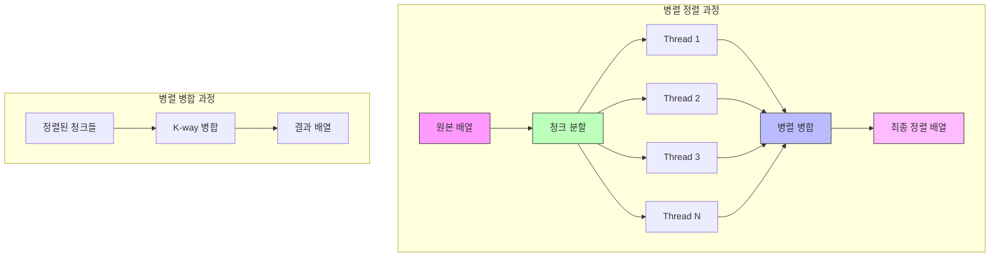

# PSort (Parallel Sort)

* 개념
    * **PSort**는 다중 코어/스레드를 활용하는 병렬 정렬 알고리즘입니다.
    * 특징:
        - 데이터를 여러 청크로 분할하여 병렬 처리
        - 각 청크는 독립적으로 정렬
        - 정렬된 청크들을 효율적으로 병합
        - 하드웨어의 병렬 처리 능력 활용

* 핵심 구성 요소
    1. 분할(Partitioning)
        - 데이터를 여러 청크로 균등 분할
        - 코어 수를 고려한 청크 크기 결정

    2. 병렬 정렬
        - 각 청크를 별도 스레드에서 정렬
        - 퀵소트나 병합 정렬 등 활용

    3. 병렬 병합
        - 정렬된 청크들을 효율적으로 병합
        - k-way 병합 전략 사용

* 기본 구현
    ```python
    import multiprocessing as mp
    from concurrent.futures import ThreadPoolExecutor
    import numpy as np

    class PSort:
        def __init__(self, arr, num_threads=None):
            self.arr = arr
            self.num_threads = num_threads or mp.cpu_count()
            
        def sort(self):
            n = len(self.arr)
            chunk_size = (n + self.num_threads - 1) // self.num_threads
            
            # 청크 분할 및 병렬 정렬
            with ThreadPoolExecutor(max_workers=self.num_threads) as executor:
                futures = []
                for i in range(0, n, chunk_size):
                    end = min(i + chunk_size, n)
                    futures.append(
                        executor.submit(self._sort_chunk, i, end)
                    )
                
                # 모든 청크 정렬 완료 대기
                for future in futures:
                    future.result()
                
            # 정렬된 청크 병합
            self._parallel_merge(chunk_size)
            
        def _sort_chunk(self, start, end):
            """각 청크 정렬"""
            chunk = self.arr[start:end]
            chunk.sort()  # 또는 다른 정렬 알고리즘 사용
            self.arr[start:end] = chunk
            
        def _parallel_merge(self, chunk_size):
            """병렬 병합"""
            n = len(self.arr)
            temp = np.empty_like(self.arr)
            
            # 병렬 병합 수행
            with ThreadPoolExecutor(max_workers=self.num_threads) as executor:
                futures = []
                for i in range(0, n, chunk_size * 2):
                    mid = min(i + chunk_size, n)
                    end = min(i + chunk_size * 2, n)
                    futures.append(
                        executor.submit(
                            self._merge, i, mid, end, temp
                        )
                    )
                
                # 병합 완료 대기
                for future in futures:
                    future.result()
    ```

* OpenMP 스타일 구현 (C++)
    ```cpp
    template<typename T>
    class PSort {
    private:
        vector<T>& arr;
        int num_threads;
        
        void parallelQuickSort(int left, int right, int depth) {
            if (right - left <= 1000) {  // 작은 구간은 순차 정렬
                sort(arr.begin() + left, arr.begin() + right);
                return;
            }
            
            int pivot = partition(left, right);
            
            #pragma omp task shared(arr) if(depth < 4)
            parallelQuickSort(left, pivot, depth + 1);
            
            #pragma omp task shared(arr) if(depth < 4)
            parallelQuickSort(pivot + 1, right, depth + 1);
            
            #pragma omp taskwait
        }
        
    public:
        PSort(vector<T>& array, int threads = 0) 
            : arr(array), 
              num_threads(threads ? threads : omp_get_max_threads()) {}
        
        void sort() {
            #pragma omp parallel
            {
                #pragma omp single
                parallelQuickSort(0, arr.size(), 0);
            }
        }
    };
    ```

* 병렬 병합 최적화
    ```python
    class OptimizedPSort:
        def parallel_merge(self, arr1, arr2, result):
            """병렬 k-way 병합"""
            n1, n2 = len(arr1), len(arr2)
            total = n1 + n2
            
            # 병렬 처리를 위한 분할점 계산
            step = (total + self.num_threads - 1) // self.num_threads
            
            def merge_partition(start, end):
                """부분 구간 병합"""
                # 이진 검색으로 각 배열의 병합 위치 찾기
                pos1 = bisect.bisect_left(arr1, result[start])
                pos2 = bisect.bisect_left(arr2, result[start])
                
                i, j = pos1, pos2
                k = start
                
                while k < end and i < n1 and j < n2:
                    if arr1[i] <= arr2[j]:
                        result[k] = arr1[i]
                        i += 1
                    else:
                        result[k] = arr2[j]
                        j += 1
                    k += 1
                
                while k < end and i < n1:
                    result[k] = arr1[i]
                    i += 1
                    k += 1
                    
                while k < end and j < n2:
                    result[k] = arr2[j]
                    j += 1
                    k += 1
            
            # 병렬로 각 구간 병합
            with ThreadPoolExecutor(max_workers=self.num_threads) as executor:
                futures = []
                for i in range(0, total, step):
                    end = min(i + step, total)
                    futures.append(
                        executor.submit(merge_partition, i, end)
                    )
                
                for future in futures:
                    future.result()
    ```

* 시간 복잡도
    |연산|복잡도|설명|
    |---|------|-----|
    |최선|O(n log n / p)|p는 스레드 수|
    |평균|O(n log n / p)|실제로는 오버헤드 존재|
    |최악|O(n log n / p)|병렬화 오버헤드 고려 필요|

* 공간 복잡도
    - O(n): 병합을 위한 임시 공간

* 장단점
    1. 장점
        - 멀티코어 활용으로 성능 향상
        - 대용량 데이터 처리에 효과적
        - 하드웨어 확장성 좋음
        - 기존 정렬 알고리즘 재사용 가능

    2. 단점
        - 구현 복잡도 높음
        - 동기화 오버헤드 존재
        - 작은 데이터셋에서는 비효율적
        - 메모리 사용량 증가

* 최적화 전략
    1. 작업 분배 최적화
        ```python
        def optimize_chunk_size(n, num_threads):
            """최적의 청크 크기 계산"""
            # CPU 캐시 크기 고려
            cache_line_size = 64  # bytes
            min_elements_per_thread = 4096  # 경험적 값
            
            # 스레드당 최소 작업량 보장
            chunk_size = max(
                min_elements_per_thread,
                (n + num_threads - 1) // num_threads
            )
            
            # 캐시 라인 정렬
            chunk_size = ((chunk_size + 15) // 16) * 16
            
            return chunk_size
        ```

    2. 캐시 지역성 최적화
        ```cpp
        template<typename T>
        void cache_aware_merge(T* arr1, int n1, T* arr2, int n2, T* result) {
            const int BLOCK_SIZE = 1024;  // L1 캐시 크기 고려
            
            for(int i = 0; i < n1; i += BLOCK_SIZE) {
                int block_end = min(i + BLOCK_SIZE, n1);
                // 블록 단위 처리
            }
        }
        ```

* 실제 활용
    1. 데이터베이스 정렬
        ```python
        class DatabaseSort:
            def __init__(self, db_connection):
                self.conn = db_connection
                self.psort = PSort(num_threads=mp.cpu_count())
                
            def sort_table(self, table_name, column):
                """테이블 병렬 정렬"""
                # 청크 단위로 데이터 로드 및 정렬
                pass
        ```

    2. 빅데이터 처리
        ```python
        def sort_large_file(filename):
            """대용량 파일 병렬 정렬"""
            chunk_size = 1024 * 1024  # 1MB
            sorter = PSort()
            
            # 파일을 청크로 나누어 병렬 처리
            pass
        ```

* 마무리
    - PSort는 현대 하드웨어의 병렬 처리 능력을 활용하는 실용적인 정렬 알고리즘
    - 대용량 데이터 처리에 특히 효과적
    - 적절한 청크 크기와 스레드 수 선택이 중요
    - 실제 구현 시 동기화와 메모리 관리에 주의 필요

