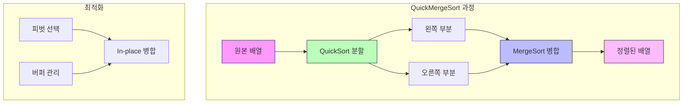

# QuickMergeSort

* 개념
    * **QuickMergeSort**는 QuickSort의 분할 전략과 MergeSort의 병합을 결합한 하이브리드 정렬입니다.
    * 특징:
        - QuickSort의 효율적인 분할
        - MergeSort의 안정적 병합
        - In-place 구현 가능
        - 최적화된 피벗 선택

* 핵심 구성 요소
    1. QuickSort 파트
        - 효율적인 분할(Partitioning)
        - 최적의 피벗 선택
        - 재귀적 분할

    2. MergeSort 파트
        - 안정적 병합
        - In-place 병합 최적화
        - 버퍼 관리

* 기본 구현
    ```python
    class QuickMergeSort:
        def __init__(self, arr):
            self.arr = arr
            self.length = len(arr)
            
        def sort(self):
            self._quick_merge_sort(0, self.length - 1)
            
        def _quick_merge_sort(self, low, high):
            if high - low <= 16:  # 작은 부분배열은 삽입정렬
                self._insertion_sort(low, high)
                return
                
            if high <= low:
                return
                
            # QuickSort 스타일 분할
            pivot = self._partition(low, high)
            
            # 분할된 부분을 MergeSort로 정렬
            mid = (low + high) // 2
            self._quick_merge_sort(low, mid)
            self._quick_merge_sort(mid + 1, high)
            
            # 병합
            self._merge(low, mid, high)
            
        def _partition(self, low, high):
            """최적화된 피벗 선택 및 분할"""
            # 3-중간값 피벗 선택
            mid = (low + high) // 2
            a = self.arr[low]
            b = self.arr[mid]
            c = self.arr[high]
            
            pivot_idx = mid
            if a <= b <= c or c <= b <= a:
                pivot_idx = mid
            elif b <= a <= c or c <= a <= b:
                pivot_idx = low
            else:
                pivot_idx = high
                
            # 피벗을 끝으로 이동
            self.arr[pivot_idx], self.arr[high] = \
                self.arr[high], self.arr[pivot_idx]
            pivot = self.arr[high]
            
            # 분할
            i = low - 1
            for j in range(low, high):
                if self.arr[j] <= pivot:
                    i += 1
                    self.arr[i], self.arr[j] = self.arr[j], self.arr[i]
                    
            self.arr[i + 1], self.arr[high] = self.arr[high], self.arr[i + 1]
            return i + 1
            
        def _merge(self, low, mid, high):
            """In-place 병합"""
            if low >= high:
                return
                
            # 임시 버퍼 사용
            left = self.arr[low:mid + 1]
            right = self.arr[mid + 1:high + 1]
            
            i = j = 0
            k = low
            
            while i < len(left) and j < len(right):
                if left[i] <= right[j]:
                    self.arr[k] = left[i]
                    i += 1
                else:
                    self.arr[k] = right[j]
                    j += 1
                k += 1
                
            while i < len(left):
                self.arr[k] = left[i]
                i += 1
                k += 1
                
            while j < len(right):
                self.arr[k] = right[j]
                j += 1
                k += 1
    ```

* 최적화된 구현
    ```python
    class OptimizedQuickMergeSort:
        def __init__(self, arr):
            self.arr = arr
            self.length = len(arr)
            self.buffer = []  # 재사용 가능한 버퍼
            
        def _optimize_pivot(self, low, high):
            """Ninther 방식의 피벗 선택"""
            if high - low < 9:
                return self._median_of_three(low, high)
                
            # 배열을 3등분하여 각 부분의 중간값을 선택
            step = (high - low + 1) // 3
            m1 = self._median_of_three(low, low + step - 1)
            m2 = self._median_of_three(low + step, low + 2 * step - 1)
            m3 = self._median_of_three(low + 2 * step, high)
            
            # 세 중간값의 중간값을 선택
            return self._median_of_three(m1, m2, m3)
            
        def _median_of_three(self, i, j):
            """3개 값의 중간값 반환"""
            if j - i < 2:
                return i
            mid = (i + j) // 2
            
            if self.arr[i] > self.arr[mid]:
                self.arr[i], self.arr[mid] = self.arr[mid], self.arr[i]
            if self.arr[mid] > self.arr[j]:
                self.arr[mid], self.arr[j] = self.arr[j], self.arr[mid]
            if self.arr[i] > self.arr[mid]:
                self.arr[i], self.arr[mid] = self.arr[mid], self.arr[i]
                
            return mid
    ```

* In-place 최적화
    ```python
    def _in_place_merge(self, low, mid, high):
        """블록 기반 in-place 병합"""
        if high - low <= 1:
            return
            
        # 블록 크기 설정
        block_size = int((high - low) ** 0.5)
        
        # 버퍼 블록 할당
        buffer = self.arr[high - block_size + 1:high + 1].copy()
        
        # 블록 단위 병합
        left = low
        right = mid + 1
        
        while left < mid and right < high - block_size:
            if self.arr[left] <= self.arr[right]:
                left += 1
            else:
                # 블록 회전
                temp = self.arr[right]
                shift = right - left
                for i in range(shift):
                    self.arr[right - i] = self.arr[right - i - 1]
                self.arr[left] = temp
                left += 1
                right += 1
                mid += 1
    ```

* 시간 복잡도
    |연산|복잡도|설명|
    |---|------|-----|
    |최선|O(n log n)|정렬된 또는 거의 정렬된 데이터|
    |평균|O(n log n)|일반적인 경우|
    |최악|O(n log n)|MergeSort 특성으로 보장|

* 공간 복잡도
    - O(n): 기본 구현
    - O(√n): 최적화된 in-place 구현

* 장단점
    1. 장점
        - QuickSort의 빠른 분할
        - MergeSort의 안정성
        - 예측 가능한 성능
        - 다양한 최적화 가능

    2. 단점
        - 구현 복잡도 높음
        - 추가 메모리 필요
        - 캐시 지역성이 MergeSort보다 낮을 수 있음

* 최적화 전략
    1. 피벗 선택
        ```python
        def _adaptive_pivot(self, low, high):
            """적응형 피벗 선택"""
            size = high - low + 1
            
            if size < 10:
                return self._median_of_three(low, high)
            elif size < 50:
                return self._ninther(low, high)
            else:
                # 샘플링 기반 피벗 선택
                samples = []
                step = size // 10
                for i in range(10):
                    pos = low + i * step
                    samples.append(self.arr[pos])
                samples.sort()
                return samples[4]  # 중간값 반환
        ```

    2. 하이브리드 전환
        ```python
        def _hybrid_sort(self, low, high):
            """크기에 따른 정렬 방법 선택"""
            size = high - low + 1
            
            if size <= 16:
                self._insertion_sort(low, high)
            elif size <= 256:
                self._merge_sort(low, high)
            else:
                self._quick_merge_sort(low, high)
        ```

* 실제 활용
    1. 대용량 데이터 정렬
        ```python
        class BigDataSort:
            def __init__(self, chunk_size=1024*1024):
                self.chunk_size = chunk_size
                self.sorter = QuickMergeSort([])
                
            def sort_large_file(self, input_file, output_file):
                """청크 단위로 파일 정렬"""
                # 파일을 청크로 읽어서 정렬 후 병합
                pass
        ```

    2. 병렬 처리 최적화
        ```python
        class ParallelQuickMergeSort:
            def __init__(self, arr, num_threads=None):
                self.arr = arr
                self.num_threads = num_threads or mp.cpu_count()
                
            def parallel_sort(self):
                """병렬 처리 버전"""
                # 스레드풀을 사용한 병렬 정렬
                with ThreadPoolExecutor(max_workers=self.num_threads) as executor:
                    # 구현
                    pass
        ```

* 마무리
    - QuickMergeSort는 두 가지 강력한 정렬 알고리즘의 장점을 결합
    - 실제 데이터에서 안정적이고 효율적인 성능
    - 다양한 최적화 가능성
    - 대규모 데이터 처리에 적합

