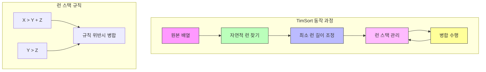

# TimSort

* 개념
    * **TimSort**는 실제 데이터의 특성을 고려한 하이브리드 정렬 알고리즘입니다.
    * Python의 기본 정렬 알고리즘으로 채택되어 있으며, Java에서도 사용됩니다.
    * 특징:
        - Merge Sort와 Insertion Sort의 조합
        - 자연적 런(Natural Run) 활용
        - 적응형 알고리즘 (데이터 패턴에 따라 동작 방식 조정)
        - 안정 정렬(Stable Sort)

* 핵심 구성 요소
    1. 최소 런(Minimum Run)
        - 정렬할 배열을 작은 청크로 나누는 기준
        - 보통 32 또는 64로 설정
        - 시스템의 캐시 크기를 고려하여 결정

    2. 자연적 런(Natural Run)
        - 이미 정렬된 부분 수열
        - 오름차순 또는 내림차순 수열 모두 활용
        - 내림차순인 경우 뒤집어서 사용

    3. 병합 정책(Merge Policy)
        - Run 스택의 크기와 길이를 기반으로 결정
        - X > Y + Z 와 Y > Z 규칙 유지

* 기본 구현
    ```python
    class TimSort:
        def __init__(self, arr):
            self.arr = arr
            self.min_run = 32
            self.n = len(arr)

        def _get_min_run(self, n):
            """최소 런 길이 계산"""
            r = 0
            while n >= self.min_run:
                r |= n & 1
                n >>= 1
            return n + r

        def _insertion_sort(self, left, right):
            """삽입 정렬"""
            for i in range(left + 1, right + 1):
                key = self.arr[i]
                j = i - 1
                while j >= left and self.arr[j] > key:
                    self.arr[j + 1] = self.arr[j]
                    j -= 1
                self.arr[j + 1] = key

        def _merge(self, l, m, r):
            """두 정렬된 배열 병합"""
            left = self.arr[l:m + 1]
            right = self.arr[m + 1:r + 1]
            i = j = 0
            k = l

            while i < len(left) and j < len(right):
                if left[i] <= right[j]:
                    self.arr[k] = left[i]
                    i += 1
                else:
                    self.arr[k] = right[j]
                    j += 1
                k += 1

            while i < len(left):
                self.arr[k] = left[i]
                i += 1
                k += 1

            while j < len(right):
                self.arr[k] = right[j]
                j += 1
                k += 1

        def _find_run(self, start):
            """자연적 런 찾기"""
            if start >= self.n - 1:
                return start + 1

            if self.arr[start + 1] < self.arr[start]:
                # 내림차순 런
                i = start + 1
                while i < self.n and self.arr[i] < self.arr[i - 1]:
                    i += 1
                # 런을 뒤집음
                self.arr[start:i] = reversed(self.arr[start:i])
                return i
            else:
                # 오름차순 런
                i = start + 1
                while i < self.n and self.arr[i] >= self.arr[i - 1]:
                    i += 1
                return i

        def sort(self):
            """TimSort 메인 알고리즘"""
            min_run = self._get_min_run(self.n)
            
            # 런 스택
            runs = []
            start = 0
            
            while start < self.n:
                # 자연적 런 찾기
                run_end = self._find_run(start)
                
                # 최소 런 길이에 맞추기
                if run_end - start < min_run:
                    run_end = min(start + min_run, self.n)
                    self._insertion_sort(start, run_end - 1)
                
                # 런 스택에 추가
                runs.append((start, run_end - 1))
                
                # 병합 조건 검사 및 병합 수행
                self._merge_collapse(runs)
                
                start = run_end
            
            # 남은 런들 모두 병합
            while len(runs) > 1:
                self._merge(runs[-2][0], runs[-2][1], runs[-1][1])
                runs[-2] = (runs[-2][0], runs[-1][1])
                runs.pop()
    ```

* 최적화된 구현 (실제 Python 스타일)
    ```python
    def merge_compute_minrun(n):
        """최적의 minrun 값 계산"""
        r = 0
        while n >= 64:
            r |= n & 1
            n >>= 1
        return n + r

    class TimSortOptimized:
        def __init__(self, arr):
            self.arr = arr
            self.len = len(arr)
            self.min_gallop = 7
            self.temp_storage = [0] * (len(arr) // 2 + 1)

        def _count_run(self, start):
            """최적화된 런 찾기"""
            if start >= self.len - 1:
                return start + 1

            run_len = 2
            if self.arr[start + 1] < self.arr[start]:
                # 내림차순 런
                while (run_len < self.len and 
                       self.arr[start + run_len] < self.arr[start + run_len - 1]):
                    run_len += 1
                # 뒤집기
                left, right = start, start + run_len
                while left < right - 1:
                    self.arr[left], self.arr[right - 1] = \
                        self.arr[right - 1], self.arr[left]
                    left += 1
                    right -= 1
            else:
                # 오름차순 런
                while (run_len < self.len and 
                       self.arr[start + run_len] >= self.arr[start + run_len - 1]):
                    run_len += 1

            return start + run_len

        def _gallop_left(self, key, arr, start, length, hint):
            """갤럽 모드 왼쪽 검색"""
            lastOffset = 0
            offset = 1

            if key > arr[hint]:
                maxOffset = length - hint
                while offset < maxOffset and key > arr[hint + offset]:
                    lastOffset = offset
                    offset = (offset << 1) + 1
                offset = min(offset, maxOffset)
                lastOffset += hint
                offset += hint
            else:
                maxOffset = hint + 1
                while offset < maxOffset and key <= arr[hint - offset]:
                    lastOffset = offset
                    offset = (offset << 1) + 1
                offset = min(offset, maxOffset)
                lastOffset, offset = hint - offset, hint - lastOffset

            lastOffset += 1
            while lastOffset < offset:
                m = lastOffset + ((offset - lastOffset) >> 1)
                if key > arr[m]:
                    lastOffset = m + 1
                else:
                    offset = m
            return offset
    ```

* 시간 복잡도
    * 최선: O(n)
        - 이미 정렬된 데이터
        - 자연적 런이 많은 경우

    * 평균: O(n log n)
        - 일반적인 경우

    * 최악: O(n log n)
        - 역순으로 정렬된 데이터

* 공간 복잡도
    - O(n): 병합 과정에서 필요한 임시 배열

* 장단점
    * 장점
        - 실제 데이터에서 매우 효율적
        - 안정 정렬
        - 적응형 알고리즘
        - 부분적으로 정렬된 데이터에 강점

    * 단점
        - 구현이 복잡
        - 추가 메모리 필요
        - 작은 데이터셋에서는 오버헤드 발생 가능

* 최적화 기법
    1. 갤럽 모드(Galloping Mode)
        ```python
        def _merge_gallop(self, a1, a2):
            """갤럽 모드를 사용한 병합"""
            min_gallop = self.min_gallop
            gallop_count = 0

            while len(a1) > 0 and len(a2) > 0:
                if gallop_count >= min_gallop:
                    # 갤럽 모드 활성화
                    pos = self._gallop_left(a2[0], a1, 0, len(a1), 0)
                    a1[:pos], a1[pos:] = a1[pos:], a1[:pos]
                    gallop_count = 0
                else:
                    # 일반 병합
                    if a1[0] <= a2[0]:
                        result.append(a1.pop(0))
                    else:
                        result.append(a2.pop(0))
                        gallop_count += 1
        ```

    2. 런 스택 최적화
        ```python
        def _merge_collapse(self, run_stack):
            """런 스택 최적화"""
            while len(run_stack) > 1:
                n = len(run_stack)
                if (n >= 3 and run_stack[-3][1] - run_stack[-3][0] <= 
                    run_stack[-2][1] - run_stack[-2][0] + run_stack[-1][1] - run_stack[-1][0]):
                    if run_stack[-3][1] - run_stack[-3][0] < run_stack[-1][1] - run_stack[-1][0]:
                        self._merge_at(run_stack, -3)
                    else:
                        self._merge_at(run_stack, -2)
                elif (n >= 2 and run_stack[-2][1] - run_stack[-2][0] <= 
                      run_stack[-1][1] - run_stack[-1][0]):
                    self._merge_at(run_stack, -2)
                else:
                    break
        ```

* 실제 활용
    1. Python의 기본 정렬
        ```python
        # Python의 내장 정렬 함수
        sorted_list = sorted(my_list)
        my_list.sort()
        ```

    2. Java의 Arrays.sort()
        ```java
        // Java 7 이후 TimSort 사용
        Arrays.sort(array);
        ```

* 마무리
    - TimSort는 실제 데이터의 특성을 고려한 현대적인 정렬 알고리즘
    - Python과 Java의 기본 정렬 알고리즘으로 채택될 만큼 실용적
    - 특히 부분적으로 정렬된 데이터나 실제 응용에서 뛰어난 성능 제공

