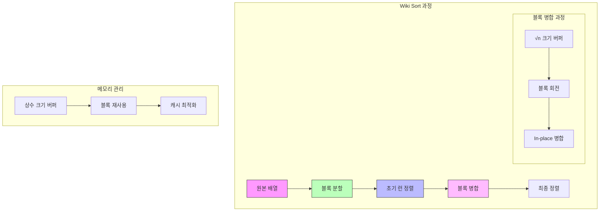

# Wiki Sort

* 개념
    * **Wiki Sort**는 순수 in-place 병합 정렬의 개선된 버전입니다.
    * Block Merge Sort의 변형으로도 알려져 있습니다.
    * 특징:
        - O(1) 추가 메모리만 사용
        - 안정 정렬(Stable Sort)
        - 효율적인 in-place 병합
        - 블록 기반 접근으로 캐시 효율성 향상

* 핵심 구성 요소
    1. 블록(Block)
        - 정렬과 병합의 기본 단위
        - 캐시 라인 크기를 고려한 크기 설정
        - 내부 버퍼로도 활용

    2. 버퍼 관리
        - √n 크기의 내부 버퍼 사용
        - 블록 회전(rotation)으로 공간 절약
        - 효율적인 메모리 재사용

    3. 병합 전략
        - 블록 단위 병합
        - in-place 연산 최적화
        - 버퍼 재활용

* 기본 구현
    ```python
    class WikiSort:
        def __init__(self, arr):
            self.arr = arr
            self.len = len(arr)
            # 블록 크기 계산 (√n에 근접한 값)
            self.block_size = int(len(arr) ** 0.5)
            
        def sort(self):
            if self.len < 2:
                return
                
            # 초기 런 생성 및 정렬
            self._sort_runs()
            
            # 블록 병합
            self._merge_runs()
            
        def _sort_runs(self):
            """초기 런 생성 및 정렬"""
            for i in range(0, self.len, self.block_size):
                end = min(i + self.block_size, self.len)
                self._insertion_sort(i, end)
                
        def _insertion_sort(self, start, end):
            """부분 배열 삽입 정렬"""
            for i in range(start + 1, end):
                temp = self.arr[i]
                j = i - 1
                while j >= start and self.arr[j] > temp:
                    self.arr[j + 1] = self.arr[j]
                    j -= 1
                self.arr[j + 1] = temp
                
        def _merge_runs(self):
            """정렬된 런들을 병합"""
            # √n 크기의 버퍼 확보
            buffer_size = self.block_size
            buffer = []
            
            # 버퍼에 사용할 값들 찾기
            for i in range(self.len - buffer_size, self.len):
                buffer.append(self.arr[i])
                
            # 버퍼 정렬
            buffer.sort()
            
            # 블록 단위로 병합
            curr_size = self.block_size
            while curr_size < self.len:
                for start in range(0, self.len - curr_size, curr_size * 2):
                    mid = start + curr_size
                    end = min(start + curr_size * 2, self.len)
                    self._merge_blocks(start, mid, end, buffer)
                curr_size *= 2
    ```

* 최적화된 병합 구현
    ```python
    def _merge_blocks(self, start, mid, end, buffer):
        """효율적인 in-place 블록 병합"""
        # 왼쪽과 오른쪽 블록의 크기
        left_size = mid - start
        right_size = end - mid
        
        if left_size == 0 or right_size == 0:
            return
            
        # 버퍼를 사용한 병합
        if left_size <= len(buffer):
            # 왼쪽 블록을 버퍼에 저장
            buffer_temp = self.arr[start:mid]
            
            # 오른쪽 블록과 버퍼의 값을 비교하며 병합
            i = 0  # 버퍼 인덱스
            j = mid  # 오른쪽 블록 인덱스
            k = start  # 결과 배열 인덱스
            
            while i < left_size and j < end:
                if buffer_temp[i] <= self.arr[j]:
                    self.arr[k] = buffer_temp[i]
                    i += 1
                else:
                    self.arr[k] = self.arr[j]
                    j += 1
                k += 1
                
            # 남은 버퍼의 값들을 복사
            while i < left_size:
                self.arr[k] = buffer_temp[i]
                i += 1
                k += 1
        else:
            # 블록 회전을 사용한 병합
            while left_size > 0 and right_size > 0:
                if self.arr[start] <= self.arr[mid]:
                    start += 1
                    left_size -= 1
                else:
                    # 오른쪽 값을 왼쪽으로 회전
                    temp = self.arr[mid]
                    index = mid
                    while index > start:
                        self.arr[index] = self.arr[index - 1]
                        index -= 1
                    self.arr[start] = temp
                    
                    start += 1
                    mid += 1
                    right_size -= 1
    ```

* 시간 복잡도
    |연산|복잡도|설명|
    |---|------|-----|
    |최선|O(n log n)|항상 동일|
    |평균|O(n log n)|항상 동일|
    |최악|O(n log n)|항상 동일|

* 공간 복잡도
    - O(1): 상수 크기의 추가 메모리

* 장단점
    1. 장점
        - 매우 적은 추가 메모리 사용
        - 안정 정렬
        - 캐시 효율적
        - 예측 가능한 성능

    2. 단점
        - 구현이 복잡
        - 최적의 블록 크기 선정 필요
        - 일부 연산이 캐시 지역성을 해칠 수 있음

* 최적화 기법
    1. 블록 크기 최적화
        ```python
        def optimize_block_size(n):
            """최적의 블록 크기 계산"""
            # 캐시 라인 크기와 배열 크기 고려
            cache_line = 64  # bytes
            min_size = 16    # 최소 블록 크기
            sqrt_n = int(n ** 0.5)
            
            # 캐시 라인의 배수로 조정
            block_size = ((sqrt_n + cache_line - 1) 
                         // cache_line) * cache_line
            return max(min_size, block_size)
        ```

    2. 버퍼 관리 최적화
        ```python
        class OptimizedBuffer:
            def __init__(self, size):
                self.data = [0] * size
                self.start = 0
                self.length = 0
                
            def push(self, value):
                """순환 버퍼에 값 추가"""
                index = (self.start + self.length) % len(self.data)
                self.data[index] = value
                if self.length < len(self.data):
                    self.length += 1
                else:
                    self.start = (self.start + 1) % len(self.data)
                    
            def get(self, index):
                """버퍼에서 값 조회"""
                return self.data[(self.start + index) % len(self.data)]
        ```

* 실제 활용
    1. 메모리 제한 환경
        ```python
        class MemoryConstrainedSort:
            def __init__(self, max_memory):
                self.max_memory = max_memory
                self.wiki_sort = WikiSort()
                
            def sort_large_file(self, filename):
                """제한된 메모리로 대용량 파일 정렬"""
                # 파일을 블록 단위로 읽어서 정렬
                pass
        ```

    2. 임베디드 시스템
        ```cpp
        template<typename T>
        class EmbeddedSort {
        private:
            static const size_t BLOCK_SIZE = 16;  // 작은 메모리 환경
            
        public:
            void sort(T* arr, size_t length) {
                WikiSort sorter(arr, length, BLOCK_SIZE);
                sorter.sort();
            }
        };
        ```

* 마무리
    - Wiki Sort는 메모리 효율적인 in-place 정렬 알고리즘
    - Block Merge Sort의 개선된 버전으로 실용적
    - 특히 메모리 제한이 있는 환경에서 유용
    - 구현은 복잡하지만 안정적인 성능 제공

