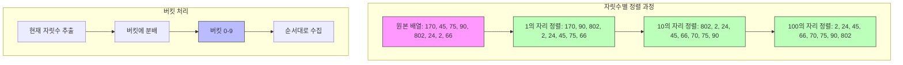

# 기수 정렬 (Radix Sort)

* 기수 정렬의 개념:
    * 기수 정렬은 비교 기반이 아닌 정렬 알고리즘입니다.
    * 데이터를 자릿수별로 정렬하여 전체를 정렬하는 방식입니다.
    * 각 자릿수별로 버킷(또는 카운팅) 정렬을 수행합니다.
    * 낮은 자릿수부터 높은 자릿수 순으로 정렬(LSD, Least Significant Digit)하거나
    * 높은 자릿수부터 낮은 자릿수 순으로 정렬(MSD, Most Significant Digit)할 수 있습니다.

* 동작 과정
    1. 데이터의 최대 자릿수를 파악합니다.
    2. 가장 낮은 자릿수부터 시작하여 각 자릿수별로 정렬합니다.
    3. 각 자릿수마다 버킷(0-9)에 숫자를 분배합니다.
    4. 버킷에서 순서대로 숫자를 다시 가져옵니다.
    5. 모든 자릿수에 대해 2-4 과정을 반복합니다.

* 기본 구현
    ```python
    def radix_sort(arr):
        # 최대값의 자릿수 찾기
        max_num = max(arr)
        exp = 1
        
        while max_num // exp > 0:
            counting_sort(arr, exp)
            exp *= 10
            
    def counting_sort(arr, exp):
        n = len(arr)
        output = [0] * n
        count = [0] * 10
        
        # 현재 자릿수를 기준으로 카운트
        for i in range(n):
            idx = arr[i] // exp
            count[idx % 10] += 1
        
        # 누적합 계산
        for i in range(1, 10):
            count[i] += count[i - 1]
        
        # 뒤에서부터 배치하여 안정성 유지
        i = n - 1
        while i >= 0:
            idx = arr[i] // exp
            output[count[idx % 10] - 1] = arr[i]
            count[idx % 10] -= 1
            i -= 1
        
        # 원본 배열에 복사
        for i in range(n):
            arr[i] = output[i]
    ```
    ```cpp
    void countingSort(vector<int>& arr, int exp) {
        vector<int> output(arr.size());
        vector<int> count(10, 0);
        
        // 현재 자릿수 기준으로 카운트
        for(int i = 0; i < arr.size(); i++)
            count[(arr[i] / exp) % 10]++;
            
        // 누적합 계산
        for(int i = 1; i < 10; i++)
            count[i] += count[i - 1];
            
        // 뒤에서부터 배치
        for(int i = arr.size() - 1; i >= 0; i--) {
            output[count[(arr[i] / exp) % 10] - 1] = arr[i];
            count[(arr[i] / exp) % 10]--;
        }
        
        // 원본 배열에 복사
        for(int i = 0; i < arr.size(); i++)
            arr[i] = output[i];
    }

    void radixSort(vector<int>& arr) {
        int max_num = *max_element(arr.begin(), arr.end());
        
        for(int exp = 1; max_num / exp > 0; exp *= 10)
            countingSort(arr, exp);
    }
    ```

* 최적화된 구현 (문자열용)
    ```python
    def radix_sort_strings(arr):
        # 가장 긴 문자열의 길이 찾기
        max_len = len(max(arr, key=len))
        
        # 문자열 길이를 동일하게 만들기 (패딩)
        padded = [s.ljust(max_len) for s in arr]
        
        # 뒤에서부터 각 위치별로 정렬
        for pos in range(max_len - 1, -1, -1):
            # 해당 위치의 문자를 기준으로 안정 정렬
            buckets = [[] for _ in range(128)]  # ASCII
            
            for s in padded:
                buckets[ord(s[pos])].append(s)
            
            # 버킷에서 순서대로 가져오기
            padded = [s for bucket in buckets for s in bucket]
        
        # 패딩 제거하고 결과 반환
        return [s.rstrip() for s in padded]
    ```

* 시간 복잡도
    * O(d * (n + k))
        - d: 자릿수
        - n: 데이터 개수
        - k: 각 자릿수의 표현 범위 (보통 10)
    
    * 특징:
        - 자릿수가 고정되어 있다면 O(n)
        - 비교 기반 정렬의 이론적 하한선 O(n log n)을 뛰어넘을 수 있음
        - 안정 정렬(stable sort)임

* 공간 복잡도
    - O(n + k): 임시 배열과 카운팅 배열 필요

* 장단점
    * 장점
        - 특정 조건에서 매우 빠른 성능
        - 비교 연산이 없음
        - 안정 정렬
        - 정수나 문자열에 효과적

    * 단점
        - 추가 메모리 필요
        - 자릿수가 많으면 비효율적
        - 음수 처리를 위해 추가 작업 필요
        - 부동 소수점에는 직접 적용 어려움

* 실제 응용 사례
    - 카드 정렬 (숫자/문자 기준)
    - 정수 데이터 정렬
    - 고정 길이 문자열 정렬
    - 네트워크 IP 주소 정렬
    - 날짜/시간 데이터 정렬

* 변형 및 최적화
    ```python
    def optimized_radix_sort(arr):
        """비트 연산을 활용한 최적화된 기수 정렬"""
        # 음수 처리
        min_val = min(arr)
        if min_val < 0:
            arr = [x - min_val for x in arr]
        
        max_val = max(arr)
        exp = 1
        bits = 8  # 한 번에 처리할 비트 수
        
        while exp <= max_val:
            buckets = [[] for _ in range(1 << bits)]
            mask = (1 << bits) - 1
            
            # 비트 마스킹으로 버킷 인덱스 계산
            for num in arr:
                idx = (num // exp) & mask
                buckets[idx].append(num)
            
            # 버킷에서 순서대로 가져오기
            arr = [num for bucket in buckets for num in bucket]
            exp <<= bits
        
        # 음수 처리 복원
        if min_val < 0:
            arr = [x + min_val for x in arr]
        
        return arr
    ```

* 다른 정렬 알고리즘과의 비교

| 알고리즘 | 시간 복잡도 (평균) | 공간 복잡도 | 안정성 | 제자리 정렬 |
|----------|-------------------|-------------|--------|------------|
| 퀵 정렬   | O(n log n)       | O(log n)    | X      | O          |
| 병합 정렬 | O(n log n)       | O(n)        | O      | X          |
| 기수 정렬 | O(d(n + k))      | O(n + k)    | O      | X          |

* 특수한 경우의 최적화
    1. 숫자 범위가 작은 경우
        - 카운팅 정렬 사용이 더 효율적
    
    2. 문자열 길이가 매우 다른 경우
        - MSD 방식이 더 효율적
    
    3. 메모리가 제한적인 경우
        - 버킷 크기를 줄이고 여러 패스 사용

* 마무리
    - 기수 정렬은 특정 조건에서 매우 효율적인 정렬 알고리즘
    - 데이터의 특성을 잘 파악하여 적절한 구현 방식 선택 필요
    - 실무에서는 주로 정수나 문자열 데이터 정렬에 활용

