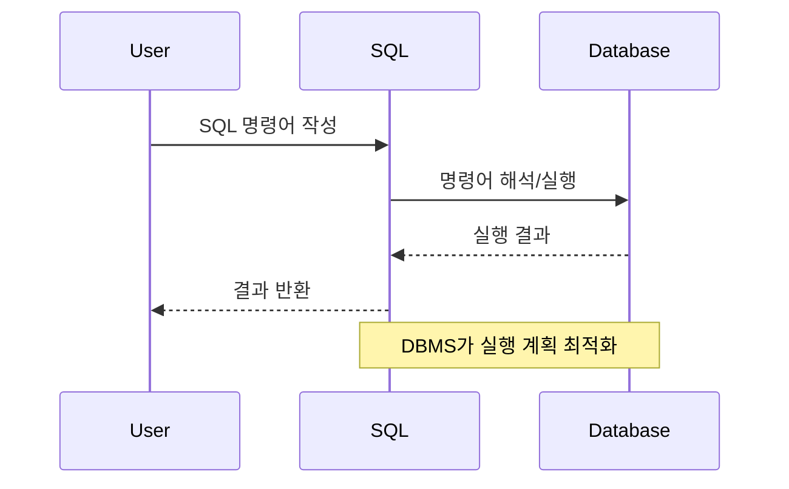
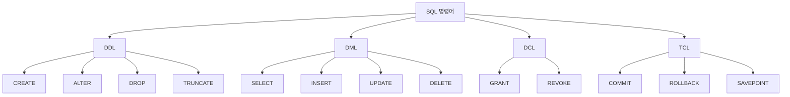
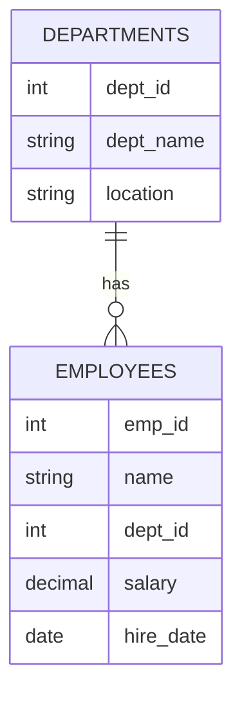
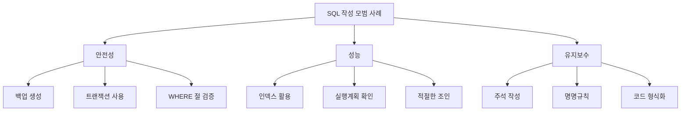

# SQL 명령어 기초

## 1. SQL 명령어란?

SQL(Structured Query Language)은 **데이터베이스와 상호작용하기 위한 표준 언어**입니다. 데이터의 정의, 조작, 제어를 위한 포괄적인 명령어 집합을 제공합니다.

### 1.1 SQL의 특징

1. **선언적 언어**
  - 원하는 결과를 명시
  - 실행 방법은 DBMS가 결정
  - 높은 추상화 수준 제공

2. **표준화된 문법**
  - ANSI/ISO 표준 준수
  - 다양한 DBMS에서 호환
  - 일관된 사용법 제공

### 1.2 데이터베이스 상호작용



**주요 용도**

1. **데이터 정의**
  - 데이터베이스 구조 생성
  - 테이블과 관계 정의
  - 제약조건 설정

2. **데이터 조작**
  - 데이터 검색 및 조회
  - 데이터 입력, 수정, 삭제
  - 데이터 분석 및 집계

3. **데이터 제어**
  - 접근 권한 관리
  - 보안 설정
  - 무결성 유지

**SQL은 이러한 기능들을 체계적으로 분류하여 제공하며, 다음 섹션에서 각 분류별 명령어들을 자세히 살펴보도록 하겠습니다.**

---

## 2. SQL 명령어의 주요 분류

SQL 명령어는 그 용도에 따라 크게 4가지 범주로 분류됩니다.

### 2.1 주요 분류 체계


### 2.2 DDL(Data Definition Language)
- **데이터베이스 구조를 정의하는 언어**
- 테이블, 스키마, 인덱스 등의 객체 처리
- 대표 명령어: CREATE, ALTER, DROP, TRUNCATE
```sql
-- 테이블 생성 예시
CREATE TABLE employees (
    id INT PRIMARY KEY,
    name VARCHAR(100),
    department VARCHAR(50),
    salary DECIMAL(10,2)
);
```

### 2.3 DML(Data Manipulation Langauge)
- **데이터를 조작하는 언어**
- 데이터 검색, 삽입, 수정, 삭제 작업 수행
- 대표 명령어: SELECT, INSERT, UPDATE, DELETE
```sql
-- 데이터 조회 예시
SELECT name, salary 
FROM employees 
WHERE department = 'IT';
```

### 2.4 DCL(Data Control Langauge)
- **데이터베이스 접근 권한을 제어하는 언어**
- 보안과 권한 관리 담당
- 대표 명령어: GRANT, REVOKE
```sql
-- 권한 부여 예시
GRANT SELECT, INSERT ON employees TO user_role;
```

### 2.5 TCL(Transaction Control Langauge)
- **트랜잭션을 제어하는 언어**
- 데이터의 일관성을 유지
- 대표 명령어: COMMIT, ROLLBACK, SAVEPOINT
```sql
-- 트랜잭션 제어 예시
BEGIN TRANSACTION;
UPDATE accounts SET balance = balance - 100 WHERE id = 1;
COMMIT;
```

**각 분류의 특징을 이해하는 것은 SQL을 효과적으로 사용하기 위한 기본이 됩니다. 다음 섹션에서는 각 명령어의 구체적인 문법과 사용법을 살펴보겠습니다.**

---

## 3. 각 명령어의 기본 문법

SQL 명령어의 각 유형별 기본 문법과 주요 사용법을 살펴보겠습니다.

### 3.1 DDL(Data Definition Langauge) 문법

1. **CREATE**
  - 용도: 데이터베이스 객체(데이터베이스, 테이블, 인덱스 등)를 생성
  - 사용 시기: 새로운 데이터베이스나 테이블을 만들어야 할 때
  - 주의사항: 이미 존재하는 이름으로 생성 시 에러 발생

  ```sql
  -- 데이터베이스 생성
  CREATE DATABASE database_name;

  -- 테이블 생성: 직원 정보를 저장하는 테이블 예시
  CREATE TABLE employees (
      id INT PRIMARY KEY,  -- 직원 고유 번호
      name VARCHAR(100),   -- 직원 이름
      dept VARCHAR(50),    -- 부서명
      salary DECIMAL(10,2) -- 급여
  );

  -- 인덱스 생성: 자주 검색하는 열에 대한 검색 속도 향상
  CREATE INDEX idx_employee_name
  ON employees (name);
  ```

2. **ALTER**
  - 용도: 기존 데이터베이스 객체의 구조를 변경
  - 사용 시기: 테이블의 구조를 수정해야 할 때(컬럼 추가/수정/삭제)
  - 주의사항: 데이터가 있는 상태에서의 변경은 신중히 검통

  ```sql
  -- 새로운 컬럼 추가: 입사일자 정보 추가
  ALTER TABLE employees
  ADD hire_date DATE;

  -- 컬럼 타입 수정: 이름 길이 제한 변경
  ALTER TABLE employees
  MODIFY name VARCHAR(150);

  -- 컬럼 삭제: 불필요한 컬럼 제거
  ALTER TABLE employees
  DROP COLUMN unused_column;
  ```

3. **DROP**
  - 용도: 데이터베이스 객체를 삭제
  - 사용 시기: 더 이상 필요없는 객체를 제거할 때
  - 주의사항: 삭제 후 복구 불가능, 신중하게 사용

  ```sql
  -- 테이블 삭제
  DROP TABLE employees;

  -- 데이터베이스 삭제
  DROP DATABASE company_db;

  -- 인덱스 삭제
  DROP INDEX idx_employee_name;
  ```

4. **TRUNCATE**
  - 용도: 테이블의 모든 데이터를 빠르게 삭제
  - 사용 시기: 테이블 구조는 유지하고 데이터만 모두 삭제할 때
  - 주의사항: DELETE와 달리 롤백 불가능

  ```sql
  -- 직원 테이블의 모든 데이터 삭제
  TRUNCATE TABLE employees;
  ```

### 3.2 DML(Data Manipulation Langauge) 문법

1. **SELECT**
  - 용도: 데이터 조회 및 검색
  - 사용 시기: 데이터를 조회하거나 분석해야 할 때
  - 특징: 가장 자주 사용되는 명령어, 다양한 조건 함수 사용 가능

  ```sql
  -- 기본 데이터 조회: IT 부서의 직원 목록 조회
  SELECT name, salary
  FROM employees
  WHERE dept = 'IT'
  ORDER BY salary DESC;

  -- 그룹화된 데이터 조회: 부서별 평균 급여
  SELECT dept, AVG(salary) as avg_salary
  FROM employees
  GROUP BY dept
  HAVING AVG(salary) > 50000;
  ```

2. **INSERT**
  - 용도: 새로운 데이터 추가
  - 사용 시기: 테이블에 새 레코드를 추가할 때
  - 주의사항: 필수 컬럼 값 누락 시 에러 발생

  ```sql
  -- 단일 직원 정보 추가
  INSERT INTO employees (id, name, dept, salary)
  VALUES (1, 'John Doe', 'IT', 60000);

  -- 여러 직원 정보 동시 추가
  INSERT INTO employees (id, name, dept, salary)
  VALUES 
      (2, 'Jane Smith', 'HR', 55000),
      (3, 'Bob Wilson', 'IT', 65000);
  ```

3. **UPDATE**
  - 용도: 기존 데이터 수정
  - 사용 시기: 저장된 데이터의 값을 변경해야 할 때
  - 주의사항: WHERE절 누락 시 전체 데이터가 수정될 수 있음

  ```sql
  -- 특정 직원의 급여 인상
  UPDATE employees
  SET salary = salary * 1.1
  WHERE dept = 'IT';

  -- 여러 컬럼 동시 수정
  UPDATE employees
  SET salary = 70000,
      dept = 'Engineering'
  WHERE id = 1;
  ```

4. **DELETE**
  - 용도: 데이터 삭제
  - 사용 시기: 특정 데이터를 제거해야 할 때
  - 특징: TRUNCATE와 달리 조건부 삭제 가능, 롤백 가능

### 3.3 DCL(Data Control Langauge) 문법

1. **GRANT**
  - 용도: 사용자에게 권한 부여
  - 사용 시기: 새로운 사용자나 역할에 권한을 설정할 때
  - 중요성: 데이터베이스 보안의 핵심 요소
  
  ```sql
  -- 읽기 권한 부여
  GRANT SELECT 
  ON employees 
  TO hr_user;

  -- 여러 권한 동시 부여
  GRANT SELECT, INSERT, UPDATE
  ON employees
  TO manager_role;
  ```

2. **REVOKE**
  - 용도: 사용자의 권한 회수
  - 사용 시기: 기존에 부여된 권한을 제거해야 할 때
  - 주의사항: 권한 회수 시 해당 권한으로 생성된 객체도 영향 받을 수 있음

  ```sql
  -- 특정 권한 회수
  REVOKE UPDATE 
  ON employees 
  FROM hr_user;

  -- 모든 권한 회수
  REVOKE ALL PRIVILEGES
  ON employees
  FROM temp_user;
  ```

### 3.4 TCL(Transaction Control Langauge) 문법

1. **COMMIT**
  - 용도: 트랜잭션의 변경사항을 영구적으로 저장
  - 사용 시기: 일련의 작업이 성공적으로 완료되었을 때
  - 특징: 변경사항을 데이터베이스에 영구적으로 반영

  ```sql
  -- 급여 갱신 트랜잭션
  BEGIN TRANSACTION;
      UPDATE employees SET salary = salary * 1.1;
      UPDATE department_budget SET total = total + 1000000;
  COMMIT;
  ```

2. **ROLLBACK**
  - 용도: 트랜잭션의 변경사항을 취소하고 이전 상태로 복원
  - 사용 시기: 작업 중 오류가 발생하거나 변경을 취소해야 할 때
  - 중요성: 데이터 일관성 유지를 위한 핵심 기능

  ```sql
  -- 실수로 한 변경 취소
  BEGIN TRANSACTION;
      DELETE FROM employees;  -- 실수로 모든 직원 삭제
      ROLLBACK;  -- 삭제 취소
  ```

3. **SAVEPOINT**
  - 용도: 트랜잭션 내에 중간 저장점을 생성
  - 사용 시기: 복잡한 트랜잭션에서 부분적 롤백이 필요할 떄
  - 특징: 트랜잭션의 특정 지점으로 롤백 가능

  ```sql
  -- 부분적 롤백 시나리오
  BEGIN TRANSACTION;
      INSERT INTO employees VALUES (1, 'John', 'IT', 50000);
      SAVEPOINT insert_done;
      
      UPDATE employees SET salary = 0;  -- 실수로 잘못된 갱신
      ROLLBACK TO insert_done;  -- 갱신만 취소하고 INSERT는 유지
  COMMIT;
  ```

---

## 4. 명령어별 사용 사례

실제 업무에서 발생할 수 있는 시나리오를 바탕으로 SQL 명령어의 활용 사례를 살펴보겠습니다.

### 4.1 직원 관리 시스템 사례

1. **테이블 구조 생성 및 구조 설정 (DDL)**
```sql
-- 부서 테이블 생성
CREATE TABLE departments (
    dept_id INT PRIMARY KEY,
    dept_name VARCHAR(50),
    location VARCHAR(100)
);

-- 직원 테이블 생성
CREATE TABLE employees (
    emp_id INT PRIMARY KEY,
    name VARCHAR(100),
    dept_id INT,
    salary DECIMAL(10,2),
    hire_date DATE,
    FOREIGN KEY (dept_id) REFERENCES departments(dept_id)
);
```



2. **데이터 입력 및 수정(DML)**
```sql
-- 부서 데이터 입력
INSERT INTO departments VALUES
(1, 'IT', 'Seoul'),
(2, 'HR', 'Busan'),
(3, 'Marketing', 'Seoul');

-- 직원 데이터 입력
INSERT INTO employees VALUES
(101, 'John Doe', 1, 60000, '2023-01-15'),
(102, 'Jane Smith', 2, 55000, '2023-02-20'),
(103, 'Bob Wilson', 1, 65000, '2023-03-10');

-- IT 부서 직원 급여 인상
UPDATE employees 
SET salary = salary * 1.1
WHERE dept_id = 1;

-- 퇴사한 직원 정보 삭제
DELETE FROM employees
WHERE emp_id = 102;
```

3. **데이터 분석 쿼리(DML-SELECT)**
```sql
-- 부서별 평균 급여
SELECT d.dept_name, 
       COUNT(e.emp_id) as emp_count,
       AVG(e.salary) as avg_salary
FROM departments d
LEFT JOIN employees e ON d.dept_id = e.dept_id
GROUP BY d.dept_name
ORDER BY avg_salary DESC;

-- 최근 입사자 목록
SELECT name, dept_id, hire_date
FROM employees
WHERE hire_date >= DATE_SUB(CURRENT_DATE, INTERVAL 3 MONTH)
ORDER BY hire_date DESC;
```

4. **권한 관리 사나리오(DCL)**
```sql
-- HR 담당자 권한 설정
GRANT SELECT, INSERT, UPDATE ON employees TO hr_admin;
GRANT SELECT ON departments TO hr_admin;

-- 임시 직원 권한 회수
REVOKE INSERT, UPDATE ON employees FROM temp_user;
```

5. **트랜잭션 처리 사례(TCL)**
```sql
-- 부서 이동 및 급여 조정 트랜잭션
BEGIN TRANSACTION;
    -- 직원의 부서 변경
    UPDATE employees 
    SET dept_id = 3 
    WHERE emp_id = 101;
    
    -- 급여 조정
    UPDATE employees 
    SET salary = 70000 
    WHERE emp_id = 101;
    
    -- 모든 변경사항이 정상적이면 커밋
    COMMIT;
```

---

## 5. SQL 명령어 활용 팁

효율적이고 안전한 SQL 명령어 사용을 위한 주요 팁들을 알아보겠습니다.

### 5.1 명령어 작성 주의사항

1. **데이터 안정성**
  - **백업 생성**
    ```sql
    -- 테이블 백업 생성
    CREATE TABLE employees_backup AS 
    SELECT * FROM employees;
    ```

  - **WHERE 절 검증**
    ```sql
    -- UPDATE/DELETE 전 SELECT로 영향받을 데이터 확인
    SELECT * FROM employees WHERE dept_id = 1;
    -- 확인 후 실제 수정/삭제 실행
    UPDATE employees SET salary = salary * 1.1 WHERE dept_id = 1;
    ```

2. **성능 최적화**
  - **인덱스 활용**
    ```sql
    -- 자주 검색되는 컬럼에 인덱스 생성
    CREATE INDEX idx_emp_dept ON employees(dept_id);
    CREATE INDEX idx_emp_name ON employees(name);
    ```

  - **효율적인 조인**
    ```sql
    -- 불필요한 조인 제거, 적절한 조인 조건 사용
    SELECT e.name, d.dept_name
    FROM employees e
    INNER JOIN departments d ON e.dept_id = d.dept_id
    WHERE e.salary > 50000;
    ```



### 5.2 효율적인 쿼리 작성 전략

1. **명확한 컬럼 지정**
```sql
-- 안좋은 예
SELECT * FROM employees;

-- 좋은 예
SELECT emp_id, name, dept_id, salary 
FROM employees;
```

2. **조건절 최적화**
```sql
-- 안좋은 예
SELECT * FROM employees 
WHERE UPPER(name) = 'JOHN';

-- 좋은 예
SELECT * FROM employees 
WHERE name = 'John';
```

3. **배치 처리 활용**
```sql
-- 대량 데이터 처리 시 배치 단위로 처리
UPDATE employees 
SET salary = salary * 1.1
WHERE emp_id BETWEEN 1 AND 1000;
```

### 5.3 SQL 표준 준수와 확장성 고려

1. **표준 SQL 사용**
```sql
-- 표준 날짜 함수 사용
SELECT * FROM employees
WHERE hire_date >= DATE_SUB(CURRENT_DATE, INTERVAL 1 YEAR);
```

2. **이식성 고려**
```sql
-- DBMS 종속적인 기능 지양
-- AUTO_INCREMENT 대신 IDENTITY 사용
CREATE TABLE employees (
    emp_id INTEGER GENERATED ALWAYS AS IDENTITY,
    name VARCHAR(100)
);
```

### 5.4 추가 권장 사항

1. **명명 규칙 준수**
  - 일관된 테이블/컬럼명 사용
  - 의미있는 이름 부여
  - 예약어 사용 피하기

2. **문서화와 주석**
```sql
-- 복잡한 쿼리에 대한 설명 추가
/* 부서별 급여 통계 산출
   - 부서별 평균/최대/최소 급여 계산
   - 전년 대비 증가율 포함
   - 최근 1년간의 데이터만 대상
*/
SELECT dept_id,
       AVG(salary) as avg_salary,
       MAX(salary) as max_salary,
       MIN(salary) as min_salary
FROM employees
WHERE hire_date >= DATE_SUB(CURRENT_DATE, INTERVAL 1 YEAR)
GROUP BY dept_id;
```

---

## 6. SQL 명령어 정리 및 결론

### 6.1 핵심 내용 요약

1. **SQL 명령어의 체계**
  - DDL: 데이터베이스 구조 정의
  - DML: 데이터 조작 및 질의
  - DCL: 접근 권한 관리
  - TCL: 트랜잭션 제어

2. **주요 사용 시나리오**
  - 테이블 생성 및 구조 변경 (DDL)
  - 데이터 입력, 수정, 삭제, 조회 (DML)
  - 사용자 권한 관리 (DCL)
  - 데이터 일관성 유지 (TCL)

### 6.2 실무 적용을 위한 체크리스트

1. **명령어 사용 전 확인사항**
  - [ ] 백업이 준비되어 있는가?
  - [ ] WHERE 절이 정확한가?
  - [ ] 영향받는 데이터의 범위를 파악했는가?
  - [ ] 필요한 권한이 있는가?

2. **성능 최적화 고려사항**
  - [ ] 적절한 인덱스가 있는가?
  - [ ] 실행 계획을 확인했는가?
  - [ ] 대량 데이터 처리 시 배치 전략을 수립했는가?
  - [ ] 조인 조건이 최적화되어 있는가?

### 6.3 학습 및 실습 권장사항

1. **단계별 학습 접근**
  ```plaintext
  기본 문법 숙지 → 간단한 쿼리 작성 → 복잡한 쿼리 도전 → 성능 최적화
  ```

2. **실습 환경 구성**
  ```plaintext
  로컬 데이터베이스 설치 → 샘플 데이터 준비 → 다양한 시나리오 실습
  ```

**마무리**
SQL 명령어는 데이터베이스 운영의 기본이자 핵심입니다. 각 명령어의 특성과 용도를 이해하고, 적절한 상황에서 올바르게 사용하는 것이 중요합니다. 지속적인 실습과 실무 적용을 통해 SQL 활용 능력을 향상시키시기 바랍니다.