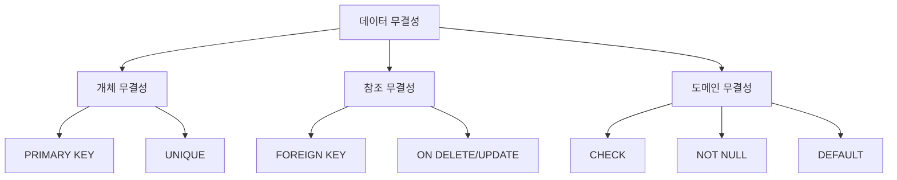
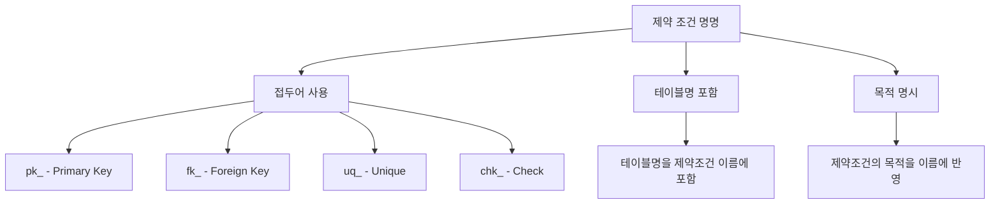
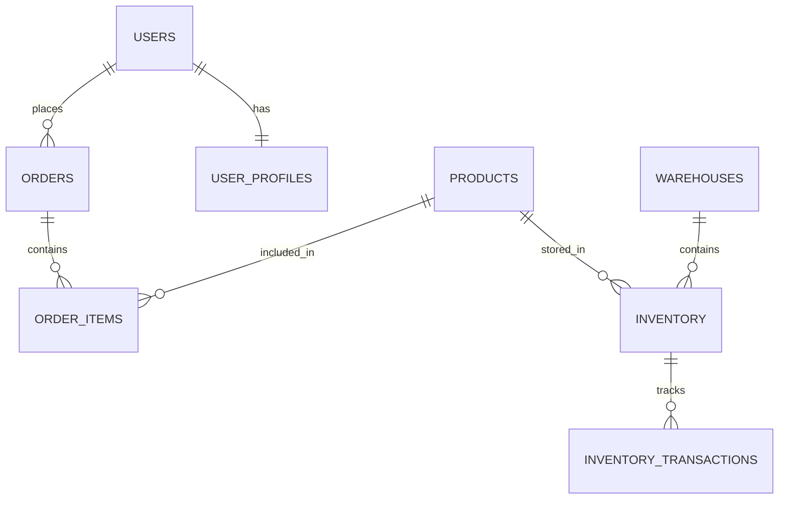
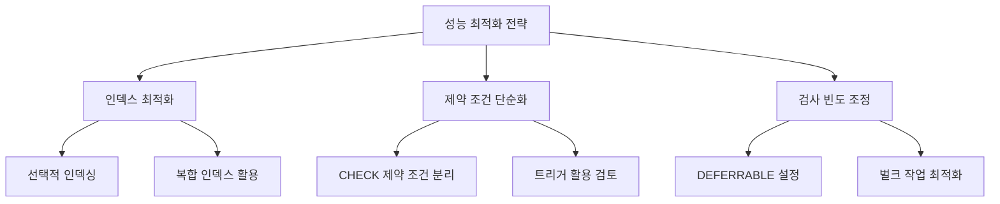
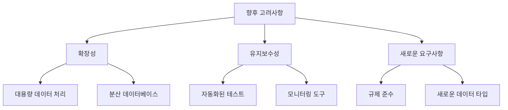

# 데이터베이스 제약 조건 (Database Constraints)

데이터베이스에서 **제약 조건(Constraints)**은 데이터의 무결성과 일관성을 보장하기 위한 규칙입니다.  
이 문서에서는 제약 조건의 개념부터 실제 활용 방법, 그리고 모범 사례까지 상세히 다룹니다.

> 최근 업데이트: 2025-01-19  
> Database Constraints Guide v1.0

---

## 1. 들어가기 (Introduction)

### 1.1 문서의 목적

데이터베이스 제약 조건은 데이터의 정확성과 신뢰성을 보장하는 핵심 요소입니다. 특히 대규모 시스템과 복잡한 데이터 관계에서는 더욱 중요해졌습니다. 이 문서는 다음을 목표로 합니다:

- 제약 조건의 **기본 개념과 원리** 이해
- 다양한 제약 조건(**PRIMARY KEY, FOREIGN KEY, UNIQUE** 등)의 특징과 활용
- 실제 프로젝트에 적용 가능한 **구체적인 구현 방법**
- 데이터 무결성 보장을 위한 **전략과 모범 사례**

### 1.2 왜 제약 조건이 중요한가?

현대 데이터베이스 시스템에서 제약 조건은 다음과 같은 상황에서 필수적입니다:

- 데이터의 정확성 보장
- 데이터 간의 관계 유지
- 비즈니스 규칙 강제
- 데이터 품질 관리

제약 조건이 없거나 부적절할 경우 다음과 같은 위험이 있습니다:

- 데이터 불일치
- 중복 데이터 발생
- 참조 무결성 위반
- 비즈니스 로직 오류

### 1.3 학습 목표

이 문서를 통해 다음을 학습할 수 있습니다:

1. 제약 조건의 기본 개념 이해
2. 각 제약 조건의 특징과 사용법 습득
3. 제약 조건 설계 및 구현 방법
4. 데이터 무결성 전략 수립
5. 실제 DBMS에서의 활용 기법

---

## 2. 제약 조건 기초 (Basic Concepts)

### 2.1 제약 조건과 데이터 무결성

#### 2.1.1 개념 정의

**제약 조건(Constraint)**
- 데이터베이스에서 정의되는 규칙이나 제한사항
- 데이터의 정확성, 일관성, 신뢰성을 보장
- 데이터베이스 스키마 레벨에서 강제되는 규칙

**데이터 무결성(Data Integrity)**
- 데이터의 정확성과 일관성을 유지하는 것
- 데이터의 수명 주기 전반에 걸쳐 보장되어야 함
- 제약 조건을 통해 구현됨

#### 2.1.2 무결성의 종류

1. **개체 무결성(Entity Integrity)**
  - 테이블의 모든 행이 고유하게 식별 가능해야 함
  - PRIMARY KEY 제약 조건으로 구현
  - NULL 값이나 중복값 허용하지 않음

2. **참조 무결성(Referential Integrity)**
  - 테이블 간의 관계가 일관되게 유지되어야 함
  - FOREIGN KEY 제약 조건으로 구현
  - 부모-자식 테이블 간의 관계 보장

3. **도메인 무결성(Domain Integrity)**
  - 컬럼의 값이 정의된 도메인에 속해야 함
  - CHECK, NOT NULL 등의 제약 조건으로 구현
  - 데이터 타입, 기본값, 체크 조건 등을 포함



### 2.2 제약 조건의 적용 범위

#### 2.2.1 컬럼 레벨 제약 조건
- 단일 컬럼에 적용되는 제약 조건
- 컬럼 정의와 함께 선언

```sql
CREATE TABLE employees (
    id INT PRIMARY KEY,           -- 컬럼 레벨 제약 조건
    email VARCHAR(100) UNIQUE,    -- 컬럼 레벨 제약 조건
    salary DECIMAL CHECK (salary > 0)  -- 컬럼 레벨 제약 조건
);
```

#### 2.2.2 테이블 레벨 제약조건
- 여러 컬럼에 걸쳐 적용되는 제약조건
- 테이블 정의 마지막에 선언

```sql
CREATE TABLE order_items (
    order_id INT,
    product_id INT,
    quantity INT,
    CONSTRAINT pk_order_items PRIMARY KEY (order_id, product_id),
    CONSTRAINT fk_orders FOREIGN KEY (order_id) 
        REFERENCES orders(id)
);
```

### 2.3 제약 조건의 명명 규칙

#### 2.3.1 명시적 이름 지정
```sql
-- 권장되는 명명 규칙
CONSTRAINT pk_users PRIMARY KEY (id)
CONSTRAINT fk_department FOREIGN KEY (dept_id)
CONSTRAINT uq_email UNIQUE (email)
CONSTRAINT chk_salary CHECK (salary > 0)
```

| 접두어 | 제약 조건 유형 | 예시 |
|-----|-------------|-------------|
| pk_ | Primary Key | pk_users |
| fk_ | Foreign Key | fk_department |
| uq_ | Unique | uq_email |
| chk_ | Check | chk_salary |
| df_ | Default | df_status |

#### 2.3.2 암시적 이름 생성
- DBMS가 자동으로 생성하는 제약 조건 이름
- 관리의 어려움으로 권장되지 않음
- 문제 해결과 유지보수 시 어려움 발생 가능
```sql
-- 권장되지 않는 방식
CREATE TABLE users (
    id INT PRIMARY KEY,  -- 시스템이 자동으로 이름 생성
    email VARCHAR(100) UNIQUE  -- 시스템이 자동으로 이름 생성
);
```

---

## 3. 제약 조건의 종류 (Types of Constraints)

### 3.1 PRIMARY KEY 제약 조건

#### 3.1.1 특징과 용도
- 테이블의 각 행을 고유하게 식별
- NULL 값을 허용하지 않음
- 테이블당 하나의 PRIMARY KEY만 정의 가능
- 내부적으로 인덱스가 자동 생성됨

```sql
-- 단일 컬럼 PRIMARY KEY
CREATE TABLE users (
    id INT PRIMARY KEY,
    name VARCHAR(100),
    email VARCHAR(255)
);

-- 복합 PRIMARY KEY
CREATE TABLE order_items (
    order_id INT,
    product_id INT,
    quantity INT,
    PRIMARY KEY (order_id, product_id)
);
```

### 3.2 FOREIGN KEY 제약 조건

#### 3.2.1 특징과 용도
- 다른 테이블의 PRIMARY KEY를 참조
- 참조 무결성을 보장
- NULL 값 허용 가능
- 여러 FOREIGN KEY 정의 가능
```sql
CREATE TABLE departments (
    id INT PRIMARY KEY,
    name VARCHAR(50)
);

CREATE TABLE employees (
    id INT PRIMARY KEY,
    name VARCHAR(100),
    dept_id INT,
    FOREIGN KEY (dept_id) REFERENCES departments(id)
        ON DELETE SET NULL
        ON UPDATE CASCADE
);
```

#### 3.2.2 참조 동작(Referential Actions)
| 동작 | 설명 | 사용 예시 |
|-----|-------------|-------------|
| CASCADE | 참조하는 행도 함께 변경/삭제 | 부서 변경 시 소속 직원 부서도 변경 |
| SET NULL | 참조하는 열을 NULL로 설정 | 부서 삭제 시 소속 직원의 부서를 NULL로 |
| SET DEFAULT | 참조하는 열을 기본값으로 설정 | 부서 삭제 시 기본 부서로 설정 |
| RESTRICT | 참조하는 행이 있으면 변경/삭제 금지 | 소속 직원이 있는 부서는 삭제 불가 |
| NO ACTION | RESTRICT와 유사 | 참조 무결성 위반 시 에러 발생 |

### 3.3 UNIQUE 제약 조건

#### 3.3.1 특징과 용도
- 컬럼 또는 컬럼 조합의 값이 고유해야 함
- NULL 값 허용 (DBMS에 따라 다를 수 있음)
- 한 테이블에 여러 UNIQUE 제약 조건 정의 가능

```sql
CREATE TABLE users (
    id INT PRIMARY KEY,
    email VARCHAR(255) UNIQUE,
    phone VARCHAR(20) UNIQUE,
    username VARCHAR(50) UNIQUE
);

-- 복합 UNIQUE 제약 조건
CREATE TABLE employees (
    id INT PRIMARY KEY,
    first_name VARCHAR(50),
    last_name VARCHAR(50),
    dept_id INT,
    UNIQUE (first_name, last_name, dept_id)
);
```

### 3.4 CHECK 제약 조건

#### 3.4.1 특징과 용도
- 컬럼에 대한 특정 조건을 정의
- 도메인 무결성을 보장
- 복잡한 비즈니스 규칙 구현 가능
```sql
CREATE TABLE products (
    id INT PRIMARY KEY,
    name VARCHAR(100),
    price DECIMAL(10,2) CHECK (price >= 0),
    discount DECIMAL(3,2) CHECK (discount >= 0 AND discount <= 0.90),
    status VARCHAR(20) CHECK (status IN ('active', 'inactive', 'discontinued'))
);

-- 복합 CHECK 제약 조건
CREATE TABLE orders (
    id INT PRIMARY KEY,
    order_date DATE,
    delivery_date DATE,
    CONSTRAINT chk_dates CHECK (delivery_date >= order_date)
);
```

### 3.5 NOT NULL 제약 조건

#### 3.5.1 특징과 용도
- 컬럼에 NULL 값 입력을 금지
- 필수 입력 필드를 정의할 때 사용
- 데이터의 완전성을 보장
```sql
CREATE TABLE employees (
    id INT PRIMARY KEY,
    first_name VARCHAR(50) NOT NULL,
    last_name VARCHAR(50) NOT NULL,
    email VARCHAR(255) NOT NULL,
    hire_date DATE NOT NULL,
    salary DECIMAL(10,2) NOT NULL DEFAULT 0
);
```

### 3.6 DEFAULT 제약 조건

#### 3.6.1 특징과 용도
- 값이 지정되지 않을 때 사용할 기본값 정의
- NULL 입력 방지에 도움
- 데이터 입력 편의성 제공
```sql
CREATE TABLE posts (
    id INT PRIMARY KEY,
    title VARCHAR(200) NOT NULL,
    content TEXT,
    status VARCHAR(20) DEFAULT 'draft',
    created_at TIMESTAMP DEFAULT CURRENT_TIMESTAMP,
    view_count INT DEFAULT 0,
    is_published BOOLEAN DEFAULT FALSE
);
```

---

## 4. 제약 조건의 관리 (Constraint Management)

### 4.1 제약 조건 추가

#### 4.1.1 테이블 생성 시 제약 조건 추가
```sql
-- 컬럼 레벨 제약 조건
CREATE TABLE users (
    id INT PRIMARY KEY,
    email VARCHAR(255) UNIQUE NOT NULL,
    age INT CHECK (age >= 0)
);

-- 테이블 레벨 제약 조건
CREATE TABLE order_items (
    order_id INT,
    product_id INT,
    quantity INT NOT NULL,
    CONSTRAINT pk_order_items PRIMARY KEY (order_id, product_id),
    CONSTRAINT fk_orders FOREIGN KEY (order_id) 
        REFERENCES orders(id)
);
```

#### 4.1.2 기존 테이블에 제약 조건 추가
```sql
-- PRIMARY KEY 추가
ALTER TABLE users
ADD CONSTRAINT pk_users PRIMARY KEY (id);

-- FOREIGN KEY 추가
ALTER TABLE employees
ADD CONSTRAINT fk_department 
FOREIGN KEY (dept_id) REFERENCES departments(id);

-- UNIQUE 제약 조건 추가
ALTER TABLE users
ADD CONSTRAINT uq_email UNIQUE (email);

-- CHECK 제약 조건 추가
ALTER TABLE products
ADD CONSTRAINT chk_price CHECK (price >= 0);
```

### 4.2 제약 조건 수정 및 삭제

#### 4.2.1 제약 조건 비활성화/활성화
```sql
-- 제약 조건 비활성화
ALTER TABLE employees 
DISABLE CONSTRAINT fk_department;

-- 제약 조건 활성화
ALTER TABLE employees 
ENABLE CONSTRAINT fk_department;
```

#### 4.2.2 제약 조건 삭제
```sql
-- 명명된 제약 조건 삭제
ALTER TABLE employees
DROP CONSTRAINT fk_department;

-- PRIMARY KEY 삭제
ALTER TABLE users
DROP PRIMARY KEY;

-- FOREIGN KEY 삭제 (MySQL)
ALTER TABLE employees
DROP FOREIGN KEY fk_department;
```

### 4.3 제약 조건 조회

#### 4.3.1 시스템 카탈로그 조회
```sql
-- PostgreSQL에서 테이블의 제약 조건 조회
SELECT con.*
FROM pg_catalog.pg_constraint con
INNER JOIN pg_catalog.pg_class rel
    ON rel.oid = con.conrelid
INNER JOIN pg_catalog.pg_namespace nsp
    ON nsp.oid = connamespace
WHERE rel.relname = 'table_name';

-- MySQL에서 제약 조건 조회
SELECT *
FROM information_schema.table_constraints
WHERE table_schema = 'database_name'
AND table_name = 'table_name';
```

#### 4.3.2 제약 조건 정보 분석
```sql
-- Oracle에서 제약 조건 상세 정보 조회
SELECT constraint_name, constraint_type, search_condition
FROM user_constraints
WHERE table_name = 'TABLE_NAME';

-- 제약 조건이 걸린 컬럼 조회
SELECT cols.table_name, cols.column_name, 
       cons.constraint_name, cons.constraint_type
FROM user_constraints cons
JOIN user_cons_columns cols 
    ON cons.constraint_name = cols.constraint_name
WHERE cols.table_name = 'TABLE_NAME';
```

### 4.4 제약 조건 관리 모범 사례

#### 4.4.1 명명 규칙
```sql
-- 제약 조건 명명 규칙 예시
CREATE TABLE orders (
    id INT,
    user_id INT,
    order_date DATE,
    
    CONSTRAINT pk_orders PRIMARY KEY (id),
    CONSTRAINT fk_orders_users 
        FOREIGN KEY (user_id) REFERENCES users(id),
    CONSTRAINT chk_orders_date 
        CHECK (order_date <= CURRENT_DATE)
);
```


#### 4.4.2 관리 전략

1. **문서화**
  - 모든 제약 조건의 목적과 영향 문서화
  - 변경 이력 관리
  - 관련 비즈니스 규칙 참조

2. **성능 고려사항**
  - 인덱스 자동 생성 영향 고려
  - 데이터 볼륨에 따른 제약 조건 설계
  - 조인 성능에 미치는 영향 분석

3. **유지보수 전략**
  - 정기적인 제약 조건 검토
  - 불필요한 제약 조건 제거
  - 새로운 비즈니스 요구사항 반영

---

## 5. 실전 활용 사례 (Practical Use Cases)

### 5.1 회원 관리 시스템

#### 5.1.1 회원 테이블 설계
```sql
CREATE TABLE users (
    id INT GENERATED ALWAYS AS IDENTITY,
    username VARCHAR(50) NOT NULL,
    email VARCHAR(255) NOT NULL,
    password_hash VARCHAR(255) NOT NULL,
    status VARCHAR(20) DEFAULT 'active',
    created_at TIMESTAMP DEFAULT CURRENT_TIMESTAMP,
    last_login TIMESTAMP,
    
    CONSTRAINT pk_users PRIMARY KEY (id),
    CONSTRAINT uq_users_username UNIQUE (username),
    CONSTRAINT uq_users_email UNIQUE (email),
    CONSTRAINT chk_users_status 
        CHECK (status IN ('active', 'inactive', 'suspended')),
    CONSTRAINT chk_users_email 
        CHECK (email ~* '^[A-Za-z0-9._%+-]+@[A-Za-z0-9.-]+\.[A-Za-z]{2,}$')
);
```

#### 5.1.2 프로필 테이블 연결
```sql
CREATE TABLE user_profiles (
    user_id INT,
    first_name VARCHAR(50),
    last_name VARCHAR(50),
    birth_date DATE,
    phone VARCHAR(20),
    address TEXT,
    
    CONSTRAINT pk_user_profiles PRIMARY KEY (user_id),
    CONSTRAINT fk_user_profiles_users 
        FOREIGN KEY (user_id) 
        REFERENCES users(id) 
        ON DELETE CASCADE,
    CONSTRAINT chk_user_profiles_birth_date 
        CHECK (birth_date > '1900-01-01' AND birth_date <= CURRENT_DATE)
);
```

### 5.2 주문 관리 시스템

#### 5.2.1 주문 테이블 구조
```sql
CREATE TABLE orders (
    id INT GENERATED ALWAYS AS IDENTITY,
    user_id INT NOT NULL,
    order_date TIMESTAMP DEFAULT CURRENT_TIMESTAMP,
    total_amount DECIMAL(10,2) NOT NULL,
    status VARCHAR(20) DEFAULT 'pending',
    
    CONSTRAINT pk_orders PRIMARY KEY (id),
    CONSTRAINT fk_orders_users 
        FOREIGN KEY (user_id) REFERENCES users(id)
        ON DELETE RESTRICT,
    CONSTRAINT chk_orders_total 
        CHECK (total_amount >= 0),
    CONSTRAINT chk_orders_status 
        CHECK (status IN ('pending', 'confirmed', 'shipped', 'delivered', 'cancelled'))
);

CREATE TABLE order_items (
    order_id INT,
    product_id INT,
    quantity INT NOT NULL,
    unit_price DECIMAL(10,2) NOT NULL,
    
    CONSTRAINT pk_order_items 
        PRIMARY KEY (order_id, product_id),
    CONSTRAINT fk_order_items_orders 
        FOREIGN KEY (order_id) REFERENCES orders(id)
        ON DELETE CASCADE,
    CONSTRAINT fk_order_items_products 
        FOREIGN KEY (product_id) REFERENCES products(id)
        ON DELETE RESTRICT,
    CONSTRAINT chk_order_items_quantity 
        CHECK (quantity > 0),
    CONSTRAINT chk_order_items_price 
        CHECK (unit_price >= 0)
);
```

### 5.3 재고 관리 시스템

#### 5.3.1 재고 트랜잭션 추적
```sql
CREATE TABLE inventory (
    product_id INT,
    warehouse_id INT,
    quantity INT NOT NULL DEFAULT 0,
    last_updated TIMESTAMP DEFAULT CURRENT_TIMESTAMP,
    
    CONSTRAINT pk_inventory 
        PRIMARY KEY (product_id, warehouse_id),
    CONSTRAINT fk_inventory_products 
        FOREIGN KEY (product_id) REFERENCES products(id),
    CONSTRAINT fk_inventory_warehouses 
        FOREIGN KEY (warehouse_id) REFERENCES warehouses(id),
    CONSTRAINT chk_inventory_quantity 
        CHECK (quantity >= 0)
);

CREATE TABLE inventory_transactions (
    id INT GENERATED ALWAYS AS IDENTITY,
    product_id INT,
    warehouse_id INT,
    transaction_type VARCHAR(20),
    quantity INT NOT NULL,
    transaction_date TIMESTAMP DEFAULT CURRENT_TIMESTAMP,
    
    CONSTRAINT pk_inventory_transactions 
        PRIMARY KEY (id),
    CONSTRAINT fk_inventory_transactions 
        FOREIGN KEY (product_id, warehouse_id) 
        REFERENCES inventory(product_id, warehouse_id),
    CONSTRAINT chk_transaction_type 
        CHECK (transaction_type IN ('in', 'out', 'adjust')),
    CONSTRAINT chk_transaction_quantity 
        CHECK (quantity != 0)
);
```

### 5.4 급여 관리 시스템

#### 5.4.1 급여 이력 관리
```sql
CREATE TABLE salaries (
    employee_id INT,
    effective_date DATE,
    salary_amount DECIMAL(10,2) NOT NULL,
    currency VARCHAR(3) DEFAULT 'USD',
    
    CONSTRAINT pk_salaries 
        PRIMARY KEY (employee_id, effective_date),
    CONSTRAINT fk_salaries_employees 
        FOREIGN KEY (employee_id) REFERENCES employees(id),
    CONSTRAINT chk_salaries_amount 
        CHECK (salary_amount > 0),
    CONSTRAINT chk_salaries_currency 
        CHECK (currency IN ('USD', 'EUR', 'JPY', 'GBP')),
    CONSTRAINT chk_salaries_date 
        CHECK (effective_date <= CURRENT_DATE)
);

CREATE TABLE bonus_payments (
    id INT GENERATED ALWAYS AS IDENTITY,
    employee_id INT,
    bonus_date DATE,
    bonus_amount DECIMAL(10,2) NOT NULL,
    bonus_type VARCHAR(20),
    
    CONSTRAINT pk_bonus_payments 
        PRIMARY KEY (id),
    CONSTRAINT fk_bonus_employees 
        FOREIGN KEY (employee_id) REFERENCES employees(id),
    CONSTRAINT chk_bonus_amount 
        CHECK (bonus_amount > 0),
    CONSTRAINT chk_bonus_type 
        CHECK (bonus_type IN ('performance', 'annual', 'project', 'special')),
    CONSTRAINT chk_bonus_date 
        CHECK (bonus_date <= CURRENT_DATE)
);
```


---

## 6. 제약 조건과 성능 (Constraints and Performance)

### 6.1 제약 조건이 성능에 미치는 영향

#### 6.1.1 인덱스 자동 생성
```sql
-- PRIMARY KEY와 UNIQUE 제약 조건은 자동으로 인덱스 생성
CREATE TABLE products (
    id INT PRIMARY KEY,  -- 자동으로 인덱스 생성
    sku VARCHAR(50) UNIQUE,  -- 자동으로 인덱스 생성
    name VARCHAR(100)
);

-- 복합 키에 대한 인덱스
CREATE TABLE order_items (
    order_id INT,
    product_id INT,
    quantity INT,
    CONSTRAINT pk_order_items PRIMARY KEY (order_id, product_id)
    -- order_id와 product_id에 대한 복합 인덱스 자동 생성
);
```

#### 6.1.2 성능 최적화 전략

1. **선택적 인덱싱**
```sql
-- 검색이 빈번한 FOREIGN KEY에 대한 인덱스 추가
CREATE INDEX idx_employees_dept 
ON employees(department_id);

-- 복합 인덱스 활용
CREATE INDEX idx_orders_user_date 
ON orders(user_id, order_date);
```

2. **제약 조건 검사 비용**
```sql
-- 복잡한 CHECK 제약 조건은 성능에 영향을 줄 수 있음
CREATE TABLE orders (
    id INT PRIMARY KEY,
    total_amount DECIMAL(10,2),
    discount_amount DECIMAL(10,2),
    final_amount DECIMAL(10,2),
    
    -- 복잡한 CHECK 제약 조건
    CONSTRAINT chk_amounts CHECK (
        final_amount = total_amount - COALESCE(discount_amount, 0) AND
        final_amount >= 0 AND
        discount_amount <= total_amount
    )
);
```

### 6.2 성능 모니터링 및 최적화

#### 6.2.1 제약 조건 관련 성능 모니터링
```sql
-- PostgreSQL에서 제약 조건 검사 통계 확인
SELECT relname AS table_name,
       conname AS constraint_name,
       pg_stat_get_constraint_checks(con.oid) AS checks,
       pg_stat_get_constraint_violations(con.oid) AS violations
FROM pg_constraint con
JOIN pg_class rel ON rel.oid = con.conrelid
WHERE contype IN ('c', 'f')  -- CHECK and FOREIGN KEY constraints
ORDER BY checks DESC;
```

#### 6.2.2 성능 개선 전략


### 6.3 대량 데이터 처리 전략

#### 6.3.1 제약 조건 비활성화/활성화
```sql
-- 대량 데이터 로드 시 일시적으로 제약 조건 비활성화
ALTER TABLE orders DISABLE TRIGGER ALL;
ALTER TABLE orders DISABLE CONSTRAINT fk_orders_users;

-- 데이터 로드 후 제약 조건 재활성화
ALTER TABLE orders ENABLE CONSTRAINT fk_orders_users;
ALTER TABLE orders ENABLE TRIGGER ALL;
```

#### 6.3.2 벌크 작업 최적화
```sql
-- 트랜잭션 내에서 제약 조건 지연 검사
BEGIN;
SET CONSTRAINTS ALL DEFERRED;

-- 대량의 데이터 작업 수행
INSERT INTO order_items (order_id, product_id, quantity)
SELECT o.id, p.id, 1
FROM orders o
CROSS JOIN products p
WHERE o.status = 'pending';

-- 트랜잭션 종료 시 제약 조건 검사
COMMIT;
```

### 6.4 메모리와 디스크 사용 최적화

#### 6.4.1 인덱스 크기 관리
```sql
-- 불필요한 인덱스 식별 및 제거
SELECT schemaname, tablename, indexname, 
       pg_size_pretty(pg_relation_size(schemaname|| '.' ||indexname::regclass)) as idx_size
FROM pg_indexes
WHERE tablename = 'your_table_name'
ORDER BY pg_relation_size(schemaname|| '.' ||indexname::regclass) DESC;
```

#### 6.4.2 저장 공간 최적화
```sql
-- CASCADE DELETE 사용 시 주의
CREATE TABLE orders (
    id INT PRIMARY KEY,
    user_id INT,
    FOREIGN KEY (user_id) REFERENCES users(id)
        ON DELETE CASCADE  -- 연쇄 삭제로 인한 성능 영향 고려
);

-- 대신 Soft Delete 고려
ALTER TABLE orders ADD COLUMN deleted_at TIMESTAMP;
CREATE INDEX idx_orders_deleted_at ON orders(deleted_at);
```

---

## 7. 모범 사례 및 권장 사항 (Best Practices & Recommendations)

### 7.1 제약 조건 설계 지침

#### 7.1.1 기본 설계 원칙
1. **명확한 명명 규칙**
```sql
-- 권장되는 명명 규칙 예시
CREATE TABLE products (
    id INT,
    sku VARCHAR(50),
    price DECIMAL(10,2),
    
    CONSTRAINT pk_products PRIMARY KEY (id),
    CONSTRAINT uq_products_sku UNIQUE (sku),
    CONSTRAINT chk_products_price CHECK (price >= 0)
);
```

2. **적절한 제약 조건 수준**
```sql
-- 컬럼 레벨과 테이블 레벨 제약 조건의 적절한 사용
CREATE TABLE orders (
    id INT PRIMARY KEY,  -- 단순한 경우 컬럼 레벨
    user_id INT,
    created_at TIMESTAMP,
    
    -- 복잡한 경우 테이블 레벨
    CONSTRAINT fk_orders_users 
        FOREIGN KEY (user_id) REFERENCES users(id),
    CONSTRAINT chk_orders_dates 
        CHECK (created_at <= CURRENT_TIMESTAMP)
);
```

3. **데이터 정합성 보장**
```sql
-- 관련 데이터 간의 정합성 보장
CREATE TABLE invoices (
    id INT PRIMARY KEY,
    order_id INT,
    amount DECIMAL(10,2),
    tax_amount DECIMAL(10,2),
    total_amount DECIMAL(10,2),
    
    CONSTRAINT fk_invoices_orders 
        FOREIGN KEY (order_id) REFERENCES orders(id),
    CONSTRAINT chk_invoices_amounts 
        CHECK (total_amount = amount + tax_amount)
);
```

### 7.2 제약 조건 관리 전략

#### 7.2.1 변경 관리
```sql
-- 제약 조건 변경 시 단계적 접근
BEGIN;
    -- 1. 임시 제약 조건 생성
    ALTER TABLE products 
    ADD CONSTRAINT chk_products_price_new 
    CHECK (price >= 0 AND price <= 1000000);
    
    -- 2. 데이터 검증
    SELECT * FROM products 
    WHERE price < 0 OR price > 1000000;
    
    -- 3. 기존 제약 조건 제거
    ALTER TABLE products 
    DROP CONSTRAINT chk_products_price;
    
    -- 4. 임시 제약 조건 이름 변경
    ALTER TABLE products 
    RENAME CONSTRAINT chk_products_price_new 
    TO chk_products_price;
COMMIT;
```

#### 7.2.2 문서화와 버전 관리
```sql
-- 제약 조건 메타데이터 관리 테이블
CREATE TABLE constraint_metadata (
    constraint_name VARCHAR(100) PRIMARY KEY,
    table_name VARCHAR(100) NOT NULL,
    description TEXT,
    created_at TIMESTAMP DEFAULT CURRENT_TIMESTAMP,
    created_by VARCHAR(100),
    version VARCHAR(20),
    change_reason TEXT
);

-- 메타데이터 입력
INSERT INTO constraint_metadata 
(constraint_name, table_name, description, created_by, version, change_reason)
VALUES 
('chk_products_price', 'products', 
 'Ensures product price is within valid range (0-1000000)',
 'db_admin', '1.0', 'Initial constraint implementation');
```

### 7.3 문제 해결 및 디버깅

#### 7.3.1 제약 조건 위반 분석
```sql
-- 제약 조건 위반 데이터 식별
CREATE OR REPLACE FUNCTION check_constraint_violations(
    p_table_name VARCHAR,
    p_constraint_name VARCHAR
) RETURNS TABLE (
    violation_count BIGINT,
    sample_violations TEXT
) AS $$
BEGIN
    RETURN QUERY
    EXECUTE format(
        'SELECT COUNT(*) as violation_count,
                STRING_AGG(id::TEXT, '', '') as sample_violations
         FROM %I
         WHERE NOT (%s)',
        p_table_name,
        (SELECT consrc 
         FROM pg_constraint 
         WHERE conname = p_constraint_name)
    );
END;
$$ LANGUAGE plpgsql;
```

#### 7.3.2 로깅 및 모니터링
```sql
-- 제약 조건 위반 로그 테이블
CREATE TABLE constraint_violation_logs (
    id BIGSERIAL PRIMARY KEY,
    table_name VARCHAR(100),
    constraint_name VARCHAR(100),
    violated_data JSONB,
    error_message TEXT,
    occurred_at TIMESTAMP DEFAULT CURRENT_TIMESTAMP
);

-- 제약 조건 위반 로깅 트리거
CREATE OR REPLACE FUNCTION log_constraint_violation()
RETURNS TRIGGER AS $$
BEGIN
    INSERT INTO constraint_violation_logs 
    (table_name, constraint_name, violated_data, error_message)
    VALUES (
        TG_TABLE_NAME,
        TG_ARGV[0],
        row_to_json(NEW),
        SQLERRM
    );
    RETURN NULL;
END;
$$ LANGUAGE plpgsql;
```

### 7.4 향후 고려사항


1. **확장성 고려**
  - 대용량 데이터 처리 방안
  - 분산 데이터베이스 환경의 제약 조건
  - 성능 최적화 전략

2. **유지보수성 향상**
  - 자동화된 제약 조건 테스트
  - 모니터링 및 알림 시스템
  - 문서화 자동화

3. **새로운 요구사항 대응**
  - 규제 준수를 위한 제약 조건
  - 새로운 데이터 타입 지원
  - 비즈니스 규칙 변경 대응