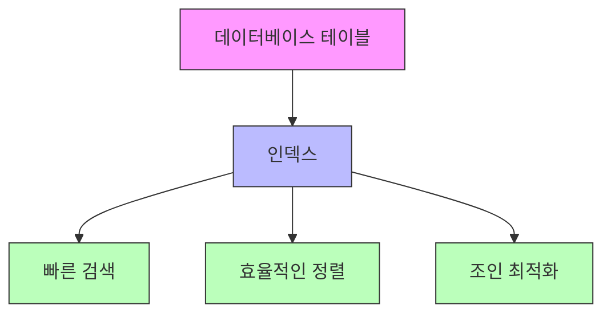
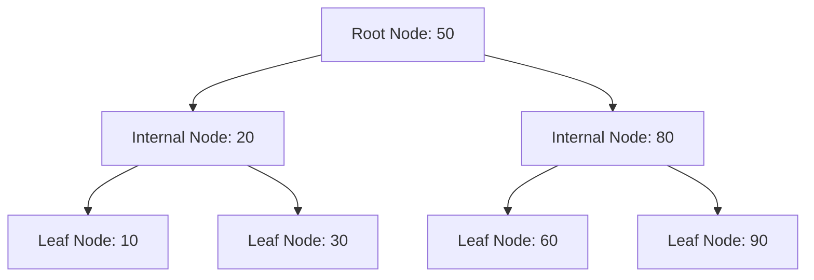
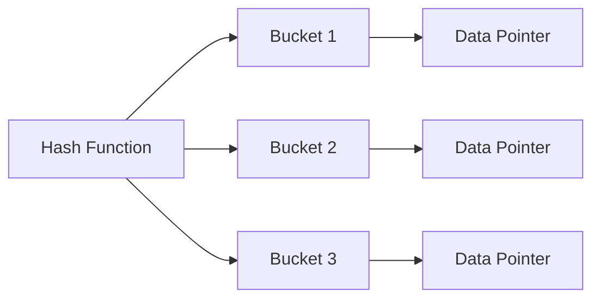
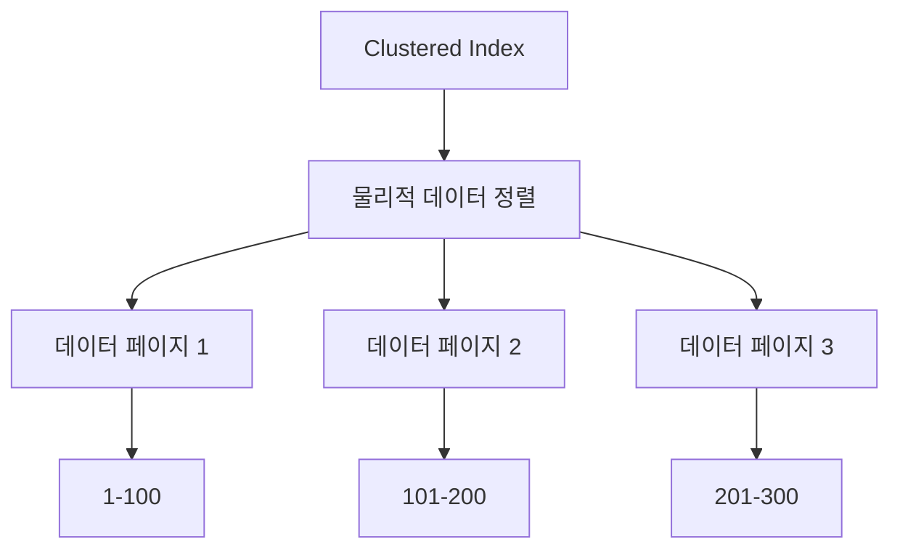
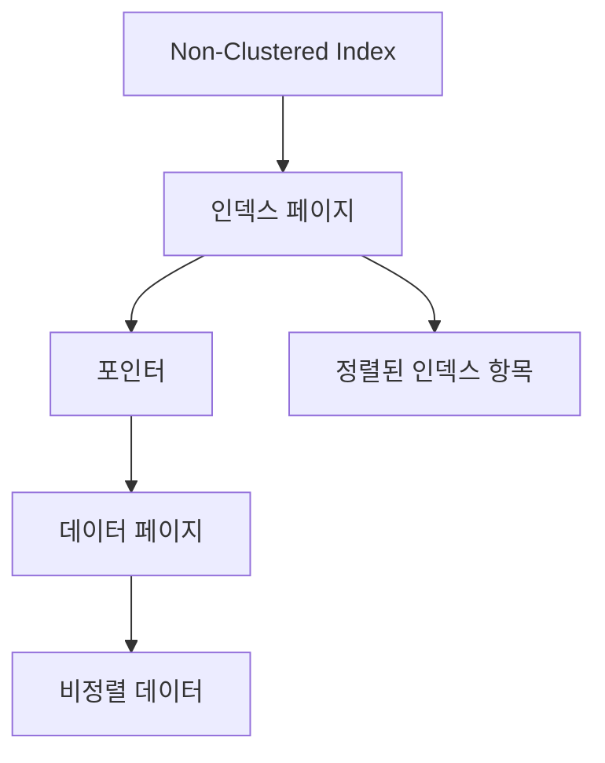
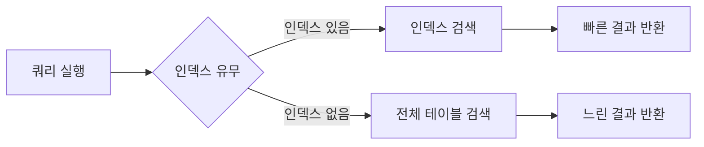
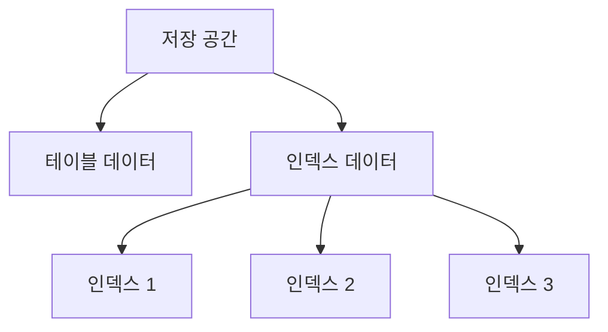

# 데이터베이스 인덱스 (Database Indexing)

## 1. 인덱스란 무엇인가?

인덱스(Index)는 **데이터베이스 테이블의 검색 속도를 향상시키기 위한 자료구조**입니다. 마치 책의 색인이나 도서관의 목록카드처럼, 데이터베이스 인덱스는 원하는 데이터를 빠르게 찾을 수 있도록 도와줍니다.

### 1.1 인덱스의 정의와 역할

인덱스는 다음과 같은 핵심 역할을 수행합니다:

1. **빠른 데이터 검색**
   - 테이블 전체를 검색하지 않고 원하는 데이터를 빠르게 찾음
   - 특정 컬럼의 값을 기준으로 데이터 위치를 신속하게 파악
   - 정렬된 상태를 유지하여 범위 검색 최적화

2. **데이터 무결성 보장**
   - 고유(Unique) 인덱스를 통한 중복 데이터 방지
   - 제약조건 검사의 효율성 향상
   - 참조 무결성 유지를 위한 외래 키 지원

3. **쿼리 성능 최적화**
   - WHERE 절의 조건 처리 속도 향상
   - ORDER BY 절의 정렬 작업 최적화
   - JOIN 연산의 효율성 증가



### 1.2 데이터 검색 최적화에서의 인덱스의 중요성

#### 1.2.1 인덱스가 없는 경우
- 테이블의 모든 데이터를 순차적으로 검색 (Full Table Scan)
- 대용량 데이터에서 심각한 성능 저하 발생
- 시스템 자원의 비효율적 사용
```sql
-- 인덱스가 없는 경우의 검색
SELECT * FROM users WHERE email = 'user@example.com';
-- 전체 테이블 스캔 발생
```

#### 1.2.1 인덱스를 사용하는 경우
- 원하는 데이터를 빠르게 찾아감
- 필요한 데이터만 선택적으로 접근
- 시스템 자원을 효율적으로 사용
```sql
-- 인덱스를 사용하는 검색
CREATE INDEX idx_users_email ON users(email);
SELECT * FROM users WHERE email = 'user@example.com';
-- 인덱스를 통한 빠른 검색
```

### 1.3 도서관의 색인과 데이터베이스 인덱스의 비유

데이터베이스 인덱스는 도서관의 카드 목록과 유사한 개념으로 이해할 수 있습니다:

| 도서관 | 데이터베이스 |
|-----|-------------|
| 책 | 테이블 데이터 |
| 카드 목록 | 인덱스 |
| 책의 위치 | 데이터 위치 |
| 분류 체계 | 인덱스 구조 |
| 정렬된 카드 | 정렬된 인덱스 항목 |


이러한 비유는 인덱스의 기본 개념을 이해하는 데 도움이 됩니다:

1. **정렬된 상태 유지**
  - 도서관: 카드가 알파벳 순으로 정렬됨
  - 데이터베이스: 인덱스 항목이 정렬된 상태로 유지

2. **빠른 검색**
  - 도서관: 카드 목록으로 책의 위치를 빠르게 찾음
  - 데이터베이스: 인덱스로 데이터 위치를 빠르게 찾음

3. **추가 공간 필요**
  - 도서관: 카드 목록을 위한 별도 공간 필요
  - 데이터베이스: 인덱스를 위한 추가 저장 공간 필요

---

## 2. 인덱스의 구조

데이터베이스 인덱스는 다양한 자료구조를 기반으로 구현됩니다. 각 구조는 특정 상황에서의 장단점을 가지고 있으며, 용도에 따라 적절한 인덱스 구조를 선택하는 것이 중요합니다.

### 2.1 B-Tree 인덱스

B-Tree(Balanced Tree) 인덱스는 **가장 일반적으로 사용되는 인덱스 구조**입니다. 균형 잡힌 트리 구조를 통해 데이터의 검색, 삽입, 삭제를 효율적으로 수행합니다.

#### 2.1.1 B-Tree의 구조


1. **노드 구성**
  - 루트 노드(Root Node): 트리의 시작점
  - 내부 노드(Internal Node): 중간 레벨의 노드
  - 리프 노드(Leaf Node): 실제 데이터 포인터를 가진 말단 노드

2. **특징**
  - 모든 리프 노드가 같은 레벨에 위치
  - 데이터가 정렬된 상태로 유지
  - 균형 잡힌 트리 구조로 검색 성능 일정

```sql
-- B-Tree 인덱스 생성 예시
CREATE INDEX idx_employees_name ON employees (name);
```

### 2.2 해시 인덱스(Hash Index)

해시 인덱스는 **해시 테이블을 기반**으로 구현된 인덱스 구조입니다. 정확한 일치 검색에 매우 효율적이지만, 범위 검색에는 적합하지 않습니다.

#### 2.2.1 해시 인덱스의 구조


1. **동작 원리**
  - 키 값을 해시 함수로 변환
  - 해시 값으로 데이터 위치 직접 접근
  - O(1) 시간 복잡도로 검색 가능

2. **제한사항**
  - 정확한 일치 검색만 가능
  - 범위 검색 불가능
  - 부등호 연산 지원 안됨

```sql
-- 메모리 테이블의 해시 인덱스 (MySQL)
CREATE TABLE users (
    id INT,
    name VARCHAR(100),
    INDEX USING HASH (name)
) ENGINE = MEMORY;
```

### 2.3 기타 인덱스 구조

#### 2.3.1 Full-text 인덱스

전문(Full-text) 검색을 위한 특수한 인덱스 구조입니다.

```sql
-- Full-text 인덱스 생성
CREATE FULLTEXT INDEX idx_articles_content 
ON articles(content);

-- Full-text 검색 예시
SELECT * FROM articles 
WHERE MATCH(content) AGAINST('검색어' IN NATURAL LANGUAGE MODE);
```

#### 2.3.2 GiST(Generalized Search Tree)

PostgreSQL에서 제공하는 일반화된 검색 트리 구조입니다.

```sql
-- PostgreSQL GiST 인덱스 예시
CREATE INDEX idx_geometric_data 
ON spatial_data USING GIST (geometry_column);
```

#### 2.3.3 R-Tree 인덱스

공간 데이터 인덱싱을 위한 특수한 트리 구조입니다.

```sql
-- 공간 인덱스 생성
CREATE SPATIAL INDEX idx_locations 
ON locations(geometry);
```

### 2.4 구조별 특징 및 활용 사례
| 인덱스 구조      | 장점                                          | 단점                               | 주요 활용 사례                         |
|----------------|-----------------------------------------------|-------------------------------------|---------------------------------|
| B-Tree | - 범위 검색 가능<br>- 정렬 지원<br>- 균형잡힌 성능 | -추가 공간 필요<br>- 삽입/삭제 시 재구성 | - 일반적인 검색<br>- 범위 조회<br>- 정렬이 필요한 경우 |
| Hash | - 매우 빠른 검색<br>- 적은 메모리 사용 | - 범위 검색 불가<br>- 정렬 미지원 | - 정확한 일치 검색<br>- 메모리 기반 테이블 |
| Full-text | - 텍스트 검색 최적화<br>- 언어 지원 | - 많은 자원 사용<br>- 갱신 비용 높음 | - 문서 검색<br>- 콘텐츠 검색 |
| GiST/R-Tree | - 공간 데이터 처리<br>- 다차원 데이터 지원 | - 특수 목적 전용<br>- 구현 복잡 | - 지리 정보 시스템<br>- 위치 기반 서비스 |

---

## 3. 인덱스의 유형

데이터베이스 인덱스는 용도와 구현 방식에 따라 여러 유형으로 분류됩니다. 각 유형은 특정 상황에서 최적의 성능을 제공할 수 있도록 설계되었습니다.

### 3.1 클러스터형 vs 비클러스터형 인덱스

#### 3.1.1 클러스터형 인덱스 (Clustered Index)
클러스터형 인덱스는 **테이블의 물리적 데이터 저장 순서를 결정**하는 인덱스입니다.



**특징:**
- 테이블당 하나만 생성 가능
- 일반적으로 기본 키(Primary Key)에 자동 생성
- 데이터 물리적 순서 정렬
- 범위 검색에 효율적
```sql
-- 클러스터형 인덱스 생성 (MySQL InnoDB)
CREATE TABLE employees (
    id INT PRIMARY KEY,  -- 자동으로 클러스터형 인덱스 생성
    name VARCHAR(100),
    department VARCHAR(50)
);
```

#### 3.1.2 비클러스터형 인덱스 (Non-Clustered Index)

비클러스터형 인덱스는 **데이터의 물리적 순서와 무관한** 별도의 인덱스 구조입니다.



**특징:**
- 테이블당 여러 개 생성 가능
- 데이터 위치를 가리키는 포인터 사용
- 추가 저장 공간 필요
- 유연한 인덱스 구성 가능
```sql
-- 비클러스터형 인덱스 생성
CREATE INDEX idx_employees_name 
ON employees (name);
```

### 3.2 단일 컬럼 vs 복합 인덱스

#### 3.2.1 단일 컬럼 인덱스

하나의 컬럼만을 포함하는 인덱스입니다.

```sql
-- 단일 컬럼 인덱스 생성
CREATE INDEX idx_employees_email 
ON employees (email);
```

**장점:**
- 간단한 구조
- 명확한 사용 목적
- 유지보수 용이

#### 3.2.2 복합 인덱스

둘 이상의 컬럼을 포함하는 인덱스입니다.

```sql
-- 복합 인덱스 생성
CREATE INDEX idx_employees_dept_name 
ON employees (department, name);
```

**특징:**
- 컬럼 순서가 중요
- 선행 컬럼 조건 필수
- WHERE절 조건 순서 고려

### 3.3 특수 인덱스 유형

#### 3.3.1 고유 인덱스 (Unique Index)

중복 값을 허용하지 않는 인덱스입니다.

```sql
-- 고유 인덱스 생성
CREATE UNIQUE INDEX idx_employees_email 
ON employees (email);
```

**특징:**
- 데이터 무결성 보장
- 제약 조건으로 활용
- 자동으로 인덱스 생성

#### 3.3.2 함수 기반 인덱스 (Function-Based Index)

컬럼의 값을 변형하여 인덱스를 생성합니다.

```sql
-- 함수 기반 인덱스 생성
CREATE INDEX idx_employees_upper_name 
ON employees (UPPER(name));

-- 사용 예시
SELECT * FROM employees 
WHERE UPPER(name) = 'JOHN';
```

**특징:**
- 함수 결과에 대한 인덱스
- 대소문자 구분 없는 검색
- 연산 결과 기반 검색 최적화

#### 3.3.3 부분 인덱스 (Partial Index)

조건을 만족하는 레코드만 포함하는 인덱스입니다.

```sql
-- 부분 인덱스 생성 (PostgreSQL)
CREATE INDEX idx_active_employees 
ON employees (name) 
WHERE status = 'ACTIVE';
```

**특징:**
- 인덱스 크기 감소
- 특정 조건 검색 최적화
- 유지보수 비용 감소

### 3.4 인덱스 유형 비교표
| 인덱스 유형      | 특징                                          | 장점                               | 단점                         |
|----------------|-----------------------------------------------|-------------------------------------|---------------------------------|
| 클러스터형 | 데이터 물리적 정렬 | - 범위 검색 효율적<br>- 데이터 접근 빠름 | - 테이블당 1개만 가능<br>- 데이터 입력 순서 중요 |
| 비클러스터형 | 별도 인덱스 구조 | - 다중 인덱스 가능<br>- 유연한 구성 | - 추가 공간 필요<br>- 참조 비용 발생 |
| 단일 컬럼 | 한 컬럼 인덱스 | - 단순 구조<br>- 관리 용이 | - 제한된 활용<br>- 다중 조건 비효율 |
| 복합 컬럼 | 다중 컬럼 인덱스 | - 다중 조건 최적화<br>- 커버링 인덱스 | - 복잡한 구조<br>- 컬럼 순서 종속 |
| 고유 | 중복 값 방지 | - 무결성 보장<br>- 빠른 검색 | - 제약적 사용<br>- 갱신 비용 높음 |
| 함수 기반 | 계산 결과 인덱스 | - 연산 최적화<br>- 유연한 검색 | - 추가 연산 필요<br>- 저장 공간 증가 |

---

## 4. 인덱스의 장단점

인덱스는 데이터베이스 성능에 큰 영향을 미치는 요소입니다. 적절한 인덱스 사용을 위해서는 그 장단점을 정확히 이해하고 있어야 합니다.

### 4.1 인덱스의 장점

#### 4.1.1 검색 성능 향상


1. **빠른 데이터 검색**
  - 테이블 전체 검색 회피
  - 필요한 데이터만 선택적 접근
  - 디스크 I/O 최적화

```sql
-- 인덱스를 활용한 빠른 검색
CREATE INDEX idx_users_email ON users(email);
SELECT * FROM users WHERE email = 'test@example.com';
-- 인덱스를 통한 직접 접근
```

2. **정렬 작업 최적화**
  - ORDER BY 절의 정렬 연산 감소
  - 이미 정렬된 인덱스 활용
  - 임시 정렬 작업 회피

```sql
-- 정렬이 필요한 쿼리
CREATE INDEX idx_users_name ON users(name);
SELECT * FROM users ORDER BY name;
-- 인덱스가 이미 name으로 정렬되어 있음
```

3. **집계 함수 성능 향상**
  - MIN, MAX 함수의 빠른 처리
  - 인덱스 자체가 정렬되어 있어 효율적

```sql
-- 집계 함수 최적화
SELECT MAX(salary) FROM employees;
-- salary 인덱스가 있다면 첫/마지막 값만 확인
```

#### 4.1.2 데이터 무결성 보장

1. **고유성 보장**
  - UNIQUE 인덱스로 중복 데이터 방지
  - 데이터 일관성 유지

```sql
-- 고유성 보장 예시
CREATE UNIQUE INDEX idx_users_email 
ON users(email);
-- 중복 이메일 입력 방지
```

2. **참조 무결성**
  - 외래 키 제약조건의 효율적 처리
  - 관계 정합성 검사 최적화


### 4.2 인덱스의 단점

#### 4.2.1 추가 저장 공간 사용


1. **디스크 공간**
  - 원본 데이터 외 추가 공간 필요
  - 인덱스 수에 비례하여 공간 증가
  - 백업 시간과 저장 공간 증가

2. **메모리 사용**
  - 인덱스 캐시를 위한 메모리 필요
  - 버퍼 풀 공간 차지
  - 시스템 리소스 사용 증가

#### 4.2.2 데이터 변경 작업의 성능 저하

1. **INSERT** 작업
```sql
-- 인덱스가 있는 테이블에 데이터 삽입
INSERT INTO users (name, email, created_at)
VALUES ('John Doe', 'john@example.com', CURRENT_TIMESTAMP);
-- 모든 인덱스 업데이트 필요
```
- 새로운 인덱스 항목 생성
- 인덱스 재정렬 필요
- 인덱스 수에 비례한 추가 작업

2. **UPDATE** 작업
```sql
-- 인덱스된 컬럼 업데이트
UPDATE users SET email = 'new@example.com'
WHERE id = 1;
-- 인덱스 재구성 필요
```
- 기존 인덱스 항목 제거
- 새로운 인덱스 항목 생성
- 인덱스 구조 재조정

3. **DELETE** 작업
```sql
-- 데이터 삭제
DELETE FROM users WHERE id = 1;
-- 관련 인덱스 항목도 제거 필요
```
- 인덱스 항목 제거
- 인덱스 구조 재조정
- 공간 재활용 관리

#### 4.3.1 긍정적 영향

| 작업 유형 | 성능 향상 정도 | 비고 |
|-----------|---------------|------|
| 검색 | 매우 높음 | WHERE 절 조건 처리 |
| 정렬 | 높음 | ORDER BY 절 처리 |
| 조인 | 높음 | 조인 키 기준 검색 |
| 집계 | 중간 | MIN, MAX 등 처리 |

#### 4.3.2 부정적 영향

| 작업 유형 | 성능 저하 정도 | 비고 |
|-----------|---------------|------|
| 삽입 | 중간 | 인덱스 수에 비례 |
| 수정 | 높음 | 인덱스 컬럼 갱신 시 |
| 삭제 | 중간 | 인덱스 항목 제거 |
| 백업/복구 | 낮음 | 추가 공간/시간 필요 |

### 4.4 최적화 전략

1. **선택적 인덱스 사용**
  - 필요한 컬럼만 인덱스 생성
  - 사용 빈도 고려
  - 데이터 분포도 분석

2. **주기적인 인덱스 관리**
  - 불필요한 인덱스 제거
  - 인덱스 재구성
  - 통계 정보 갱신

3. **비용/이득 분석**
  - 쿼리 실행 계획 분석
  - 실제 성능 측정
  - 리소스 사용량 모니터링